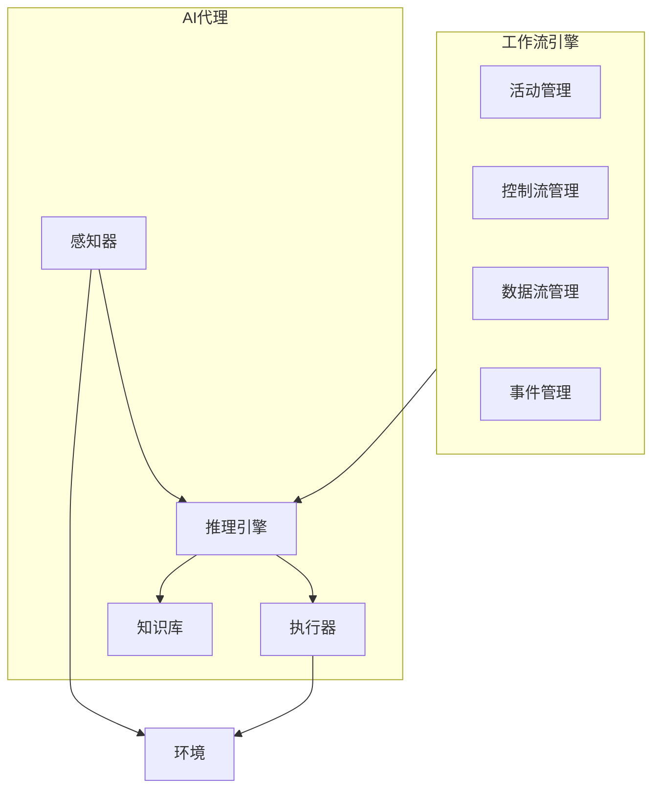

# AI人工智能代理工作流 AI Agent Workflow：在能源管理中的应用

## 1.背景介绍

### 1.1 能源管理的重要性

能源是现代社会运转的核心驱动力。随着全球人口不断增长和经济持续发展,能源需求也在不断攀升。然而,传统的化石燃料不可再生,而且会产生大量温室气体排放,加剧全球变暖和环境污染问题。因此,有效的能源管理对于实现可持续发展至关重要。

能源管理旨在优化能源的生产、传输、分配和消费,以最大限度地提高能源效率,减少浪费和排放。它涉及多个领域,包括能源政策、技术创新、基础设施建设、用户行为改变等。随着人工智能(AI)技术的快速发展,AI代理工作流程已成为能源管理中一个极具前景的应用领域。

### 1.2 AI代理工作流在能源管理中的作用

AI代理工作流是指利用AI技术构建智能代理系统,通过自主决策和行动来完成特定任务的过程。在能源管理领域,AI代理工作流可以用于以下几个方面:

1. **能源需求预测**: 通过分析历史数据和多种影响因素,准确预测未来的能源需求,为能源生产和分配提供依据。

2. **能源优化调度**: 根据预测的需求,优化能源的生产、存储和输送,实现能源的高效利用。

3. **需求侧管理**: 通过与用户交互,引导用户改变用能行为,实现需求侧的节能减排。

4. **故障检测和预防**: 监测能源系统的运行状态,及时发现故障隐患,预防故障发生。

5. **可再生能源整合**: 协调各种能源的生产和利用,促进可再生能源在能源体系中的融合。

AI代理工作流具有自主性、智能性和高效性等特点,可以极大地提高能源管理的精度和效率,是实现智能化能源系统的关键技术之一。

## 2.核心概念与联系

### 2.1 AI代理

AI代理是指能够感知环境,并根据感知做出决策和行动的智能系统。它是AI系统与外部世界交互的接口,是实现AI自主行为的核心组件。

AI代理通常由以下几个部分组成:

- **感知器(Sensor)**: 用于获取环境信息,如温度、压力、图像等数据。
- **执行器(Actuator)**: 用于对环境进行操作,如控制设备开关、调节参数等。
- **知识库(Knowledge Base)**: 存储代理所掌握的知识,包括事实、规则、模型等。
- **推理引擎(Inference Engine)**: 根据感知数据和知识库,运行算法进行推理决策。

AI代理的工作过程如下:首先通过感知器获取环境数据,将数据输入推理引擎;推理引擎基于知识库中的知识,运行算法对数据进行处理和决策;最后通过执行器对环境进行相应的操作。

### 2.2 工作流

工作流(Workflow)描述了为完成特定任务所需执行的一系列有序活动。它将复杂任务分解为多个步骤,明确定义每个步骤的输入、输出、控制流程和执行条件。

工作流的核心概念包括:

- **活动(Activity)**: 工作流中的基本执行单元,表示一个具体的任务步骤。
- **控制流(Control Flow)**: 定义活动之间的执行顺序和条件。
- **数据流(Data Flow)**: 描述活动之间输入输出数据的传递关系。
- **角色(Role)**: 指定谁来执行特定活动。
- **事件(Event)**: 触发活动执行或影响控制流的条件。

工作流可以使复杂任务自动化、标准化和优化,提高效率和一致性。在能源管理中,工作流可用于规范化各种决策和操作流程。

### 2.3 AI代理工作流

AI代理工作流是将AI代理技术与工作流技术相结合的一种范式。它利用AI代理的智能决策能力,将工作流中的活动自动化,实现工作流的智能执行。

在AI代理工作流中,AI代理扮演着核心角色。它根据感知数据和知识库,运行算法对工作流活动进行决策,并通过执行器完成相应的操作。工作流则提供了明确的执行逻辑和约束条件,使AI代理的行为更加可控和可预测。

AI代理工作流的优势在于:

1. **自主性**: AI代理可以自主完成复杂任务,无需人工干预。
2. **智能性**: 利用AI算法进行决策,比传统工作流更加智能化。
3. **可扩展性**: 可以根据需求灵活调整工作流,适应不同场景。
4. **高效性**: 自动化执行提高了工作效率,降低了人力成本。

在能源管理领域,AI代理工作流可以应用于需求预测、优化调度、故障检测等多个环节,实现能源系统的智能化管理。

## 3.核心算法原理具体操作步骤

### 3.1 AI代理工作流架构

AI代理工作流的总体架构如下所示:

该架构由两个主要部分组成:

1. **AI代理**:包括感知器、推理引擎、执行器和知识库四个模块。感知器获取环境数据,推理引擎根据知识库进行决策,执行器对环境进行操作。

2. **工作流引擎**:管理整个工作流的执行,包括活动管理、控制流管理、数据流管理和事件管理四个模块。它与AI代理的推理引擎交互,为其提供工作流规则和约束。

工作流引擎和AI代理通过接口相连,工作流引擎将工作流信息传递给AI代理,AI代理则根据这些信息做出决策和执行操作。

### 3.2 工作流建模

在AI代理工作流中,首先需要对业务流程进行工作流建模,将其形式化为可执行的工作流定义。工作流建模的主要步骤如下:

1. **识别活动**:分析业务流程,识别出所有需要执行的活动。

2. **确定控制流**:根据活动之间的逻辑关系,确定它们的执行顺序和条件。可使用顺序流、并行流、选择流等控制流模式。

3. **设置数据流**:确定活动之间的数据依赖关系,定义输入输出数据的传递方式。

4. **分配角色**:为每个活动分配执行者角色,可以是人员或AI代理。

5. **定义事件**:识别可能触发活动执行或影响控制流的事件,如时间事件、数据事件等。

6. **建立知识库**:为AI代理构建知识库,包括领域知识、规则、模型等。

工作流建模通常使用图形化工具进行,如BPMN(业务流程模型和标记法)等,最终输出可执行的工作流定义文件。

### 3.3 AI代理决策算法

AI代理的核心是推理引擎,它运行各种算法对工作流活动进行决策。常用的AI决策算法包括:

1. **规则引擎**:根据预定义的规则集对数据进行推理,适用于决策逻辑相对简单的场景。

2. **机器学习算法**:利用历史数据训练模型,对新数据进行预测和决策,如回归、分类、聚类等算法。

3. **优化算法**:通过建立目标函数和约束条件,求解最优解,如线性规划、动态规划等。

4. **搜索算法**:在解空间中搜索满足条件的解,如启发式搜索、A*算法等。

5. **多智能体系统**:由多个智能体协同工作,模拟复杂系统行为,如博弈论、拍卖算法等。

不同算法适用于不同场景,在实际应用中需要根据问题的特点选择合适的算法。算法的输入来自感知数据和知识库,输出为对工作流活动的决策结果。

### 3.4 AI代理工作流执行

经过工作流建模和算法选择后,AI代理工作流就可以执行了。执行过程如下:

1. **初始化**:工作流引擎读取工作流定义,初始化工作流实例。同时初始化AI代理,加载知识库和算法模型。

2. **感知**:感知器获取环境数据,如能源需求、设备状态等,传递给AI代理的推理引擎。

3. **决策**:推理引擎根据工作流规则、知识库和算法,对当前活动进行决策,输出执行指令。

4. **执行**:执行器根据决策指令对环境进行操作,如控制设备开关、调节参数等。

5. **状态更新**:根据执行结果,更新工作流和AI代理的内部状态。

6. **循环**:重复步骤2~5,直到工作流完成或发生终止事件。

在执行过程中,工作流引擎负责协调控制流、数据流和事件响应,而AI代理负责各个活动的智能决策。二者通过接口紧密配合,实现了工作流的自动化智能执行。

## 4.数学模型和公式详细讲解举例说明

在能源管理的AI代理工作流中,通常需要建立数学模型来描述和优化能源系统。以下是一些常用的数学模型和公式:

### 4.1 能源需求预测模型

能源需求预测是能源管理的基础,它通过分析历史数据和影响因素,对未来一段时间内的能源需求进行预测。常用的预测模型有:

1. **时间序列模型**

时间序列模型利用历史数据的时间模式,对未来进行预测。常用的时间序列模型有自回归移动平均(ARMA)模型、指数平滑模型等。

ARMA模型公式:

$$
y_t = c + \epsilon_t + \sum_{i=1}^p \phi_i y_{t-i} + \sum_{j=1}^q \theta_j \epsilon_{t-j}
$$

其中$y_t$是时间$t$的观测值,$\epsilon_t$是白噪声项,$\phi_i$和$\theta_j$分别是自回归和移动平均的系数。

2. **回归模型**

回归模型通过分析能源需求与影响因素(如温度、人口、工业产值等)之间的关系,对需求进行预测。常用的回归模型有线性回归、逻辑回归等。

线性回归公式:

$$
y = \beta_0 + \beta_1 x_1 + \beta_2 x_2 + ... + \beta_n x_n + \epsilon
$$

其中$y$是因变量(能源需求),$x_i$是自变量(影响因素),$\beta_i$是回归系数,$\epsilon$是随机误差项。

3. **机器学习模型**

机器学习模型利用历史数据训练模型,对新数据进行预测。常用的模型有神经网络、支持向量机、决策树等。

以神经网络为例,其基本公式为:

$$
y = f(W^Tx + b)
$$

其中$x$是输入向量,$y$是输出,$W$和$b$分别是权重和偏置,$f$是激活函数。

### 4.2 能源优化调度模型

能源优化调度旨在合理分配能源资源,最大限度地满足需求、降低成本和减少排放。常用的优化模型有:

1. **线性规划模型**

线性规划模型在目标函数和约束条件都是线性的情况下,求解最优解。

标准线性规划模型:

$$
\begin{aligned}
\max \ \ & \sum_{j=1}^n c_jx_j \\
\text{s.t.} \ \ & \sum_{j=1}^n a_{ij}x_j \leq b_i, \ \ i=1,2,...,m \\
& x_j \geq 0, \ \ j=1,2,...,n
\end{aligned}
$$

其中$c_j$是目标函数系数,$a_{ij}$是约束条件系数,$b_i$是资源限制。

2. **动态规划模型**

动态规划模型将复杂问题分解为多个