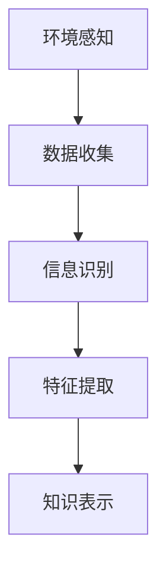
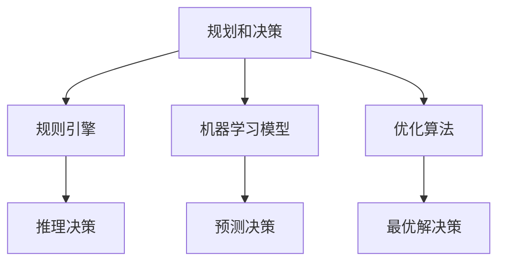
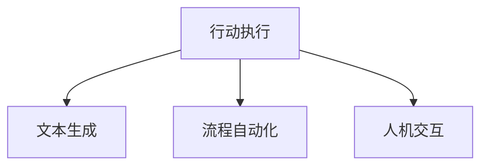
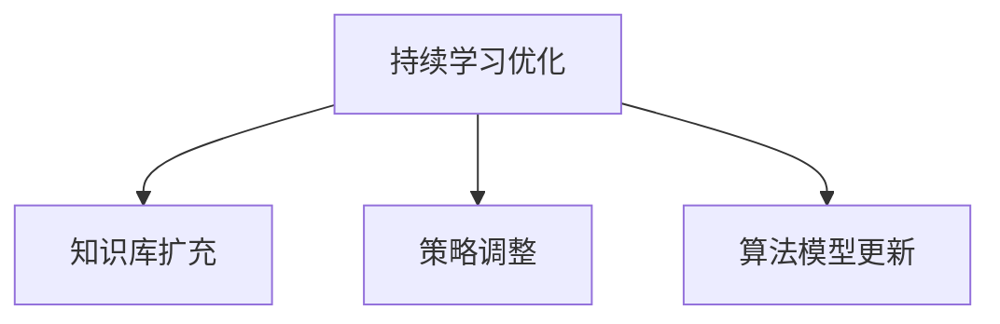

# AI人工智能代理工作流AI Agent WorkFlow：智能代理在法律服务系统中的应用

## 1.背景介绍

### 1.1 法律服务行业的挑战

法律服务行业一直面临着诸多挑战,例如大量的文书工作、复杂的法律程序、庞大的案件数据等。这些挑战导致了效率低下、成本高昂,并且容易出现人为错误。因此,该行业亟需引入新技术来提高效率、降低成本并提供更好的服务质量。

### 1.2 人工智能在法律服务中的应用前景

人工智能(AI)技术在近年来取得了长足进步,展现出巨大的应用潜力。在法律服务领域,AI可以用于自动化文书工作、智能案件管理、法律研究辅助等多个方面。其中,智能代理(Intelligent Agent)作为AI的一个重要分支,可以通过模拟人类行为来执行各种任务,为法律服务带来全新的解决方案。

## 2.核心概念与联系

### 2.1 智能代理的定义

智能代理是一种能够感知环境、持续规划和执行行动的自治系统。它可以根据预定目标,自主做出决策并采取行动,而无需人工干预。

### 2.2 工作流程(Workflow)概念

工作流程是指为了完成某项任务而进行的一系列有序活动。它将复杂的业务过程分解为一系列可管理和可重复的步骤,从而提高效率和一致性。

### 2.3 智能代理工作流(AI Agent Workflow)

智能代理工作流是将智能代理与工作流程相结合的概念。它利用AI技术来自动化和优化工作流程,使代理能够自主地执行各种任务,同时保持高效和一致性。

在法律服务系统中,智能代理工作流可以应用于多个场景,如:

- 自动化文书工作
- 智能案件管理
- 法律研究辅助
- 合同审查和分析
- 法律咨询和辅助决策

通过将智能代理与工作流程相结合,法律服务系统可以极大地提高效率、降低成本,并提供更准确、一致的服务质量。

## 3.核心算法原理具体操作步骤

智能代理工作流的核心算法原理包括以下几个方面:

### 3.1 感知环境

智能代理需要能够感知并理解周围环境,包括收集相关数据、识别关键信息等。在法律服务系统中,这可能涉及到:

1. 自然语言处理(NLP),用于理解法律文书、案件材料等文本信息。
2. 计算机视觉,用于识别法庭视频、证据照片等视觉信息。
3. 信息抽取,从大量非结构化数据中提取出关键实体、事实和关系。



### 3.2 规划和决策

根据感知到的环境信息,智能代理需要制定行动计划并做出决策。这通常涉及到:

1. 规则引擎,根据预定义的规则和约束条件进行推理和决策。
2. 机器学习模型,基于历史数据和案例进行预测和决策。
3. 优化算法,寻找最优解以实现既定目标。



### 3.3 行动执行

智能代理需要根据规划和决策,采取具体行动来完成任务。在法律服务系统中,这可能包括:

1. 自动生成法律文书、合同等文本内容。
2. 自动化案件流程,如分配任务、发送通知等。
3. 与人工律师、当事人等进行交互和协作。



### 3.4 持续学习和优化

为了提高智能代理的性能,需要持续学习和优化算法模型。这可以通过以下方式实现:

1. 从新数据中学习,不断扩充知识库。
2. 根据反馈调整决策策略和参数。
3. 引入新的算法模型和技术。



## 4.数学模型和公式详细讲解举例说明

在智能代理工作流中,数学模型和公式扮演着重要角色,为算法提供理论基础和计算支持。以下是一些常用的数学模型和公式:

### 4.1 马尔可夫决策过程(MDP)

马尔可夫决策过程是一种描述决策序列的数学框架,常用于强化学习和决策规划。它可以形式化描述为一个元组 $(S, A, P, R, \gamma)$,其中:

- $S$ 是状态集合
- $A$ 是动作集合
- $P(s'|s,a)$ 是状态转移概率,表示在状态 $s$ 下执行动作 $a$ 后转移到状态 $s'$ 的概率
- $R(s,a)$ 是回报函数,表示在状态 $s$ 下执行动作 $a$ 获得的即时回报
- $\gamma \in [0,1]$ 是折现因子,用于权衡即时回报和长期回报

在法律服务系统中,MDP可以用于案件流程决策、证据分析等场景。例如,对于一个案件,不同的处理步骤可以看作是不同的状态,代理的行为则是选择执行哪个步骤(动作),目标是最大化整个案件处理的效率和质量(累积回报)。

### 4.2 条件随机场(CRF)

条件随机场是一种用于序列建模的无向概率图模型,常用于结构化预测任务,如命名实体识别、序列标注等。

对于输入序列 $X=\{x_1, x_2, \dots, x_T\}$ 和输出序列 $Y=\{y_1, y_2, \dots, y_T\}$,线性链条件随机场的条件概率可以表示为:

$$P(Y|X) = \frac{1}{Z(X)}\exp\left(\sum_{t=1}^T\sum_{k}\lambda_kf_k(y_t, y_{t-1}, X)\right)$$

其中:

- $Z(X)$ 是归一化因子
- $f_k(y_t, y_{t-1}, X)$ 是特征函数
- $\lambda_k$ 是对应的特征权重

在法律服务系统中,CRF可以用于从法律文书、案件材料中自动提取关键信息,如当事人、地点、时间等实体。

### 4.3 注意力机制(Attention Mechanism)

注意力机制是一种广泛应用于深度学习模型(如Transformer)的技术,它允许模型在编码输入序列时,对不同位置的输入词元赋予不同的注意力权重,从而更好地捕获长距离依赖关系。

对于输入序列 $X=\{x_1, x_2, \dots, x_n\}$,注意力权重 $\alpha_{i,j}$ 表示解码时步 $i$ 对编码输入 $x_j$ 的注意力程度,可以通过以下公式计算:

$$\alpha_{i,j} = \frac{\exp(e_{i,j})}{\sum_{k=1}^n\exp(e_{i,k})}$$
$$e_{i,j} = f(s_i, h_j)$$

其中 $s_i$ 是解码器在时间步 $i$ 的状态,$ h_j$ 是编码器在位置 $j$ 的输出向量,$ f $ 是一个评分函数(如点积或多层感知机)。

通过注意力加权求和,可以得到上下文向量 $c_i$:

$$c_i = \sum_{j=1}^n\alpha_{i,j}h_j$$

注意力机制在法律服务系统中可以应用于智能文本生成、问答系统等任务,帮助模型关注输入序列中的关键信息。

### 4.4 图神经网络(GNN)

图神经网络是一类专门用于处理图结构数据的深度学习模型。它可以同时捕获节点的特征信息和拓扑结构信息,并在节点之间传播并聚合邻居节点的表示。

对于一个无向图 $G=(V, E)$,其中 $V$ 是节点集合, $E$ 是边集合,图神经网络的基本传播规则可以表示为:

$$h_v^{(k+1)} = \gamma\left(h_v^{(k)}, \square_{u\in\mathcal{N}(v)}\phi\left(h_v^{(k)}, h_u^{(k)}, e_{v,u}\right)\right)$$

其中:

- $h_v^{(k)}$ 是节点 $v$ 在第 $k$ 层的表示向量
- $\mathcal{N}(v)$ 是节点 $v$ 的邻居节点集合
- $\phi$ 是邻居节点信息的聚合函数
- $\gamma$ 是节点状态更新函数
- $e_{v,u}$ 是边 $(v,u)$ 的特征向量(如果有的话)

在法律服务系统中,图神经网络可以用于建模复杂的法律知识图谱,捕获法律实体之间的关系,为智能推理和决策提供支持。

通过上述数学模型和公式,智能代理工作流可以在感知、规划、决策和行动执行等各个环节发挥重要作用,从而提高法律服务系统的智能化水平。

## 5.项目实践:代码实例和详细解释说明

为了更好地理解智能代理工作流在法律服务系统中的应用,我们提供了一个基于Python的示例项目。该项目包括以下几个核心模块:

### 5.1 自然语言处理模块

该模块使用BERT等预训练语言模型,对法律文书和案件材料进行自然语言处理,包括命名实体识别、关系抽取、文本分类等任务。

```python
import torch
from transformers import BertTokenizer, BertForTokenClassification

# 加载预训练模型和分词器
tokenizer = BertTokenizer.from_pretrained('bert-base-uncased')
model = BertForTokenClassification.from_pretrained('bert-base-uncased', num_labels=9)

# 对输入文本进行标记
text = "John Smith signed a contract with Acme Inc. on 01/01/2020."
inputs = tokenizer.encode_plus(text, return_tensors='pt')

# 进行命名实体识别
outputs = model(**inputs)[0]
predictions = torch.argmax(outputs, dim=2)

# 输出结果
print([(tokenizer.decode([pred]), label_map[pred]) for pred in predictions[0].tolist()])
```

上述代码示例使用BERT模型对输入文本进行命名实体识别,识别出人名、组织名、日期等实体。

### 5.2 规则引擎模块

该模块实现了一个基于前向链式推理的规则引擎,用于根据法律规则和案件事实进行推理和决策。

```python
from pyknow import *

class LegalRuleEngine(KnowledgeEngine):
    @Rule(Fact(plaintiff=MATCH.plaintiff),
          Fact(defendant=MATCH.defendant),
          Fact(contract_date=MATCH.contract_date),
          Fact(contract_breach=L(True)))
    def contract_breach_rule(self, plaintiff, defendant, contract_date):
        print(f"{defendant} breached the contract with {plaintiff} signed on {contract_date}.")
        self.declare(Fact(ruling="Defendant is liable"))

engine = LegalRuleEngine()
engine.reset()

# 声明案件事实
engine.declare(Fact(plaintiff="John Smith"),
               Fact(defendant="Acme Inc."),
               Fact(contract_date="01/01/2020"),
               Fact(contract_breach=True))

# 运行推理
engine.run()
```

上述代码定义了一条规则,如果存在原告、被告、合同日期和合同违约的事实,则推断被告应承担责任。通过声明相关事实并运行推理引擎,可以得出相应的裁决结果。

### 5.3 决策优化模块

该模块使用强化学习算法(如Q-Learning)来优化案件处理流程,最大化处理效率和质量。

```python
import numpy as np
from collections import defaultdict

# 定义状态、动作空间和回报函数
states = ['新案件', '证据收集', '庭审', '判决']
actions = ['收集证据', '准