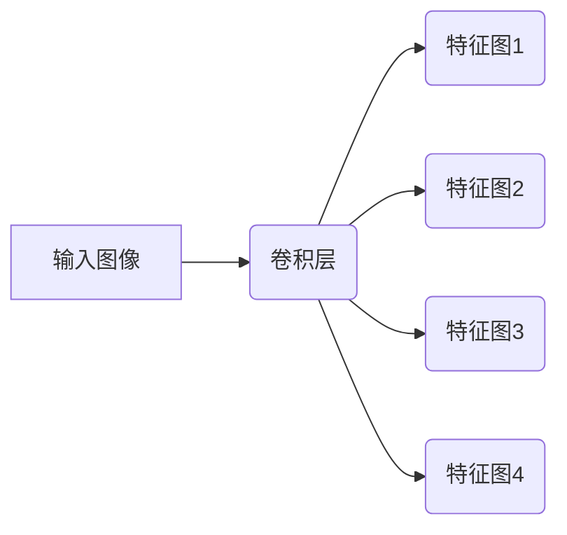
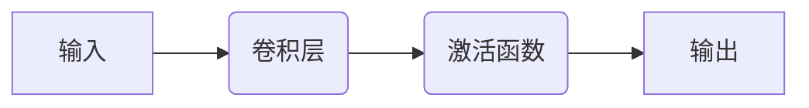
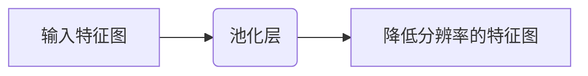
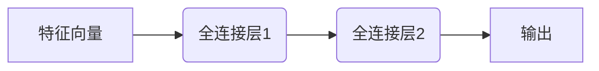

# AI人工智能深度学习算法：卷积神经网络的可视化技术

## 1.背景介绍

在当今的人工智能领域,卷积神经网络(Convolutional Neural Networks, CNN)无疑是最成功和最广泛应用的深度学习模型之一。自从AlexNet在2012年的ImageNet大赛上取得了巨大的成功之后,CNN在计算机视觉、自然语言处理、语音识别等诸多领域展现出了卓越的性能。然而,CNN模型通常被视为一个"黑箱",很难解释其内部工作机制和决策过程。因此,对CNN进行可视化分析就显得尤为重要,有助于我们更好地理解模型,诊断模型存在的问题,并提高模型的可解释性和可信度。

### 1.1 可视化的重要性

CNN可视化技术可以帮助我们回答诸如以下几个问题:

- CNN在学习过程中到底学习到了什么特征?
- 不同的卷积层和特征图对最终结果有何影响?
- 模型是如何做出预测决策的?
- 模型存在什么偏差或缺陷?

通过可视化,我们能够洞察CNN内部的工作原理,了解其关注的区域和提取的特征,从而更好地解释模型的行为,优化模型设计,并增强人类对模型的信任度。

### 1.2 可视化技术分类

CNN可视化技术通常可以分为以下几类:

- 特征可视化(Feature Visualization)
- 最大激活可视化(Maximum Activation Visualization) 
- 注意力可视化(Attention Visualization)
- 反向传播可视化(Deconvolution Visualization)

本文将重点介绍上述四种主要的CNN可视化技术,并结合实例对它们的原理、实现方法和应用场景进行深入探讨。

## 2.核心概念与联系

在深入探讨CNN可视化技术之前,我们需要先了解一些核心概念,这些概念贯穿于不同的可视化方法中,是理解可视化技术的基础。

### 2.1 卷积层和特征图

卷积神经网络的核心组成部分是卷积层(Convolutional Layer)。每个卷积层由多个二维平面组成,这些平面被称为特征图(Feature Map)。特征图的每个元素对应输入图像的一个局部区域,称为感受野(Receptive Field)。

卷积层的作用是通过卷积核(Kernel)在输入数据上进行卷积操作,提取不同的特征模式。不同的卷积核对应于不同的特征图,每个特征图捕获输入数据的不同特征。

### 2.2 激活函数和非线性

在卷积层之后,通常会应用一个非线性激活函数(Activation Function),如ReLU、Sigmoid等。激活函数的作用是引入非线性,使网络能够学习复杂的映射关系。如果没有激活函数,整个网络将等价于一个线性模型,无法解决复杂的问题。

### 2.3 池化层

池化层(Pooling Layer)通常在卷积层之后使用,其目的是降低特征图的分辨率,减少参数数量,提高计算效率。常见的池化操作包括最大池化(Max Pooling)和平均池化(Average Pooling)。

### 2.4 全连接层

在CNN的最后几层通常是全连接层(Fully Connected Layer),它将前面卷积层和池化层提取的特征进行整合,并输出最终的分类或回归结果。全连接层类似于传统的人工神经网络,每个神经元与前一层的所有神经元相连。

通过理解这些核心概念及其相互关系,我们就能更好地理解CNN可视化技术的原理和实现方式。

## 3.核心算法原理具体操作步骤

在本节中,我们将详细介绍四种主要的CNN可视化技术:特征可视化、最大激活可视化、注意力可视化和反向传播可视化。对于每种技术,我们将探讨其原理、实现步骤以及应用场景。

### 3.1 特征可视化(Feature Visualization)

特征可视化旨在直观地展示CNN在不同层次上学习到的特征表示。通过可视化特征图,我们可以更好地理解网络关注的区域和提取的模式。

#### 3.1.1 原理

特征可视化的基本思想是:对于给定的卷积层,我们希望找到一个输入图像,使得该层的特征图对该输入图像产生最大的激活值。换句话说,我们希望生成一个"理想"的输入图像,使得该层的特征图对其有最强的响应。

具体来说,我们可以定义一个损失函数,表示特征图的激活值与目标激活值之间的差异。然后,通过反向传播和梯度下降算法,不断调整输入图像的像素值,使得损失函数最小化,从而得到一个能够最大化特征图激活值的"理想"输入图像。

#### 3.1.2 实现步骤

1. 选择要可视化的卷积层及其特征图。
2. 初始化一个随机噪声图像作为输入。
3. 前向传播,计算选定层的特征图激活值。
4. 定义损失函数,例如特征图激活值与目标激活值之间的均方差。
5. 反向传播,计算输入图像的梯度。
6. 使用梯度下降算法,更新输入图像的像素值,以最小化损失函数。
7. 重复步骤3-6,直到损失函数收敛或达到最大迭代次数。
8. 将最终得到的输入图像作为可视化结果。

#### 3.1.3 应用场景

特征可视化技术可以应用于以下场景:

- 理解CNN在不同层次上学习到的特征表示,分析网络关注的区域和模式。
- 诊断CNN模型,发现模型存在的偏差或缺陷。
- 优化CNN模型设计,通过可视化不同层次的特征,调整网络结构和参数。
- 在教学和科研领域,直观展示深度学习模型的工作原理。

### 3.2 最大激活可视化(Maximum Activation Visualization)

最大激活可视化技术旨在生成一个输入图像,使得CNN对该图像产生最大的激活值,从而揭示网络对哪些模式和特征最为敏感。

#### 3.2.1 原理

最大激活可视化的思想类似于特征可视化,但目标不同。特征可视化是希望找到一个输入图像,使得特定层的特征图对该输入图像产生最大的激活值;而最大激活可视化则是希望找到一个输入图像,使得整个网络对该输入图像产生最大的激活值(通常是最后一层的输出)。

具体来说,我们可以定义一个损失函数,表示网络最后一层的输出与目标输出之间的差异。然后,通过反向传播和梯度下降算法,不断调整输入图像的像素值,使得损失函数最小化,从而得到一个能够最大化网络输出的"理想"输入图像。

#### 3.2.2 实现步骤

1. 选择要最大化的输出节点(通常是最后一层的某个节点)。
2. 初始化一个随机噪声图像作为输入。
3. 前向传播,计算选定输出节点的激活值。
4. 定义损失函数,例如输出节点的激活值与目标激活值之间的均方差。
5. 反向传播,计算输入图像的梯度。
6. 使用梯度上升算法,更新输入图像的像素值,以最大化损失函数。
7. 重复步骤3-6,直到损失函数收敛或达到最大迭代次数。
8. 将最终得到的输入图像作为可视化结果。

#### 3.2.3 应用场景

最大激活可视化技术可以应用于以下场景:

- 理解CNN对哪些模式和特征最为敏感,从而优化模型设计和训练过程。
- 诊断CNN模型,发现模型存在的偏差或缺陷。
- 在教学和科研领域,直观展示深度学习模型的工作原理。

### 3.3 注意力可视化(Attention Visualization)

注意力机制是深度学习中一种广泛应用的技术,它允许模型在处理输入数据时,selectively关注输入的不同部分。注意力可视化技术旨在直观展示模型在做出预测时,关注输入数据的哪些区域。

#### 3.3.1 原理

注意力机制通常由三个主要组成部分构成:查询(Query)、键(Key)和值(Value)。查询表示模型当前的状态或目标,键和值则表示输入数据的不同部分。

通过计算查询与每个键之间的相似性得分,模型可以决定应该关注输入数据的哪些部分。相似性得分越高,表示该部分与模型的当前状态或目标越相关,因此会被赋予更高的注意力权重。

最终,模型会根据注意力权重,对输入数据的不同部分进行加权求和,得到一个注意力向量,作为模型的输出或下一层的输入。

#### 3.3.2 实现步骤

1. 训练含有注意力机制的CNN模型。
2. 选择一个输入样本,前向传播并获取注意力权重矩阵。
3. 将注意力权重矩阵可视化为热力图,覆盖在原始输入图像上。
4. 根据热力图的强度,分析模型关注的区域。

#### 3.3.3 应用场景

注意力可视化技术可以应用于以下场景:

- 理解模型在做出预测时,关注输入数据的哪些区域。
- 诊断模型存在的偏差或缺陷,例如过度关注无关区域或忽视重要区域。
- 在计算机视觉、自然语言处理等领域,直观展示模型的注意力机制。
- 优化模型设计和训练过程,根据注意力可视化结果调整模型参数或结构。

### 3.4 反向传播可视化(Deconvolution Visualization)

反向传播可视化技术旨在生成一个输入图像,使得该输入图像在经过CNN模型后,能够重构出特定的目标特征图。通过这种方式,我们可以直观地了解每个特征图所对应的视觉模式。

#### 3.4.1 原理

反向传播可视化的基本思想是:给定一个目标特征图,我们希望找到一个输入图像,使得该输入图像在经过CNN模型后,能够重构出该目标特征图。

具体来说,我们可以定义一个损失函数,表示CNN模型输出的特征图与目标特征图之间的差异。然后,通过反向传播和梯度下降算法,不断调整输入图像的像素值,使得损失函数最小化,从而得到一个能够重构目标特征图的"理想"输入图像。

#### 3.4.2 实现步骤

1. 选择要可视化的目标特征图。
2. 初始化一个随机噪声图像作为输入。
3. 前向传播,计算CNN模型输出的特征图。
4. 定义损失函数,例如模型输出的特征图与目标特征图之间的均方差。
5. 反向传播,计算输入图像的梯度。
6. 使用梯度下降算法,更新输入图像的像素值,以最小化损失函数。
7. 重复步骤3-6,直到损失函数收敛或达到最大迭代次数。
8. 将最终得到的输入图像作为可视化结果。

#### 3.4.3 应用场景

反向传播可视化技术可以应用于以下场景:

- 理解每个特征图所对应的视觉模式,从而更好地解释CNN模型的工作原理。
- 诊断CNN模型,发现模型存在的偏差或缺陷。
- 在教学和科研领域,直观展示深度学习模型的