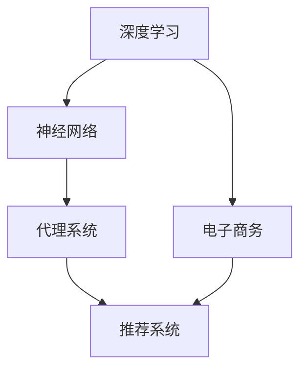
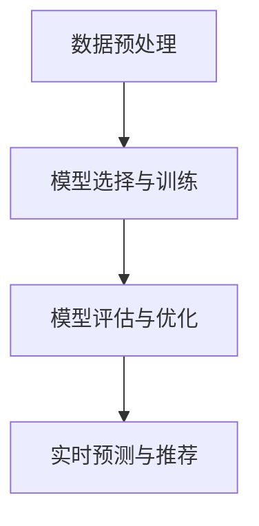

# AI人工智能深度学习算法：智能深度学习代理在电子商务中的应用策略

## 1.背景介绍

在当今数字化时代，电子商务已经成为全球经济的重要组成部分。随着互联网的普及和技术的进步，电子商务平台的用户数量和交易量呈现爆炸式增长。与此同时，人工智能（AI）和深度学习（DL）技术的迅猛发展，为电子商务带来了前所未有的机遇和挑战。智能深度学习代理作为AI技术的一个重要分支，正在逐步改变电子商务的运营模式和用户体验。

### 1.1 电子商务的现状与挑战

电子商务平台面临的主要挑战包括：
- 用户需求的多样性和个性化
- 海量数据的处理和分析
- 实时响应和高效推荐
- 安全性和隐私保护

### 1.2 人工智能和深度学习的崛起

人工智能和深度学习技术在图像识别、自然语言处理、推荐系统等领域取得了显著成果。这些技术的应用不仅提高了电子商务平台的运营效率，还极大地提升了用户体验。

### 1.3 智能深度学习代理的定义

智能深度学习代理是指利用深度学习算法和模型，自动执行特定任务或决策的智能系统。在电子商务中，智能深度学习代理可以用于用户行为分析、个性化推荐、智能客服等多个方面。

## 2.核心概念与联系

在深入探讨智能深度学习代理在电子商务中的应用之前，我们需要了解一些核心概念及其相互联系。

### 2.1 深度学习

深度学习是机器学习的一个分支，主要通过多层神经网络来模拟人脑的工作方式。其核心在于通过大量数据的训练，使模型能够自动提取特征并进行预测或分类。

### 2.2 神经网络

神经网络是深度学习的基础结构，通常由输入层、隐藏层和输出层组成。每一层由若干神经元构成，神经元之间通过权重连接。

### 2.3 代理系统

代理系统是一种能够自主执行任务的智能系统。在电子商务中，代理系统可以用于自动化交易、用户行为分析等。

### 2.4 推荐系统

推荐系统是电子商务平台的重要组成部分，通过分析用户的历史行为和偏好，向用户推荐可能感兴趣的商品或服务。

### 2.5 核心概念联系图



## 3.核心算法原理具体操作步骤

智能深度学习代理在电子商务中的应用涉及多个核心算法和操作步骤。以下是一些关键算法及其具体操作步骤。

### 3.1 数据预处理

数据预处理是深度学习的第一步，主要包括数据清洗、数据归一化、特征提取等步骤。

### 3.2 模型选择与训练

选择合适的深度学习模型（如卷积神经网络、循环神经网络等），并通过大量数据进行训练。

### 3.3 模型评估与优化

通过交叉验证、混淆矩阵等方法评估模型性能，并通过调整超参数、增加训练数据等方式优化模型。

### 3.4 实时预测与推荐

将训练好的模型部署到生产环境中，实时分析用户行为并进行个性化推荐。

### 3.5 核心算法流程图



## 4.数学模型和公式详细讲解举例说明

在智能深度学习代理的实现过程中，数学模型和公式起着至关重要的作用。以下是一些关键数学模型和公式的详细讲解和举例说明。

### 4.1 神经网络的数学模型

神经网络的基本单元是神经元，其数学模型可以表示为：

$$
y = f\left(\sum_{i=1}^{n} w_i x_i + b\right)
$$

其中，$y$ 是输出，$f$ 是激活函数，$w_i$ 是权重，$x_i$ 是输入，$b$ 是偏置。

### 4.2 损失函数

损失函数用于衡量模型预测值与真实值之间的差异。常用的损失函数包括均方误差（MSE）和交叉熵损失：

$$
\text{MSE} = \frac{1}{n} \sum_{i=1}^{n} (y_i - \hat{y}_i)^2
$$

$$
\text{交叉熵损失} = -\sum_{i=1}^{n} y_i \log(\hat{y}_i)
$$

### 4.3 反向传播算法

反向传播算法用于更新神经网络的权重和偏置，其核心公式为：

$$
\Delta w = -\eta \frac{\partial L}{\partial w}
$$

其中，$\Delta w$ 是权重的更新量，$\eta$ 是学习率，$L$ 是损失函数。

### 4.4 举例说明

假设我们有一个简单的二分类问题，输入数据为 $x = [0.5, 0.3]$，权重为 $w = [0.2, 0.8]$，偏置为 $b = 0.1$，激活函数为 Sigmoid 函数：

$$
f(x) = \frac{1}{1 + e^{-x}}
$$

则神经元的输出为：

$$
y = f(0.2 \times 0.5 + 0.8 \times 0.3 + 0.1) = f(0.41) \approx 0.601
$$

## 5.项目实践：代码实例和详细解释说明

为了更好地理解智能深度学习代理在电子商务中的应用，我们将通过一个具体的项目实例来进行详细解释和说明。

### 5.1 项目简介

本项目旨在构建一个基于深度学习的推荐系统，通过分析用户的历史行为，向用户推荐可能感兴趣的商品。

### 5.2 数据集准备

我们将使用公开的电子商务数据集，如 Amazon Product Review 数据集。数据集包含用户的历史购买记录、商品信息等。

### 5.3 数据预处理

```python
import pandas as pd
from sklearn.model_selection import train_test_split
from sklearn.preprocessing import StandardScaler

# 读取数据集
data = pd.read_csv('amazon_product_reviews.csv')

# 数据清洗
data = data.dropna()

# 特征提取
features = data[['user_id', 'product_id', 'rating']]
labels = data['purchase']

# 数据归一化
scaler = StandardScaler()
features = scaler.fit_transform(features)

# 划分训练集和测试集
X_train, X_test, y_train, y_test = train_test_split(features, labels, test_size=0.2, random_state=42)
```

### 5.4 模型构建与训练

```python
import tensorflow as tf
from tensorflow.keras.models import Sequential
from tensorflow.keras.layers import Dense

# 构建模型
model = Sequential()
model.add(Dense(64, input_dim=3, activation='relu'))
model.add(Dense(32, activation='relu'))
model.add(Dense(1, activation='sigmoid'))

# 编译模型
model.compile(loss='binary_crossentropy', optimizer='adam', metrics=['accuracy'])

# 训练模型
model.fit(X_train, y_train, epochs=10, batch_size=32, validation_data=(X_test, y_test))
```

### 5.5 模型评估与优化

```python
# 评估模型
loss, accuracy = model.evaluate(X_test, y_test)
print(f'Loss: {loss}, Accuracy: {accuracy}')

# 模型优化（如调整学习率、增加训练数据等）
```

### 5.6 实时预测与推荐

```python
# 实时预测
new_data = [[0.4, 0.6, 0.7]]
new_data = scaler.transform(new_data)
prediction = model.predict(new_data)
print(f'Prediction: {prediction}')
```

## 6.实际应用场景

智能深度学习代理在电子商务中的应用场景非常广泛，以下是一些典型的应用场景。

### 6.1 个性化推荐

通过分析用户的历史行为和偏好，向用户推荐可能感兴趣的商品或服务，提高用户满意度和平台转化率。

### 6.2 智能客服

利用自然语言处理技术，构建智能客服系统，自动回答用户的常见问题，提高客服效率和用户体验。

### 6.3 动态定价

通过分析市场供需关系和用户行为，实时调整商品价格，最大化平台收益。

### 6.4 用户行为分析

通过深度学习模型，分析用户的浏览、点击、购买等行为，挖掘用户需求和偏好，为平台运营提供数据支持。

