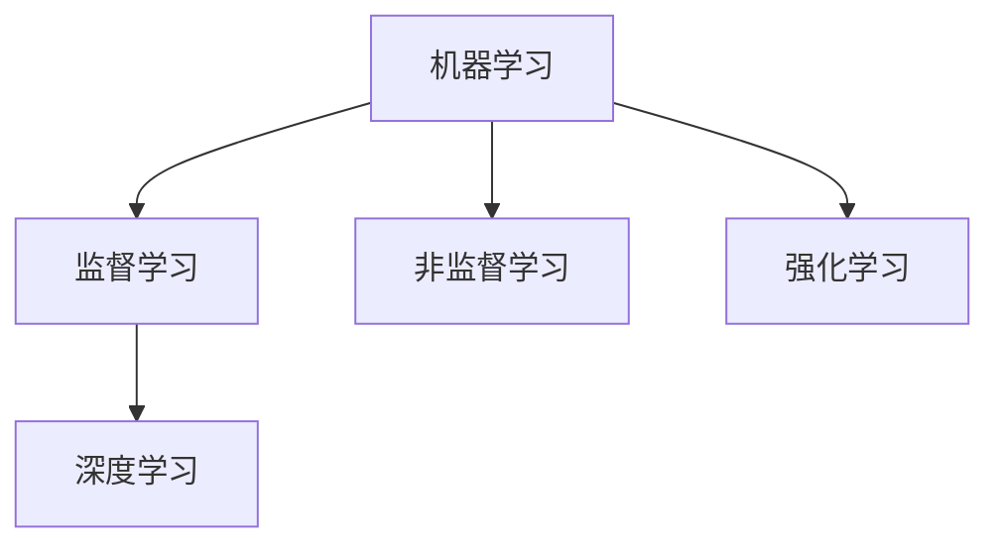
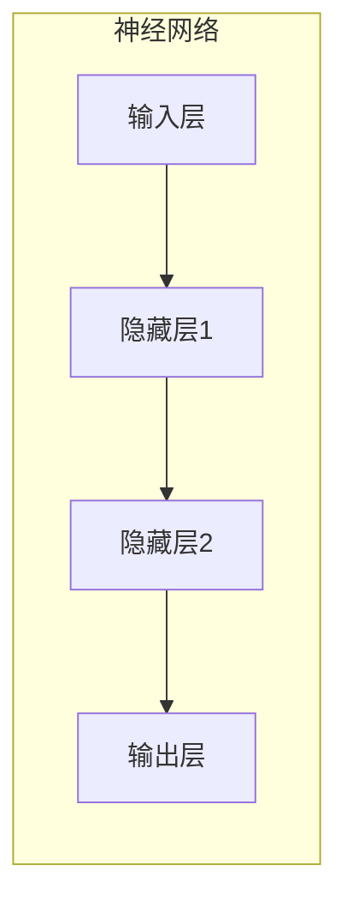
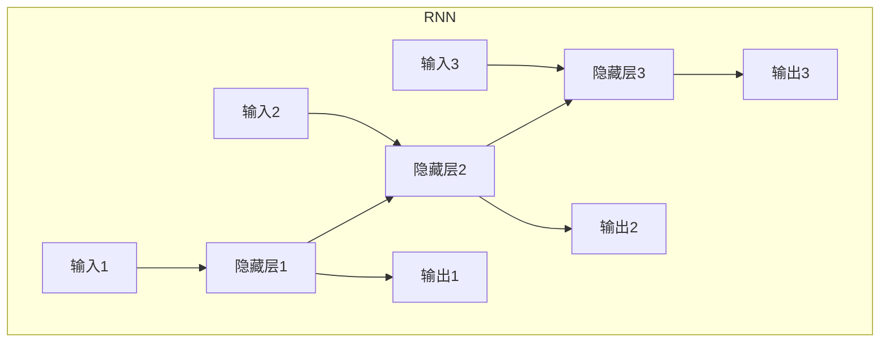

# AI人工智能深度学习算法：理论基础导论

## 1.背景介绍

### 1.1 人工智能的兴起

人工智能(Artificial Intelligence, AI)是当代科技发展的热点领域之一,近年来受到了前所未有的关注和投资。随着计算能力的不断提高和大数据时代的到来,人工智能技术在诸多领域展现出了巨大的潜力,如计算机视觉、自然语言处理、推荐系统等。人工智能的核心目标是使机器能够模拟或超越人类的认知能力,如学习、推理、规划、感知和控制等。

### 1.2 深度学习的崛起

深度学习(Deep Learning)是人工智能领域的一个新兴热点方向,是机器学习中表现最为优秀的一种方法。深度学习的核心思想是通过对数据的建模,使计算机在最小化目标函数的同时自动获取数据的高阶特征表示,从而完成特定的任务。近年来,受益于大数据、算力硬件和算法创新的推动,深度学习在语音识别、图像识别、自然语言处理等领域取得了突破性的进展,性能已经超越了人类水平。

### 1.3 导论目的与重要性

本文将系统地介绍深度学习算法的理论基础,旨在为读者提供全面的认识,帮助读者掌握深度学习的核心概念、数学原理和实现细节。通过对算法原理的深入剖析,读者将能够更好地理解和运用这一强大的技术,为未来的创新奠定坚实的基础。

## 2.核心概念与联系

### 2.1 机器学习与深度学习

机器学习(Machine Learning)是人工智能的一个重要分支,其核心思想是通过对大量数据的学习,使计算机能够自动获取知识,从而完成特定的任务。根据任务类型的不同,机器学习可分为监督学习、非监督学习和强化学习等。

深度学习则是机器学习中的一种特殊方法,它通过对数据建模,使计算机能够自动获取数据的高阶特征表示,从而完成特定的任务。深度学习模型通常由多层非线性变换单元(如神经网络)组成,能够对输入数据进行逐层特征提取和转换,最终输出所需的结果。

### 2.2 深度学习模型

深度学习模型主要包括以下几种类型:

- **前馈神经网络(Feedforward Neural Network, FNN)**: 最基本的神经网络结构,数据在网络中只能单向传播。
- **卷积神经网络(Convolutional Neural Network, CNN)**: 在图像、语音等领域表现卓越,能够自动学习局部特征模式。
- **循环神经网络(Recurrent Neural Network, RNN)**: 擅长处理序列数据,在自然语言处理等领域有广泛应用。
- **生成对抗网络(Generative Adversarial Network, GAN)**: 可用于生成逼真的图像、音频和文本数据。
- **其他模型**: 如注意力机制(Attention Mechanism)、Transformer等。

这些模型在不同的应用场景下发挥着重要作用,为人工智能系统赋能。

### 2.3 深度学习与其他机器学习方法的关系

深度学习是机器学习的一个重要分支,与其他机器学习方法存在一些联系和区别:

- **特征工程**: 传统机器学习方法需要人工设计特征,而深度学习能够自动从数据中学习有效的特征表示。
- **模型复杂度**: 深度学习模型通常由多层非线性变换单元组成,结构更加复杂。
- **数据需求**: 深度学习对大规模数据的需求更加迫切,以获取有效的特征表示。
- **计算能力**: 深度学习对计算资源的需求更高,需要强大的硬件支持(如GPU)。

总的来说,深度学习是一种更加灵活和强大的机器学习方法,在处理高维复杂数据时具有明显的优势。

## 3.核心算法原理具体操作步骤  

### 3.1 神经网络基础

神经网络是深度学习的核心模型,其灵感来源于生物神经系统。一个基本的神经网络由输入层、隐藏层和输出层组成,每一层由多个神经元(节点)构成。神经元通过加权求和和非线性激活函数对输入进行转换,并将结果传递给下一层。

#### 3.1.1 前向传播

前向传播是神经网络的核心计算过程,它按照网络结构从输入层开始,逐层计算并传递激活值,最终得到输出结果。具体步骤如下:

1. 将输入数据传入输入层
2. 在每一层,每个神经元根据上一层的输出和连接权重,计算加权和
3. 将加权和通过激活函数(如Sigmoid、ReLU等)进行非线性转换,得到该层的输出
4. 重复步骤2和3,直到到达输出层,得到最终输出

#### 3.1.2 反向传播

反向传播是神经网络训练的关键算法,它通过计算损失函数对参数(权重和偏置)的梯度,并使用优化算法(如梯度下降)来更新参数,从而减小损失函数值,提高模型性能。具体步骤如下:

1. 计算输出层与期望输出之间的损失函数值
2. 计算损失函数对输出层神经元输出的梯度
3. 从输出层开始,逐层反向传播误差,计算每层神经元输出对损失函数的梯度
4. 根据梯度更新每层神经元的权重和偏置
5. 重复步骤1到4,直到模型收敛或达到最大迭代次数

#### 3.1.3 激活函数

激活函数在神经网络中起着非常重要的作用,它引入了非线性,使得神经网络能够拟合复杂的函数。常用的激活函数包括:

- Sigmoid函数: $\sigma(x) = \frac{1}{1 + e^{-x}}$
- Tanh函数: $\tanh(x) = \frac{e^x - e^{-x}}{e^x + e^{-x}}$
- ReLU函数: $\text{ReLU}(x) = \max(0, x)$
- Leaky ReLU函数: $\text{LeakyReLU}(x) = \begin{cases} x, & \text{if } x > 0 \\ \alpha x, & \text{otherwise} \end{cases}$

不同的激活函数具有不同的特性,如非线性程度、梯度饱和问题等,需要根据具体任务进行选择。

### 3.2 卷积神经网络

卷积神经网络(Convolutional Neural Network, CNN)是一种专门用于处理网格结构数据(如图像、序列等)的神经网络,在计算机视觉和自然语言处理等领域有着广泛的应用。CNN主要由卷积层、池化层和全连接层组成。

#### 3.2.1 卷积层

卷积层是CNN的核心部分,它通过在输入数据上滑动卷积核(也称滤波器)来提取局部特征。具体操作步骤如下:

1. 初始化卷积核的权重参数
2. 在输入数据上滑动卷积核,对每个局部区域进行加权求和
3. 对求和结果应用激活函数(如ReLU),得到该区域的特征映射
4. 重复步骤2和3,直到完成整个输入数据的卷积操作

卷积层能够有效地捕捉输入数据的局部模式和空间关系,从而提取出有用的特征。

#### 3.2.2 池化层

池化层通常在卷积层之后使用,其目的是降低特征维度,减少计算量和过拟合风险。常见的池化操作包括最大池化和平均池化。

最大池化的操作步骤如下:

1. 将输入特征图划分为多个不重叠的小区域
2. 对每个小区域取最大值,作为该区域的代表值
3. 重复步骤2,直到完成整个特征图的池化操作

平均池化的操作步骤类似,只是取每个小区域的平均值作为代表值。

#### 3.2.3 全连接层

全连接层通常在CNN的最后几层使用,它将前面层的特征映射展平,并将每个神经元与下一层的所有神经元连接。全连接层的作用是对提取的特征进行组合和整合,从而产生最终的输出(如分类结果)。

### 3.3 循环神经网络

循环神经网络(Recurrent Neural Network, RNN)是一种专门用于处理序列数据(如文本、语音等)的神经网络模型。与前馈神经网络不同,RNN在隐藏层之间引入了循环连接,使得网络能够捕捉序列数据中的长期依赖关系。

#### 3.3.1 RNN基本结构

一个基本的RNN由输入层、隐藏层和输出层组成。在每个时间步,隐藏层不仅接收当前时间步的输入,还会接收上一时间步的隐藏状态,从而捕捉序列数据中的动态信息。

#### 3.3.2 前向传播

RNN的前向传播过程与普通神经网络类似,但需要考虑隐藏状态的传递。具体步骤如下:

1. 在时间步t,将输入$x_t$和上一时间步的隐藏状态$h_{t-1}$传入隐藏层
2. 计算当前时间步的隐藏状态$h_t = f(W_{hx}x_t + W_{hh}h_{t-1} + b_h)$,其中$f$是激活函数
3. 计算当前时间步的输出$o_t = g(W_{oh}h_t + b_o)$,其中$g$是另一个激活函数
4. 重复步骤1到3,直到处理完整个序列

#### 3.3.3 反向传播

RNN的反向传播算法是基于反向传播through time(BPTT)实现的,它需要沿着时间步长展开网络,并计算每个时间步的梯度。具体步骤如下:

1. 初始化所有时间步的梯度为0
2. 从最后一个时间步开始,计算当前时间步的梯度
3. 将当前时间步的梯度传递给前一时间步,并累加梯度
4. 重复步骤2和3,直到第一个时间步
5. 根据累加的梯度更新模型参数

由于RNN需要保存所有时间步的隐藏状态和梯度,因此在处理长序列时容易出现梯度消失或爆炸的问题。为了解决这个问题,引入了长短期记忆网络(LSTM)和门控循环单元(GRU)等变体模型。

### 3.4 生成对抗网络

生成对抗网络(Generative Adversarial Network, GAN)是一种用于生成式建模的深度学习框架,它由一个生成器(Generator)和一个判别器(Discriminator)组成,两者通过对抗训练的方式相互竞争,最终使生成器能够生成逼真的数据样本。

#### 3.4.1 GAN基本原理

GAN的基本思想是将生成器和判别器建模为一个二人零和博弈问题。生成器的目标是生成足以欺骗判别器的假样本,而判别器的目标是正确区分真实样本和生成器生成的假样本。

在训练过程中,生成器和判别器通过最小化各自的损失函数来相互竞争,直到达到一种动态平衡,此时生成器生成的样本分布与真实数据分布无法区分。

#### 3.4.2 GAN训练过程

GAN的训练过程可以概括为以下步骤:

1