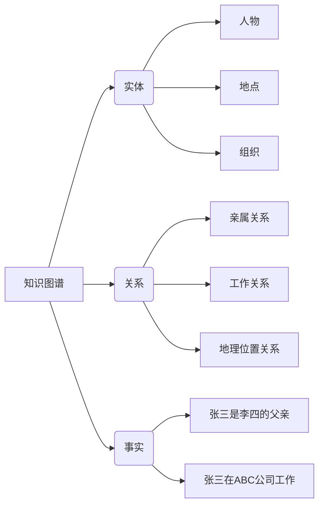
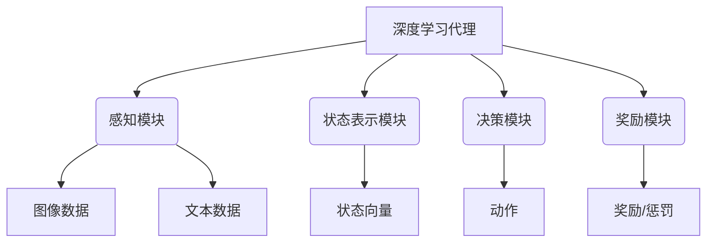
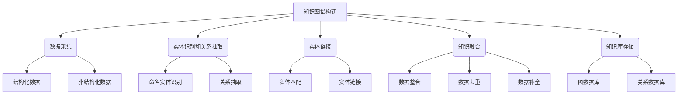
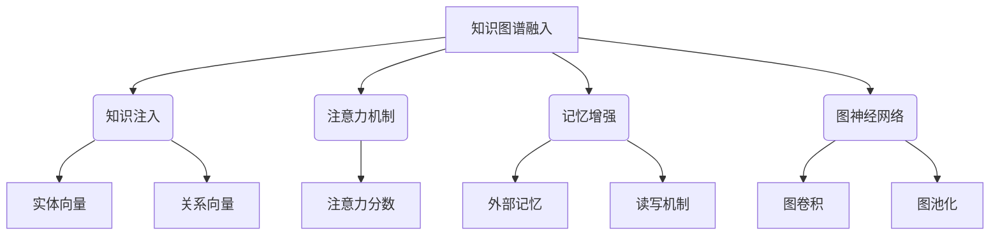

# AI人工智能深度学习算法：知识图谱在深度学习代理中的应用

## 1. 背景介绍

### 1.1 人工智能和深度学习的发展

人工智能(AI)是当代科技领域最具革命性和影响力的技术之一。近年来,随着计算能力的飞速提升、大数据的爆发式增长以及算法的不断创新,深度学习作为人工智能的核心驱动力,已经在诸多领域取得了令人瞩目的成就。从计算机视觉、自然语言处理到推荐系统等,深度学习正在彻底改变着我们与信息和服务的交互方式。

### 1.2 知识图谱的重要性

然而,尽管深度学习模型在处理结构化数据方面表现出色,但它们在理解复杂的语义和背景知识方面仍然存在局限性。这就引入了知识图谱(Knowledge Graph)的概念,知识图谱是一种富有语义的知识表示形式,能够以结构化和可理解的方式捕捉实体、概念及其之间的关系。通过将知识图谱融入深度学习模型,我们可以赋予模型更强的理解和推理能力,从而提高其在复杂任务中的性能表现。

### 1.3 深度学习代理与知识图谱的结合

深度学习代理(Deep Learning Agent)是一种基于深度学习技术的智能系统,能够感知环境、学习经验并做出决策。将知识图谱融入深度学习代理的过程中,代理可以利用知识图谱中蕴含的结构化知识,提高对复杂场景的理解能力,从而做出更加准确和合理的决策。这种结合不仅能够提高代理的性能,还能够增强其可解释性和可信赖性,为人工智能系统的发展注入新的动力。

## 2. 核心概念与联系

### 2.1 知识图谱

知识图谱是一种以图的形式组织和存储知识的方法,它由实体(Entity)、关系(Relation)和事实三部分组成。实体代表现实世界中的对象、概念或事物,关系描述实体之间的语义联系,而事实则记录了实体之间特定关系的存在。

知识图谱不仅能够以结构化的方式存储知识,还能够通过关系的传递性进行推理,从而发现隐藏的知识联系。这种丰富的语义信息对于提高深度学习模型的理解和推理能力至关重要。

### 2.2 深度学习代理

深度学习代理是一种基于深度神经网络的智能系统,能够感知环境、学习经验并做出决策。它通常由以下几个核心组件组成:

1. **感知模块(Perception Module)**: 用于从环境中获取原始数据,如图像、文本等。
2. **状态表示模块(State Representation Module)**: 将原始数据转换为代理可以理解的状态表示。
3. **决策模块(Decision Module)**: 基于当前状态做出相应的决策或执行相应的动作。
4. **奖励模块(Reward Module)**: 根据代理的行为给出相应的奖励或惩罚,用于指导代理的学习过程。

深度学习代理通过不断地与环境交互、获取反馈并调整自身参数,最终达到优化决策的目标。然而,传统的深度学习代理往往缺乏对背景知识和语义信息的理解,这就需要将知识图谱融入其中,赋予代理更强的理解和推理能力。

### 2.3 知识图谱与深度学习代理的结合

将知识图谱融入深度学习代理的过程中,我们可以在代理的不同模块中引入知识图谱,以提高其性能表现:

1. **状态表示模块**: 利用知识图谱中的实体和关系,丰富状态的语义表示,帮助代理更好地理解当前状态。
2. **决策模块**: 将知识图谱的推理能力融入决策过程,使代理能够基于背景知识做出更加合理的决策。
3. **奖励模块**: 根据知识图谱中的规则和约束,调整奖励函数,引导代理朝着符合背景知识的方向优化。

通过这种融合,深度学习代理不仅能够获得更加丰富的状态表示,还能够利用知识图谱进行推理和规则约束,从而做出更加准确和合理的决策。这种结合有助于提高代理的性能、可解释性和可信赖性,为人工智能系统的发展注入新的动力。

## 3. 核心算法原理具体操作步骤

### 3.1 知识图谱构建

构建高质量的知识图谱是将其融入深度学习代理的前提条件。知识图谱的构建过程通常包括以下几个步骤:

1. **数据采集**: 从各种结构化和非结构化数据源(如维基百科、新闻报道、社交媒体等)中收集相关数据。
2. **实体识别和关系抽取**: 使用自然语言处理技术(如命名实体识别、关系抽取等)从原始数据中提取实体和关系。
3. **实体链接**: 将提取的实体与已有的知识库(如DBpedia、Freebase等)中的实体进行匹配和链接。
4. **知识融合**: 将来自不同数据源的知识进行整合、去重和补全,构建统一的知识图谱。
5. **知识库存储**: 将构建好的知识图谱存储在适当的数据库或图数据库中,以便后续的查询和推理。

构建高质量的知识图谱是一项艰巨的任务,需要综合运用多种技术,如自然语言处理、数据挖掘、知识表示与推理等。高质量的知识图谱不仅能够为深度学习代理提供丰富的背景知识,还能够提高代理的可解释性和可信赖性。

### 3.2 知识图谱融入深度学习代理

将知识图谱融入深度学习代理的过程中,我们需要设计合适的神经网络架构,以有效地利用知识图谱中的信息。常见的融合方法包括:

1. **知识注入(Knowledge Injection)**: 将知识图谱中的实体和关系表示为向量,并将其作为额外的输入注入到神经网络中,丰富模型的输入表示。
2. **注意力机制(Attention Mechanism)**: 使用注意力机制动态地关注知识图谱中与当前任务相关的部分,提高模型对重要信息的关注度。
3. **记忆增强(Memory Augmentation)**: 将知识图谱存储在外部记忆中,并设计读写机制,使神经网络能够根据需要从记忆中读取和写入信息。
4. **图神经网络(Graph Neural Networks)**: 直接在知识图谱的拓扑结构上进行端到端的训练,利用图结构捕捉实体之间的关系和依赖。

这些融合方法各有优缺点,需要根据具体任务和数据特点进行选择和调整。通过合理地将知识图谱融入深度学习代理,我们可以赋予代理更强的理解和推理能力,提高其在复杂任务中的性能表现。

## 4. 数学模型和公式详细讲解举例说明

### 4.1 知识图谱表示学习

为了将知识图谱融入深度学习模型,我们需要首先将知识图谱中的实体和关系映射为向量表示,这个过程被称为知识图谱表示学习(Knowledge Graph Embedding)。常见的表示学习方法包括TransE、DistMult、ComplEx等。

以TransE为例,它将实体和关系映射到同一个低维连续向量空间中,并使用如下公式来定义三元组(head, relation, tail)的得分函数:

$$\mathcal{L} = \sum_{(h,r,t) \in \mathcal{S}} \sum_{(h',r',t') \in \mathcal{S'}} \max(0, \gamma + d(h + r, t) - d(h' + r', t'))$$

其中:
- $\mathcal{S}$ 表示训练集中的正例三元组
- $\mathcal{S'}$ 表示负例三元组
- $h, r, t$ 分别表示头实体、关系和尾实体的向量表示
- $d(\cdot, \cdot)$ 表示两个向量之间的距离函数(如L1或L2范数)
- $\gamma$ 是一个超参数,用于控制正负例之间的边距

TransE的目标是使得正例三元组的得分函数值小于负例三元组的得分函数值,从而学习出合理的实体和关系向量表示。

### 4.2 注意力机制与知识图谱融合

注意力机制是一种有效利用知识图谱的方法,它允许模型动态地关注与当前任务相关的知识子图,从而提高模型的性能和可解释性。

以一个基于注意力机制的知识图谱增强文本分类模型为例,我们可以定义如下注意力分数公式:

$$\alpha_{i,j} = \frac{\exp(e_{i}^{\top}W_{\alpha}r_j)}{\sum_{k=1}^{N}\exp(e_{i}^{\top}W_{\alpha}r_k)}$$

其中:
- $e_i$ 表示输入文本中的第 $i$ 个单词的向量表示
- $r_j$ 表示知识图谱中与第 $j$ 个实体相关的关系向量
- $W_{\alpha}$ 是一个可训练的权重矩阵
- $N$ 是知识图谱中与输入文本相关的实体数量

注意力分数 $\alpha_{i,j}$ 反映了输入单词 $e_i$ 与知识图谱实体 $r_j$ 之间的相关性。通过将注意力分数与实体向量加权求和,我们可以获得一个知识增强的文本表示:

$$\hat{e}_i = e_i + \sum_{j=1}^{N}\alpha_{i,j}r_j$$

这种融合方式允许模型选择性地关注与当前任务相关的知识,从而提高模型的性能和可解释性。

## 5. 项目实践:代码实例和详细解释说明

为了更好地理解知识图谱在深度学习代理中的应用,我们将通过一个具体的项目实践来演示如何将知识图谱融入到一个基于强化学习的对话代理中。

### 5.1 项目概述

在这个项目中,我们将构建一个基于知识图谱的对话代理,它能够根据用户的输入,从知识图谱中检索相关信息,并生成自然语言回复。我们将使用强化学习算法来训练代理,使其能够学习如何在对话过程中有效地利用知识图谱。

### 5.2 知识