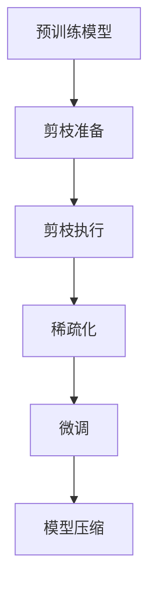

# AI模型剪枝原理与代码实战案例讲解

## 1. 背景介绍

### 1.1 AI模型复杂性挑战

随着深度学习模型在各个领域的广泛应用,模型的规模和复杂性也在不断增加。大型模型虽然具有更强的表现力,但同时也带来了一些挑战,例如:

- 计算资源消耗大
- 推理时间长
- 部署难度高

为了在保持模型精度的同时,降低计算和存储开销,模型压缩和加速成为了一个迫切的需求。

### 1.2 模型剪枝的重要性

模型剪枝作为一种常用的模型压缩技术,通过移除模型中的冗余参数和计算,可以有效降低模型的计算复杂度,从而减小模型的尺寸,加快推理速度,降低内存和能耗需求。剪枝技术在深度学习模型的部署和优化中扮演着重要角色。

## 2. 核心概念与联系

### 2.1 模型剪枝的概念

模型剪枝是一种模型压缩技术,通过永久移除模型中的冗余参数和计算,来减小模型大小和计算复杂度。剪枝可以应用于模型的权重、神经元、通道等多个层面。

### 2.2 剪枝方法分类

根据剪枝策略的不同,模型剪枝可分为以下几种主要类型:

1. **权重剪枝(Weight Pruning)**:移除模型权重矩阵中的部分权重参数。
2. **神经元剪枝(Neuron Pruning)**:移除模型中的部分神经元及其连接。
3. **滤波器剪枝(Filter Pruning)**:移除卷积层中的部分滤波器(通道)。
4. **层剪枝(Layer Pruning)**:移除模型中的部分层。

上述剪枝方法可以单独使用,也可以组合使用,以达到更好的压缩效果。

### 2.3 剪枝流程概览

一般来说,模型剪枝的流程包括以下几个主要步骤:



1. **预训练模型**: 获取待剪枝的预训练模型。
2. **剪枝准备**: 确定剪枝策略,设置剪枝比例等参数。
3. **剪枝执行**: 根据设定的策略移除冗余参数或计算。
4. **稀疏化**: 将剪枝后的模型稀疏化,移除无效参数。
5. **微调**: 在剪枝后的模型基础上进行微调,恢复模型性能。
6. **模型压缩**: 对微调后的稀疏模型进行压缩,生成最终的小型模型。

## 3. 核心算法原理具体操作步骤

### 3.1 权重剪枝算法

权重剪枝是模型剪枝中最常用和最基础的方法。其核心思想是移除权重矩阵中的部分权重参数,从而减小模型大小和计算量。常见的权重剪枝算法包括:

1. **基于权重值的剪枝**

   - 操作步骤:
     1) 对模型进行预训练,获取权重参数。
     2) 根据设定的阈值,将绝对值小于阈值的权重设置为0。
     3) 对剪枝后的模型进行稀疏化,移除无效权重。
     4) 在稀疏模型基础上进行微调,恢复模型性能。

2. **基于权重重要性的剪枝**

   - 操作步骤:
     1) 计算每个权重参数对模型输出的重要性得分。
     2) 根据重要性得分,移除重要性较低的权重参数。
     3) 稀疏化和微调,生成压缩模型。

   - 常见的重要性评估方法包括:
     - 绝对值加权和
     - 梯度范数
     - 第一导数检验
     - 第二导数检验

### 3.2 神经元剪枝算法

神经元剪枝的目标是移除模型中的部分神经元及其连接,从而减小模型大小和计算量。常见的神经元剪枝算法包括:

1. **基于激活值的剪枝**

   - 操作步骤:
     1) 在模型前向传播时,记录每个神经元的激活值。
     2) 根据激活值的平均值或其他统计量,确定神经元重要性。
     3) 移除重要性较低的神经元及其连接。
     4) 稀疏化和微调,生成压缩模型。

2. **基于权重范数的剪枝**

   - 操作步骤:
     1) 计算每个神经元连接权重的范数(L1或L2范数)。
     2) 将范数较小的神经元及其连接移除。
     3) 稀疏化和微调,生成压缩模型。

### 3.3 滤波器剪枝算法

滤波器剪枝专注于移除卷积神经网络中的冗余滤波器(通道),从而减小模型大小和计算量。常见的滤波器剪枝算法包括:

1. **基于滤波器范数的剪枝**

   - 操作步骤:
     1) 计算每个滤波器权重的范数(L1或L2范数)。
     2) 将范数较小的滤波器移除。
     3) 稀疏化和微调,生成压缩模型。

2. **基于滤波器重要性的剪枝**

   - 操作步骤:
     1) 计算每个滤波器对模型输出的重要性得分。
     2) 移除重要性较低的滤波器。
     3) 稀疏化和微调,生成压缩模型。

   - 常见的重要性评估方法包括:
     - 梯度范数
     - 第一导数检验
     - 第二导数检验
     - 信息理论方法

### 3.4 层剪枝算法

层剪枝的目标是移除模型中的部分层,从而减小模型大小和计算量。常见的层剪枝算法包括:

1. **基于层重要性的剪枝**

   - 操作步骤:
     1) 计算每个层对模型输出的重要性得分。
     2) 移除重要性较低的层。
     3) 微调,生成压缩模型。

   - 常见的重要性评估方法包括:
     - 梯度范数
     - 第一导数检验
     - 第二导数检验
     - 信息理论方法

2. **基于层类型的剪枝**

   - 操作步骤:
     1) 根据经验或启发式规则,确定可以移除的层类型。
     2) 移除指定类型的层。
     3) 微调,生成压缩模型。

## 4. 数学模型和公式详细讲解举例说明

### 4.1 权重剪枝数学模型

假设我们有一个全连接层,其权重矩阵为$W \in \mathbb{R}^{m \times n}$,偏置向量为$b \in \mathbb{R}^n$。该层的前向传播计算可表示为:

$$
y = f(Wx + b)
$$

其中$x \in \mathbb{R}^m$是输入向量,$f$是激活函数。

在权重剪枝中,我们希望找到一个稀疏权重矩阵$\hat{W}$,使得$\hat{W}$与$W$足够接近,同时包含尽可能多的零元素。这可以通过以下目标函数来实现:

$$
\underset{\hat{W}}{\mathrm{minimize}} \quad \|W - \hat{W}\|_F^2 + \lambda \|\hat{W}\|_0
$$

其中$\|\cdot\|_F$是矩阵的Frobenius范数,$\|\cdot\|_0$是矩阵的$\ell_0$范数(非零元素的个数),$\lambda$是一个超参数,用于平衡精度和稀疏性。

上述目标函数的第一项旨在最小化$\hat{W}$与$W$之间的差异,第二项则鼓励$\hat{W}$具有更多的零元素。由于$\ell_0$范数是一个非凸函数,因此该优化问题是NP-hard的。实际中,我们通常使用$\ell_1$范数作为$\ell_0$范数的近似,从而将问题转化为可解的凸优化问题。

### 4.2 神经元剪枝数学模型

假设我们有一个全连接层,其权重矩阵为$W \in \mathbb{R}^{m \times n}$,偏置向量为$b \in \mathbb{R}^n$。该层的前向传播计算可表示为:

$$
y = f(Wx + b)
$$

其中$x \in \mathbb{R}^m$是输入向量,$f$是激活函数。

在神经元剪枝中,我们希望找到一个稀疏输出向量$\hat{y}$,使得$\hat{y}$与$y$足够接近,同时包含尽可能多的零元素。这可以通过以下目标函数来实现:

$$
\underset{\hat{y}}{\mathrm{minimize}} \quad \|y - \hat{y}\|_2^2 + \lambda \|\hat{y}\|_0
$$

其中$\|\cdot\|_2$是向量的$\ell_2$范数,$\|\cdot\|_0$是向量的$\ell_0$范数(非零元素的个数),$\lambda$是一个超参数,用于平衡精度和稀疏性。

上述目标函数的第一项旨在最小化$\hat{y}$与$y$之间的差异,第二项则鼓励$\hat{y}$具有更多的零元素。由于$\ell_0$范数是一个非凸函数,因此该优化问题是NP-hard的。实际中,我们通常使用$\ell_1$范数作为$\ell_0$范数的近似,从而将问题转化为可解的凸优化问题。

### 4.3 滤波器剪枝数学模型

假设我们有一个卷积层,其权重张量为$W \in \mathbb{R}^{c_\text{out} \times c_\text{in} \times k_h \times k_w}$,偏置向量为$b \in \mathbb{R}^{c_\text{out}}$。该层的前向传播计算可表示为:

$$
y = f(W * x + b)
$$

其中$x \in \mathbb{R}^{c_\text{in} \times h \times w}$是输入特征图,$f$是激活函数,$*$表示卷积操作。

在滤波器剪枝中,我们希望找到一个稀疏权重张量$\hat{W}$,使得$\hat{W}$与$W$足够接近,同时包含尽可能多的零滤波器。这可以通过以下目标函数来实现:

$$
\underset{\hat{W}}{\mathrm{minimize}} \quad \|W - \hat{W}\|_F^2 + \lambda \sum_{i=1}^{c_\text{out}} \|\hat{W}_i\|_1
$$

其中$\|\cdot\|_F$是张量的Frobenius范数,$\|\cdot\|_1$是向量的$\ell_1$范数,$\lambda$是一个超参数,用于平衡精度和稀疏性。

上述目标函数的第一项旨在最小化$\hat{W}$与$W$之间的差异,第二项则鼓励$\hat{W}$具有更多的零滤波器(通道)。通过优化该目标函数,我们可以获得一个稀疏的卷积核张量,从而减小模型大小和计算量。

## 5. 项目实践:代码实例和详细解释说明

在这一节,我们将通过一个实际的代码示例,演示如何使用PyTorch实现卷积神经网络的滤波器剪枝。我们将使用CIFAR-10数据集进行训练和剪枝。

### 5.1 导入所需库

```python
import torch
import torch.nn as nn
import torchvision
import torchvision.transforms as transforms
```

### 5.2 定义卷积神经网络模型

```python
class ConvNet(nn.Module):
    def __init__(self):
        super(ConvNet, self).__init__()
        self.conv1 = nn.Conv2d(3, 32, kernel_size=3, padding=1)
        self.conv2 = nn.Conv2d(32, 64, kernel_size=3, padding=1)
        self.pool = nn.MaxPool2d(2, 2)
        self.fc1 = nn.Linear(64 * 8 * 8, 512)
        self.fc2 = nn.Linear(512, 10)

    def