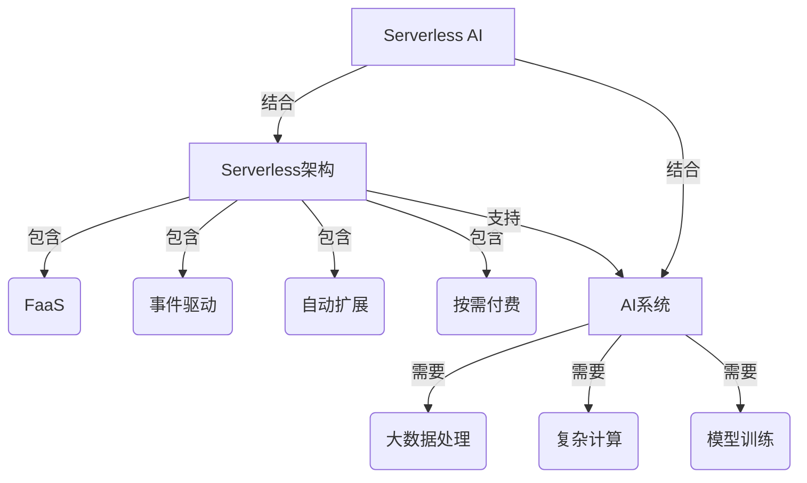

# AI系统Serverless原理与代码实战案例讲解

## 1.背景介绍

在当今快节奏的数字时代，应用程序的开发和部署需求正在不断增长。传统的服务器架构已经无法满足现代应用程序的灵活性、可扩展性和成本效益的需求。这就催生了Serverless架构的兴起,它提供了一种全新的应用程序开发和部署模式。

Serverless架构是一种基于事件驱动的计算模型,它允许开发人员构建和运行应用程序和服务,而无需预先配置或管理基础设施。在Serverless架构中,云提供商负责动态分配资源并自动扩展以满足应用程序的需求。开发人员只需关注代码的编写,而不必担心底层基础设施的管理。

随着人工智能(AI)技术的不断发展和广泛应用,将AI系统与Serverless架构相结合已成为一个重要趋势。AI系统通常需要处理大量数据、进行复杂的计算和模型训练,这对传统的服务器架构来说是一个巨大的挑战。Serverless架构为AI系统提供了高度的灵活性、可扩展性和成本效益,使其能够更高效地处理这些任务。

本文将深入探讨AI系统Serverless架构的原理、关键概念、核心算法、数学模型、实际应用场景、工具和资源,并通过代码示例和实战案例,帮助读者全面了解这一前沿技术。

## 2.核心概念与联系

### 2.1 Serverless架构

Serverless架构是一种基于事件驱动的计算模型,它允许开发人员构建和运行应用程序和服务,而无需预先配置或管理基础设施。在Serverless架构中,云提供商负责动态分配资源并自动扩展以满足应用程序的需求。开发人员只需关注代码的编写,而不必担心底层基础设施的管理。

Serverless架构的核心概念包括:

- **函数即服务(Function as a Service, FaaS)**: FaaS是Serverless架构的核心组件,它允许开发人员编写和部署单个函数,而不需要管理整个应用程序堆栈。云提供商负责自动分配资源、运行函数并处理扩展。

- **事件驱动**: Serverless架构是基于事件驱动的,函数被触发器(如HTTP请求、数据库事件、消息队列等)激活并执行。

- **自动扩展**:云提供商根据incoming负载动态分配资源,实现自动扩展,确保应用程序的高可用性和性能。

- **按需付费**:在Serverless架构中,您只需为实际使用的计算资源付费,而不是为预配置的资源付费。这有助于降低成本并提高资源利用率。

### 2.2 AI系统

AI系统是指利用人工智能技术构建的各种应用程序和服务,包括机器学习、深度学习、自然语言处理、计算机视觉等领域。AI系统通常需要处理大量数据、进行复杂的计算和模型训练,对计算资源和基础设施有着较高的需求。

将AI系统与Serverless架构相结合可以带来以下优势:

- **高度可扩展性**: Serverless架构可以根据AI系统的需求动态分配计算资源,确保高并发和大规模数据处理的需求得到满足。

- **成本效益**: Serverless架构采用按需付费模式,可以避免过度配置资源,从而降低运营成本。

- **简化部署和管理**: Serverless架构可以自动管理底层基础设施,减轻开发人员的运维负担,使他们能够专注于AI模型和算法的开发。

- **事件驱动**: AI系统可以利用Serverless架构的事件驱动特性,实现实时数据处理和智能响应。

### 2.3 Mermaid流程图

上图展示了Serverless架构、AI系统以及Serverless AI系统的核心概念及其关系。Serverless架构包含FaaS、事件驱动、自动扩展和按需付费等关键特性。AI系统需要处理大数据、进行复杂计算和模型训练。将Serverless架构与AI系统相结合,可以形成Serverless AI系统,充分利用两者的优势。

## 3.核心算法原理具体操作步骤

在Serverless AI系统中,核心算法原理和具体操作步骤主要包括以下几个方面:

### 3.1 函数即服务(FaaS)

FaaS是Serverless架构的核心组件,它允许开发人员编写和部署单个函数,而不需要管理整个应用程序堆栈。云提供商负责自动分配资源、运行函数并处理扩展。

FaaS的具体操作步骤如下:

1. **编写函数代码**: 开发人员编写函数代码,实现特定的业务逻辑或AI算法。

2. **配置函数**: 配置函数的触发器(如HTTP请求、数据库事件、消息队列等)、内存大小、超时时间等参数。

3. **部署函数**: 将函数代码和配置部署到云提供商的FaaS平台上。

4. **触发函数执行**: 当触发器事件发生时,FaaS平台会自动分配资源并执行函数。

5. **自动扩展**: FaaS平台根据incoming负载动态分配计算资源,实现自动扩展。

6. **监控和日志记录**: 监控函数的执行情况,记录日志以便调试和优化。

### 3.2 事件驱动架构

事件驱动架构是Serverless架构的核心特性之一。在这种架构中,函数被触发器(如HTTP请求、数据库事件、消息队列等)激活并执行。

事件驱动架构的具体操作步骤如下:

1. **定义事件源**: 确定应用程序中需要响应的事件源,如HTTP请求、数据库更新、消息队列等。

2. **配置触发器**: 将函数与相应的事件源关联,配置触发器。

3. **编写事件处理逻辑**: 在函数代码中编写处理事件的逻辑,包括数据处理、AI算法执行等。

4. **部署函数**: 将函数代码和配置部署到云提供商的FaaS平台上。

5. **事件触发执行**: 当事件发生时,FaaS平台会自动执行相应的函数。

6. **监控和日志记录**: 监控函数的执行情况,记录日志以便调试和优化。

### 3.3 自动扩展

自动扩展是Serverless架构的另一个核心特性。云提供商根据incoming负载动态分配资源,实现自动扩展,确保应用程序的高可用性和性能。

自动扩展的具体操作步骤如下:

1. **配置扩展策略**: 根据应用程序的需求,配置自动扩展的策略,如CPU利用率、内存使用量等指标。

2. **监控资源利用率**: 云提供商持续监控函数的资源利用率,包括CPU、内存、网络等。

3. **自动分配资源**: 当资源利用率达到预设阈值时,云提供商会自动分配更多计算资源。

4. **负载均衡**: 云提供商会自动将incoming负载分发到新分配的资源上,确保应用程序的高可用性和性能。

5. **自动缩减资源**: 当负载降低时,云提供商会自动释放多余的资源,以节省成本。

6. **监控和日志记录**: 监控扩展过程,记录日志以便调试和优化。

通过这些核心算法原理和具体操作步骤,Serverless AI系统可以实现高度的灵活性、可扩展性和成本效益,满足AI应用程序的计算需求。

## 4.数学模型和公式详细讲解举例说明

在AI系统中,数学模型和公式扮演着至关重要的角色。它们为AI算法提供了理论基础和计算框架,使得AI系统能够从数据中学习并做出智能决策。本节将详细讲解一些常见的数学模型和公式,并结合实际案例进行说明。

### 4.1 线性回归

线性回归是一种常见的监督学习算法,用于预测连续值的目标变量。它基于输入特征和目标变量之间的线性关系建立模型。

线性回归的数学模型可以表示为:

$$y = \theta_0 + \theta_1x_1 + \theta_2x_2 + \cdots + \theta_nx_n$$

其中:
- $y$ 是目标变量
- $x_1, x_2, \cdots, x_n$ 是输入特征
- $\theta_0, \theta_1, \cdots, \theta_n$ 是模型参数

目标是找到最优的参数值,使得预测值 $\hat{y}$ 与实际值 $y$ 之间的差异最小化。通常使用最小二乘法来估计参数值,即最小化以下代价函数:

$$J(\theta) = \frac{1}{2m} \sum_{i=1}^m (h_\theta(x^{(i)}) - y^{(i)})^2$$

其中:
- $m$ 是训练样本数量
- $h_\theta(x^{(i)})$ 是对于第 $i$ 个样本的预测值
- $y^{(i)}$ 是第 $i$ 个样本的实际值

通过梯度下降法或其他优化算法,可以找到使代价函数最小化的参数值。

**示例**:
假设我们想预测房屋价格,输入特征包括房屋面积、卧室数量和地理位置等。我们可以使用线性回归模型来建立房屋价格与这些特征之间的线性关系,从而预测新房屋的价格。

### 4.2 逻辑回归

逻辑回归是一种常用的分类算法,用于预测离散值的目标变量,如二元分类问题(0或1)。它基于输入特征和目标变量之间的对数几率(log odds)关系建立模型。

逻辑回归的数学模型可以表示为:

$$h_\theta(x) = g(\theta^T x) = \frac{1}{1 + e^{-\theta^T x}}$$

其中:
- $h_\theta(x)$ 是预测值,介于0和1之间
- $g$ 是逻辑函数(Sigmoid函数)
- $\theta$ 是模型参数向量
- $x$ 是输入特征向量

目标是找到最优的参数值 $\theta$,使得预测值 $h_\theta(x)$ 与实际值 $y$ 之间的差异最小化。通常使用最大似然估计法来估计参数值,即最大化以下对数似然函数:

$$l(\theta) = \sum_{i=1}^m [y^{(i)} \log h_\theta(x^{(i)}) + (1 - y^{(i)}) \log (1 - h_\theta(x^{(i)}))]$$

其中:
- $m$ 是训练样本数量
- $y^{(i)}$ 是第 $i$ 个样本的实际值(0或1)

通过梯度上升法或其他优化算法,可以找到使对数似然函数最大化的参数值。

**示例**:
假设我们想构建一个垃圾邮件检测系统,输入特征包括邮件主题、正文内容等。我们可以使用逻辑回归模型来建立邮件特征与垃圾邮件标签之间的关系,从而预测新邮件是否为垃圾邮件。

### 4.3 支持向量机(SVM)

支持向量机(SVM)是一种常用的监督学习算法,用于分类和回归问题。它基于结构风险最小化原理,寻找最优的决策边界,将不同类别的样本分开。

对于线性可分的二元分类问题,SVM的目标是找到一个超平面,将两类样本分开,并使正负样本到超平面的距离最大化。这个最大间隔被称为函数间隔(functional margin)。

SVM的数学模型可以表示为:

$$\begin{align}
\min_{\theta_0, \theta} \frac{1}{2} \|\theta\|^2 \\
\text{subject to } y^{(i)}(\theta^T x^{(i)} + \theta_0) \geq 1, i = 1, \cdots, m