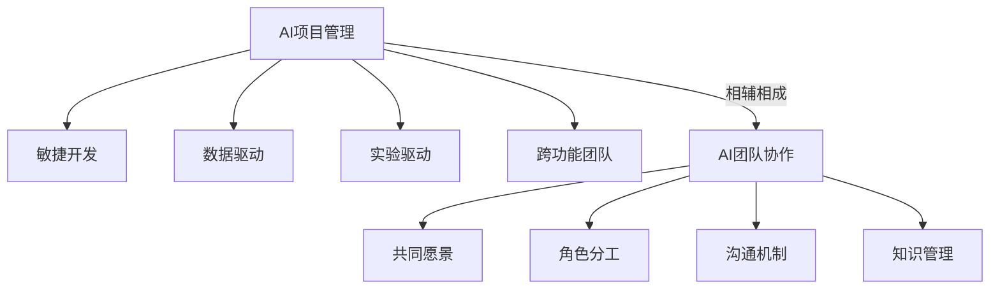

# AI项目管理与团队协作原理与代码实战案例讲解

## 1.背景介绍
### 1.1 AI项目管理的重要性
随着人工智能技术的快速发展,AI项目在各行各业中的应用日益广泛。然而,AI项目的复杂性、不确定性和高风险性给项目管理带来了巨大挑战。有效的AI项目管理对于项目的成功至关重要。
### 1.2 AI团队协作面临的挑战
AI项目通常需要多学科团队的协作,包括数据科学家、软件工程师、业务专家等。不同背景的团队成员在沟通、协调和知识共享方面存在障碍。如何促进AI团队的有效协作是一个亟待解决的问题。
### 1.3 本文的目的和价值
本文将深入探讨AI项目管理与团队协作的原理,并结合实际代码案例进行讲解。通过系统性的分析和实战案例,为AI项目管理者和团队成员提供可操作的方法论和最佳实践,帮助他们应对AI项目管理与团队协作的挑战。

## 2.核心概念与联系
### 2.1 AI项目管理的核心概念
- 敏捷开发:适应变化,快速迭代,持续交付价值
- 数据驱动:以数据为中心,数据质量和管理至关重要 
- 实验驱动:快速实验和验证假设,fail fast
- 跨功能团队:多学科背景,紧密协作
### 2.2 AI团队协作的关键要素
- 共同愿景:明确项目目标,形成共识
- 角色分工:明确责任,发挥专长
- 沟通机制:定期会议,信息共享平台
- 知识管理:文档记录,经验教训总结
### 2.3 AI项目管理与团队协作的关系
有效的AI项目管理为团队协作提供了框架和保障,而高效的团队协作是AI项目成功的基础。二者相辅相成,缺一不可。



## 3.核心算法原理具体操作步骤
### 3.1 Scrum敏捷开发
- 3.1.1 Sprint计划会议:确定Sprint目标和任务
- 3.1.2 每日站会:同步进度,解决问题
- 3.1.3 Sprint评审会议:检视成果,收集反馈
- 3.1.4 Sprint回顾会议:总结经验,持续改进
### 3.2 数据管理流程
- 3.2.1 数据采集:收集原始数据
- 3.2.2 数据清洗:去噪,处理缺失值
- 3.2.3 数据标注:为训练数据添加标签
- 3.2.4 数据增强:扩充训练数据集
- 3.2.5 数据版本管理:数据集的版本控制
### 3.3 模型开发实验流程
- 3.3.1 问题定义:明确要解决的问题
- 3.3.2 数据准备:获取和处理数据
- 3.3.3 特征工程:提取和选择特征
- 3.3.4 模型选择:选择适合的模型算法
- 3.3.5 模型训练:用训练数据训练模型
- 3.3.6 模型评估:用测试数据评估模型性能
- 3.3.7 模型调优:调整超参数优化模型
- 3.3.8 模型部署:将模型集成到生产环境

## 4.数学模型和公式详细讲解举例说明
### 4.1 Scrum 燃尽图
Scrum燃尽图用于跟踪Sprint进度,横轴是时间,纵轴是剩余工作量。理想情况下,实际燃尽线应该尽可能接近理想燃尽线。

$$ 理想燃尽线斜率 = \frac{Sprint初始工作量}{Sprint的天数} $$

$$ 第n天理想剩余工作量 = Sprint初始工作量 - 理想燃尽线斜率 \times n $$

举例:假设一个Sprint为10天,初始工作量为100个故事点。
理想燃尽线斜率 = $\frac{100}{10} = 10$
第5天的理想剩余工作量 = $100 - 10 \times 5 = 50$

### 4.2 数据集划分
将数据集划分为训练集、验证集和测试集,常见的比例是:
$$ 训练集:验证集:测试集 = 70\%:10\%:20\% $$

举例:假设有10000条数据,则划分为:
$$ 训练集 = 10000 \times 70\% = 7000 $$
$$ 验证集 = 10000 \times 10\% = 1000 $$
$$ 测试集 = 10000 \times 20\% = 2000 $$

### 4.3 模型评估指标
以二分类问题为例,常用的模型评估指标有:
- 准确率(Accuracy): $\frac{TP+TN}{TP+TN+FP+FN}$
- 精确率(Precision): $\frac{TP}{TP+FP}$
- 召回率(Recall): $\frac{TP}{TP+FN}$
- F1分数: $2 \times \frac{Precision \times Recall}{Precision + Recall}$

其中,TP为真正例,TN为真反例,FP为假正例,FN为假反例。

举例:一个二分类模型在100个样本上的预测结果为:TP=40,TN=50,FP=5,FN=5。
则各项指标计算如下:
$$ Accuracy = \frac{40+50}{40+50+5+5} = 0.90 $$
$$ Precision = \frac{40}{40+5} = 0.889 $$
$$ Recall = \frac{40}{40+5} = 0.889 $$
$$ F1 = 2 \times \frac{0.889 \times 0.889}{0.889 + 0.889} = 0.889 $$

## 5.项目实践：代码实例和详细解释说明
### 5.1 Scrum看板管理
使用Trello实现Scrum看板管理,将任务卡片在Todo、Doing、Done等列表间拖动,直观展示任务状态。

```python
from trello import TrelloClient

client = TrelloClient(
    api_key='your-api-key',
    api_secret='your-api-secret',
    token='your-token'
)

todo_list = board.get_list('Todo')
doing_list = board.get_list('Doing')
done_list = board.get_list('Done')

# 创建新卡片
todo_list.add_card('任务1')

# 移动卡片
card = todo_list.list_cards()[0]
card.change_list(doing_list.id)
card.change_list(done_list.id)
```

### 5.2 数据版本管理
使用DVC对数据集进行版本管理,记录数据的来源和处理过程,方便数据的共享和复现。

```bash
# 初始化DVC
dvc init

# 将数据集添加到DVC管理
dvc add data/raw_data.csv

# 提交数据版本
dvc commit data/raw_data.csv -m "Add raw data"

# 推送数据到远程存储
dvc push

# 切换到特定数据版本
git checkout v1.0
dvc checkout
```

### 5.3 模型实验管理
使用MLflow跟踪和管理模型实验,记录实验参数、指标和模型文件,便于比较和复现实验结果。

```python
import mlflow

# 设置实验
mlflow.set_experiment('credit-scoring')

# 开始一次实验
with mlflow.start_run():
    # 记录参数
    mlflow.log_param('model', 'RandomForest')
    mlflow.log_param('max_depth', 5)
    
    # 训练模型
    model = train_model(X_train, y_train)
    
    # 评估模型
    accuracy = evaluate_model(model, X_test, y_test)
    
    # 记录指标
    mlflow.log_metric('accuracy', accuracy)
    
    # 保存模型
    mlflow.sklearn.log_model(model, 'model')
```

## 6.实际应用场景
### 6.1 金融风控
- 业务需求:利用机器学习模型对贷款申请者进行信用评分和违约预测
- 技术方案:
  - 数据:收集申请者的个人信息、信用记录、交易数据等
  - 模型:使用Logistic回归、随机森林、GBDT等模型训练信用评分模型
  - 评估:使用AUC、KS等指标评估模型性能
  - 部署:将模型封装成API,集成到贷款审批流程中
- 团队协作:
  - 数据工程师负责数据的采集、清洗和特征工程
  - 数据科学家负责模型的选择、训练和调优
  - 软件工程师负责模型的部署和集成
  - 业务专家负责提供领域知识和业务需求
### 6.2 智能客服
- 业务需求:利用自然语言处理技术构建智能客服系统,自动解答客户问题
- 技术方案:
  - 数据:收集常见问题及其答案,构建知识库
  - 模型:使用BERT等预训练语言模型进行意图识别和语义匹配
  - 评估:使用准确率、召回率等指标评估问答质量
  - 部署:将模型封装成API,集成到客服系统中
- 团队协作:
  - 数据标注团队负责知识库的构建和问答对的标注
  - NLP工程师负责模型的训练和优化
  - 软件工程师负责模型的部署和系统集成
  - 产品经理负责收集用户反馈,优化系统usability

## 7.工具和资源推荐
- 项目管理
  - Jira:功能强大的项目管理与事务跟踪工具
  - Trello:简单易用的在线看板协作工具
  - Asana:适合小团队的项目管理与协作平台
- 数据管理
  - DVC:数据版本控制工具,便于数据集的管理和共享
  - Apache Airflow:数据工作流管理平台,用于数据ETL和处理
  - Pandas Profiling:快速生成数据集的统计报告,了解数据分布情况
- 实验管理
  - MLflow:管理机器学习生命周期,包括实验跟踪、模型注册等
  - Weights & Biases:实验跟踪平台,可视化模型训练过程和结果
  - TensorBoard:TensorFlow的可视化工具包,用于检视训练过程
- 模型部署
  - Docker:容器化技术,实现环境隔离和一致性部署
  - Kubernetes:容器编排平台,实现服务的自动化部署、扩展和管理
  - TensorFlow Serving:用于机器学习模型的高性能服务框架
- 在线课程
  - 机器学习工程师nanodegree(Udacity):覆盖机器学习工程的全流程实践
  - MLOps专项课程(Coursera):由deeplearning.ai出品,教授MLOps理念与实践
  - CS329S机器学习系统设计(斯坦福):讲授ML系统的设计原则和最佳实践

## 8.总结：未来发展趋势与挑战
### 8.1 MLOps的兴起
MLOps是一种结合了机器学习(ML)和运维(Operations)的实践,旨在高效、自动化地管理机器学习系统的整个生命周期。随着机器学习应用的日益普及,MLOps将成为组织机器学习实践的重要方法论。
### 8.2 数据治理的重要性
AI项目的成败很大程度上取决于数据质量。建立完善的数据治理体系,从数据采集、存储、处理到应用各个环节把控数据质量,将成为AI项目成功的关键因素。
### 8.3 人机协作趋势
AI系统并非要取代人力,而是要成为人类智慧的助手和倍增器。在AI项目团队中,如何实现人机协作,发挥人机各自的优势,将是一个值得深入研究的课题。
### 8.4 AI模型的可解释性
随着AI应用领域的拓展,尤其是在金融、医疗等关乎重大决策的领域,AI模型的可解释性日益受到重视。如何在保证模型性能的同时,提高模型的透明度和可解释性,将成为AI技术发展的重要方向。
### 8.5 AI+传统行业的融合
AI技术与传统