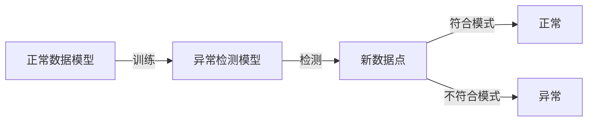

## 1.背景介绍

异常检测（Anomaly Detection）是一种在数据中识别出与正常数据行为不符的模式的方法，这些模式被称为异常。在许多关键领域，如信用卡欺诈、网络安全、健康监测等，异常检测都起着至关重要的作用。

## 2.核心概念与联系

异常检测的核心概念是基于数据的正常行为建立模型，然后使用这个模型来检测新的数据点是否符合正常行为模式。如果一个数据点与正常行为模式有显著的差异，那么我们就认为它是一个异常。



## 3.核心算法原理具体操作步骤

### 3.1 数据预处理

在进行异常检测之前，我们需要对数据进行预处理，包括缺失值处理、特征选择、特征缩放等。

### 3.2 模型训练

我们使用正常数据训练一个模型，这个模型可以是基于统计的、基于距离的、基于密度的或基于集群的。

### 3.3 异常检测

我们使用训练好的模型来检测新的数据点，如果一个数据点与正常模式有显著的差异，我们就认为它是一个异常。

## 4.数学模型和公式详细讲解举例说明

以基于统计的异常检测为例，我们可以使用高斯分布来建立正常数据模型。假设我们的数据服从高斯分布，即 $X \sim N(\mu, \sigma^2)$，其中 $\mu$ 是均值，$\sigma^2$ 是方差。我们可以用样本均值和样本方差来估计 $\mu$ 和 $\sigma^2$：

$$
\mu = \frac{1}{n}\sum_{i=1}^n x_i, \quad \sigma^2 = \frac{1}{n}\sum_{i=1}^n (x_i - \mu)^2
$$

然后我们可以使用3西格玛原则来检测异常，即如果一个数据点 $x$ 满足 $|x - \mu| > 3\sigma$，我们就认为它是一个异常。

## 5.项目实践：代码实例和详细解释说明

以下是一个使用Python和Scikit-learn库进行异常检测的简单示例：

```python
import numpy as np
from sklearn.covariance import EllipticEnvelope

# 生成正常数据
normal_data = np.random.normal(0, 1, size=(100, 2))

# 训练模型
model = EllipticEnvelope(contamination=0.1)
model.fit(normal_data)

# 生成新的数据点
new_data = np.array([[2, 2]])

# 检测异常
pred = model.predict(new_data)
if pred[0] == -1:
    print("Anomaly detected!")
else:
    print("Normal data point.")
```

## 6.实际应用场景

异常检测在许多领域都有广泛的应用，例如信用卡欺诈检测、网络入侵检测、健康监测等。在信用卡欺诈检测中，我们可以使用异常检测来识别出不正常的交易行为；在网络入侵检测中，我们可以使用异常检测来识别出不正常的网络流量；在健康监测中，我们可以使用异常检测来识别出不正常的生理信号。

## 7.工具和资源推荐

- Python：一种广泛用于数据分析和机器学习的编程语言。
- Scikit-learn：一个提供大量机器学习算法的Python库，包括异常检测。
- PyOD：一个专门用于异常检测的Python库，提供了多种异常检测算法。

## 8.总结：未来发展趋势与挑战

异常检测是一种强大的工具，但也面临着许多挑战，例如如何处理高维数据、如何处理大规模数据等。随着深度学习和大数据技术的发展，我们期待在未来能看到更多的创新和进步。

## 9.附录：常见问题与解答

Q: 异常检测和异常识别有什么区别？

A: 异常检测是识别出与正常数据行为不符的模式，而异常识别不仅要识别出异常，还要识别出异常的类型。

Q: 如何处理高维数据的异常检测？

A: 高维数据的异常检测是一个挑战，常用的方法包括降维和子空间方法。

作者：禅与计算机程序设计艺术 / Zen and the Art of Computer Programming
