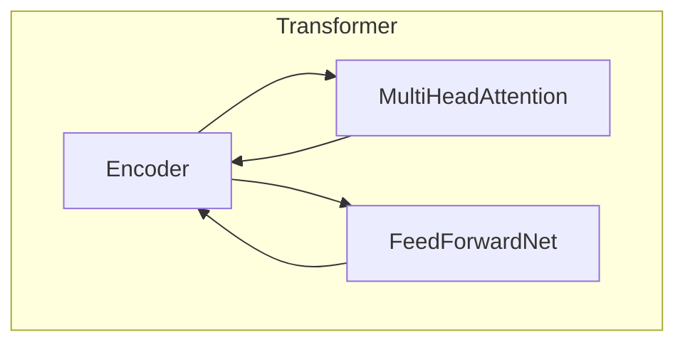
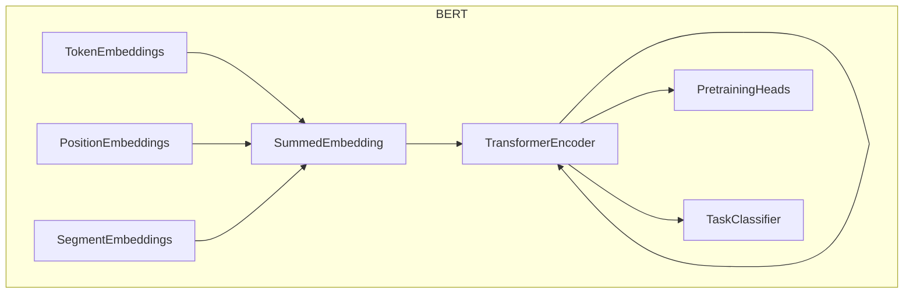

# BERT 原理与代码实战案例讲解

## 1.背景介绍

### 1.1 自然语言处理的重要性

在当今信息时代,自然语言处理(Natural Language Processing,NLP)已经成为了人工智能领域中最重要和最具挑战性的研究方向之一。随着海量文本数据的快速积累,对于计算机能够自动理解和处理自然语言的需求变得越来越迫切。自然语言处理广泛应用于机器翻译、智能问答、信息检索、情感分析、自动总结等诸多领域,对提高人机交互效率、挖掘文本数据价值具有重要意义。

### 1.2 NLP面临的主要挑战

然而,自然语言处理一直面临着许多艰巨挑战:

1. **语义复杂性**:自然语言存在复杂的语义关系、隐喻、双关语等,很难用精确的数学模型来描述。

2. **语法多样性**:不同语言的语法结构差异巨大,给跨语言处理带来极大困难。

3. **领域依赖性**:同一词语在不同领域可能有完全不同的含义,需要结合上下文理解。

4. **标注数据缺乏**:训练有素的NLP模型需要大量高质量的标注语料,而这是一项昂贵且耗时的工作。

### 1.3 BERT的重要意义

为了突破以上瓶颈,2018年Google的AI研究员发表了一种全新的预训练语言模型BERT(Bidirectional Encoder Representations from Transformers),它在自然语言处理领域掀起了新的革命浪潮。BERT能够通过大规模无监督预训练,学习到通用的语义表示,从而极大提高了下游NLP任务的性能表现,被广泛应用于机器阅读理解、文本分类、序列标注等各种任务中。本文将深入探讨BERT的核心原理、训练策略、编码实现,并通过实战案例讲解如何将BERT应用于实际的NLP问题。

## 2.核心概念与联系

### 2.1 Transformer模型

要理解BERT,我们首先需要了解Transformer模型的核心概念。Transformer是2017年由Google的Vaswani等人提出的一种全新的基于注意力机制(Attention Mechanism)的序列到序列(Seq2Seq)模型,主要用于机器翻译任务。与传统的RNN/LSTM模型相比,Transformer完全摒弃了递归结构,而是通过自注意力(Self-Attention)机制来捕捉输入序列中任意两个位置之间的长程依赖关系,大大提高了并行计算能力。此外,Transformer还引入了位置编码(Positional Encoding)来注入序列的位置信息。

Transformer的核心组件是多头自注意力(Multi-Head Self-Attention)和前馈神经网络(Feed-Forward Neural Network),通过堆叠多个这样的编码器(Encoder)层,就构成了Transformer的编码器部分。对于机器翻译任务,Transformer还需要一个解码器(Decoder)部分,用于根据编码器的输出生成目标序列。BERT则只使用了Transformer的编码器部分。

### 2.2 BERT的模型结构

BERT的基本思想是:先通过大规模无监督预训练,在大量通用语料上学习通用的语义表示,然后再将这些通用语义表示迁移到下游的NLP任务上,进行有监督的微调(Fine-tuning),从而显著提高模型的性能。

BERT的模型结构主要由以下几个部分组成:

1. **词嵌入(Token Embeddings)**: 将输入的词元(Token)转换为对应的词向量表示。

2. **位置嵌入(Position Embeddings)**: 因为Transformer没有递归结构,需要添加位置嵌入来区分不同位置的词元。

3. **片段嵌入(Segment Embeddings)**: 对于双句输入(如问答对),需要引入片段嵌入来区分两个句子。

4. **多层Transformer编码器(Transformer Encoder)**: 堆叠多个编码器层,每一层包含多头注意力和前馈神经网络。

5. **预训练头(Pre-training Heads)**: 根据不同的预训练任务(如遮掩语言模型和下一句预测),添加相应的输出层。

6. **微调分类器(Task Classifier)**: 将BERT的输出传给单层分类器,对于下游的有监督任务(如文本分类)进行微调。

### 2.3 预训练任务

BERT的预训练过程包括两个无监督任务:

1. **遮掩语言模型(Masked Language Model, MLM)**: 随机遮掩输入序列中的15%词元,并以这些遮掩的词元作为标签,训练模型去预测它们的原始词元。这样可以让BERT学习到双向的上下文语义表示。

2. **下一句预测(Next Sentence Prediction, NSP)**: 判断两个句子是否为连续句子,从而让BERT学习到跨句子的关系表示。

通过在大规模无标注语料上预训练上述两个任务,BERT可以在底层捕捉到丰富的语义和句法信息,为后续的下游任务提供强大的语义表示能力。

## 3.核心算法原理具体操作步骤 

### 3.1 输入表示

BERT接受一个序列作为输入,该序列由词元(Token)组成。每个序列都会被添加上特殊的标记[CLS]和[SEP],其中[CLS]用于分类任务,[SEP]用于分隔两个句子。

对于给定的词元序列,BERT首先通过查询词表(Vocabulary),将每个词元映射为相应的词嵌入向量;然后为每个位置添加对应的位置嵌入;如果是双句输入,还需要添加片段嵌入来区分两个句子。最后将以上三种嵌入相加,作为BERT模型的初始输入表示。

### 3.2 Transformer编码器

BERT使用了基于Transformer的编码器结构,由多个相同的编码器层堆叠而成。每个编码器层主要包括两个子层:

1. **多头自注意力(Multi-Head Self-Attention)**

   自注意力机制能够捕捉输入序列中任意两个位置之间的长程依赖关系,是Transformer的核心组件。具体来说,对于每个词元,计算其与输入序列中所有其他词元的注意力权重,然后根据这些权重对所有词元进行加权求和,得到该词元的注意力表示。

   多头注意力是将注意力机制复制多份,分别对输入序列进行编码,最后将所有注意力表示拼接起来,捕捉不同子空间的信息。

2. **前馈神经网络(Feed-Forward Neural Network)**

   前馈神经网络包含两个线性变换,中间使用ReLU激活函数。它对每个词元的注意力表示进行非线性映射,提供"融会贯通"的能力。

此外,每个子层之后还会进行残差连接(Residual Connection)和层归一化(Layer Normalization),以缓解深度模型的训练问题。BERT的编码器层通过堆叠多个这样的结构,对输入序列进行了深度的上下文编码。

### 3.3 预训练过程

BERT的预训练过程包括两个无监督任务:遮掩语言模型(MLM)和下一句预测(NSP)。

1. **遮掩语言模型(MLM)**

   在输入序列中随机遮掩15%的词元,并以这些遮掩词元作为标签,训练模型去预测它们的原始词元。具体操作步骤如下:

   a) 选择15%的词元位置进行遮掩,其中80%直接替换为特殊标记[MASK],10%替换为随机词元,剩余10%保持不变。

   b) 将BERT的最终隐层状态作为输入,通过一个分类器层预测遮掩位置的原始词元。

   c) 最小化预测的交叉熵损失,作为MLM预训练的目标函数。

   通过MLM预训练,BERT学会了利用左右上下文进行双向编码,捕捉到了丰富的语义和句法信息。

2. **下一句预测(NSP)** 

   NSP任务的目标是判断两个句子是否为连续的句子。具体步骤如下:

   a) 以50%的概率,将输入序列A和B拼接为连续句子;另外50%的概率,从语料库中随机选择一个句子B'与A拼接。

   b) 将特殊标记[CLS]作为输入,通过一个二分类器层预测拼接句子是否为连续句子。

   c) 最小化二分类交叉熵损失,作为NSP预训练的目标函数。

   NSP任务让BERT学习到了跨句子级别的关系表示,对于诸如问答、自然语言推理等任务很有帮助。

通过在大规模语料上联合预训练MLM和NSP两个任务,BERT在底层学习到了通用的上下文语义表示,为后续的下游任务提供了强大的迁移能力。

## 4.数学模型和公式详细讲解举例说明

### 4.1 Self-Attention注意力机制

Self-Attention是Transformer的核心组件,它能够捕捉输入序列中任意两个位置之间的长程依赖关系。对于给定的查询向量$\boldsymbol{q}$、键向量$\boldsymbol{k}$和值向量$\boldsymbol{v}$,注意力机制的计算过程如下:

$$\begin{aligned}
\text{Attention}(\boldsymbol{q}, \boldsymbol{k}, \boldsymbol{v}) &= \text{softmax}\left(\frac{\boldsymbol{q}\boldsymbol{k}^\top}{\sqrt{d_k}}\right)\boldsymbol{v} \\
&= \sum_{j=1}^n \alpha_j \boldsymbol{v}_j
\end{aligned}$$

其中,$\alpha_j$表示查询向量$\boldsymbol{q}$对键向量$\boldsymbol{k}_j$的注意力权重,通过软max函数计算得到:

$$\alpha_j = \frac{\exp\left(\boldsymbol{q}\boldsymbol{k}_j^\top/\sqrt{d_k}\right)}{\sum_{i=1}^n\exp\left(\boldsymbol{q}\boldsymbol{k}_i^\top/\sqrt{d_k}\right)}$$

其中,$d_k$是键向量$\boldsymbol{k}$的维度。最后,将注意力权重$\alpha_j$与对应的值向量$\boldsymbol{v}_j$相乘并求和,得到注意力表示。$\sqrt{d_k}$的作用是防止点积过大导致软max函数梯度较小。

在Self-Attention中,查询向量$\boldsymbol{q}$、键向量$\boldsymbol{k}$和值向量$\boldsymbol{v}$都来自同一个输入序列的嵌入表示。通过计算每个位置与所有其他位置的注意力权重,Self-Attention能够有效地捕捉长程依赖关系。

### 4.2 Multi-Head Attention

单一的Self-Attention只能从一个子空间捕捉序列的上下文信息,为了获得更丰富的表示,Transformer引入了Multi-Head Attention机制。具体来说,将注意力机制复制$h$份,每一份称为一个"头"(Head),分别对输入序列进行编码,最后将所有头的注意力表示拼接起来:

$$\text{MultiHead}(\boldsymbol{Q}, \boldsymbol{K}, \boldsymbol{V}) = \text{Concat}(\text{head}_1, \ldots, \text{head}_h)\boldsymbol{W}^O$$

其中,第$i$个头的计算过程为:

$$\begin{aligned}
\text{head}_i &= \text{Attention}(\boldsymbol{Q}\boldsymbol{W}_i^Q, \boldsymbol{K}\boldsymbol{W}_i^K, \boldsymbol{V}\boldsymbol{W}_i^V) \\
&= \text{softmax}\left(\frac{(\boldsymbol{Q}\boldsymbol{W}_i^Q)(\boldsymbol{K}\boldsymbol{W}_i^K)^\top}{\sqrt{d_k}}\right)(\boldsymbol{V}\boldsymbol{W}_i^V