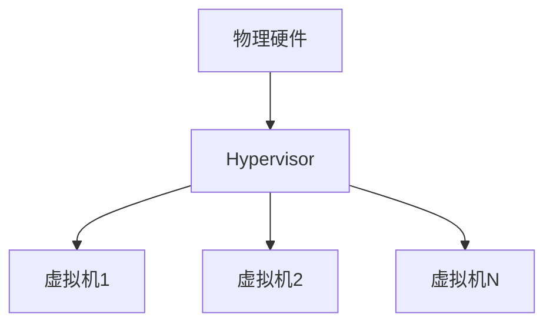
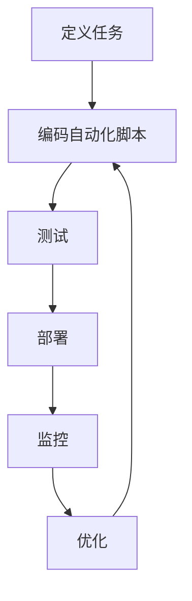

# Cloud Computing 原理与代码实战案例讲解

## 1. 背景介绍

随着互联网技术的飞速发展和数据量的快速增长,云计算作为一种新兴的计算模式,已经深深地影响着我们的生活和工作方式。云计算可以为用户提供按需使用、快速部署、弹性伸缩、按量付费等优势,极大地提高了资源利用率,降低了IT成本。

云计算的核心思想是将计算资源(如CPU、内存、存储、带宽等)通过互联网以服务的形式提供给用户,用户可以根据自身需求按需租用所需的资源,无需购买昂贵的硬件设备。云计算服务商负责构建和维护底层基础设施,确保资源的高可用性和安全性。

云计算可以分为三种主要服务模式:基础设施即服务(IaaS)、平台即服务(PaaS)和软件即服务(SaaS)。其中,IaaS提供基础计算资源,如虚拟机和存储;PaaS提供开发和部署环境;而SaaS则直接提供可用的应用程序。

## 2. 核心概念与联系

### 2.1 虚拟化技术

虚拟化是云计算的核心技术之一,它允许在单个物理硬件上运行多个虚拟机(VM),每个虚拟机都可以像独立的物理机一样运行操作系统和应用程序。通过虚拟化,可以实现资源的高效利用和隔离,提高了灵活性和可扩展性。

### 2.2 资源池

资源池是云计算中的一个重要概念,它将大量的物理资源(如CPU、内存、存储等)聚合到一个逻辑资源池中,并通过虚拟化技术对资源进行动态分配和调度。资源池可以实现资源的统一管理和按需分配,提高了资源利用率。

### 2.3 自动化和编排

自动化和编排是云计算中的另一个关键概念。自动化可以实现资源的自动配置、部署和管理,减少了人工干预;而编排则可以将多个任务或服务自动化地组合在一起,实现复杂的应用程序部署和管理。

### 2.4 弹性伸缩

弹性伸缩是云计算的一大优势,它允许根据实际负载情况自动调整资源的分配,在高峰期扩展资源以满足需求,在闲暇时释放多余资源以节省成本。这种按需分配资源的方式可以提高资源利用率,降低运营成本。

### 2.5 安全性

由于云计算涉及将数据和应用程序托管在第三方环境中,因此安全性是一个重要的考虑因素。云服务提供商通常会采用多种安全措施,如身份认证、访问控制、数据加密、防火墙等,以保护用户数据和应用程序的安全。

## 3. 核心算法原理具体操作步骤

### 3.1 虚拟化技术原理

虚拟化技术的核心是引入了一个虚拟机监控程序(Hypervisor或VMM),它在硬件和操作系统之间充当了一个中介层。Hypervisor可以模拟硬件资源,并将这些虚拟化的资源分配给运行在其上的多个虚拟机。

虚拟化技术的具体操作步骤如下:

1. 安装Hypervisor软件,如VMware ESXi、Xen、KVM等。
2. 在Hypervisor上创建虚拟机,为每个虚拟机分配虚拟化的CPU、内存、存储和网络资源。
3. 在虚拟机中安装操作系统和应用程序,就像在物理机上一样。
4. Hypervisor负责调度和管理虚拟机,确保它们可以共享底层硬件资源,同时又相互隔离。



### 3.2 资源池管理算法

资源池管理算法的目标是高效地利用资源池中的资源,满足用户对资源的需求。常见的资源池管理算法包括:

1. **首次适配(First Fit)算法**: 从资源池中找到第一个足够大的空闲资源块分配给请求。
2. **最佳适配(Best Fit)算法**: 从资源池中找到最小的足够大的空闲资源块分配给请求,以减少内存碎片。
3. **最坏适配(Worst Fit)算法**: 从资源池中找到最大的空闲资源块分配给请求,以产生较大的内存碎片,从而减少外部碎片。
4. **伙伴系统(Buddy System)算法**: 将内存划分为若干个等大小的块,当请求到来时,找到足够大的块分配,如果没有足够大的块,则将较大的块一分为二,直到找到足够大的块为止。

这些算法各有优缺点,在实际应用中需要根据具体场景选择合适的算法,以达到资源利用最大化和内存碎片最小化的目标。

### 3.3 自动化和编排流程

自动化和编排流程通常包括以下几个步骤:

1. **定义**: 首先需要定义要自动化和编排的任务或服务,包括它们的依赖关系、配置参数等。
2. **编码**: 使用特定的语言或工具(如Ansible、Terraform等)编写自动化和编排脚本。
3. **测试**: 在测试环境中测试自动化和编排脚本,确保它们可以正常工作。
4. **部署**: 在生产环境中执行自动化和编排脚本,完成任务或服务的部署和管理。
5. **监控**: 持续监控自动化和编排过程,及时发现和解决任何问题。
6. **优化**: 根据实际运行情况,对自动化和编排脚本进行优化和改进。



## 4. 数学模型和公式详细讲解举例说明

### 4.1 虚拟机资源分配模型

在云计算环境中,需要合理地分配有限的物理资源(如CPU、内存等)给多个虚拟机。资源分配模型通常基于以下公式:

$$
\begin{aligned}
\text{minimize} \quad & \sum_{i=1}^{N} \sum_{j=1}^{M} c_{ij} x_{ij} \\
\text{subject to} \quad & \sum_{j=1}^{M} x_{ij} = 1, \quad i = 1, 2, \ldots, N \\
& \sum_{i=1}^{N} r_{ik} x_{ij} \leq R_k, \quad k = 1, 2, \ldots, K \\
& x_{ij} \in \{0, 1\}, \quad i = 1, 2, \ldots, N; \quad j = 1, 2, \ldots, M
\end{aligned}
$$

其中:

- $N$是虚拟机的数量
- $M$是物理机的数量
- $c_{ij}$是将虚拟机$i$分配到物理机$j$上的成本
- $x_{ij}$是决策变量,如果虚拟机$i$分配到物理机$j$上,则$x_{ij}=1$,否则$x_{ij}=0$
- $r_{ik}$是虚拟机$i$对资源$k$的需求
- $R_k$是可用的资源$k$的总量

目标函数是最小化所有虚拟机分配的总成本。约束条件包括:

1. 每个虚拟机只能分配到一台物理机上
2. 每种资源的总需求不能超过可用资源的总量
3. 决策变量是0或1的整数值

通过求解这个优化问题,可以找到最优的虚拟机到物理机的分配方案。

### 4.2 队列模型

在云计算系统中,常常需要处理大量的任务请求,这些请求可以被建模为队列系统。假设任务请求按照泊松过程到达,服务时间服从指数分布,则可以使用$M/M/c$队列模型来描述该系统。

$M/M/c$队列模型的一些重要公式如下:

$$
\begin{aligned}
\rho &= \frac{\lambda}{c\mu} \\
P_0 &= \left[\sum_{n=0}^{c-1}\frac{(c\rho)^n}{n!} + \frac{(c\rho)^c}{c!(1-\rho)}\right]^{-1} \\
P_n &= \begin{cases}
\frac{(c\rho)^n}{n!}P_0, & n < c \\
\frac{(c\rho)^n}{c!c^{n-c}}P_0, & n \geq c
\end{cases} \\
L &= \rho + \frac{c\rho^{c+1}}{c!(1-\rho)^2}P_0 \\
W &= \frac{L}{\lambda}
\end{aligned}
$$

其中:

- $\lambda$是任务请求的到达率
- $\mu$是服务率
- $c$是服务器的数量
- $\rho$是系统的利用率
- $P_n$是有$n$个任务在系统中的稳态概率
- $P_0$是系统空闲的稳态概率
- $L$是系统中任务的平均数量
- $W$是任务在系统中的平均等待时间

通过计算这些性能指标,可以评估云计算系统的负载情况,并根据需要进行资源调配和扩容。

## 5. 项目实践:代码实例和详细解释说明

### 5.1 使用Terraform构建AWS云基础设施

Terraform是一种基础设施即代码(IaC)工具,可以用来自动化云资源的配置和管理。下面是一个使用Terraform在AWS上创建虚拟私有云(VPC)、子网、Internet网关、路由表和安全组的示例:

```hcl
# 配置AWS提供商
provider "aws" {
  region = "us-east-1"
}

# 创建VPC
resource "aws_vpc" "main" {
  cidr_block = "10.0.0.0/16"

  tags = {
    Name = "Main VPC"
  }
}

# 创建公有子网
resource "aws_subnet" "public" {
  vpc_id     = aws_vpc.main.id
  cidr_block = "10.0.1.0/24"

  tags = {
    Name = "Public Subnet"
  }
}

# 创建Internet网关
resource "aws_internet_gateway" "gw" {
  vpc_id = aws_vpc.main.id

  tags = {
    Name = "Internet Gateway"
  }
}

# 创建路由表并关联Internet网关
resource "aws_route_table" "public" {
  vpc_id = aws_vpc.main.id

  route {
    cidr_block = "0.0.0.0/0"
    gateway_id = aws_internet_gateway.gw.id
  }

  tags = {
    Name = "Public Route Table"
  }
}

# 将公有子网关联到路由表
resource "aws_route_table_association" "public" {
  subnet_id      = aws_subnet.public.id
  route_table_id = aws_route_table.public.id
}

# 创建安全组
resource "aws_security_group" "allow_http" {
  name        = "allow_http"
  description = "Allow HTTP inbound traffic"
  vpc_id      = aws_vpc.main.id

  ingress {
    from_port   = 80
    to_port     = 80
    protocol    = "tcp"
    cidr_blocks = ["0.0.0.0/0"]
  }

  egress {
    from_port       = 0
    to_port         = 0
    protocol        = "-1"
    cidr_blocks     = ["0.0.0.0/0"]
  }
}
```

在这个示例中,我们首先配置AWS提供商,然后定义了VPC、公有子网、Internet网关、路由表和安全组等资源。Terraform会根据这些资源定义自动创建和配置相应的云资源。

使用Terraform的好处是可以通过代码来管理基础设施,实现基础设施的版本控制、复制和自动化部署。它还支持多种云平台,如AWS、Azure、GCP等。

### 5.2 使用Ansible自动化应用程序部署

Ansible是一种自动化工具,可以用来自动化应用程序的配置、部署和管理。下面是一个使用Ansible在多台服务器上部署Apache Web服务器的示例:

```yaml
# Apache安装playbook
- hosts: webservers
  become: yes

  tasks:
    - name: Install Apache
      yum:
        name: httpd
        state: latest

    - name: Start Apache
      systemd:
        name: httpd
        state: started
        enabled: yes

    