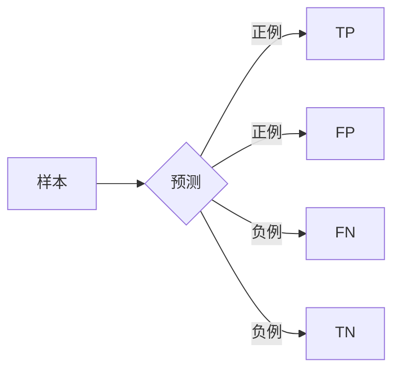

# Confusion Matrix 原理与代码实战案例讲解

## 1. 背景介绍
### 1.1 什么是 Confusion Matrix
Confusion Matrix,中文名叫混淆矩阵,是机器学习中常用的一种可视化工具,特别是在监督学习领域。它可以很好地评估模型的性能,尤其是在分类问题中。混淆矩阵展示了模型在测试集上的表现情况,告诉我们模型在各个类别上的预测准确率和错误率。通过混淆矩阵,我们可以计算出许多评估指标,如准确率(Accuracy)、精确率(Precision)、召回率(Recall)和F1分数等。

### 1.2 为什么要使用 Confusion Matrix
在机器学习和数据挖掘领域,模型评估是一个非常重要的环节。我们需要知道模型的性能如何,才能决定是否要部署和使用它。准确率这个指标虽然直观,但有时候会具有欺骗性,特别是在数据集不平衡的情况下。而混淆矩阵可以给出更全面的评估结果,让我们清楚地看到模型在每个类别上的表现。此外,混淆矩阵也有助于我们分析模型的错误类型,找出可以改进的地方。

### 1.3 Confusion Matrix 的应用场景
混淆矩阵几乎可以用于所有的分类问题,无论是二分类还是多分类。一些常见的应用场景包括:

- 医疗诊断:通过混淆矩阵评估诊断模型的准确性,避免漏诊和误诊。
- 垃圾邮件检测:评估垃圾邮件分类器的性能,尽量减少错误的分类。  
- 情感分析:分析情感分类模型在正面、负面和中性情感上的表现。
- 图像分类:评估图像分类模型对不同类别图像的识别能力。

## 2. 核心概念与联系
### 2.1 混淆矩阵的构成元素
对于一个二分类问题,混淆矩阵是一个2x2的矩阵,主对角线上的元素表示分类正确的样本数量,而非对角线上的元素则表示分类错误的样本数量。

- True Positive (TP):实际为正例,预测也为正例。
- True Negative (TN):实际为负例,预测也为负例。
- False Positive (FP):实际为负例,预测为正例。
- False Negative (FN):实际为正例,预测为负例。

### 2.2 评估指标的计算
有了混淆矩阵,我们就可以计算各种评估指标:

- 准确率 Accuracy = (TP + TN) / (TP + TN + FP + FN)
- 精确率 Precision = TP / (TP + FP) 
- 召回率 Recall = TP / (TP + FN)
- F1分数 F1-Score = 2 * Precision * Recall / (Precision + Recall)



## 3. 核心算法原理与具体操作步骤
### 3.1 构建混淆矩阵的步骤
1. 对测试集中的每个样本,用训练好的模型进行预测。
2. 将预测结果与真实标签进行比较,统计TP、TN、FP、FN的数量。
3. 将统计结果填入混淆矩阵。
4. 根据混淆矩阵计算评估指标。

### 3.2 多分类问题的混淆矩阵
对于多分类问题,混淆矩阵的大小为nxn,其中n为类别数。矩阵的第i行第j列的元素表示真实标签为i,预测标签为j的样本数量。对角线上的元素表示分类正确的样本数量,非对角线元素则表示分类错误的样本数量。多分类问题的评估指标计算需要对每个类别分别进行,然后取平均值。

## 4. 数学模型和公式详细讲解举例说明
### 4.1 二分类问题的混淆矩阵
假设我们有一个二分类模型,用于预测一个人是否患有某种疾病。我们用这个模型对100个人进行预测,得到如下结果:

- 60个人被正确预测为患病(TP)
- 20个人被正确预测为未患病(TN) 
- 10个人被错误预测为患病(FP)
- 10个人被错误预测为未患病(FN)

则混淆矩阵为:

|      | 预测患病 | 预测未患病 |
|------|--------|----------|
| 实际患病 |   60  |    10    |
| 实际未患病 |   10  |    20    |

根据混淆矩阵,我们可以计算出:

- 准确率 Accuracy = (60 + 20) / 100 = 0.8
- 精确率 Precision = 60 / (60 + 10) = 0.86
- 召回率 Recall = 60 / (60 + 10) = 0.86 
- F1分数 F1-Score = 2 * 0.86 * 0.86 / (0.86 + 0.86) = 0.86

### 4.2 不平衡数据集下的混淆矩阵
假设我们有一个用于检测信用卡欺诈的模型,在10000个交易中,只有100个欺诈交易。模型的预测结果如下:

- 90个欺诈交易被正确预测(TP)
- 9900个正常交易被正确预测(TN)
- 10个正常交易被错误预测为欺诈(FP) 
- 10个欺诈交易被错误预测为正常(FN)

混淆矩阵为:

|      | 预测欺诈 | 预测正常 |
|------|--------|--------|
| 实际欺诈 |   90   |   10   |
| 实际正常 |   10   |  9900  |

虽然模型的准确率很高(0.998),但是召回率只有0.9,说明还有10%的欺诈交易没有被检测出来。这个例子说明了在不平衡数据集下,准确率并不能完全反映模型的性能,需要综合考虑其他指标。

## 5. 项目实践:代码实例和详细解释说明
下面是用Python的Scikit-learn库实现混淆矩阵和评估指标计算的示例代码:

```python
from sklearn.metrics import confusion_matrix, classification_report

# 假设y_true是真实标签,y_pred是预测标签
y_true = [1, 0, 1, 1, 0, 1, 0, 0, 1, 0] 
y_pred = [1, 0, 1, 1, 0, 0, 1, 0, 1, 0]

# 计算混淆矩阵
cm = confusion_matrix(y_true, y_pred)
print("Confusion Matrix:")
print(cm)

# 计算评估指标
report = classification_report(y_true, y_pred)
print("Classification Report:")
print(report)
```

输出结果:

```
Confusion Matrix:
[[4 1]
 [1 4]]
Classification Report:
              precision    recall  f1-score   support

           0       0.80      0.80      0.80         5
           1       0.80      0.80      0.80         5

    accuracy                           0.80        10
   macro avg       0.80      0.80      0.80        10
weighted avg       0.80      0.80      0.80        10
```

代码解释:

1. 首先导入需要的函数。confusion_matrix用于计算混淆矩阵,classification_report用于生成评估报告。

2. 准备真实标签y_true和预测标签y_pred。这里用了一个简单的示例数据。

3. 用confusion_matrix计算混淆矩阵,并打印出来。可以看到这是一个二分类问题的混淆矩阵。

4. 用classification_report计算评估指标,包括准确率、精确率、召回率和F1分数,并打印评估报告。report中的support表示每个类别的样本数量。

除了Scikit-learn,其他深度学习框架如TensorFlow和PyTorch也提供了计算混淆矩阵的函数。无论使用哪个框架,混淆矩阵的计算原理都是一样的。

## 6. 实际应用场景
混淆矩阵在许多实际场景中都有应用,下面举几个具体的例子:

### 6.1 医疗诊断
假设我们开发了一个用于诊断某种癌症的模型。我们希望这个模型的召回率尽量高,即尽量减少漏诊(FN)的情况,因为漏诊可能会耽误病人的治疗。同时,我们也希望模型的精确率足够高,避免将健康人误诊为癌症(FP),因为这可能会给病人带来不必要的恐慌和医疗开支。通过混淆矩阵,我们可以评估模型在这两个指标上的表现,并进行优化。

### 6.2 欺诈检测
在欺诈检测中,我们希望尽量减少False Negative,即将欺诈交易误判为正常交易,因为这可能给银行或商家带来损失。但同时,我们也不希望False Positive太高,因为频繁地将正常交易判定为欺诈可能会影响用户体验,甚至导致客户流失。通过混淆矩阵,我们可以权衡模型在这两个方面的表现。

### 6.3 情感分析
在情感分析中,我们常常需要将文本分为正面、负面和中性三类。我们可以用混淆矩阵来评估模型在每个类别上的表现。例如,如果模型在负面情感上的召回率较低,说明许多负面情感被漏判了,这可能会影响后续的决策。我们可以通过混淆矩阵发现这个问题,并针对性地改进模型。

## 7. 工具和资源推荐
- Scikit-learn:Python机器学习库,提供了计算混淆矩阵和常见评估指标的函数。
- TensorFlow:深度学习框架,tf.math.confusion_matrix函数可以计算混淆矩阵。
- PyTorch:深度学习框架,torchmetrics库提供了混淆矩阵和各种评估指标的计算。
- Matplotlib和Seaborn:Python数据可视化库,可以用于绘制混淆矩阵的热力图。
- Google Machine Learning Crash Course:谷歌的机器学习课程,有关于混淆矩阵的详细讲解。
- Coursera Machine Learning Course:吴恩达的机器学习课程,涵盖了混淆矩阵等模型评估知识。

## 8. 总结:未来发展趋势与挑战
混淆矩阵作为一种经典的模型评估工具,在未来仍然会扮演重要的角色。随着机器学习和深度学习的发展,我们面临的分类问题将变得更加复杂,如多标签分类、层次分类等。混淆矩阵需要适应这些新的问题形式,可能需要扩展到三维甚至更高维度。

此外,在大规模数据和在线学习的场景下,混淆矩阵的计算和存储也面临挑战。我们可能需要设计增量式或分布式的算法来构建混淆矩阵。

最后,如何将混淆矩阵与其他评估指标结合,如ROC曲线、PR曲线等,也是一个值得探索的方向。通过综合利用多种评估工具,我们可以对模型有更全面的了解。

总之,尽管混淆矩阵已有悠久的历史,但它仍然有许多值得研究的问题。只有不断发展混淆矩阵的理论和应用,我们才能更好地评估和改进我们的机器学习模型。

## 9. 附录:常见问题与解答
### 9.1 混淆矩阵可以用于回归问题吗?
不可以。混淆矩阵是专门用于分类问题的评估工具。对于回归问题,我们通常使用均方误差(MSE)、平均绝对误差(MAE)、R平方等指标来评估模型的性能。

### 9.2 如果数据集不平衡,如何解释混淆矩阵?
在不平衡数据集下,我们需要更关注少数类(通常是我们更感兴趣的类)的表现。我们可以重点看少数类的召回率,即多少比例的少数类样本被正确识别出来了。此外,我们也可以计算F1分数,它是精确率和召回率的调和平均,可以平衡地考虑两个指标。

### 9.3 混淆矩阵可以处理多个模型的比较吗?
可以。我们可以为