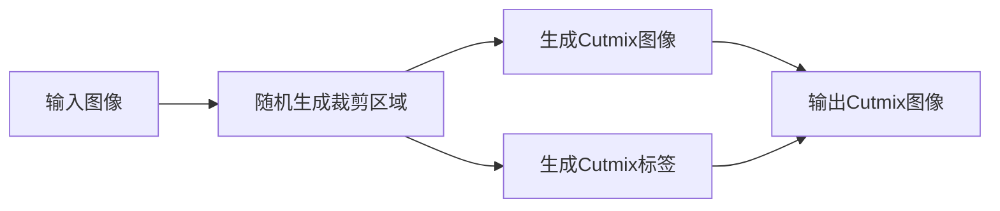

# Cutmix原理与代码实例讲解

## 1. 背景介绍

### 1.1 数据增强技术概述

在深度学习领域,数据增强技术扮演着至关重要的角色。数据增强是一种通过对原始训练数据进行变换和组合,从而生成新的训练样本的技术。它可以有效地扩充训练集的规模和多样性,提高模型的泛化能力,降低过拟合风险。

### 1.2 常见的数据增强方法

传统的数据增强方法主要包括:

- 几何变换:如旋转、翻转、缩放、裁剪等
- 色彩变换:如亮度、对比度、饱和度调整等  
- 噪声扰动:如高斯噪声、椒盐噪声等
- 数据混合:如Mixup

### 1.3 Mixup的局限性

Mixup是一种简单有效的数据增强方法,通过对两张图像及其标签进行线性组合,生成新的训练样本。但Mixup存在一定局限性:

- 线性组合可能生成一些非自然、无意义的图像
- 混合区域过于简单,学习到的特征可能不够丰富
- 混合比例是随机生成的,未充分利用样本特征

因此,有必要探索更加先进的数据混合方法,这就是Cutmix的由来。

## 2. 核心概念与联系

### 2.1 Cutmix的基本思想

Cutmix是一种改进的数据混合方法,其核心思想是:

- 从一张图像中随机裁剪出一个矩形区域
- 将该区域粘贴到另一张图像的相同位置
- 根据裁剪区域的面积比例,对两张图像的标签进行加权平均

通过这种方式,Cutmix生成的新样本兼顾了两张图像的局部特征,且具有更加清晰、自然的边界。

### 2.2 Cutmix与Mixup的异同

Cutmix与Mixup都属于数据混合方法,但二者存在一些区别:

- 混合粒度:Mixup是对整张图像进行混合,Cutmix只混合局部区域
- 混合方式:Mixup使用线性插值,Cutmix直接替换像素  
- 混合系数:Mixup的混合系数是随机生成的,Cutmix的混合系数由裁剪区域面积决定

下图展示了Mixup与Cutmix的混合效果对比:


可以看出,Cutmix生成的图像更加自然,保留了更多原始图像的语义信息。

## 3. 核心算法原理与具体操作步骤

### 3.1 Cutmix的数学表示

设原始图像为 $x_A$ 和 $x_B$,其对应的标签为 $y_A$ 和 $y_B$。我们从 $x_B$ 中随机裁剪出一个矩形区域 $\mathbf{M}$,其面积为 $\lambda$。则Cutmix生成的新图像 $\tilde{x}$ 为:

$$
\tilde{x} = \mathbf{M} \odot x_B + (\mathbf{1}-\mathbf{M}) \odot x_A
$$

其中 $\odot$ 表示矩阵点乘。对应的标签 $\tilde{y}$ 为:

$$
\tilde{y} = \lambda y_B + (1-\lambda) y_A
$$

### 3.2 裁剪区域的随机生成

裁剪区域 $\mathbf{M}$ 可以通过如下方式随机生成:

1. 随机采样混合系数 $\lambda \sim \text{Beta}(\alpha, \alpha)$,其中 $\alpha$ 是超参数
2. 根据 $\lambda$ 计算裁剪区域的宽度 $w$ 和高度 $h$:
$$ w = W \sqrt{1-\lambda}, h = H \sqrt{1-\lambda} $$
其中 $W$ 和 $H$ 分别为原始图像的宽度和高度
3. 随机采样裁剪区域的左上角坐标 $(i, j)$:
$$ i \sim \text{Unif}(0, H-h), j \sim \text{Unif}(0, W-w) $$
4. 生成裁剪区域的掩码矩阵 $\mathbf{M} \in \{0,1\}^{H \times W}$:
$$
\mathbf{M}[i:i+h, j:j+w] = \mathbf{1}, \text{others} = \mathbf{0}
$$

### 3.3 Cutmix的实现步骤

有了上述数学表示和随机采样策略,我们可以总结出Cutmix的具体实现步骤:

1. 输入两张原始图像 $x_A, x_B \in \mathbb{R}^{H \times W \times C}$ 及其标签 $y_A, y_B$
2. 按照3.2节的方法随机生成裁剪区域的掩码矩阵 $\mathbf{M}$ 和面积 $\lambda$ 
3. 生成Cutmix图像:
$\tilde{x} = \mathbf{M} \odot x_B + (\mathbf{1}-\mathbf{M}) \odot x_A$
4. 生成Cutmix标签:
$\tilde{y} = \lambda y_B + (1-\lambda) y_A$
5. 输出Cutmix图像 $\tilde{x}$ 和Cutmix标签 $\tilde{y}$

整个过程可以用下面的Mermaid流程图表示:



## 4. 数学模型和公式详细讲解举例说明

这一节我们将详细推导Cutmix的数学模型,并给出一些具体的例子加以说明。

### 4.1 Beta分布与混合系数的采样

在Cutmix中,混合系数 $\lambda$ 是从Beta分布中采样得到的。Beta分布是一种定义在(0,1)区间上的连续概率分布,其概率密度函数为:

$$
f(x; \alpha, \beta) = \frac{x^{\alpha-1}(1-x)^{\beta-1}}{\mathrm{B}(\alpha,\beta)}
$$

其中 $\mathrm{B}(\alpha,\beta)$ 是Beta函数:

$$
\mathrm{B}(\alpha,\beta) = \int_0^1 x^{\alpha-1}(1-x)^{\beta-1} dx
$$

当 $\alpha=\beta$ 时,Beta分布是对称的。Cutmix采用 $\alpha=1$ 的对称Beta分布来采样混合系数 $\lambda$。这意味着 $\lambda$ 更倾向于取0或1附近的值,从而使得混合图像更接近原始图像。下图展示了不同 $\alpha$ 值下Beta分布的概率密度曲线:


### 4.2 裁剪区域坐标的随机采样

裁剪区域的左上角坐标 $(i,j)$ 是从离散均匀分布中采样得到的。离散均匀分布的概率质量函数为:

$$
P(X=k) = \frac{1}{n}, k=1,2,\cdots,n
$$

其中 $n$ 是可能取值的个数。对于坐标 $i$,可能的取值有 $H-h+1$ 个,对于坐标 $j$,可能的取值有 $W-w+1$ 个。因此它们的采样概率分别为:

$$
P(i=k) = \frac{1}{H-h+1}, k=0,1,\cdots,H-h \\
P(j=k) = \frac{1}{W-w+1}, k=0,1,\cdots,W-w
$$

### 4.3 Cutmix图像与标签的生成

有了混合系数 $\lambda$ 和裁剪区域的掩码矩阵 $\mathbf{M}$,我们就可以生成Cutmix图像和标签了。设原始图像 $x_A, x_B$ 的像素值分别为 $a_{ij}, b_{ij}$,Cutmix图像 $\tilde{x}$ 的像素值为 $\tilde{x}_{ij}$,则:

$$
\tilde{x}_{ij} = 
\begin{cases}
b_{ij}, & \text{if } \mathbf{M}_{ij} = 1 \\
a_{ij}, & \text{if } \mathbf{M}_{ij} = 0
\end{cases}
$$

用矩阵形式表示为:

$$
\tilde{x} = \mathbf{M} \odot x_B + (\mathbf{1}-\mathbf{M}) \odot x_A
$$

类似地,设原始标签 $y_A, y_B$ 的取值分别为 $c_A, c_B$,Cutmix标签 $\tilde{y}$ 的取值为 $\tilde{c}$,则:

$$
\tilde{c} = \lambda c_B + (1-\lambda) c_A
$$

举个例子,假设有两张 $3 \times 3$ 的图像:

$$
x_A = 
\begin{bmatrix}
1 & 2 & 3 \\
4 & 5 & 6 \\
7 & 8 & 9
\end{bmatrix},
x_B = 
\begin{bmatrix}
10 & 11 & 12 \\
13 & 14 & 15 \\
16 & 17 & 18
\end{bmatrix}
$$

它们的标签分别为 $y_A=0, y_B=1$。假设随机生成的裁剪区域和混合系数为:

$$
\mathbf{M} = 
\begin{bmatrix}
0 & 0 & 0 \\
0 & 1 & 1 \\
0 & 1 & 1
\end{bmatrix},
\lambda = \frac{4}{9} \approx 0.44
$$

则Cutmix生成的图像和标签为:

$$
\tilde{x} = 
\begin{bmatrix}
1 & 2 & 3 \\
4 & 14 & 15 \\
7 & 17 & 18
\end{bmatrix},
\tilde{y} = 0.44 \times 1 + 0.56 \times 0 = 0.44
$$

## 5. 项目实践：代码实例和详细解释说明

下面我们使用PyTorch实现Cutmix,并应用于CIFAR-10图像分类任务。

### 5.1 导入依赖包

```python
import torch
import torch.nn as nn
import torch.optim as optim
import torchvision
import torchvision.transforms as transforms
import numpy as np
```

### 5.2 定义Cutmix函数

```python
def cutmix(batch, alpha):
    data, targets = batch
    
    indices = torch.randperm(data.size(0))
    shuffled_data = data[indices]
    shuffled_targets = targets[indices]
    
    lam = np.random.beta(alpha, alpha)
    
    image_h, image_w = data.shape[2:]
    cx = np.random.uniform(0, image_w)
    cy = np.random.uniform(0, image_h)
    w = image_w * np.sqrt(1 - lam)
    h = image_h * np.sqrt(1 - lam)
    x0 = int(np.round(max(cx - w / 2, 0)))
    x1 = int(np.round(min(cx + w / 2, image_w)))
    y0 = int(np.round(max(cy - h / 2, 0)))
    y1 = int(np.round(min(cy + h / 2, image_h)))

    data[:, :, y0:y1, x0:x1] = shuffled_data[:, :, y0:y1, x0:x1]
    targets = (targets, shuffled_targets, lam)

    return data, targets
```

这个函数接受一个批次的数据和Beta分布的参数 `alpha`,返回Cutmix后的图像和标签。具体步骤如下:

1. 打乱数据集的顺序,得到 `shuffled_data` 和 `shuffled_targets`
2. 从 $\text{Beta}(\alpha,\alpha)$ 采样混合系数 `lam`
3. 根据 `lam` 计算裁剪区域的宽度 `w` 和高度 `h`
4. 随机采样裁剪区域的中心坐标 `(cx, cy)`
5. 计算裁剪区域的角点坐标 `(x0, y0)` 和 `(x1, y1)`
6. 将 `shuffled_data` 的裁剪区域粘贴到原始数据 `data` 的对应位置
7. 将原始标签 `targets` 和打乱后的标签 `shuffle