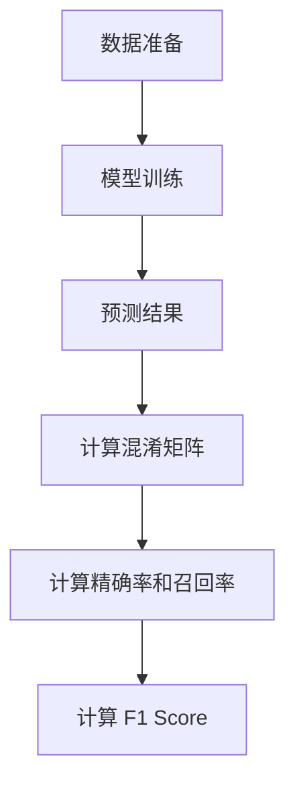

# F1 Score原理与代码实例讲解

## 1.背景介绍

在机器学习和数据科学领域，评估模型性能是至关重要的一环。无论是分类问题还是回归问题，选择合适的评估指标都能帮助我们更好地理解模型的表现。对于分类问题，尤其是不平衡数据集，F1 Score 是一个非常重要的评估指标。它综合了精确率（Precision）和召回率（Recall），为我们提供了一个更全面的模型性能评估。

## 2.核心概念与联系

### 2.1 精确率（Precision）

精确率是指在所有被预测为正类的样本中，实际为正类的比例。公式如下：

$$
\text{Precision} = \frac{TP}{TP + FP}
$$

其中，TP（True Positive）表示真正类，FP（False Positive）表示假正类。

### 2.2 召回率（Recall）

召回率是指在所有实际为正类的样本中，被正确预测为正类的比例。公式如下：

$$
\text{Recall} = \frac{TP}{TP + FN}
$$

其中，FN（False Negative）表示假负类。

### 2.3 F1 Score

F1 Score 是精确率和召回率的调和平均数，公式如下：

$$
\text{F1 Score} = 2 \times \frac{\text{Precision} \times \text{Recall}}{\text{Precision} + \text{Recall}}
$$

F1 Score 的取值范围是 0 到 1，值越大表示模型性能越好。

## 3.核心算法原理具体操作步骤

### 3.1 数据准备

首先，我们需要准备一个分类数据集。数据集可以是二分类或多分类问题，但为了简化说明，我们以二分类问题为例。

### 3.2 模型训练

选择一个分类算法（如逻辑回归、决策树、支持向量机等）进行模型训练。

### 3.3 预测结果

使用训练好的模型对测试数据进行预测，得到预测结果。

### 3.4 计算混淆矩阵

根据预测结果和实际标签，计算混淆矩阵。混淆矩阵包含 TP、FP、FN 和 TN（True Negative）。

### 3.5 计算精确率和召回率

根据混淆矩阵，计算精确率和召回率。

### 3.6 计算 F1 Score

最后，根据精确率和召回率计算 F1 Score。

以下是上述步骤的 Mermaid 流程图：



## 4.数学模型和公式详细讲解举例说明

### 4.1 数学模型

假设我们有一个二分类问题，数据集包含 N 个样本，每个样本有一个实际标签和一个预测标签。我们可以构建如下的混淆矩阵：

|            | 预测正类 | 预测负类 |
|------------|----------|----------|
| 实际正类   | TP       | FN       |
| 实际负类   | FP       | TN       |

### 4.2 公式推导

根据混淆矩阵，我们可以推导出精确率和召回率的公式：

$$
\text{Precision} = \frac{TP}{TP + FP}
$$

$$
\text{Recall} = \frac{TP}{TP + FN}
$$

然后，我们可以推导出 F1 Score 的公式：

$$
\text{F1 Score} = 2 \times \frac{\text{Precision} \times \text{Recall}}{\text{Precision} + \text{Recall}}
$$

### 4.3 举例说明

假设我们有以下混淆矩阵：

|            | 预测正类 | 预测负类 |
|------------|----------|----------|
| 实际正类   | 50       | 10       |
| 实际负类   | 5        | 35       |

根据上述公式，我们可以计算出精确率、召回率和 F1 Score：

$$
\text{Precision} = \frac{50}{50 + 5} = 0.909
$$

$$
\text{Recall} = \frac{50}{50 + 10} = 0.833
$$

$$
\text{F1 Score} = 2 \times \frac{0.909 \times 0.833}{0.909 + 0.833} = 0.87
$$

## 5.项目实践：代码实例和详细解释说明

### 5.1 数据准备

我们将使用 Python 和 scikit-learn 库来进行项目实践。首先，导入必要的库并准备数据集：

```python
import numpy as np
from sklearn.model_selection import train_test_split
from sklearn.datasets import make_classification

# 生成一个二分类数据集
X, y = make_classification(n_samples=1000, n_features=20, n_classes=2, random_state=42)

# 划分训练集和测试集
X_train, X_test, y_train, y_test = train_test_split(X, y, test_size=0.3, random_state=42)
```

### 5.2 模型训练

选择一个分类算法进行模型训练，这里我们使用逻辑回归：

```python
from sklearn.linear_model import LogisticRegression

# 初始化逻辑回归模型
model = LogisticRegression()

# 训练模型
model.fit(X_train, y_train)
```

### 5.3 预测结果

使用训练好的模型对测试数据进行预测：

```python
# 预测测试集
y_pred = model.predict(X_test)
```

### 5.4 计算混淆矩阵

根据预测结果和实际标签，计算混淆矩阵：

```python
from sklearn.metrics import confusion_matrix

# 计算混淆矩阵
cm = confusion_matrix(y_test, y_pred)
print(cm)
```

### 5.5 计算精确率和召回率

根据混淆矩阵，计算精确率和召回率：

```python
from sklearn.metrics import precision_score, recall_score

# 计算精确率
precision = precision_score(y_test, y_pred)
print(f'Precision: {precision}')

# 计算召回率
recall = recall_score(y_test, y_pred)
print(f'Recall: {recall}')
```

### 5.6 计算 F1 Score

最后，根据精确率和召回率计算 F1 Score：

```python
from sklearn.metrics import f1_score

# 计算 F1 Score
f1 = f1_score(y_test, y_pred)
print(f'F1 Score: {f1}')
```

## 6.实际应用场景

### 6.1 医疗诊断

在医疗诊断中，错误分类可能会导致严重的后果。F1 Score 可以帮助我们在精确率和召回率之间找到平衡，确保模型在检测疾病时既不漏诊也不误诊。

### 6.2 欺诈检测

在金融领域，欺诈检测是一个重要的应用场景。F1 Score 可以帮助我们评估模型在检测欺诈交易时的性能，确保既能捕捉到尽可能多的欺诈行为，又不误报正常交易。

### 6.3 自然语言处理

在自然语言处理任务中，如文本分类和情感分析，F1 Score 是一个常用的评估指标。它可以帮助我们评估模型在处理不平衡数据集时的性能。

## 7.工具和资源推荐

### 7.1 scikit-learn

scikit-learn 是一个强大的 Python 机器学习库，提供了丰富的分类算法和评估指标。它是进行机器学习项目的首选工具之一。

### 7.2 TensorFlow 和 PyTorch

TensorFlow 和 PyTorch 是两个流行的深度学习框架，适用于构建和训练复杂的神经网络模型。它们也提供了丰富的评估指标和工具。

### 7.3 Kaggle

Kaggle 是一个数据科学竞赛平台，提供了丰富的数据集和竞赛项目。通过参与 Kaggle 竞赛，可以提升自己的数据科学技能，并与全球的数据科学家交流学习。

## 8.总结：未来发展趋势与挑战

### 8.1 未来发展趋势

随着机器学习和人工智能技术的不断发展，评估指标也在不断演进。未来，我们可能会看到更多综合性评估指标的出现，以更全面地评估模型性能。

### 8.2 挑战

尽管 F1 Score 是一个重要的评估指标，但它也有其局限性。例如，它无法区分不同类型的错误（如