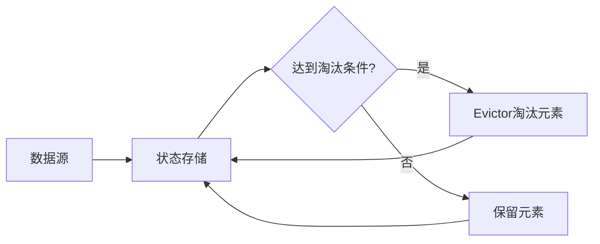

# Flink Evictor原理与代码实例讲解

## 1. 背景介绍
### 1.1 Flink简介
Apache Flink是一个开源的分布式流处理和批处理框架,它以高吞吐、低延迟、高可靠等特点被广泛应用于实时计算领域。Flink提供了多种API,包括DataStream API、Table API和SQL API,可以方便地进行流式和批式数据处理。

### 1.2 状态管理的重要性
在流式计算中,状态管理是一个非常重要的概念。由于数据流是无界的,系统需要在处理数据的同时维护一些状态信息,例如窗口计算中的窗口数据、去重计算中的历史数据等。高效可靠的状态管理可以保证计算的准确性和系统的稳定性。

### 1.3 Flink状态管理机制
Flink提供了一套完善的状态管理机制,主要包括:
- Keyed State:与特定的key相关联,只能用于KeyedStream。
- Operator State:与特定operator相关联。
- Broadcast State:用于广播流与非广播流的连接操作。

本文将重点介绍Flink中的一个重要的状态管理机制——Evictor,并结合代码实例进行详细讲解。

## 2. 核心概念与联系
### 2.1 Evictor的定义
Evictor是Flink状态管理中的一个重要概念,它用于在状态存储达到一定条件时,淘汰部分状态数据,以控制状态的大小。Flink提供了ListState和MapState两种类型的状态存储,Evictor主要用于ListState。

### 2.2 Evictor与ListState 
ListState是Flink中常用的一种状态存储,它以列表的形式存储状态值。当ListState中的元素数量达到一定阈值时,可以使用Evictor来淘汰部分元素。Evictor定义了淘汰的条件和淘汰的方式,可以有效地控制ListState的大小。

### 2.3 Evictor的分类
Flink提供了三种类型的Evictor:
- TimeEvictor:根据元素的时间戳进行淘汰。
- CountEvictor:根据元素的数量进行淘汰。
- DeltaEvictor:根据元素之间的差值(如序号差)进行淘汰。

## 3. 核心算法原理与操作步骤
### 3.1 Evictor的工作原理
Evictor的工作原理可以概括为以下几个步骤:

1. 状态存储(如ListState)不断添加新的元素。 
2. 当状态存储达到一定条件时(如元素数量超过阈值),触发Evictor的淘汰操作。
3. Evictor根据预定义的淘汰条件和淘汰方式,选择部分元素进行淘汰。
4. 状态存储移除被淘汰的元素,控制存储大小。

### 3.2 不同类型Evictor的淘汰方式
- TimeEvictor:根据元素的时间戳,淘汰早于某个时间点的元素。
- CountEvictor:根据元素的数量,只保留最新的N个元素。
- DeltaEvictor:根据元素的某个属性值(如序号)之间的差值,淘汰差值超过阈值的元素。

Evictor的淘汰操作是在状态存储的`add`方法中自动触发的,用户只需在初始化状态存储时指定Evictor的类型和参数即可。

## 4. 数学模型与公式
### 4.1 CountEvictor的数学模型
CountEvictor的数学模型比较简单,可以用以下公式表示:

$$
N_{keep} = min(N_{current}, N_{max})
$$

其中:
- $N_{keep}$ 表示淘汰后要保留的元素数量。
- $N_{current}$ 表示当前状态存储中的元素数量。
- $N_{max}$ 表示CountEvictor设置的最大元素数量阈值。

CountEvictor的淘汰逻辑可以描述为:当$N_{current} > N_{max}$时,淘汰最早添加的 $N_{current} - N_{max}$ 个元素。

### 4.2 TimeEvictor的数学模型
TimeEvictor的数学模型涉及到时间窗口的概念,可以用以下公式表示:

$$
W_{keep} = [T_{max} - T_{size}, T_{max}]
$$

其中:
- $W_{keep}$ 表示淘汰后要保留的元素的时间窗口。
- $T_{max}$ 表示当前时间戳。
- $T_{size}$ 表示TimeEvictor设置的时间窗口大小。

TimeEvictor的淘汰逻辑可以描述为:淘汰时间戳小于 $T_{max} - T_{size}$ 的所有元素。

### 4.3 DeltaEvictor的数学模型
DeltaEvictor的数学模型涉及到元素属性值之间的差值计算,可以用以下公式表示:

$$
\Delta_{i,j} = |V_i - V_j| 
$$

其中:
- $\Delta_{i,j}$ 表示第i个元素和第j个元素的属性值之间的差值。
- $V_i$ 表示第i个元素的属性值。
- $V_j$ 表示第j个元素的属性值。

DeltaEvictor的淘汰逻辑可以描述为:对于任意两个元素,如果它们的属性值差值超过设定的阈值$\Delta_{max}$,则淘汰较早添加的元素。

## 5. 项目实践:代码实例与讲解
下面通过一个具体的代码实例来说明Evictor的使用方法。本例中,我们将使用CountEvictor来控制ListState的大小。

```java
public class EvictorExample {
    
    public static void main(String[] args) throws Exception {
        StreamExecutionEnvironment env = StreamExecutionEnvironment.getExecutionEnvironment();
        
        // 创建一个数据源,产生随机数
        DataStream<Integer> inputStream = env.addSource(new RandomSource());
        
        // 使用CountEvictor来控制状态大小
        DataStream<Integer> resultStream = inputStream
            .keyBy(value -> value % 2)
            .mapWithState(new EvictorStateDescriptor<>(new CountEvictor<Integer>(5)))
            .map(value -> value.f1);
        
        resultStream.print();
        
        env.execute("Evictor Example");
    }
    
    // 自定义MapState,使用CountEvictor淘汰元素
    private static class EvictorStateDescriptor<T> extends StateDescriptor<MapState<T, Long>, T> {
        
        public EvictorStateDescriptor(Evictor<T> evictor) {
            super(new MapStateDescriptor<>("state", Types.GENERIC(Object.class), Types.LONG), evictor);
        }
    }
    
    // 数据源,产生随机数 
    private static class RandomSource implements SourceFunction<Integer> {
        
        private volatile boolean running = true;
        
        @Override
        public void run(SourceContext<Integer> ctx) throws Exception {
            while (running) {
                ctx.collect(ThreadLocalRandom.current().nextInt(100));
                Thread.sleep(1000);
            }
        }
        
        @Override
        public void cancel() {
            running = false;
        }
    }
}
```

在这个例子中,我们首先创建了一个`RandomSource`,用于产生随机数。然后使用`keyBy`算子对数据流进行分区,这里根据数值的奇偶性进行分区。

接下来是关键的一步,我们使用`mapWithState`算子来维护每个分区的状态,并指定使用`EvictorStateDescriptor`来管理状态。在`EvictorStateDescriptor`的构造函数中,我们传入了一个`CountEvictor`,它的参数`5`表示只保留最新的5个元素。

当新的元素到来时,`CountEvictor`会自动检查状态中的元素数量,如果超过了5个,就会淘汰最早添加的元素,保证状态大小始终不超过5。

最后,我们将结果数据流打印输出,并启动执行。

运行这个程序,可以看到输出结果中,每个分区(奇数或偶数)的状态都维持在5个元素以内,超出部分会被自动淘汰。这就是CountEvictor的效果。

## 6. 实际应用场景
Evictor在实际应用中有广泛的用途,下面列举几个典型场景:

### 6.1 Top N 计算
在实时计算中,经常需要统计一段时间内的Top N值,如热门商品、热搜关键词等。这可以通过维护一个固定大小的ListState来实现,使用CountEvictor或DeltaEvictor来淘汰超出数量的元素,保证结果的实时性和准确性。

### 6.2 去重计算
在某些应用场景下,需要对实时数据流进行去重处理,只保留一段时间内的唯一值。这可以通过MapState和TimeEvictor来实现,以数据的唯一标识为key,以时间戳为value,使用TimeEvictor来淘汰超出时间窗口的数据。

### 6.3 限流与异常检测
Evictor还可以用于实现限流和异常检测功能。例如,可以使用CountEvictor来检测一段时间内的请求数是否超过阈值,从而实现限流;也可以使用DeltaEvictor来检测数据流中的突变或异常波动,及时发现和处理异常情况。

## 7. 工具和资源推荐
### 7.1 Flink官方文档
Flink官网提供了详尽的用户手册和API文档,是学习和使用Flink的权威资料。其中对Evictor的描述可以参考以下链接:
- [Flink State Documentation](https://nightlies.apache.org/flink/flink-docs-release-1.14/docs/dev/datastream/fault-tolerance/state/)

### 7.2 Flink Github仓库
Flink的源码托管在Github上,感兴趣的读者可以阅读和分析源码,深入理解Flink的实现原理。 
- [Flink Github Repository](https://github.com/apache/flink)

### 7.3 Flink社区
Flink拥有活跃的社区,用户可以通过邮件列表、Slack、Stack Overflow等渠道与社区成员交流,获取帮助和支持。
- [Flink Community](https://flink.apache.org/community.html)

## 8. 总结与展望
本文详细介绍了Flink中的Evictor机制,包括它的核心概念、工作原理、数学模型和代码实例。Evictor是Flink状态管理的重要组成部分,可以有效地控制状态的大小,防止OOM异常,提高系统的稳定性。

展望未来,随着流式计算技术的不断发展,Flink的状态管理机制也将进一步优化和改进。一方面,Flink社区正在探索更加高效和灵活的状态存储方案,如增量检查点、Pluggable State Backend等;另一方面,Flink也在不断增强与其他存储系统的集成,支持更多的状态存储选择。

总之,Evictor作为Flink状态管理的利器,将在未来的流式计算应用中扮演越来越重要的角色。开发者应该深入理解和灵活运用Evictor,构建高效可靠的流式计算系统。

## 9. 附录:常见问题解答
### Q1:Evictor能否用于KeyedState?
A1:不能,Evictor只能用于ListState。Flink暂时没有提供KeyedState的Evictor支持。

### Q2:Evictor的淘汰操作是否会影响状态的一致性?
A2:不会,Evictor的淘汰操作是在状态快照之前进行的,不会影响状态的一致性。即使发生故障,Flink也能从最近的一致性快照中恢复状态。

### Q3:Evictor的淘汰操作是否会阻塞数据处理?
A3:不会,Evictor的淘汰操作是异步进行的,不会阻塞正常的数据处理。Flink使用单独的线程来执行淘汰操作,以保证性能。

### Q4:是否可以自定义Evictor的淘汰策略?
A4:可以,Flink支持自定义Evictor。用户可以实现`Evictor`接口,定义自己的淘汰条件和淘汰方式,以满足特定的业务需求。



作者：禅与计算机程序设计艺术 / Zen and the Art of Computer Programming