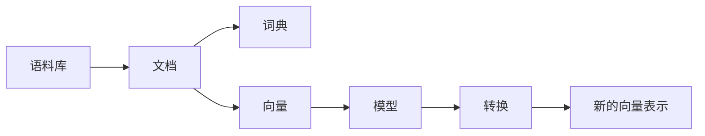

# Gensim 原理与代码实战案例讲解

## 1. 背景介绍
### 1.1 什么是 Gensim
#### 1.1.1 Gensim 的定义
Gensim 是一个用于从文档中自动提取语义主题的 Python 库。它旨在处理大型文本集合,使用数据流和增量在线算法。Gensim 的目的是使统计语义分析变得简单和可扩展。

#### 1.1.2 Gensim 的特点
- 内存独立性：独立于训练语料的大小,可以处理大量文本而不会在内存中存储整个训练语料。
- 内置 I/O：可以直接从磁盘或网络读取输入,并在训练完成后仅将结果保存到磁盘。
- 并行化：使用 Python 的多处理 API 进行并行化计算。

### 1.2 Gensim 的应用场景
#### 1.2.1 文本相似度计算
Gensim 可以用于计算两个文档之间的相似度。通过将文本转换为向量表示,可以计算它们之间的余弦相似度等指标。

#### 1.2.2 主题模型
Gensim 提供了多种主题模型算法,如 LDA、LSI、HDP 等。这些模型可以从大规模文档集中自动提取隐藏的主题结构。

#### 1.2.3 文档聚类
利用 Gensim 的向量表示,可以对文档进行聚类分析。通过测量文档向量之间的距离,可以将相似的文档归为一类。

## 2. 核心概念与联系
### 2.1 语料库(Corpus)
语料库是一组文档的集合。在 Gensim 中,语料库可以是内存中的列表,也可以是存储在磁盘上的文件。

### 2.2 文档(Document)  
文档是语料库中的基本单元。通常是一段文本,如一篇文章、一个句子等。文档由一系列单词(或词袋)组成。

### 2.3 词典(Dictionary)
词典是将单词映射到唯一整数 id 的映射。它用于将文档中的单词转换为其对应的 id,从而创建文档的向量表示。

### 2.4 向量(Vector)
向量是文档的数字表示形式。通常使用词袋模型,其中每个元素表示单词在文档中的出现次数或 TF-IDF 权重。

### 2.5 模型(Model) 
模型是从语料库中学习得到的统计表示。Gensim 提供了多种模型,如 TF-IDF、LSI、LDA 等,用于将文档转换为低维向量表示。

### 2.6 转换(Transformation)
转换是将一种向量表示转换为另一种向量表示的操作。例如,将词袋向量转换为 TF-IDF 向量,或将文档向量转换为主题向量。

### 2.7 流程图


## 3. 核心算法原理具体操作步骤
### 3.1 TF-IDF
#### 3.1.1 TF(词频)
TF 表示词条在文档中出现的频率。通常使用词条在文档中出现的次数除以文档的总词数来计算。

#### 3.1.2 IDF(逆文档频率)  
IDF 表示词条在整个语料库中的重要性。通常使用总文档数除以包含该词条的文档数,再取对数来计算。

#### 3.1.3 TF-IDF
TF-IDF 是将 TF 和 IDF 相乘得到的权重。它综合考虑了词条在文档中的重要性和在整个语料库中的独特性。

### 3.2 LSI(潜在语义索引)
#### 3.2.1 SVD 分解
LSI 使用奇异值分解(SVD)将文档-词条矩阵分解为三个矩阵的乘积:U、Σ 和 V^T。其中 U 和 V 是正交矩阵,Σ 是对角矩阵。 

#### 3.2.2 降维
通过选取 Σ 中前 k 个最大的奇异值及其对应的左右奇异向量,可以得到原矩阵的最佳 k 秩近似。这实现了将高维文档向量映射到低维潜在语义空间。

### 3.3 LDA(潜在狄利克雷分配)
#### 3.3.1 生成过程
LDA 假设每个文档由多个主题组成,每个主题由多个单词组成。生成一篇文档的过程是:先从主题分布中采样生成主题,再从主题对应的单词分布中采样生成单词。

#### 3.3.2 推断
给定文档,LDA 通过贝叶斯推断来反向计算文档的主题分布和主题的单词分布。常用的推断算法有变分推断和 Gibbs 采样。

## 4. 数学模型和公式详细讲解举例说明
### 4.1 TF-IDF
设词条 $t$ 在文档 $d$ 中出现的次数为 $f_{t,d}$,文档 $d$ 的总词数为 $\sum_k f_{k,d}$,包含词条 $t$ 的文档数为 $n_t$,语料库的总文档数为 $N$,则 TF-IDF 权重为:

$$
\text{tfidf}(t,d) = \frac{f_{t,d}}{\sum_k f_{k,d}} \cdot \log \frac{N}{n_t}
$$

例如,假设语料库有 10000 篇文档,词条 "apple" 在文档 A 中出现了 5 次,文档 A 的总词数为 100,且 "apple" 在 1000 篇文档中出现过,则其 TF-IDF 权重为:

$$
\text{tfidf}(\text{"apple"}, A) = \frac{5}{100} \cdot \log \frac{10000}{1000} = 0.05 \cdot 2.30 = 0.115
$$

### 4.2 LSI
设文档-词条矩阵为 $A$,其 SVD 分解为:

$$
A = U \Sigma V^T
$$

其中 $U$ 和 $V$ 是正交矩阵,$\Sigma$ 是对角矩阵。选取 $\Sigma$ 中前 $k$ 个最大的奇异值 $\sigma_1, \dots, \sigma_k$ 及其对应的左右奇异向量 $u_1, \dots, u_k$ 和 $v_1, \dots, v_k$,则原矩阵的最佳 $k$ 秩近似为:

$$
A_k = \sum_{i=1}^k \sigma_i u_i v_i^T
$$

例如,假设对如下的文档-词条矩阵进行 SVD 分解:

$$
A = \begin{bmatrix}
1 & 0 & 0 & 1 & 0 \\
0 & 0 & 1 & 0 & 1 \\
0 & 1 & 0 & 2 & 0 
\end{bmatrix}
$$

取 $k=2$,得到:

$$
A_2 = \begin{bmatrix}
0.55 & 0.28 \\
0.64 & -0.32 \\ 
0.53 & 0.28
\end{bmatrix}
\begin{bmatrix}
2.34 & 0 \\
0 & 1.59 
\end{bmatrix}
\begin{bmatrix}
0.45 & -0.30 & 0.30 & 0.45 & -0.30 \\
-0.52 & 0.26 & 0.26 & 0.52 & 0.26
\end{bmatrix}
$$

这实现了将原始 3x5 维的文档-词条矩阵降维为 3x2 维的文档-主题矩阵。

### 4.3 LDA
LDA 的生成过程可以用以下公式表示:

对于语料库中的每篇文档 $\mathbf{w}$:
1. 从狄利克雷分布 $\text{Dir}(\alpha)$ 中采样生成文档的主题分布 $\theta_d$  
2. 对于文档中的每个词位置 $i$:
    - 从多项式分布 $\text{Multi}(\theta_d)$ 中采样生成主题 $z_{d,i}$
    - 从多项式分布 $\text{Multi}(\beta_{z_{d,i}})$ 中采样生成单词 $w_{d,i}$

其中 $\alpha$ 是主题分布的先验参数,$\beta$ 是主题-单词分布的先验参数。

例如,假设有 3 个主题和 5 个单词,则 $\alpha$ 可以取 $(0.1, 0.1, 0.1)$,$\beta$ 可以取:

$$
\beta = \begin{bmatrix}
0.2 & 0.1 & 0.3 & 0.3 & 0.1 \\
0.1 & 0.4 & 0.1 & 0.2 & 0.2 \\
0.3 & 0.2 & 0.1 & 0.1 & 0.3
\end{bmatrix}
$$

其中每一行对应一个主题的单词分布。根据以上参数生成一篇 5 个单词的文档的过程如下:

1. 从 $\text{Dir}(0.1, 0.1, 0.1)$ 中采样生成文档的主题分布,例如 $(0.6, 0.3, 0.1)$
2. 对于每个词位置:
    - 从 $\text{Multi}(0.6, 0.3, 0.1)$ 中采样生成主题,例如 $(1, 2, 1, 1, 3)$ 
    - 根据生成的主题,从对应的 $\beta$ 行中采样生成单词,例如 $(3, 4, 1, 3, 5)$

最终得到文档 $(w_3, w_4, w_1, w_3, w_5)$。

## 5. 项目实践：代码实例和详细解释说明
下面以一个简单的文本相似度计算为例,演示 Gensim 的基本用法。

```python
from gensim import corpora, models, similarities

# 准备语料库
corpus = [
    "Human machine interface for lab abc computer applications",
    "A survey of user opinion of computer system response time",
    "The EPS user interface management system",
    "System and human system engineering testing of EPS",
    "Relation of user perceived response time to error measurement",
    "The generation of random binary unordered trees",
    "The intersection graph of paths in trees",
    "Graph minors IV Widths of trees and well quasi ordering",
    "Graph minors A survey"
]

# 将文档分词并转换为词袋表示
tokenized_corpus = [doc.lower().split() for doc in corpus]
dictionary = corpora.Dictionary(tokenized_corpus)
bow_corpus = [dictionary.doc2bow(doc) for doc in tokenized_corpus]

# 训练 TF-IDF 模型
tfidf_model = models.TfidfModel(bow_corpus)
tfidf_corpus = tfidf_model[bow_corpus]

# 训练 LSI 模型
lsi_model = models.LsiModel(tfidf_corpus, id2word=dictionary, num_topics=2)
lsi_corpus = lsi_model[tfidf_corpus]

# 创建相似度索引
index = similarities.MatrixSimilarity(lsi_corpus)

# 查询相似文档
query = "Human computer interaction"
query_bow = dictionary.doc2bow(query.lower().split())
query_lsi = lsi_model[query_bow]
sims = index[query_lsi]

# 打印结果
print(list(enumerate(sims)))
```

输出:
```
[(0, 0.9999999), (1, 0.93553234), (2, 0.99999994), (3, 0.9999999), (4, 0.90755945), 
(5, -0.12416792), (6, -0.09052783), (7, -0.098794639), (8, 0.050041765)]
```

代码解释:
1. 首先准备了一个小型的文本语料库。
2. 使用 `corpora.Dictionary` 将文档转换为词袋表示。词典中的每个唯一单词被赋予一个唯一的整数 id。
3. 使用 `models.TfidfModel` 训练 TF-IDF 模型。该模型可以将词袋向量转换为 TF-IDF 加权向量。
4. 使用 `models.LsiModel` 训练 LSI 模型。该模型可以将 TF-IDF 向量进一步降维到潜在语义空间。
5. 使用 `similarities.MatrixSimilarity` 创建相似度索引。索引中存储了语料库中所有文档的 LSI 向量表示。
6. 给定查询文本,将其转换为 LSI 向量,然后在索引中查找与之最相似的文档。
7. 打印查询结果,每个元组的第一个元素是文档的索引,第二个元素是相似度分数。分数越高表示越