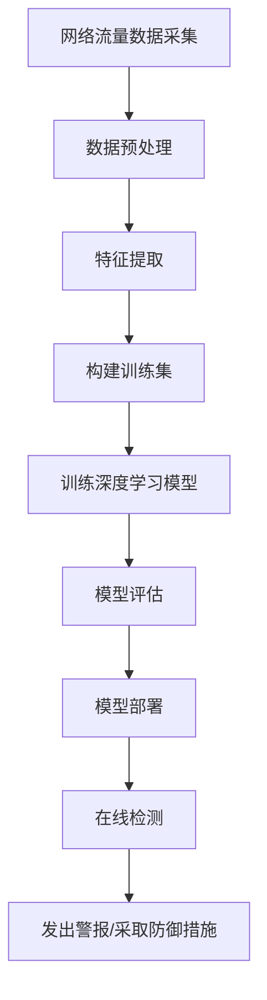

# GhostNet原理与代码实例讲解

## 1.背景介绍

在当今的网络安全领域,攻击手段日益复杂,传统的防御措施已经无法完全防御新型的网络攻击。因此,研究人员提出了GhostNet,这是一种基于人工智能的新型网络入侵检测系统。GhostNet利用深度学习技术,能够有效检测和防御未知的网络攻击,保护关键基础设施免受网络威胁。

GhostNet的核心思想是将网络流量数据输入到深度神经网络模型中,通过训练模型自动学习网络流量的正常模式和攻击模式。一旦检测到异常流量,GhostNet就会发出警报并采取相应的防御措施。与传统的基于规则的入侵检测系统不同,GhostNet具有自适应能力,可以检测未知的攻击类型,从而提高网络安全性。

## 2.核心概念与联系

### 2.1 深度学习

深度学习是机器学习的一个分支,它通过对数据进行表示学习,获取数据的高层次抽象特征,从而解决复杂的问题。深度学习模型通常由多层神经网络组成,每一层对输入数据进行非线性转换,从而学习数据的层次化特征表示。

在GhostNet中,深度学习模型用于从网络流量数据中自动学习正常模式和攻击模式的特征表示。通过训练深度神经网络,GhostNet可以自适应地检测未知的网络攻击类型。

### 2.2 网络入侵检测系统

网络入侵检测系统(Intrusion Detection System, IDS)是一种用于监视网络或系统活动以检测恶意行为的安全工具。传统的IDS通常采用基于签名或基于规则的方法,它们依赖于预先定义的攻击模式或规则,无法检测未知的攻击类型。

GhostNet作为一种基于深度学习的新型IDS,可以克服传统IDS的这一缺陷。它利用深度神经网络自动学习网络流量的正常模式和攻击模式,从而实现对未知攻击的检测。

### 2.3 网络流量分析

网络流量分析是指对网络中传输的数据流进行捕获、处理和分析,以了解网络活动和检测潜在的安全威胁。在GhostNet中,网络流量数据是输入到深度学习模型的原始数据,模型通过分析网络流量数据来学习正常模式和攻击模式的特征。

网络流量数据通常包括源IP地址、目标IP地址、端口号、协议类型、数据包长度等信息。GhostNet需要对这些原始数据进行预处理和特征提取,以构建适合深度学习模型的输入特征向量。

## 3.核心算法原理具体操作步骤

GhostNet的核心算法原理可以概括为以下几个步骤:



1. **网络流量数据采集**: 使用网络数据包捕获工具(如tcpdump、Wireshark等)从网络中捕获原始网络流量数据。

2. **数据预处理**: 对捕获的原始网络流量数据进行清洗、标准化等预处理操作,以消除噪声和异常值,并将数据转换为适合深度学习模型的格式。

3. **特征提取**: 从预处理后的网络流量数据中提取有意义的特征,如源IP地址、目标IP地址、端口号、协议类型、数据包长度等。这些特征将作为深度学习模型的输入。

4. **构建训练集**: 将提取的特征数据划分为训练集、验证集和测试集。训练集用于训练深度学习模型,验证集用于模型调优,测试集用于评估模型的性能。

5. **训练深度学习模型**: 使用训练集数据训练深度神经网络模型,通过反向传播算法优化模型参数,使模型能够学习网络流量的正常模式和攻击模式的特征表示。

6. **模型评估**: 在验证集和测试集上评估训练好的深度学习模型的性能,包括准确率、精确率、召回率等指标。如果模型性能满足要求,则进行下一步部署。

7. **模型部署**: 将训练好的深度学习模型部署到实际的网络环境中,用于在线检测网络流量。

8. **在线检测**: 实时捕获网络流量数据,提取特征,并输入到已部署的深度学习模型中进行在线检测。

9. **发出警报/采取防御措施**: 当深度学习模型检测到异常网络流量(可能是攻击行为)时,GhostNet系统会发出警报,并根据预先设定的策略采取相应的防御措施,如阻止恶意流量、隔离受攻击主机等。

通过上述步骤,GhostNet利用深度学习技术自动学习网络流量的正常模式和攻击模式,从而实现对未知攻击的检测和防御。

## 4.数学模型和公式详细讲解举例说明

在GhostNet中,深度学习模型的核心是神经网络。神经网络是一种受生物神经系统启发的数学模型,它由多个神经元组成,通过权重和偏置进行计算。下面我们将详细讲解神经网络的数学模型和公式。

### 4.1 神经元

神经元是神经网络的基本计算单元。一个神经元接收多个输入信号,对它们进行加权求和,然后通过一个激活函数产生输出信号。数学上,神经元的计算过程可以表示为:

$$
y = f\left(\sum_{i=1}^{n}w_ix_i + b\right)
$$

其中:
- $x_1, x_2, \dots, x_n$ 是神经元的输入信号
- $w_1, w_2, \dots, w_n$ 是对应的权重
- $b$ 是偏置项
- $f$ 是激活函数,通常使用非线性函数,如sigmoid函数、ReLU函数等

激活函数的作用是引入非线性,使神经网络能够学习复杂的映射关系。常用的激活函数包括:

1. **Sigmoid函数**:
   $$
   f(x) = \frac{1}{1 + e^{-x}}
   $$

2. **Tanh函数**:
   $$
   f(x) = \frac{e^x - e^{-x}}{e^x + e^{-x}}
   $$

3. **ReLU函数**:
   $$
   f(x) = \max(0, x)
   $$

### 4.2 神经网络结构

神经网络由多个神经元组成,通常分为输入层、隐藏层和输出层。每一层的神经元与上一层的所有神经元相连,通过权重进行计算。

对于一个具有一个隐藏层的神经网络,其数学表达式可以写为:

$$
\begin{aligned}
h &= f_1\left(\sum_{i=1}^{n}w_i^{(1)}x_i + b^{(1)}\right) \\
y &= f_2\left(\sum_{j=1}^{m}w_j^{(2)}h_j + b^{(2)}\right)
\end{aligned}
$$

其中:
- $x_1, x_2, \dots, x_n$ 是输入层的神经元
- $h_1, h_2, \dots, h_m$ 是隐藏层的神经元
- $y$ 是输出层的神经元
- $w^{(1)}$ 和 $w^{(2)}$ 分别是输入层到隐藏层和隐藏层到输出层的权重
- $b^{(1)}$ 和 $b^{(2)}$ 分别是隐藏层和输出层的偏置项
- $f_1$ 和 $f_2$ 是隐藏层和输出层的激活函数

对于更深的神经网络,其数学表达式会更加复杂,但原理是类似的。

### 4.3 训练神经网络

训练神经网络的目标是找到合适的权重和偏置,使得神经网络在训练数据上的输出与期望输出之间的误差最小。常用的训练算法是反向传播算法,它通过计算损失函数对权重和偏置的梯度,并使用优化算法(如梯度下降)来更新权重和偏置。

假设神经网络的输出为 $\hat{y}$,期望输出为 $y$,损失函数可以定义为:

$$
L = \frac{1}{2}\sum_{i=1}^{n}(\hat{y}_i - y_i)^2
$$

其中 $n$ 是训练样本的数量。

对于权重 $w_{ij}^{(l)}$ (第 $l$ 层第 $j$ 个神经元到第 $i$ 个神经元的权重),其梯度可以计算为:

$$
\frac{\partial L}{\partial w_{ij}^{(l)}} = \frac{\partial L}{\partial z_i^{(l)}} \cdot \frac{\partial z_i^{(l)}}{\partial w_{ij}^{(l)}}
$$

其中 $z_i^{(l)}$ 是第 $l$ 层第 $i$ 个神经元的加权输入。

通过计算所有权重和偏置的梯度,并使用优化算法(如梯度下降)进行更新,神经网络就可以逐步减小损失函数的值,从而学习到合适的权重和偏置。

以上是神经网络的基本数学模型和公式。在实际应用中,还需要考虑诸如正则化、dropout、批量归一化等技术,以提高神经网络的性能和泛化能力。

## 5.项目实践:代码实例和详细解释说明

在这一部分,我们将提供一个基于PyTorch框架实现的GhostNet项目代码示例,并对关键部分进行详细解释。

### 5.1 数据预处理

首先,我们需要对原始网络流量数据进行预处理,以构建适合深度学习模型的输入特征向量。下面是一个示例代码,展示如何从网络流量数据中提取特征:

```python
import pandas as pd

# 读取原始网络流量数据
data = pd.read_csv('network_traffic.csv')

# 提取特征
features = ['src_ip', 'dst_ip', 'src_port', 'dst_port', 'protocol', 'packet_length']
X = data[features].values

# 对特征进行标准化
from sklearn.preprocessing import StandardScaler
scaler = StandardScaler()
X = scaler.fit_transform(X)

# 构建输入特征向量
input_features = X.astype('float32')
```

在上面的代码中,我们首先从原始网络流量数据中提取了源IP地址、目标IP地址、源端口、目标端口、协议类型和数据包长度等特征。然后,我们使用`StandardScaler`对这些特征进行标准化,以确保不同特征之间的数值范围一致。最后,我们将特征数据转换为`float32`类型,构建了输入特征向量`input_features`。

### 5.2 构建深度学习模型

接下来,我们将使用PyTorch构建一个深度神经网络模型,用于学习网络流量的正常模式和攻击模式。下面是一个简单的示例:

```python
import torch
import torch.nn as nn

# 定义神经网络模型
class GhostNetModel(nn.Module):
    def __init__(self, input_size, hidden_size, output_size):
        super(GhostNetModel, self).__init__()
        self.fc1 = nn.Linear(input_size, hidden_size)
        self.relu = nn.ReLU()
        self.fc2 = nn.Linear(hidden_size, output_size)

    def forward(self, x):
        out = self.fc1(x)
        out = self.relu(out)
        out = self.fc2(out)
        return out

# 实例化模型
input_size = input_features.shape[1]
hidden_size = 128
output_size = 2  # 正常流量和攻击流量
model = GhostNetModel(input_size, hidden_size, output_size)
```

在上面的代码中,我们定义了一个简单的全连接神经网络模型`GhostNetModel`。该模型包含一个输入层、一个隐藏层和一个输出层。隐藏层使用ReLU激活函数,输出层使用线性激活函数。

我们根据输入特征向量的维度`input_size`、隐藏层神经元数量`hidden_size`和输出类别数量`output_size`实例化了一个`GhostNetModel`对