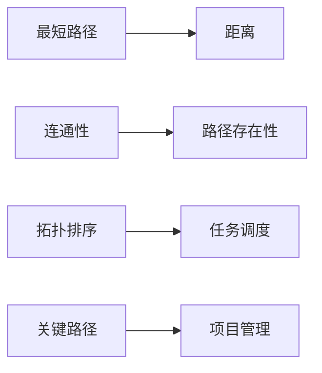
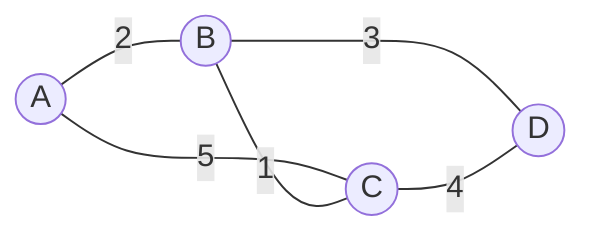

# Graph Path原理与代码实例讲解

## 1.背景介绍

在计算机科学领域,图(Graph)是一种非常重要且广泛应用的数据结构。图由一组顶点(Vertex)和连接这些顶点的边(Edge)组成。图在现实世界中有着广泛的应用,例如社交网络、地图导航、网络路由等。而在图论中,路径(Path)是一个非常基础且关键的概念。本文将深入探讨图中的路径,包括其定义、性质以及常见的寻路算法。同时,我们还将通过代码实例来讲解如何使用不同的编程语言来实现这些算法。

### 1.1 图的基本概念

在正式讨论路径之前,我们先来回顾一下图的一些基本概念:
- 顶点(Vertex):图中的基本元素,通常用圆圈表示。
- 边(Edge):连接两个顶点的线段或弧线,表示顶点之间的关系。边可以是有向的或无向的。
- 权重(Weight):在加权图中,每条边都会被赋予一个权重值,表示从一个顶点到另一个顶点的代价或距离。
- 度(Degree):与一个顶点相连的边的数量。在有向图中,还可以细分为出度和入度。

### 1.2 路径的定义

路径是图中的一个重要概念。简单来说,路径是指图中从一个起点顶点到一个终点顶点经过的一系列顶点和边的序列。更严谨地定义如下:

在图$G=(V,E)$中,一条从顶点$v_1$到$v_k$的路径定义为一个顶点序列$v_1, v_2, \cdots, v_k$,其中$v_i \in V$,且对于$1 \leq i < k$,$(v_i, v_{i+1}) \in E$。

路径的长度是指路径上经过的边的数量。如果一条路径的起点和终点是同一个顶点,那么这条路径称为环或回路。

### 1.3 路径的性质

路径有以下几个重要的性质:
1. 简单路径:除了起点和终点,路径上的所有顶点都不重复出现。
2. 欧拉路径:图中经过每条边一次且仅一次的路径。
3. 哈密顿路径:图中经过每个顶点一次且仅一次的路径。

在实际应用中,我们经常需要寻找图中两个顶点之间的最短路径或满足特定条件的路径。接下来,我们将介绍几种常见的寻路算法。

## 2.核心概念与联系

在图的路径问题中,有几个核心概念需要掌握:

### 2.1 距离和最短路径

在加权图中,两个顶点之间的距离通常指的是它们之间的最短路径长度。最短路径问题是图论中的经典问题之一,即在图中找到从起点到终点的权重和最小的路径。常见的最短路径算法包括:
- Dijkstra算法:适用于非负权重的有向图和无向图。
- Bellman-Ford算法:适用于存在负权重边的有向图。
- Floyd-Warshall算法:可以求出图中任意两点之间的最短路径。

### 2.2 连通性

在无向图中,如果两个顶点之间存在一条路径,则称这两个顶点是连通的。如果图中任意两个顶点都是连通的,则称该图是连通图。连通性与路径密切相关,常见的连通性问题包括:  
- 判断图是否连通
- 求解图的连通分量
- 寻找图的割点和桥

### 2.3 拓扑排序

在有向无环图(DAG)中,拓扑排序是指对图中的所有顶点进行排序,使得对于每条有向边$(u,v)$,在排序中顶点$u$都在顶点$v$的前面。拓扑排序常用于解决依赖问题,如课程安排、任务调度等。

### 2.4 关键路径

在带权有向无环图中,如果每个顶点表示一个任务,每条边表示任务之间的先后关系和完成需要的时间,则从起点到终点的最长路径称为关键路径。关键路径上的任务就是影响整个项目完成时间的关键任务。

下图展示了这些核心概念之间的联系:

理解并掌握这些核心概念,对于解决复杂的图路径问题至关重要。

## 3.核心算法原理具体操作步骤

在本节中,我们将详细介绍几种常见的图路径算法,包括它们的原理、时间复杂度以及具体的操作步骤。

### 3.1 Dijkstra算法

Dijkstra算法是一种用于求解单源最短路径问题的贪心算法。其基本思想是维护一个距离数组,记录从起点到每个顶点的最短距离,并不断更新这个数组直到找到终点。

算法步骤如下:
1. 初始化距离数组,起点到自身的距离为0,到其他顶点的距离为无穷大。
2. 创建一个优先队列,将起点加入队列。
3. 当队列不为空时,取出队首顶点$u$,标记其为已访问。
4. 遍历与$u$相邻的所有未访问顶点$v$,如果通过$u$到达$v$的距离更短,则更新$v$的距离,并将$v$加入队列。
5. 重复步骤3-4,直到终点被访问或队列为空。

Dijkstra算法的时间复杂度为$O((V+E)logV)$,其中$V$和$E$分别为图的顶点数和边数。

### 3.2 Bellman-Ford算法

Bellman-Ford算法是一种用于求解单源最短路径问题的动态规划算法,可以处理存在负权重边的情况。

算法步骤如下:
1. 初始化距离数组,起点到自身的距离为0,到其他顶点的距离为无穷大。
2. 进行$V-1$轮松弛操作,其中$V$为图的顶点数。
3. 在第$i$轮松弛操作中,遍历图中的每条边$(u,v)$,如果通过$u$到达$v$的距离更短,则更新$v$的距离。
4. 在完成$V-1$轮松弛后,再进行一轮松弛,如果还能更新距离,则说明图中存在负权重回路。

Bellman-Ford算法的时间复杂度为$O(VE)$。

### 3.3 Floyd-Warshall算法

Floyd-Warshall算法是一种用于求解多源最短路径问题的动态规划算法,可以求出图中任意两点之间的最短路径。

算法步骤如下:
1. 初始化距离矩阵$dist$,对于任意两个顶点$i$和$j$,如果它们之间有边相连,则$dist[i][j]$为边的权重,否则为无穷大。$dist[i][i]=0$。
2. 进行$V$轮更新,其中$V$为图的顶点数。
3. 在第$k$轮更新中,遍历所有顶点对$(i,j)$,检查是否存在一个中间顶点$k$,使得从$i$经过$k$到达$j$的距离更短,如果是,则更新$dist[i][j]$。

Floyd-Warshall算法的时间复杂度为$O(V^3)$。

### 3.4 拓扑排序

拓扑排序是对有向无环图(DAG)进行排序的算法,常用于解决依赖问题。

算法步骤如下:
1. 计算每个顶点的入度。
2. 将所有入度为0的顶点加入队列。
3. 当队列不为空时,取出队首顶点$u$,将其加入拓扑排序序列。
4. 遍历所有从$u$出发的边$(u,v)$,将$v$的入度减1,如果$v$的入度变为0,则将$v$加入队列。
5. 重复步骤3-4,直到队列为空。如果拓扑排序序列中的顶点数小于图的顶点数,则说明图中存在环。

拓扑排序的时间复杂度为$O(V+E)$。

## 4.数学模型和公式详细讲解举例说明

在图的路径问题中,我们经常需要用到一些数学模型和公式。本节将详细讲解这些模型和公式,并给出具体的例子。

### 4.1 最短路径的数学模型

对于加权图$G=(V,E)$,我们定义一个距离函数$d:V \times V \rightarrow R$,其中$d(u,v)$表示从顶点$u$到顶点$v$的最短路径长度。最短路径应满足以下条件:

1. 非负性:对于任意顶点$u$和$v$,有$d(u,v) \geq 0$。
2. 同一性:对于任意顶点$u$,有$d(u,u)=0$。
3. 三角不等式:对于任意顶点$u$,$v$和$w$,有$d(u,v) \leq d(u,w) + d(w,v)$。

例如,考虑下图所示的加权无向图:

我们可以得到距离函数$d$的值:
- $d(A,A)=d(B,B)=d(C,C)=d(D,D)=0$
- $d(A,B)=d(B,A)=2$
- $d(A,C)=d(C,A)=3$
- $d(A,D)=d(D,A)=5$
- $d(B,C)=d(C,B)=1$
- $d(B,D)=d(D,B)=3$
- $d(C,D)=d(D,C)=4$

可以验证,这个距离函数满足上述三个条件。

### 4.2 Dijkstra算法的数学描述

Dijkstra算法可以用以下数学公式来描述:

设$dist[v]$表示从起点$s$到顶点$v$的最短距离,$prev[v]$表示最短路径上$v$的前驱顶点。初始时,$dist[s]=0$,$dist[v]=\infty$对于所有$v \neq s$。

在算法的每一步,我们选择一个未访问的顶点$u$,使得$dist[u]$最小。然后,对于每个与$u$相邻的未访问顶点$v$,如果通过$u$到达$v$的距离$dist[u]+w(u,v)$更短,则更新$dist[v]$和$prev[v]$:

$$
dist[v] = min(dist[v], dist[u]+w(u,v))
$$
$$
prev[v] = 
\begin{cases}
u, & \text{if } dist[v] > dist[u]+w(u,v) \\
prev[v], & \text{otherwise}
\end{cases}
$$

其中,$w(u,v)$表示边$(u,v)$的权重。

重复这个过程,直到所有顶点都被访问。最终,$dist[v]$就是从起点到顶点$v$的最短距离,$prev$数组可以用来还原最短路径。

### 4.3 Floyd-Warshall算法的数学描述

Floyd-Warshall算法可以用以下数学公式来描述:

设$dist[i][j]$表示从顶点$i$到顶点$j$的最短距离,$next[i][j]$表示最短路径上$j$的前驱顶点。初始时,$dist[i][j]=w(i,j)$如果边$(i,j)$存在,否则$dist[i][j]=\infty$。$next[i][j]=j$如果边$(i,j)$存在,否则$next[i][j]=-1$。

在算法的第$k$轮更新中,我们检查是否存在一个中间顶点$k$,使得从$i$经过$k$到达$j$的距离更短:

$$
dist[i][j] = min(dist[i][j], dist[i][k]+dist[k][j])
$$
$$
next[i][j] = 
\begin{cases}
next[i][k], & \text{if } dist[i][j] > dist[i][k]+dist[k][j] \\
next[i][j], & \text{otherwise}
\end{cases}
$$

重复这个过程$V$轮,其中$V$为图的顶点数。最终,$dist[i][j]$就是从顶点$i$到顶点