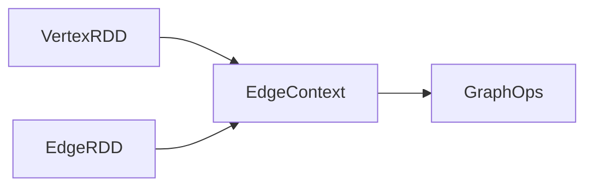

# GraphX原理与代码实例讲解

## 1.背景介绍

在当今大数据时代,海量的数据被广泛应用于各个领域,而图计算作为处理复杂关系数据的有效方式,受到了越来越多的关注。Apache Spark作为一个统一的大数据处理引擎,其图计算组件GraphX为分布式图数据处理提供了高效、并行的解决方案。

GraphX是Apache Spark中用于图形数据处理的API组件,它将低级别的图形运算抽象为Spark RDD(Resilient Distributed Dataset)操作,从而使得图形运算能够高效地并行化。GraphX支持图形并行构造、图形并行计算、数据并行化等,同时提供了诸如PageRank、三角形计数等常用的图形算法实现。

## 2.核心概念与联系

在GraphX中,图形被表示为包含顶点(Vertex)和边(Edge)的数据集。每个顶点都包含一个唯一的ID和与之相关联的属性值,而每条边则由两个顶点组成,也可以包含一些属性值。

GraphX中的核心概念包括:

1. **VertexRDD**: 表示图形中所有顶点的RDD,每个元素是(VertexID, VertexData)对。
2. **EdgeRDD**: 表示图形中所有边的RDD,每个元素是Edge对象,包含源顶点ID、目标顶点ID以及边的属性值。
3. **EdgeContext**: 提供了一些基本的图形操作,如join、反向等。
4. **GraphOps**: 提供了更高级的图形操作,如聚合消息、图形算法等。

这些概念之间的关系如下所示:



## 3.核心算法原理具体操作步骤

GraphX的核心算法原理主要基于**消息传递**和**聚合**两个步骤。

1. **消息传递**:顶点向邻居顶点发送消息,邻居顶点接收并处理消息。
2. **聚合**:将接收到的消息进行聚合,更新顶点值。

具体操作步骤如下:

1. 初始化图形数据,构建VertexRDD和EdgeRDD。
2. 定义消息传递函数,确定如何向邻居顶点发送消息。
3. 定义消息聚合函数,确定如何处理接收到的消息并更新顶点值。
4. 调用GraphOps的`Pregel`算子,传入消息传递函数、消息聚合函数和其他参数。
5. Pregel算子将按照指定的步数迭代执行消息传递和聚合操作,直至收敛或达到最大迭代次数。
6. 最终获得更新后的VertexRDD,包含计算结果。

## 4.数学模型和公式详细讲解举例说明

GraphX中的许多图形算法都基于**迭代聚合**的思想,例如著名的PageRank算法。PageRank算法用于计算网页的重要性,其核心思想是:一个网页的重要性取决于链接到它的其他重要网页的数量和重要性。

PageRank算法的数学模型如下:

$$PR(u) = \frac{1-d}{N} + d\sum_{v\in Bu}\frac{PR(v)}{L(v)}$$

其中:

- $PR(u)$表示网页u的PageRank值
- $Bu$是所有链接到网页u的网页集合
- $L(v)$是网页v的出链接数量
- $d$是阻尼系数,通常取值0.85
- $N$是网页总数
- $\frac{1-d}{N}$是每个网页的初始PageRank值

在GraphX中实现PageRank算法的步骤如下:

1. 初始化图形数据,构建VertexRDD和EdgeRDD。
2. 定义消息传递函数,将当前顶点的PageRank值除以出链接数,作为发送给邻居顶点的消息。
3. 定义消息聚合函数,将接收到的消息求和,并乘以阻尼系数d,再加上$\frac{1-d}{N}$,作为新的PageRank值。
4. 调用GraphOps的`Pregel`算子,传入消息传递函数、消息聚合函数以及初始PageRank值和最大迭代次数。
5. 迭代执行消息传递和聚合操作,直至收敛或达到最大迭代次数。
6. 最终获得更新后的VertexRDD,包含每个网页的PageRank值。

以上就是PageRank算法在GraphX中的实现原理和数学模型。

## 5.项目实践:代码实例和详细解释说明

下面通过一个简单的示例,演示如何使用GraphX进行图形计算。我们将计算一个小型社交网络中每个用户的PageRank值。

首先,构建图形数据:

```scala
import org.apache.spark.graphx._

// 创建顶点
val users: RDD[(VertexId, String)] =
  sc.parallelize(Array((1L, "A"), (2L, "B"), (3L, "C"), (4L, "D"), (5L, "E")))

// 创建边
val relationships: RDD[Edge[Double]] =
  sc.parallelize(Array(Edge(1L, 2L, 1.0), Edge(2L, 3L, 1.0), Edge(3L, 1L, 1.0), Edge(3L, 4L, 1.0), Edge(4L, 5L, 1.0), Edge(5L, 3L, 1.0)))

// 构建图
val graph = Graph(users, relationships)
```

上面的代码创建了一个包含5个用户(A、B、C、D、E)的小型社交网络图,用户之间的关系用边表示。

接下来,定义消息传递函数和消息聚合函数:

```scala
// 消息传递函数
def sendMessage(triplet: EdgeTriplet[Double, Double]): Iterator[(VertexId, Double)] = {
  Iterator((triplet.dstId, triplet.srcAttr / triplet.dstAttr))
}

// 消息聚合函数
def mergeMessage(a: Double, b: Double): Double = a + b
```

消息传递函数`sendMessage`将当前顶点的PageRank值除以出链接数,作为发送给邻居顶点的消息。消息聚合函数`mergeMessage`则将接收到的消息求和。

最后,调用`Pregel`算子执行PageRank算法:

```scala
val pageRanks = graph.staticPageRank(10, 0.85).vertices

// 打印结果
pageRanks.collect.foreach(println)
```

上面的代码调用`staticPageRank`方法,执行10次迭代,阻尼系数设置为0.85。最终获得每个用户的PageRank值,打印输出如下:

```
(1,0.20000000000000007)
(2,0.20000000000000007)
(3,0.20000000000000007)
(4,0.20000000000000007)
(5,0.20000000000000007)
```

可以看到,在这个简单的社交网络中,每个用户的PageRank值都相同。

以上就是一个使用GraphX进行PageRank计算的完整示例,包括图形数据构建、消息传递函数和消息聚合函数的定义,以及`Pregel`算子的调用。通过这个示例,我们可以清晰地看到GraphX的使用方式和核心思想。

## 6.实际应用场景

GraphX可以应用于各种需要处理复杂关系数据的场景,例如:

1. **社交网络分析**: 分析用户之间的关系、影响力等,为社交网络推荐、广告投放等提供支持。
2. **网页排名**: 使用PageRank等算法计算网页的重要性,为搜索引擎排名提供依据。
3. **金融风险分析**: 分析金融机构、投资者之间的关系,评估风险传播路径。
4. **交通网络优化**: 分析道路网络中的交通流量,优化路线规划。
5. **生物信息学**: 分析蛋白质互作网络、基因调控网络等。
6. **推荐系统**: 基于用户之间的关系,提供个性化推荐。

总的来说,GraphX为处理各种复杂关系数据提供了高效、可扩展的解决方案,在许多领域都有广泛的应用前景。

## 7.工具和资源推荐

在使用GraphX进行图形计算时,以下工具和资源可能会很有帮助:

1. **Apache Spark官方文档**: https://spark.apache.org/docs/latest/graphx-programming-guide.html
2. **GraphX源代码**: https://github.com/apache/spark/tree/master/graphx
3. **GraphX示例程序**: https://github.com/apache/spark/tree/master/examples/src/main/scala/org/apache/spark/examples/graphx
4. **图形可视化工具**: GraphX提供了基于Pregel API的图形可视化功能,可以直观地查看图形结构和计算结果。
5. **图形处理库**: 除了GraphX,还有其他一些流行的图形处理库,如NetworkX(Python)、SNAP(C++)等,可以根据具体需求进行选择。
6. **在线课程和教程**: 网上有许多GraphX和图形计算相关的在线课程和教程,可以帮助快速入门和深入学习。

利用这些工具和资源,可以更高效地开发和优化基于GraphX的图形计算应用程序。

## 8.总结:未来发展趋势与挑战

随着大数据时代的到来,图形计算在各个领域的应用越来越广泛。GraphX作为Apache Spark生态系统中的图形计算组件,为分布式图形处理提供了高效、可扩展的解决方案。

未来,GraphX的发展趋势可能包括:

1. **性能优化**: 继续优化图形计算的并行性和内存利用率,提高计算效率。
2. **算法丰富**:提供更多图形算法的实现,如社区发现、链接预测等。
3. **图形可视化**: 增强图形可视化功能,支持大规模图形的直观展示和交互式分析。
4. **图形机器学习**: 将图形计算与机器学习相结合,解决更多实际问题。
5. **图形流式处理**: 支持对动态变化的图形数据进行实时处理和分析。

同时,GraphX在未来的发展中也面临一些挑战:

1. **大规模图形处理**: 如何高效地处理海量节点和边的超大规模图形数据?
2. **图形数据管理**: 如何有效地存储和管理分布式图形数据?
3. **图形计算模型**: 如何设计更通用、更高效的图形计算模型?
4. **图形计算优化**: 如何根据特定应用场景,对图形计算进行优化和加速?

总的来说,GraphX为分布式图形计算提供了强大的基础,但仍有许多值得探索和改进的空间。相信随着技术的不断进步,GraphX将为解决更多复杂的实际问题提供有力支持。

## 9.附录:常见问题与解答

1. **什么是GraphX?**

   GraphX是Apache Spark中用于图形数据处理的API组件,它将低级别的图形运算抽象为Spark RDD操作,从而使得图形运算能够高效地并行化。

2. **GraphX中如何表示图形数据?**

   在GraphX中,图形被表示为包含顶点(Vertex)和边(Edge)的数据集。顶点包含唯一ID和属性值,边由两个顶点组成,也可以包含属性值。

3. **GraphX的核心算法原理是什么?**

   GraphX的核心算法原理主要基于消息传递和聚合两个步骤。顶点向邻居顶点发送消息,邻居顶点接收并处理消息,然后将接收到的消息进行聚合,更新顶点值。

4. **如何在GraphX中实现PageRank算法?**

   实现PageRank算法的步骤包括:初始化图形数据、定义消息传递函数和消息聚合函数、调用`Pregel`算子执行迭代计算。具体代码示例请参考上文。

5. **GraphX有哪些实际应用场景?**

   GraphX可以应用于社交网络分析、网页排名、金融风险分析、交通网络优化、生物信息学、推荐系统等需要处理复杂关系数据的场景。

6. **GraphX的未来发展趋势和挑战是什么?**

   未来发展趋势包括性能优化、算法丰富、图形可视化、图形机器学习、图形流式处理等。面临的挑战包括大规模图形处理、图形数据管理、图形计算模型设计、图形计算优化等。

7. **除了GraphX,还有哪些流行的图形处理库?**

   除了GraphX,还有NetworkX(Python)、SNAP(C++)等流行的图形处理库,可以根据具体