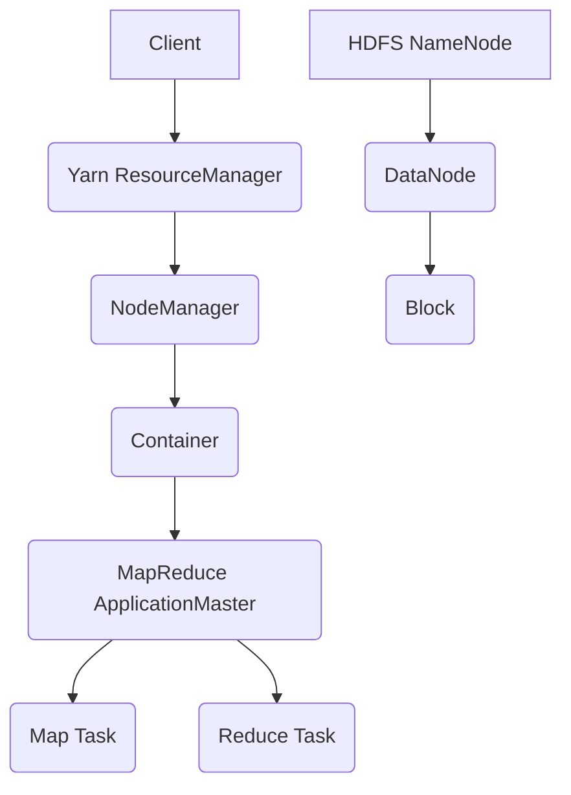

# Hadoop 原理与代码实例讲解

## 1. 背景介绍

### 1.1 大数据处理的挑战

在当今数据爆炸式增长的时代,传统的数据处理方式已经无法满足海量数据的存储和计算需求。面对 TB 甚至 PB 级别的海量数据,单台服务器的性能和存储容量都捉襟见肘。同时,高昂的硬件成本也让许多企业望而却步。

### 1.2 Hadoop 的诞生

Hadoop 应运而生,它是一个开源的分布式计算平台,旨在利用普通服务器集群提供可靠、可扩展的大数据存储和计算能力。Hadoop 最初由 Doug Cutting 和 Mike Cafarella 开发,灵感来自于 Google 的 GFS 和 MapReduce 论文。

### 1.3 Hadoop生态系统概览

如今,Hadoop 已发展成为一个庞大的生态系统,包括 HDFS、MapReduce、Yarn、Hive、HBase、Spark 等多个子项目。这些组件各司其职,协同工作,共同构建了一个完整的大数据处理平台。

## 2. 核心概念与联系

### 2.1 HDFS 分布式文件系统

HDFS(Hadoop Distributed File System)是 Hadoop 的核心存储系统。它采用主/从架构,由 NameNode 和 DataNode 组成。

- NameNode:管理文件系统的命名空间,维护文件到数据块的映射关系。
- DataNode:存储实际的数据块,并提供读写服务。

HDFS 具有高容错、高吞吐量等特点,适合存储大文件。

### 2.2 MapReduce 分布式计算框架

MapReduce 是 Hadoop 的核心计算框架,用于大规模数据的并行处理。它将计算过程分为 Map 和 Reduce 两个阶段:

- Map:对输入数据进行处理,生成中间的键值对。
- Reduce:对 Map 输出的键值对进行归约,生成最终结果。

MapReduce 采用"分而治之"的思想,可以轻松实现并行计算,具有良好的可扩展性。

### 2.3 Yarn 资源管理系统

Yarn(Yet Another Resource Negotiator)是 Hadoop 2.x 引入的资源管理系统。它将资源管理和作业调度从 MapReduce 中剥离出来,成为一个独立的服务。

Yarn 采用主/从架构,由 ResourceManager 和 NodeManager 组成:

- ResourceManager:负责集群资源的统一管理和调度。
- NodeManager:负责单个节点的资源管理和任务执行。

Yarn 提高了 Hadoop 的资源利用率和可扩展性,支持多种计算框架如 MapReduce、Spark 等。

### 2.4 核心组件关系图

下面是 Hadoop 核心组件的关系图:



## 3. 核心算法原理具体操作步骤

### 3.1 MapReduce 编程模型

MapReduce 编程模型由以下几个核心概念组成:

- InputFormat:描述输入数据的格式,常用的有 TextInputFormat、SequenceFileInputFormat 等。
- Mapper:用户自定义的 map 函数,对输入的键值对进行处理。
- Reducer:用户自定义的 reduce 函数,对 map 输出的键值对进行归约。
- OutputFormat:描述输出数据的格式,常用的有 TextOutputFormat、SequenceFileOutputFormat 等。

具体操作步骤如下:

1. 将输入数据划分为多个切片(Split),每个切片由一个 Map Task 处理。
2. Map Task 读取对应的切片数据,调用用户定义的 map 函数进行处理,生成中间结果键值对。
3. 对中间结果按照 key 进行分区(Partition),并在每个分区内部进行排序(Sort)。
4. 将排序后的结果发送给对应的 Reduce Task,这个过程称为 Shuffle。
5. Reduce Task 对接收到的键值对进行归约,调用用户定义的 reduce 函数,生成最终结果。
6. 将最终结果写入 HDFS 或其他输出系统。

### 3.2 HDFS 读写流程

HDFS 的读写流程如下:

写入数据:
1. Client 将文件切分成多个 Block,默认大小为 128MB。
2. Client 向 NameNode 请求写入文件,NameNode 返回一组 DataNode 用于存储数据。
3. Client 将数据写入 DataNode,采用流式传输,同时写入多个副本。
4. 所有 Block 写入完成后,Client 通知 NameNode 提交文件。

读取数据:
1. Client 向 NameNode 请求读取文件,NameNode 返回文件的 Block 列表和位置信息。
2. Client 直接从最近的 DataNode 读取 Block 数据。
3. 如果某个 DataNode 失效,Client 会尝试从其他副本读取数据。

## 4. 数学模型和公式详细讲解举例说明

### 4.1 TextInputFormat 切片策略

TextInputFormat 是 Hadoop 默认的输入格式,它按照行来划分数据。每个切片的大小计算公式如下:

$splitSize = max(minSize, min(maxSize, blockSize))$

其中:
- minSize:切片的最小大小,默认为1。
- maxSize:切片的最大大小,默认等于 blockSize。
- blockSize:HDFS 的块大小,默认为 128MB。

例如,有一个 200MB 的文件,HDFS 块大小为 128MB,则切片大小为:

$splitSize = max(1, min(128, 128)) = 128MB$

该文件会被划分为 2 个切片,每个切片大小约为 100MB。

### 4.2 Combiner 合并策略

Combiner 是 MapReduce 的一种本地聚合优化策略,它可以减少 Shuffle 阶段的数据传输量。Combiner 的输入输出类型必须与 Reducer 相同。

假设有以下 Map 输出结果:

$(hello, 1), (hello, 1), (world, 1), (hadoop, 1)$

如果设置了 Combiner,则在 Shuffle 之前会先进行本地聚合:

$(hello, 2), (world, 1), (hadoop, 1)$

这样可以减少 Shuffle 阶段的数据传输量,提高整体的计算性能。

## 5. 项目实践:代码实例和详细解释说明

下面是一个经典的 WordCount 示例,用于统计文本文件中单词的出现次数。

```java
public class WordCount {
    public static class TokenizerMapper extends Mapper<Object, Text, Text, IntWritable> {
        private final static IntWritable one = new IntWritable(1);
        private Text word = new Text();

        public void map(Object key, Text value, Context context) throws IOException, InterruptedException {
            StringTokenizer itr = new StringTokenizer(value.toString());
            while (itr.hasMoreTokens()) {
                word.set(itr.nextToken());
                context.write(word, one);
            }
        }
    }

    public static class IntSumReducer extends Reducer<Text, IntWritable, Text, IntWritable> {
        private IntWritable result = new IntWritable();

        public void reduce(Text key, Iterable<IntWritable> values, Context context) throws IOException, InterruptedException {
            int sum = 0;
            for (IntWritable val : values) {
                sum += val.get();
            }
            result.set(sum);
            context.write(key, result);
        }
    }

    public static void main(String[] args) throws Exception {
        Configuration conf = new Configuration();
        Job job = Job.getInstance(conf, "word count");
        job.setJarByClass(WordCount.class);
        job.setMapperClass(TokenizerMapper.class);
        job.setCombinerClass(IntSumReducer.class);
        job.setReducerClass(IntSumReducer.class);
        job.setOutputKeyClass(Text.class);
        job.setOutputValueClass(IntWritable.class);
        FileInputFormat.addInputPath(job, new Path(args[0]));
        FileOutputFormat.setOutputPath(job, new Path(args[1]));
        System.exit(job.waitForCompletion(true) ? 0 : 1);
    }
}
```

代码详解:

1. 自定义了一个 Mapper 类 TokenizerMapper,它继承自 Mapper 类,泛型参数分别为输入键、输入值、输出键、输出值的类型。
2. 在 map 方法中,通过 StringTokenizer 对输入的文本进行分词,并输出<word, 1>形式的键值对。
3. 自定义了一个 Reducer 类 IntSumReducer,它继承自 Reducer 类,泛型参数分别为输入键、输入值、输出键、输出值的类型。
4. 在 reduce 方法中,对输入的<word, [1, 1, ...]>键值对进行求和,并输出<word, sum>形式的键值对。
5. 在 main 方法中,通过 Job 类配置作业信息,如 Mapper、Combiner、Reducer 等。
6. 通过 FileInputFormat 和 FileOutputFormat 设置输入输出路径。
7. 提交作业并等待执行完成。

这个示例很好地展示了 MapReduce 编程的基本流程和常用 API 的使用方法。

## 6. 实际应用场景

Hadoop 在实际生产环境中有着广泛的应用,下面列举几个典型场景:

### 6.1 日志分析

互联网公司每天会产生海量的用户访问日志,通过 Hadoop 可以对这些日志进行离线分析,挖掘出有价值的信息,如 PV/UV、用户行为、异常访问等。

### 6.2 推荐系统

电商网站通常会给用户推荐相关商品,这背后离不开大数据分析的支持。通过 Hadoop 对用户的历史行为数据进行挖掘,构建用户画像和商品画像,从而实现精准推荐。

### 6.3 舆情分析

通过 Hadoop 对社交网络、新闻媒体、论坛等渠道的文本数据进行采集和分析,可以实时掌握舆情动向,预警负面事件,为决策提供支持。

### 6.4 交通流量预测

利用 Hadoop 对历史的交通流量数据、天气数据等进行分析,构建机器学习模型,可以对未来的交通流量进行预测,从而更好地指导交通调度和疏导。

## 7. 工具和资源推荐

### 7.1 Ambari

Ambari 是 Hadoop 生态系统的管理工具,提供了 Web UI 界面,可以很方便地进行 Hadoop 集群的部署、监控和管理。

### 7.2 Hue

Hue 是一个开源的 Hadoop UI 系统,它提供了 Hadoop 各个组件的 Web 界面,如 HDFS、MapReduce、Hive、HBase 等,使得用户可以在浏览器上与 Hadoop 进行交互。

### 7.3 Apache Kylin

Kylin 是一个开源的分布式分析引擎,提供 Hadoop/Spark 之上的 SQL 查询接口。它能够支持亚秒级的大数据查询,适合用于数据仓库和 BI 分析场景。

### 7.4 Apache Eagle

Eagle 是一个开源的实时大数据安全分析平台,它利用机器学习算法,可以实时检测 Hadoop 集群中的异常行为和安全威胁,提高集群的安全性。

## 8. 总结:未来发展趋势与挑战

### 8.1 Hadoop 与云计算的融合

随着云计算的发展,越来越多的企业选择将 Hadoop 集群部署在云平台上,如 AWS、阿里云等。云平台提供的弹性资源和托管服务,可以极大地简化 Hadoop 集群的运维工作。未来 Hadoop 与云计算的融合将进一步加深。

### 8.2 Hadoop 与实时计算的结合

Hadoop 擅长离线批处理,但在实时计算方面略有不足。随着 Spark、Flink 等实时计算框架的兴起,Hadoop 生态系统也在向实时化方向发展。未来 Hadoop 与实时计算框架的结合将更加紧密,以满足日益增长的实时大数据处理需求。

### 8.3 机器学习与深度学习的支持

Hadoop 作为一个通用的大数据处理平台,为机器学习和深度学习提供了数据基础。当前已有多个基于 Hadoop 的机器学习框架,如 Mahout、Spark MLlib 等。未来 Hadoop 将与更多的机器学习和深度学习框架进行集成,为 AI 应用提供强大的支撑。

### 8.4 数据安全与隐私保护

在大数据时代,数据