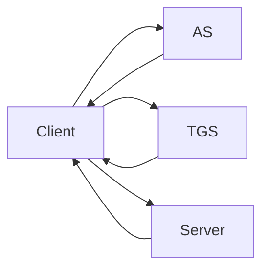
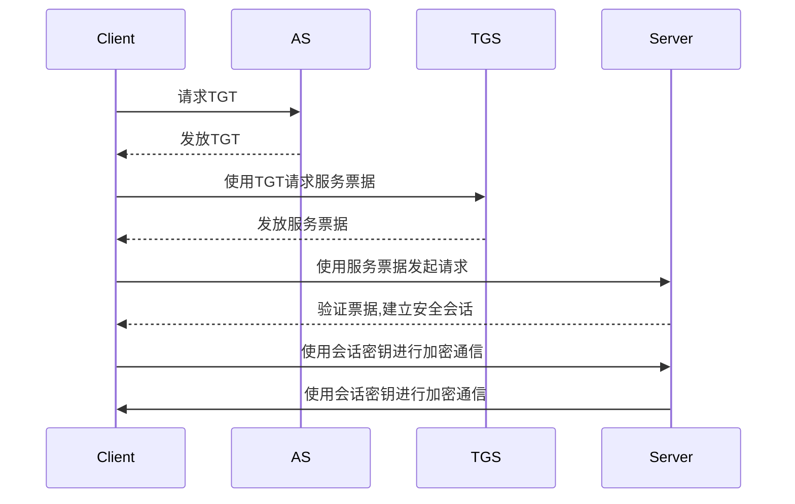

# Kerberos原理与代码实例讲解

## 1.背景介绍

在分布式系统中,确保通信安全是一个关键挑战。Kerberos是一种网络认证协议,旨在通过使用强密钥密码学为客户机/服务器应用程序提供相互认证。Kerberos最初由麻省理工学院(MIT)在20世纪80年代中期设计,目的是保护网络服务免受未经授权的访问。

Kerberos的名称源于希腊神话中的"守门者"Cerberus,一只守卫冥界入口的三头狗。就像Cerberus守护着冥界的大门,Kerberos协议也负责认证用户进入网络服务。

### 1.1 Kerberos的优势

Kerberos具有以下主要优势:

- **单点登录(SSO)**: 用户只需登录一次,就可以访问网络上的所有服务。
- **集中式密钥管理**: 密钥存储在中央服务器中,简化了密钥分发和管理。
- **相互认证**: 客户端和服务器都可以相互认证对方的身份。
- **密钥传输**: 客户端和服务器之间的会话密钥可以安全地传输,而不会被窃听。
- **可扩展性**: Kerberos可以轻松扩展以支持新的服务和应用程序。

### 1.2 Kerberos在现实中的应用

Kerberos广泛应用于各种环境,包括:

- **企业网络**: 保护内部网络资源免受未经授权的访问。
- **Web应用程序**: 实现单点登录(SSO),简化用户认证流程。
- **云服务**: 在云环境中保护虚拟机和其他资源的安全。
- **操作系统**: Windows、Linux和其他操作系统都支持Kerberos认证。

## 2.核心概念与联系

### 2.1 Kerberos体系结构

Kerberos体系结构包括三个主要组件:

1. **客户端(Client)**: 请求访问网络服务的实体,通常是用户或应用程序。
2. **认证服务器(Authentication Server, AS)**: 验证客户端身份并发放票据授权票据(Ticket Granting Ticket, TGT)。
3. **票据授予服务器(Ticket Granting Server, TGS)**: 基于TGT为客户端发放服务票据(Service Ticket),以便访问特定服务。



### 2.2 核心概念

Kerberos使用以下核心概念:

- **委托人(Principal)**: 一个可以被认证的实体,可以是用户或服务。
- **密钥分发中心(Key Distribution Center, KDC)**: 包含AS和TGS,负责存储和分发密钥。
- **密钥**: 用于加密通信的密码学密钥,存储在KDC中。
- **票据(Ticket)**: 包含加密的身份和会话密钥信息,用于认证和建立安全会话。

## 3.核心算法原理具体操作步骤

Kerberos的工作流程包括以下步骤:

1. **认证过程(Authentication Exchange)**:
   - 客户端向AS请求TGT,提供自己的身份。
   - AS验证客户端身份,并发放TGT(包含会话密钥)。

2. **票据获取过程(Ticket Granting Process)**:
   - 客户端使用TGT向TGS请求服务票据。
   - TGS验证TGT的有效性,并发放服务票据。

3. **客户端/服务器认证(Client/Server Authentication)**:
   - 客户端使用服务票据向服务器发起请求。
   - 服务器验证服务票据的有效性,并建立安全会话。

4. **客户端/服务器安全通信(Secure Communication)**:
   - 客户端和服务器使用会话密钥进行加密通信。



## 4.数学模型和公式详细讲解举例说明

Kerberos使用对称密钥加密算法(如DES、AES等)来保护通信。它依赖于密钥分发中心(KDC)来生成和分发密钥。

### 4.1 Kerberos消息交换

Kerberos消息交换涉及以下步骤:

1. **客户端向AS请求TGT**:

$$
C \rightarrow AS: C, tgs
$$

其中:
- $C$ 表示客户端身份
- $tgs$ 表示TGS的身份

2. **AS发放TGT**:

$$
AS \rightarrow C: \{ K_{c,tgs}, C, tgs, t_1, t_2 \}_{K_c}, \{ K_{c,tgs}, t_1, t_2 \}_{K_{tgs}}
$$

其中:
- $K_{c,tgs}$ 是客户端和TGS之间的会话密钥
- $t_1$ 是TGT的开始时间
- $t_2$ 是TGT的过期时间
- $K_c$ 是客户端的密钥
- $K_{tgs}$ 是TGS的密钥

3. **客户端向TGS请求服务票据**:

$$
C \rightarrow TGS: \{ AP_1, C, tgs \}_{K_{c,tgs}}, \{ C, t_3 \}_{K_{c,tgs}}
$$

其中:
- $AP_1$ 是一个身份验证器,包含客户端身份和时间戳
- $t_3$ 是服务票据的开始时间

4. **TGS发放服务票据**:

$$
TGS \rightarrow C: \{ K_{c,v}, C, t_4, t_5 \}_{K_{c,tgs}}, \{ K_{c,v}, t_4, t_5 \}_{K_v}
$$

其中:
- $K_{c,v}$ 是客户端和服务器之间的会话密钥
- $t_4$ 是服务票据的开始时间
- $t_5$ 是服务票据的过期时间
- $K_v$ 是服务器的密钥

5. **客户端向服务器发起请求**:

$$
C \rightarrow V: \{ AP_2, C, t_6 \}_{K_{c,v}}, \{ C, t_7 \}_{K_{c,v}}
$$

其中:
- $AP_2$ 是另一个身份验证器,包含客户端身份和时间戳
- $t_6$ 是客户端发送的时间戳
- $t_7$ 是服务器发送的时间戳

通过这种方式,Kerberos可以确保通信的机密性、完整性和身份认证。

## 5.项目实践: 代码实例和详细解释说明

以下是一个使用Python和`kerberos`库实现Kerberos认证的示例:

```python
import kerberos

# 获取TGT
service = "krbtgt/EXAMPLE.COM@EXAMPLE.COM"
result = kerberos.authGSSClientInit(service)
kerberos.authGSSClientStep(result, "")

# 获取服务票据
service = "http/www.example.com@EXAMPLE.COM"
server_creds = kerberos.authGSSServerInit(service)
client_token = kerberos.authGSSClientStep(result, "")
server_response = kerberos.authGSSServerStep(server_creds, client_token)

# 客户端/服务器认证
client_response = kerberos.authGSSClientStep(result, server_response)
server_response = kerberos.authGSSServerStep(server_creds, client_response)

if server_response == kerberos.AUTH_GSS_COMPLETE:
    print("Kerberos authentication successful!")
else:
    print("Kerberos authentication failed.")
```

这个示例演示了如何使用Python的`kerberos`库执行Kerberos认证。让我们逐步解释代码:

1. **获取TGT**:
   - `service = "krbtgt/EXAMPLE.COM@EXAMPLE.COM"` 指定了KDC的服务名称。
   - `kerberos.authGSSClientInit(service)` 初始化客户端上下文,并请求TGT。
   - `kerberos.authGSSClientStep(result, "")` 发送空数据以完成TGT获取过程。

2. **获取服务票据**:
   - `service = "http/www.example.com@EXAMPLE.COM"` 指定了要访问的服务名称。
   - `kerberos.authGSSServerInit(service)` 初始化服务器上下文。
   - `kerberos.authGSSClientStep(result, "")` 使用TGT请求服务票据。
   - `kerberos.authGSSServerStep(server_creds, client_token)` 服务器验证客户端请求并响应。

3. **客户端/服务器认证**:
   - `kerberos.authGSSClientStep(result, server_response)` 客户端处理服务器响应。
   - `kerberos.authGSSServerStep(server_creds, client_response)` 服务器验证客户端响应。
   - 如果最终响应为`kerberos.AUTH_GSS_COMPLETE`,则认证成功。

这个示例展示了如何使用Python的`kerberos`库执行Kerberos认证的基本流程。在实际应用中,您可能需要处理更多错误情况和边界条件。

## 6.实际应用场景

Kerberos广泛应用于各种场景,以提供安全的身份认证和通信保护。以下是一些常见的应用场景:

1. **企业网络安全**: Kerberos可以保护企业内部网络资源免受未经授权的访问,确保只有经过认证的用户和服务才能访问敏感数据和系统。

2. **Web应用程序单点登录(SSO)**: 通过Kerberos,用户只需登录一次,就可以访问多个Web应用程序和服务,提高了用户体验和安全性。

3. **云环境安全**: 在云环境中,Kerberos可以保护虚拟机和其他资源免受未经授权的访问,确保只有经过认证的实体才能访问这些资源。

4. **操作系统安全**: Windows、Linux和其他操作系统都支持Kerberos认证,可以保护系统免受未经授权的访问和操作。

5. **数据库安全**: Kerberos可以用于保护数据库服务器,确保只有经过认证的客户端才能访问和修改数据。

6. **物联网(IoT)安全**: 随着物联网设备的增多,Kerberos可以提供一种安全的方式来认证和保护这些设备之间的通信。

7. **移动应用程序安全**: Kerberos可以用于保护移动应用程序与后端服务器之间的通信,防止未经授权的访问和数据泄露。

总的来说,Kerberos提供了一种安全、可扩展和易于管理的方式来保护分布式系统中的通信和资源访问。

## 7.工具和资源推荐

以下是一些有用的Kerberos工具和资源:

1. **MIT Kerberos**: 这是Kerberos协议的参考实现,由麻省理工学院开发和维护。它提供了完整的Kerberos服务器和客户端组件,支持多种操作系统。网址: https://web.mit.edu/kerberos/

2. **Kerberos工具箱(KToolBox)**: 一个免费的开源工具集,提供了各种Kerberos相关工具,如密钥管理、票据查看器、密码破解工具等。网址: https://ktoolbox.sourceforge.net/

3. **Kerberos网络认证服务(KNetSrv)**: 一个开源的Kerberos服务器实现,支持Windows和Unix/Linux系统。网址: https://knetsrv.sourceforge.net/

4. **Kerberos文档**: MIT Kerberos项目提供了详细的文档,涵盖了Kerberos协议的各个方面,包括安装、配置、管理和故障排除。网址: https://web.mit.edu/kerberos/krb5-latest/doc/

5. **Kerberos社区**: 有几个活跃的Kerberos社区,如Kerberos邮件列表和论坛,可以提供支持和解答问题。

6. **Kerberos书籍**: 有几本关于Kerberos的书籍可供参考,如《Kerberos: The Definitive Guide》和《Kerberos Explained》。

利用这些工具和资源,您可以更好地理解和使用Kerberos,提高分布式系统的安全性。

## 8.总结: 未来发展趋势与挑战

Kerberos已经成为分布式系统中广泛采用的安全认证协议。然而,随着技术的不断发展,Kerberos也面临着一些挑战和未来发展趋势: