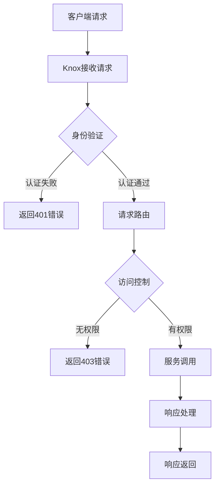

# Knox原理与代码实例讲解

## 1.背景介绍

在现代分布式系统中,安全性和隔离性是非常重要的需求。Apache Knox是一个反向代理服务器,旨在为Apache Hadoop集群提供单一入口点,增强安全性和集中化管理。它位于Hadoop集群与客户端应用程序之间,充当网关和负载均衡器的角色。

Knox的主要目标是:

1. 提供集中式身份验证和授权,减轻客户端应用程序的负担。
2. 实现多租户支持,允许不同的组织或部门安全地共享同一个Hadoop集群。
3. 简化Hadoop服务的访问,提供统一的REST API。
4. 通过SSL和其他安全机制保护数据传输。

Knox的设计理念是遵循"责任最小化"原则,只提供必要的功能,从而减小攻击面并提高整体安全性。它是Hadoop生态系统中非常重要的一个组件,为构建企业级安全解决方案奠定了基础。

## 2.核心概念与联系

Knox的核心概念包括:

1. **Topology**:描述了Knox如何将传入请求路由到Hadoop服务。它定义了服务的URL映射规则。
2. **Provider**:实现特定协议的插件,用于与Hadoop服务进行通信。
3. **Descriptor**:描述服务的元数据信息,包括服务URL、认证方式等。
4. **Authentication**:Knox支持多种认证机制,如Kerberos、SPNEGO等。
5. **Authorization**:基于Apache Shiro的访问控制模型,支持角色和权限管理。
6. **Deployment**:Knox可以部署在独立主机或Hadoop集群中。

这些概念相互关联,共同构建了Knox的安全框架。Topology定义了请求路由规则,Provider负责与后端服务通信,Descriptor提供服务元数据,Authentication和Authorization实现访问控制,最后根据部署模式将Knox集成到整个系统中。

## 3.核心算法原理具体操作步骤

Knox的核心算法原理可以概括为以下几个步骤:

1. **请求接收**:Knox通过HTTP(S)协议接收来自客户端的请求。

2. **身份验证**:根据配置的认证机制(如Kerberos、SPNEGO等),对客户端进行身份验证。如果认证通过,则继续下一步;否则返回401错误。

3. **请求路由**:根据请求URL和Topology文件中定义的规则,将请求路由到相应的Hadoop服务。

4. **访问控制**:利用Apache Shiro的访问控制模型,根据用户的角色和权限,判断是否允许访问请求的资源。如果没有权限,则返回403错误。

5. **服务调用**:使用相应的Provider插件,通过底层协议(如HDFS、YARN、HBase等)与Hadoop服务进行交互,获取或提交数据。

6. **响应处理**:对从Hadoop服务获取的响应进行必要的处理,如数据转换、头信息修改等。

7. **响应返回**:将处理后的响应返回给客户端。

该算法的核心思想是将安全性相关的逻辑集中在Knox中处理,从而减轻客户端应用程序的负担,同时也提高了整个系统的安全性和可管理性。



## 4.数学模型和公式详细讲解举例说明

在Knox的设计中,没有直接使用复杂的数学模型或公式。但是,在实现特定功能时,可能会涉及一些基本的数学概念和算法。

例如,在实现负载均衡功能时,Knox可能会使用一些简单的负载均衡算法,如轮询(Round-Robin)算法或加权轮询(Weighted Round-Robin)算法。

**轮询算法**:

轮询算法是一种最简单的负载均衡算法。它将请求按顺序依次分配给每个服务器,当分配到最后一个服务器后,会循环回到第一个服务器继续分配。

假设有n个服务器,第i次请求分配给第$k_i$个服务器,则:

$$k_i = (i \bmod n) + 1$$

其中,mod是取模运算符。

**加权轮询算法**:

加权轮询算法是在轮询算法的基础上,根据服务器的权重进行调整。服务器的权重可以根据其性能、负载等因素来设置。

假设有n个服务器,第i个服务器的权重为$w_i$,总权重为$W = \sum_{i=1}^{n} w_i$。第j次请求分配给第$k_j$个服务器,则:

$$k_j = 1 + \left\lfloor\frac{\sum_{i=1}^{j \bmod W} w_{(i+n-1) \bmod n+1}}{W}\right\rfloor$$

这里,$\lfloor x \rfloor$表示向下取整。

虽然这些算法在Knox中的应用并不复杂,但它们展示了Knox在设计和实现时,如何利用一些基本的数学概念和算法来实现特定的功能。

## 5.项目实践:代码实例和详细解释说明

为了更好地理解Knox的工作原理,我们可以通过一个简单的示例来演示如何使用Knox访问Hadoop集群中的HDFS服务。

### 5.1 环境准备

1. 安装并配置Apache Hadoop集群。
2. 安装并配置Apache Knox。
3. 在Knox中创建一个Topology文件,定义HDFS服务的URL映射规则。

```xml
<topology>
  <service>
    <role>HDFS</role>
    <url>hdfs://namenode:8020</url>
  </service>

  <service>
    <role>HDFS</role>
    <url>hdfs://namenode:50070/webhdfs</url>
  </service>
</topology>
```

### 5.2 代码示例

以下是一个使用Python编写的示例代码,演示如何通过Knox访问HDFS服务:

```python
import requests
from requests.auth import HTTPBasicAuth

# Knox地址和端口
knox_host = "knox.example.com"
knox_port = 8443

# HDFS服务URL
hdfs_url = f"https://{knox_host}:{knox_port}/gateway/default/hdfs"

# 认证信息
username = "hdfs"
password = "password"

# 创建HDFS目录
def create_dir(dir_path):
    url = f"{hdfs_url}/v1/{dir_path}?op=MKDIRS"
    response = requests.put(url, auth=HTTPBasicAuth(username, password), verify=False)
    print(f"创建目录 {dir_path} 的响应: {response.status_code}")

# 列出HDFS目录内容
def list_dir(dir_path):
    url = f"{hdfs_url}/v1/{dir_path}?op=LISTSTATUS"
    response = requests.get(url, auth=HTTPBasicAuth(username, password), verify=False)
    print(f"列出目录 {dir_path} 内容的响应: {response.status_code}")
    print(response.json())

# 主函数
if __name__ == "__main__":
    dir_path = "/user/knox_example"
    create_dir(dir_path)
    list_dir(dir_path)
```

### 5.3 代码解释

1. 导入必要的Python模块,包括`requests`用于发送HTTP请求,以及`HTTPBasicAuth`用于基本身份验证。

2. 定义Knox的主机地址和端口,以及HDFS服务的URL。

3. 定义用于认证的用户名和密码。

4. 实现`create_dir`函数,用于在HDFS中创建目录。它通过向Knox发送PUT请求,并将目录路径作为URL参数传递。请求使用基本身份验证进行认证。

5. 实现`list_dir`函数,用于列出HDFS目录的内容。它通过向Knox发送GET请求,并将目录路径作为URL参数传递。请求使用基本身份验证进行认证。

6. 在主函数中,调用`create_dir`和`list_dir`函数,演示如何在HDFS中创建目录并列出其内容。

通过这个示例,我们可以看到如何使用Knox作为网关,通过发送HTTP请求并进行身份验证,来访问Hadoop集群中的HDFS服务。Knox隐藏了底层协议的复杂性,为客户端应用程序提供了简单、统一的REST API。

## 6.实际应用场景

Knox在企业级Hadoop部署中发挥着重要作用,为构建安全、可管理的大数据平台提供了基础。以下是一些典型的应用场景:

1. **多租户环境**:在共享的Hadoop集群中,Knox可以通过多租户支持实现数据隔离和访问控制,确保不同组织或部门之间的数据安全。

2. **Web应用程序集成**:Knox为Web应用程序提供了一个安全的入口点,使它们能够与Hadoop服务进行交互,而无需直接访问底层服务。这简化了应用程序开发,并提高了安全性。

3. **移动应用程序集成**:Knox可以为移动应用程序提供REST API,使它们能够访问Hadoop数据,从而支持各种移动场景,如物联网、实时分析等。

4. **数据治理和合规性**:Knox的集中式身份验证和授权机制有助于实现数据治理和合规性要求,如审计跟踪、访问控制等。

5. **混合云环境**:在混合云环境中,Knox可以作为桥梁,连接本地Hadoop集群和云服务,实现数据共享和集成。

6. **边缘计算**:Knox可以部署在边缘节点上,为边缘设备提供安全的数据访问和计算服务,支持物联网等应用场景。

7. **API网关**:Knox可以作为API网关,为各种服务提供统一的入口点,实现API管理、安全性控制和流量管理等功能。

总的来说,Knox为构建安全、可扩展的大数据平台提供了关键支持,在企业级Hadoop部署中扮演着重要角色。

## 7.工具和资源推荐

为了更好地学习和使用Knox,以下是一些推荐的工具和资源:

1. **Apache Knox官方网站**:https://knox.apache.org/
   - 包含Knox的文档、教程、发行版本等信息。

2. **Apache Knox GitHub仓库**:https://github.com/apache/knox
   - Knox的源代码仓库,可以查看最新的代码变更和issue跟踪。

3. **Apache Knox书籍**:
   - "Apache Knox: Securing Hadoop Clusters" by Pasi Kärkkäinen和Mayank Choudhary。

4. **Apache Knox视频教程**:
   - Hortonworks公司提供的Knox视频教程:https://hortonworks.com/tutorials/?tab=1#developers

5. **Apache Knox社区邮件列表**:
   - user@knox.apache.org:用于提出问题和讨论。
   - dev@knox.apache.org:用于开发相关讨论。

6. **Apache Knox Stack Overflow标签**:
   - https://stackoverflow.com/questions/tagged/apache-knox

7. **Apache Knox Meetup小组**:
   - 一些地区可能会有Knox相关的Meetup小组,可以加入交流。

8. **Apache Knox Conference Talks**:
   - 在Apache大会和其他相关会议上,可以找到Knox相关的演讲和分享。

利用这些工具和资源,可以更好地学习Knox的概念、架构和使用方法,并与社区保持互动。

## 8.总结:未来发展趋势与挑战

Apache Knox作为Hadoop生态系统中的关键组件,在未来的发展中将面临一些趋势和挑战:

1. **云原生支持**:随着越来越多的企业将大数据工作负载迁移到云平台,Knox需要提供更好的云原生支持,包括与各种云服务的无缝集成、自动化部署和扩展等。

2. **服务网格集成**:服务网格(Service Mesh)是一种新兴的架构模式,旨在简化微服务之间的通信和管理。Knox可能需要与服务网格技术(如Istio、Linkerd等)进行集成,以提供更好的服务发现、流量控制和安全性。

3. **边缘计算支持**:随着物联网和边缘计算的兴起,Knox需要提供更好的支持,以便在边缘节点上部署和管理安全网关,实现数据的本地处理和传输。

4. **API管理和开发者体验**:Knox作为API网关,需要提供更强大的API管理功能,如API文档、测试、监控等,以提升开发者的体验和生产力。

5. **可观测性和监控**:随着系统规模和复