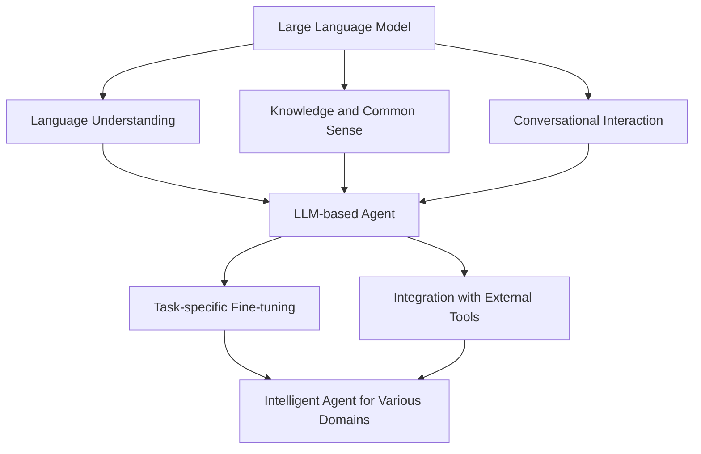

# LLM-based Agent

## 1. 背景介绍
### 1.1 人工智能的发展历程
#### 1.1.1 早期的人工智能
#### 1.1.2 机器学习的崛起  
#### 1.1.3 深度学习的突破

### 1.2 自然语言处理的进展
#### 1.2.1 早期的自然语言处理技术
#### 1.2.2 神经网络在自然语言处理中的应用
#### 1.2.3 Transformer模型的出现

### 1.3 大语言模型(LLM)的兴起
#### 1.3.1 GPT系列模型 
#### 1.3.2 BERT等预训练模型
#### 1.3.3 LLM的特点和优势

## 2. 核心概念与联系
### 2.1 Agent的定义与特点
#### 2.1.1 Agent的定义
#### 2.1.2 Agent的关键特点
#### 2.1.3 Agent与传统程序的区别

### 2.2 LLM在构建Agent中的作用
#### 2.2.1 LLM提供语言理解能力
#### 2.2.2 LLM赋予Agent知识和常识
#### 2.2.3 LLM使Agent具备对话交互能力

### 2.3 LLM-based Agent的整体架构

## 3. 核心算法原理具体操作步骤
### 3.1 基于LLM的Agent核心算法
#### 3.1.1 基于Prompt的few-shot学习
#### 3.1.2 基于人类反馈的强化学习
#### 3.1.3 基于上下文学习的持续学习

### 3.2 算法实现的关键步骤
#### 3.2.1 构建高质量的Prompt
#### 3.2.2 引入人类反馈信号 
#### 3.2.3 实现Agent的上下文理解和记忆
#### 3.2.4 实现Agent的任务导向对话能力

### 3.3 算法优化与改进
#### 3.3.1 Prompt工程的优化
#### 3.3.2 人类反馈信号的有效利用
#### 3.3.3 引入外部知识增强Agent能力

## 4. 数学模型和公式详细讲解举例说明
### 4.1 Transformer模型的数学原理
#### 4.1.1 Self-Attention机制
$Attention(Q,K,V) = softmax(\frac{QK^T}{\sqrt{d_k}})V$
#### 4.1.2 Multi-Head Attention
$$MultiHead(Q,K,V) = Concat(head_1,...,head_h)W^O$$
$$head_i = Attention(QW_i^Q, KW_i^K, VW_i^V)$$
#### 4.1.3 Position-wise前向网络
$$FFN(x) = max(0, xW_1 + b_1)W_2 + b_2$$

### 4.2 强化学习中的数学模型
#### 4.2.1 马尔可夫决策过程(MDP)
$$G_t = R_{t+1} + \gamma R_{t+2} + ... = \sum_{k=0}^{\infty} \gamma^k R_{t+k+1}$$
#### 4.2.2 策略梯度定理
$$\nabla J(\theta) = E_{\tau \sim \pi_{\theta}}[\sum_{t=0}^{T} \nabla_{\theta}log\pi_{\theta}(a_t|s_t)G_t]$$
#### 4.2.3 Actor-Critic算法
$$L(\theta) = E_{(s_t,a_t) \sim \pi_{\theta}}[(Q^w(s_t,a_t) - V^v(s_t))^2]$$

### 4.3 公式的实际应用解释
#### 4.3.1 在LLM中的应用
#### 4.3.2 在Agent的训练优化中的应用
#### 4.3.3 公式如何指导算法改进

## 5. 项目实践：代码实例和详细解释说明
### 5.1 使用LLM构建问答Agent
#### 5.1.1 利用OpenAI API接入GPT模型
#### 5.1.2 构建问答Prompt模板
#### 5.1.3 代码实现与效果演示

### 5.2 基于人类反馈优化Agent
#### 5.2.1 收集人类反馈数据
#### 5.2.2 训练反馈评估模型
#### 5.2.3 通过强化学习优化Agent策略
#### 5.2.4 代码实现与性能评测

### 5.3 集成外部工具增强Agent能力
#### 5.3.1 接入搜索引擎API
#### 5.3.2 集成计算器、日历等工具
#### 5.3.3 实现Agent的工具使用决策
#### 5.3.4 代码实现与效果展示

## 6. 实际应用场景
### 6.1 智能客服
#### 6.1.1 客户问题理解与解答
#### 6.1.2 个性化服务推荐
#### 6.1.3 客户情绪识别与安抚

### 6.2 个人助理
#### 6.2.1 日程管理与提醒
#### 6.2.2 信息检索与整理
#### 6.2.3 个性化推荐与决策辅助

### 6.3 智能教育
#### 6.3.1 智能导师与答疑
#### 6.3.2 个性化学习路径规划
#### 6.3.3 学习效果评估与反馈

### 6.4 医疗健康
#### 6.4.1 医疗知识问答
#### 6.4.2 智能诊断与治疗方案推荐
#### 6.4.3 医患沟通与心理疏导

## 7. 工具和资源推荐
### 7.1 LLM训练平台
#### 7.1.1 OpenAI API
#### 7.1.2 HuggingFace Transformers
#### 7.1.3 Google FLAN-T5
#### 7.1.4 DeepMind Chinchilla

### 7.2 数据集资源
#### 7.2.1 Wikipedia
#### 7.2.2 CommonCrawl
#### 7.2.3 WebText
#### 7.2.4 书籍语料

### 7.3 开发工具与框架
#### 7.3.1 Langchain
#### 7.3.2 transformers
#### 7.3.3 OpenAI Gym
#### 7.3.4 Ray

## 8. 总结：未来发展趋势与挑战
### 8.1 LLM-based Agent的发展前景
#### 8.1.1 在各领域的广泛应用
#### 8.1.2 人机协作范式的变革
#### 8.1.3 通用人工智能的曙光

### 8.2 面临的挑战
#### 8.2.1 算法的可解释性和可控性
#### 8.2.2 安全与伦理风险
#### 8.2.3 知识获取与更新
#### 8.2.4 推理能力的提升

### 8.3 未来的研究方向
#### 8.3.1 引入因果推理能力
#### 8.3.2 实现多模态感知与交互
#### 8.3.3 探索更高效的学习范式
#### 8.3.4 建立行业标准和评测基准

## 9. 附录：常见问题与解答
### 9.1 LLM-based Agent与传统的规则系统有何区别？
### 9.2 构建LLM-based Agent需要哪些计算资源？
### 9.3 如何权衡Agent的通用性和专业性？
### 9.4 Few-shot学习能否胜任复杂的现实应用？
### 9.5 Agent的数据隐私和安全如何保障？

作者：禅与计算机程序设计艺术 / Zen and the Art of Computer Programming