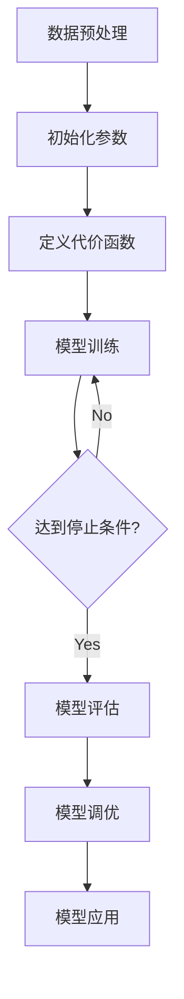

# Logistic Regression 原理与代码实战案例讲解

## 1. 背景介绍

### 1.1 什么是 Logistic Regression
Logistic Regression(逻辑回归)是一种常用的分类算法,属于有监督学习。它通过对数几率函数将样本的特征映射到一个0~1之间的概率值,以此来预测样本的类别。Logistic Regression 广泛应用于二分类问题,如垃圾邮件识别、金融风控、医疗诊断等领域。

### 1.2 Logistic Regression 的优缺点

优点:
- 直接对分类可能性进行建模,无需事先假设数据分布
- 计算代价不高,速度很快,存储资源低
- 模型可解释性强,特征权重可看作不同特征对最后结果影响的权重
- 适合二分类问题,也可以通过一对多方法推广到多分类

缺点:
- 容易欠拟合,分类精度不太高 
- 对非线性特征和特征组合建模能力较弱
- 不能很好处理大量多类特征或变量
- 对缺失数据敏感

### 1.3 Logistic Regression 与其他分类算法的比较

- 与决策树相比,Logistic 回归模型更简洁,预测效率更高,但不能很好处理非线性关系
- 与 SVM 相比,Logistic 回归模型可解释性更强,训练更快,但分类性能不如 SVM
- 与朴素贝叶斯相比,Logistic 回归不需要条件独立性假设,但朴素贝叶斯实现更简单
- 与神经网络相比,Logistic 回归模型可解释性更强,训练更快,但神经网络可以构建更复杂的非线性关系

## 2. 核心概念与联系

### 2.1 Sigmoid 函数
Sigmoid 函数是 Logistic 回归的核心,它将实数域映射到(0,1)区间,可以用来做二分类。其数学形式为:

$$g(z)=\frac{1}{1+e^{-z}}$$

其中 $z=w^Tx+b$,是特征向量 $x$ 的线性组合。

### 2.2 决策边界
决策边界是用来划分不同类别样本的超平面。对于 Logistic 回归,决策边界由 $w^Tx+b=0$ 定义。当 $w^Tx+b>0$ 时,模型倾向于预测正类,反之则预测负类。决策边界的形状由特征的线性组合决定。

### 2.3 代价函数
Logistic 回归通过最小化代价函数来寻找最优模型参数。常用的代价函数是对数似然函数的相反数:

$$J(w,b)=-\frac{1}{m}\sum_{i=1}^m[y^{(i)}log(h_w(x^{(i)}))+(1-y^{(i)})log(1-h_w(x^{(i)}))]$$

其中 $h_w(x)=g(w^Tx+b)$ 是模型的预测函数。

### 2.4 梯度下降
梯度下降是求解 Logistic 回归代价函数最小值的常用优化算法。它通过不断迭代,沿梯度的反方向更新参数,直到收敛。参数更新公式为:

$$w:=w-\alpha\frac{\partial{J(w,b)}}{\partial{w}}$$

$$b:=b-\alpha\frac{\partial{J(w,b)}}{\partial{b}}$$

其中 $\alpha$ 是学习率。

### 2.5 正则化
正则化是一种降低模型过拟合风险的常用方法。通过在代价函数中引入参数的惩罚项,可以控制模型的复杂度。L2正则化在代价函数中加入参数平方和,L1正则化加入参数绝对值之和。加入正则化后,代价函数变为:

$$J(w,b)=-\frac{1}{m}\sum_{i=1}^m[y^{(i)}log(h_w(x^{(i)}))+(1-y^{(i)})log(1-h_w(x^{(i)}))]+\frac{\lambda}{2m}\sum_{j=1}^nw_j^2$$

其中 $\lambda$ 是正则化系数。

## 3. 核心算法原理具体操作步骤

Logistic 回归算法的主要步骤如下:

1. 数据预处理
   - 特征缩放
   - 添加偏置项
   - 划分训练集和测试集

2. 初始化模型参数
   - 随机初始化参数 $w$ 和 $b$ 为 0 或很小的随机值

3. 定义代价函数
   - 根据任务选择合适的代价函数形式,如对数似然函数
   - 加入正则化项(可选)

4. 模型训练
   - 前向传播:根据当前参数和输入计算预测输出
   - 反向传播:计算代价函数关于参数的梯度
   - 参数更新:根据梯度下降公式更新参数
   - 重复上述步骤直到满足停止条件(如达到最大迭代次数、代价函数变化很小等)

5. 模型评估
   - 在测试集上评估模型性能,计算准确率、精确率、召回率、F1 等指标
   - 进行交叉验证以更准确评估模型泛化能力

6. 模型调优
   - 尝试不同的特征组合、正则化方法、代价函数、优化算法等
   - 通过网格搜索等方法寻找最优超参数

7. 模型应用
   - 使用训练好的模型对新样本进行预测
   - 将模型部署到生产环境

下图是 Logistic 回归算法的流程图:



## 4. 数学模型和公式详细讲解举例说明

### 4.1 Sigmoid 函数推导
Logistic 回归之所以选择 Sigmoid 函数作为预测函数,是因为它可以将连续值映射到 0~1 之间,符合概率的取值范围。下面我们来推导 Sigmoid 函数的表达式。

假设一个事件发生的几率(odds)为 $\frac{p}{1-p}$,取对数后得到 log odds 或 logit 函数:

$$logit(p)=log\frac{p}{1-p}$$

我们希望 logit 是特征 $x$ 的线性函数,即:

$$logit(p)=w^Tx+b$$

两边取指数,得到:

$$\frac{p}{1-p}=e^{w^Tx+b}$$

移项,得到:

$$p=\frac{e^{w^Tx+b}}{1+e^{w^Tx+b}}=\frac{1}{1+e^{-(w^Tx+b)}}$$

这就是 Sigmoid 函数的表达式。可以看到,当 $z=w^Tx+b$ 是一个很大的正数时,$g(z)$ 趋近于 1;当 $z$ 是一个很大的负数时,$g(z)$ 趋近于 0。这恰好符合我们对二分类问题的预测函数的要求。

### 4.2 代价函数推导
假设我们有 $m$ 个训练样本 $\{(x^{(1)},y^{(1)}),(x^{(2)},y^{(2)}),...,(x^{(m)},y^{(m)})\}$,其中 $x^{(i)}$ 是第 $i$ 个样本的特征向量,$y^{(i)} \in \{0,1\}$ 是对应的二元标签。我们的目标是最大化似然函数:

$$L(w,b)=\prod_{i=1}^m(h_w(x^{(i)}))^{y^{(i)}}(1-h_w(x^{(i)}))^{1-y^{(i)}}$$

其中 $h_w(x)=g(w^Tx+b)$ 是模型的预测函数。对似然函数取对数,得到对数似然函数:

$$l(w,b)=logL(w,b)=\sum_{i=1}^m[y^{(i)}log(h_w(x^{(i)}))+(1-y^{(i)})log(1-h_w(x^{(i)}))]$$

我们希望最大化 $l(w,b)$,等价于最小化它的相反数,即代价函数:

$$J(w,b)=-\frac{1}{m}l(w,b)=-\frac{1}{m}\sum_{i=1}^m[y^{(i)}log(h_w(x^{(i)}))+(1-y^{(i)})log(1-h_w(x^{(i)}))]$$

这就是 Logistic 回归常用的代价函数表达式。

### 4.3 梯度计算
为了使用梯度下降优化算法,我们需要计算代价函数 $J(w,b)$ 关于参数 $w,b$ 的梯度。根据定义,梯度是代价函数对参数的偏导数。对于参数 $w_j$,其梯度为:

$$\frac{\partial{J(w,b)}}{\partial{w_j}}=-\frac{1}{m}\sum_{i=1}^m(y^{(i)}-h_w(x^{(i)}))x_j^{(i)}$$

对于参数 $b$,其梯度为:

$$\frac{\partial{J(w,b)}}{\partial{b}}=-\frac{1}{m}\sum_{i=1}^m(y^{(i)}-h_w(x^{(i)}))$$

有了梯度表达式,我们就可以使用梯度下降算法不断迭代更新参数,直到代价函数收敛到最小值。

## 5. 项目实践：代码实例和详细解释说明

下面我们用 Python 实现一个简单的 Logistic 回归模型,并在鸢尾花数据集上进行训练和测试。

```python
import numpy as np
from sklearn import datasets
from sklearn.model_selection import train_test_split

# sigmoid函数
def sigmoid(z):
    return 1 / (1 + np.exp(-z))

# 模型训练
def train(X, y, learning_rate=0.01, num_iterations=10000):
    m, n = X.shape
    w = np.zeros((n, 1))
    b = 0

    for i in range(num_iterations):
        # 前向传播
        A = sigmoid(np.dot(X, w) + b)

        # 计算代价函数
        cost = -1/m * np.sum(y*np.log(A) + (1-y)*np.log(1-A))

        # 反向传播
        dw = 1/m * np.dot(X.T, A-y)
        db = 1/m * np.sum(A-y)

        # 更新参数
        w -= learning_rate * dw
        b -= learning_rate * db

        if i % 1000 == 0:
            print(f'Iteration {i}, cost = {cost}')

    return w, b

# 模型预测
def predict(X, w, b):
    A = sigmoid(np.dot(X, w) + b)
    return np.where(A > 0.5, 1, 0)

# 加载数据集
iris = datasets.load_iris()
X = iris.data[:, :2]  # 为了便于可视化,只取前两个特征
y = (iris.target != 0) * 1  # 转化为二分类问题

# 数据集划分
X_train, X_test, y_train, y_test = train_test_split(X, y, test_size=0.2, random_state=42)

# 训练模型
w, b = train(X_train, y_train)

# 测试模型
y_pred = predict(X_test, w, b)
accuracy = np.mean(y_pred == y_test)
print(f'Test accuracy: {accuracy}')
```

代码说明:
1. 首先定义了 sigmoid 函数,作为 Logistic 回归的预测函数。
2. train 函数实现了模型的训练过程,包括前向传播、代价函数计算、反向传播和参数更新。其中学习率和迭代次数可以通过参数调节。
3. predict 函数根据训练好的参数对新样本进行预测。
4. 主函数部分加载了鸢尾花数据集,并将其转化为二分类问题。为了便于可视化,只取了前两个特征。
5. 使用 train_test_split 函数划分了训练集和测试集。
6. 调用 train 函数在训练集上训练模型,然后用 predict 函数在测试集上评估模型性能。

运行该代码,可以看到模型在训练过程中代价函数不断减小,最终在测试集上达到了较高的分类准确率。

## 6. 实际应用场景

Logistic 回归在很多领域都有广泛应用,下面列举几个典型场景:

1. 垃圾邮件识别
   - 特征:邮件中的单词