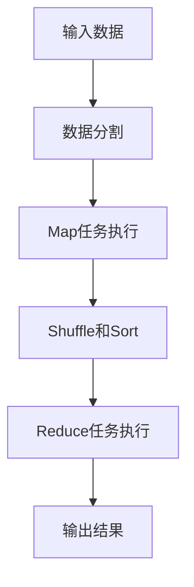

# MapReduce原理与代码实例讲解

## 1.背景介绍

在大数据时代，数据量的爆炸式增长对数据处理技术提出了巨大的挑战。传统的单机数据处理方式已经无法满足海量数据的处理需求。为了解决这一问题，Google在2004年提出了MapReduce编程模型，这一模型通过分布式计算的方式，极大地提高了数据处理的效率和可扩展性。MapReduce的核心思想是将复杂的数据处理任务分解为简单的Map和Reduce操作，通过分布式系统并行执行，从而实现高效的数据处理。

## 2.核心概念与联系

### 2.1 Map操作

Map操作的主要任务是将输入数据分割成若干个小块，并对每个小块进行处理。具体来说，Map操作会将输入的键值对（key-value pair）映射为一组中间键值对。Map函数的输入是一个键值对，输出是一组键值对。

### 2.2 Reduce操作

Reduce操作的主要任务是对Map操作生成的中间键值对进行汇总和处理。具体来说，Reduce操作会将具有相同键的中间键值对进行合并，并生成最终的输出结果。Reduce函数的输入是一组具有相同键的中间键值对，输出是一个键值对。

### 2.3 Map和Reduce的联系

Map和Reduce操作是相互独立的，但它们之间通过中间键值对进行联系。Map操作生成的中间键值对会被分发到不同的Reduce任务中进行处理。通过这种方式，MapReduce实现了数据处理任务的并行化和分布式执行。

## 3.核心算法原理具体操作步骤

### 3.1 数据分割

首先，将输入数据分割成若干个小块，每个小块称为一个split。每个split会被分配给一个Map任务进行处理。

### 3.2 Map任务执行

每个Map任务会读取一个split的数据，并对其进行处理。Map任务的输出是一组中间键值对。

### 3.3 Shuffle和Sort

Map任务生成的中间键值对会被分发到不同的Reduce任务中。在分发过程中，中间键值对会根据键进行排序和分组。这个过程称为Shuffle和Sort。

### 3.4 Reduce任务执行

每个Reduce任务会处理一组具有相同键的中间键值对。Reduce任务的输出是最终的结果。

### 3.5 输出结果

Reduce任务生成的最终结果会被写入到输出文件中。

以下是MapReduce流程的Mermaid图示：



## 4.数学模型和公式详细讲解举例说明

### 4.1 数学模型

MapReduce的数学模型可以用以下公式表示：

$$
\text{Map}: (k1, v1) \rightarrow [(k2, v2)]
$$

$$
\text{Reduce}: (k2, [v2]) \rightarrow [(k3, v3)]
$$

其中，$(k1, v1)$ 是输入的键值对，$[(k2, v2)]$ 是Map操作生成的中间键值对，$(k2, [v2])$ 是Reduce操作的输入，$[(k3, v3)]$ 是Reduce操作的输出。

### 4.2 举例说明

假设我们有一个文本文件，内容如下：

```
hello world
hello mapreduce
```

我们的目标是统计每个单词出现的次数。我们可以定义以下Map和Reduce函数：

#### Map函数

```python
def map_function(key, value):
    words = value.split()
    for word in words:
        emit(word, 1)
```

#### Reduce函数

```python
def reduce_function(key, values):
    count = sum(values)
    emit(key, count)
```

### 4.3 具体操作步骤

1. **数据分割**：将输入文件分割成若干个split，每个split包含若干行文本。
2. **Map任务执行**：对每个split执行Map函数，生成中间键值对。例如，第一行文本生成的中间键值对为`[(hello, 1), (world, 1)]`。
3. **Shuffle和Sort**：将具有相同键的中间键值对分组。例如，`[(hello, 1), (hello, 1)]`。
4. **Reduce任务执行**：对每组中间键值对执行Reduce函数，生成最终结果。例如，`(hello, [1, 1])`生成的最终结果为`(hello, 2)`。
5. **输出结果**：将最终结果写入输出文件。

## 5.项目实践：代码实例和详细解释说明

### 5.1 环境准备

在进行MapReduce项目实践之前，我们需要准备好开发环境。我们可以使用Hadoop框架来实现MapReduce任务。以下是环境准备的步骤：

1. 下载并安装Hadoop。
2. 配置Hadoop环境变量。
3. 启动Hadoop集群。

### 5.2 代码实例

以下是