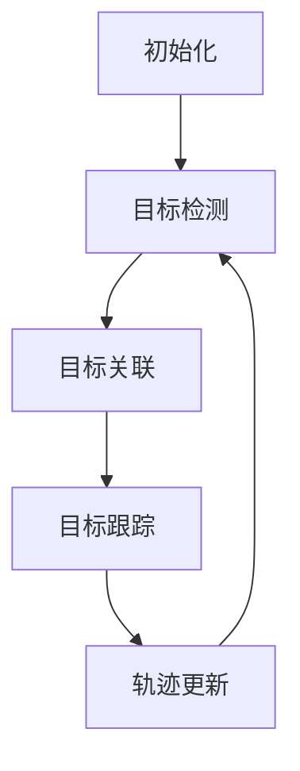

# Object Tracking 原理与代码实战案例讲解

## 1.背景介绍

### 1.1 什么是 Object Tracking?

Object Tracking(目标跟踪)是计算机视觉和图像处理领域的一个核心问题,旨在实时检测和跟踪运动目标在视频序列中的位置。它广泛应用于安防监控、交通管理、人机交互、增强现实等多个领域。随着深度学习技术的发展,基于深度神经网络的目标跟踪算法取得了长足的进步,展现出了强大的鲁棒性和精确度。

### 1.2 Object Tracking 的挑战

尽管目标跟踪技术已经取得了长足进展,但仍然面临诸多挑战:

- 遮挡问题:目标被其他物体遮挡时,很容易导致跟踪失败。
- 形变问题:目标形状和尺寸发生显著变化时,跟踪难度加大。 
- 运动模糊:快速运动目标会产生运动模糊,影响跟踪精度。
- 背景干扰:复杂多变的背景环境会干扰目标检测和跟踪。

### 1.3 Object Tracking 研究意义

Object Tracking 技术的持续发展对于提高视频分析能力、优化人工智能系统具有重要意义。准确高效的目标跟踪是实现智能视频分析、行为识别等高级任务的基础。因此,不断改进目标跟踪算法的鲁棒性和实时性,对于推动人工智能技术在实际场景中的落地应用至关重要。

## 2.核心概念与联系  

### 2.1 目标表示

目标表示是目标跟踪算法的基础,常用的目标表示方式有:

- 边界框(Bounding Box):使用矩形框circumscribed目标区域。
- 形状匹配(Shape Matching):使用参数模型拟合目标轮廓。
- 核相关滤波(Kernel Correlation Filter):将目标表示为高维特征。

### 2.2 运动模型

运动模型用于预测目标在下一帧可能出现的位置,从而缩小搜索范围,提高跟踪效率。常用的运动模型有:

- 恒速模型(Constant Velocity Model)
- 平滑运动模型(Smooth Motion Model) 
- 非刚性运动模型(Non-rigid Motion Model)

### 2.3 观测模型 

观测模型根据目标的外观特征在图像中搜索目标,常用的观测模型有:

- 模板匹配(Template Matching)
- 核相关滤波(Kernel Correlation Filter)
- 深度神经网络特征(Deep Features)

### 2.4 Tracking-by-Detection 范式

Tracking-by-Detection是目标跟踪领域的主流范式,其基本思路是:

1. 检测算法定位目标
2. 将检测结果关联为轨迹
3. 根据运动模型预测目标位置
4. 在预测区域内搜索目标

该范式将目标检测和目标跟踪有机结合,显著提高了跟踪性能。

## 3.核心算法原理具体操作步骤

目标跟踪算法通常分为四个核心步骤:



### 3.1 初始化

在第一帧,需要手动或自动初始化目标的位置和大小,为后续跟踪做好准备。

### 3.2 目标检测

目标检测算法(如Faster R-CNN、YOLO等)在每一帧图像中检测所有感兴趣的目标,为后续关联和跟踪提供候选框。

### 3.3 目标关联

目标关联算法(如Hungarian算法、SORT等)将当前帧的检测结果与上一帧的跟踪结果进行匹配,建立目标ID与检测框之间的对应关系。

### 3.4 目标跟踪

对于每个已关联的目标,跟踪算法根据目标的运动模型预测目标在下一帧可能出现的位置和大小,并在该区域内搜索目标,获得精确的目标位置。常用的跟踪算法有相关滤波(Correlation Filter)、Mean-Shift、CAMSHIFT等。

### 3.5 轨迹更新

将本帧获得的目标位置与ID记录到轨迹中,为下一帧的预测和搜索做好准备。

该循环不断重复,直至视频结束或目标跟丢。

## 4.数学模型和公式详细讲解举例说明

### 4.1 核相关滤波(Kernel Correlation Filter)

核相关滤波是目标跟踪领域的一种经典方法,其基本思路是:

1. 在第一帧中提供目标模板 $f$
2. 学习一个核相关滤波器 $\omega$,使其在目标区域的响应值最大
3. 在后续帧中,在滑动窗口内对 $\omega$ 进行卷积,找到响应最大的位置作为目标位置

为了提高鲁棒性,该方法通常在傅里叶域进行求解,公式如下:

$$\hat{\omega} = \frac{\hat{f}}{\hat{g} \circledast \hat{g} + \lambda}$$

其中:

- $\hat{f}$ 为目标模板的傅里叶变换
- $\hat{g}$ 为高斯核的傅里叶变换,用于加权
- $\lambda$ 为正则化系数,避免过拟合
- $\circledast$ 为循环卷积

通过该公式求解得到 $\hat{\omega}$ 后,在搜索区域对其进行反卷积,找到响应最大的位置即为目标所在位置。

### 4.2 Mean-Shift 算法

Mean-Shift是一种经典的目标跟踪算法,其基于目标与其周围区域的颜色直方图相似性进行跟踪。算法步骤如下:

1. 计算目标模型的颜色直方图 $q$
2. 对于当前帧的一个候选窗口,计算其颜色直方图 $p$
3. 计算 $q$ 与 $p$ 的相似度,通常使用 Bhattacharyya 系数:

$$\rho[p,q] = \sum\limits_{u=1}^{m}\sqrt{p_u(y)q_u} $$

4. 计算均值漂移向量:

$$M_h(y) = \frac{\sum_{x_i \in S_h(y)}x_i g\left(\left\|\frac{x_i-y}{h}\right\|\right)}{\sum_{x_i \in S_h(y)}g\left(\left\|\frac{x_i-y}{h}\right\|\right)} - y$$

5. 将窗口中心移动到新位置 $y_1 = y_0 + M_h(y_0)$
6. 重复步骤3-5,直至收敛

收敛位置即为目标所在位置。

## 5.项目实践:代码实例和详细解释说明

以下是一个使用 OpenCV 和 DLIB 库实现简单相关滤波目标跟踪的 Python 代码示例:

```python
import cv2
import dlib

# 初始化相关滤波器
tracker = dlib.correlation_tracker()

# 读取视频
cap = cv2.VideoCapture('test.mp4')
ret, frame = cap.read()

# 手动选择目标区域
bbox = cv2.selectROI(frame)

# 初始化目标区域
tracker.start_track(frame, dlib.rectangle(bbox[0], bbox[1], bbox[0]+bbox[2], bbox[1]+bbox[3]))

while True:
    # 读取一帧
    ret, frame = cap.read()
    if not ret:
        break
    
    # 更新目标位置
    tracker.update(frame)
    pos = tracker.get_position()

    # 绘制目标框
    x = int(pos.left())
    y = int(pos.top())
    w = int(pos.width())
    h = int(pos.height())
    cv2.rectangle(frame, (x,y), (x+w,y+h), (0,0,255), 2)

    cv2.imshow('Tracking', frame)
    if cv2.waitKey(1) == 27:
        break

cap.release()
cv2.destroyAllWindows()
```

代码解释:

1. 导入 OpenCV 和 DLIB 库。
2. 创建 DLIB 相关滤波器跟踪器对象。
3. 打开视频文件,读取第一帧。
4. 使用 `cv2.selectROI` 手动选择目标区域。
5. 使用选择的区域初始化跟踪器。
6. 进入循环,持续读取视频帧:
    - 调用 `tracker.update(frame)` 更新目标位置
    - 获取目标位置矩形框
    - 在图像上绘制矩形框
    - 显示处理后的图像
7. 按下 Esc 键退出循环。
8. 释放资源,关闭窗口。

该示例使用 DLIB 中的相关滤波器进行简单的目标跟踪。实际应用中,通常需要结合检测算法、数据关联等模块,构建完整的多目标跟踪系统。

## 6.实际应用场景

目标跟踪技术在以下场景中有着广泛的应用:

### 6.1 视频监控

在安防监控系统中,目标跟踪可用于自动检测、跟踪和识别可疑目标,提高监控效率。

### 6.2 交通管理

通过跟踪车辆和行人,可以自动分析交通流量、检测违章行为、优化交通信号等。

### 6.3 人机交互

在人机交互系统中,目标跟踪可用于捕捉用户手势、面部表情等,实现自然的交互方式。

### 6.4 增强现实(AR)

AR 应用需要实时跟踪场景中的目标,并叠加虚拟信息,目标跟踪是关键技术之一。

### 6.5 无人驾驶

无人驾驶汽车需要精准检测和跟踪路面上的车辆、行人、障碍物等,以确保行驶安全。

### 6.6 运动分析

在体育赛事分析中,可以跟踪运动员和球员的运动轨迹,分析动作技术和策略。

## 7.工具和资源推荐

以下是一些流行的目标跟踪算法库和资源:

- **OpenCV**: 开源计算机视觉库,提供多种经典和现代跟踪算法。
- **Dlib**: C++跨平台开源库,实现了相关滤波和Mean-Shift等经典算法。
- **PyTorch**: 提供目标跟踪模块,可方便集成深度神经网络模型。
- **TensorFlow Object Detection API**: 支持多种目标检测和跟踪模型。
- **MMTracking**: 开源的视频目标感知工具箱,支持多种SOTA算法。
- **VOT Challenge**: 每年的目标跟踪算法挑战赛,提供标准数据集和评测平台。
- **MVG Tracker Benchmark**: 目标跟踪算法评测网站,持续更新数据集和算法排行。

## 8.总结:未来发展趋势与挑战

### 8.1 未来发展趋势

- **深度学习方法占主导地位**: 基于深度神经网络的目标跟踪算法将日益普及,精度和鲁棒性不断提高。
- **多目标跟踪受到重视**: 同时跟踪多个目标的能力将成为关键需求,算法需要处理目标遮挡、出现消失等复杂情况。
- **注意力机制和图神经网络**: 这些新兴技术有望进一步提升目标跟踪的性能。
- **端到端学习模型**: 整合目标检测、关联和跟踪为一个统一的端到端模型,简化系统流程。
- **无监督和自监督学习**: 减少对大量标注数据的依赖,提高泛化能力。
- **目标跟踪与其他任务融合**: 将目标跟踪与行为分析、轨迹预测等任务结合,实现更智能的视觉系统。

### 8.2 面临的主要挑战

- **实时性**: 在保证精度的前提下,进一步提高算法的运行速度,满足实时应用需求。
- **长时间遮挡**: 当目标长时间被遮挡后,如何精确重新获取目标位置是一大挑战。
- **目标形变**: 目标形状和尺度发生显著变化时,跟踪难度加大。
- **相似目标干扰**: 在目标密集区域,相似外观的目标会干扰跟踪。
- **复杂环境适应性**: 算法需要具备更强的适应性,在复杂动态环境中保持鲁棒