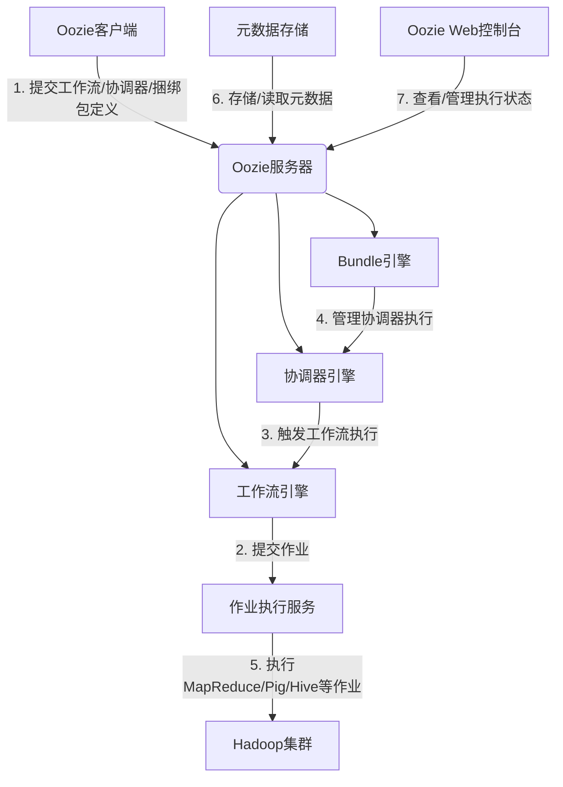

# Oozie原理与代码实例讲解

## 1. 背景介绍

在大数据时代,数据处理作业的调度和协调管理成为了一个巨大的挑战。Apache Oozie就是为了解决这一问题而诞生的工作流调度系统。它可以有效地管理大数据处理过程中的各种作业,包括MapReduce作业、Pig作业、Hive作业和Shell脚本等,实现了复杂数据处理流程的自动化调度和监控。

Oozie最初是雅虎公司的一个内部项目,后来捐献给Apache软件基金会,成为Apache顶级项目。它广泛应用于Hadoop生态系统中,为大数据应用程序的工作流编排和管理提供了强大的支持。

### 1.1 Oozie的主要特性

- **工作流调度**:Oozie允许开发人员创建复杂的数据处理流程,将多个作业按照特定的顺序和依赖关系进行组织和执行。
- **作业协调**:Oozie可以协调和管理大量的作业,确保它们按照预定的时间和依赖关系运行。
- **作业监控**:Oozie提供了全面的监控功能,可以跟踪作业的执行状态、进度和日志信息。
- **容错和重试**:Oozie具有容错和重试机制,可以在作业失败时自动重新执行,提高了系统的可靠性。
- **安全性**:Oozie支持基于Kerberos的安全认证,确保数据处理过程的安全性。
- **可扩展性**:Oozie可以轻松地扩展以支持新的作业类型和执行引擎。

### 1.2 Oozie的应用场景

Oozie广泛应用于以下场景:

- **ETL (提取、转换、加载)流程**:在数据仓库和数据集市中,Oozie可以协调复杂的ETL流程,确保数据的及时准确地从各种来源提取、转换和加载到目标系统中。
- **数据处理管道**:Oozie可以管理大数据处理管道,包括数据采集、清洗、转换和分析等多个步骤。
- **机器学习和人工智能**:在机器学习和人工智能领域,Oozie可以协调数据准备、模型训练、评估和部署等步骤。
- **报告和分析**:Oozie可以自动化定期报告和分析任务,确保及时生成所需的报告和分析结果。

## 2. 核心概念与联系

在深入探讨Oozie的原理和实现之前,我们需要了解一些核心概念。

### 2.1 工作流(Workflow)

工作流是Oozie中最基本的概念。它定义了一系列需要按特定顺序执行的作业。工作流由多个动作(Action)组成,这些动作可以是MapReduce作业、Pig作业、Hive作业、Shell脚本等。工作流中的动作可以设置执行顺序和依赖关系,以确保整个流程按预期进行。

工作流由一个XML文件来定义,该文件描述了工作流的结构、动作类型、配置参数等信息。

### 2.2 协调器(Coordinator)

协调器用于定义和管理基于时间和数据可用性触发的工作流。它可以安排工作流在特定时间或数据可用时执行。协调器由一个XML文件定义,包括启动、结束时间、执行频率、输入数据集等信息。

协调器非常适合于需要定期执行的任务,如每日报告、每周数据处理等。它可以自动触发工作流的执行,无需人工干预。

### 2.3 捆绑包(Bundle)

捆绑包是一组协调器的集合。它允许将多个相关的协调器组合在一起,作为一个逻辑单元进行管理和执行。捆绑包由一个XML文件定义,描述了包含的协调器及其配置信息。

捆绑包通常用于管理复杂的数据处理流程,其中涉及多个协调器和工作流的组合。

### 2.4 Oozie核心架构

Oozie的核心架构由以下几个主要组件组成:

1. **Oozie工作流引擎**: 负责解析和执行工作流定义。
2. **Oozie协调器引擎**: 负责解析和执行协调器定义,触发工作流的执行。
3. **Oozie Bundle引擎**: 负责解析和执行捆绑包定义,管理协调器的执行。
4. **Oozie作业执行服务**: 负责提交和监控各种类型的作业(如MapReduce、Pig、Hive等)的执行。
5. **Oozie元数据存储**: 存储工作流、协调器、捆绑包等元数据信息。
6. **Oozie Web控制台**: 提供Web界面,用于查看和管理工作流、协调器和捆绑包的执行状态。

这些组件协同工作,实现了Oozie的核心功能。

上图展示了Oozie的核心架构和组件之间的交互关系。客户端向Oozie服务器提交工作流、协调器或捆绑包定义(1)。工作流引擎负责解析和执行工作流定义,并通过作业执行服务提交实际的作业(2)。协调器引擎根据时间和数据条件触发工作流的执行(3)。Bundle引擎管理协调器的执行(4)。作业执行服务在Hadoop集群上执行MapReduce、Pig、Hive等作业(5)。元数据存储用于存储和读取工作流、协调器和捆绑包的元数据信息(6)。Oozie Web控制台提供了Web界面,用于查看和管理执行状态(7)。

## 3. 核心算法原理具体操作步骤

### 3.1 工作流执行原理

工作流的执行由Oozie工作流引擎负责。工作流引擎根据工作流定义XML文件中的信息,解析和执行工作流中的各个动作。下面是工作流执行的主要步骤:

1. **解析工作流定义**: 工作流引擎首先解析工作流定义XML文件,获取工作流的结构、动作类型、配置参数等信息。

2. **创建工作流实例**: 根据解析的信息,工作流引擎创建一个工作流实例,用于跟踪和管理工作流的执行状态。

3. **执行动作**: 工作流引擎按照定义的顺序和依赖关系执行工作流中的各个动作。对于每个动作,工作流引擎会根据动作类型(如MapReduce、Pig、Hive等)将其提交给相应的作业执行服务进行执行。

4. **监控动作执行**: 工作流引擎持续监控每个动作的执行状态,包括运行中、成功、失败等。如果某个动作失败,工作流引擎会根据配置决定是否重试或终止整个工作流。

5. **处理依赖关系**: 工作流引擎根据动作之间的依赖关系决定下一步执行哪个动作。只有当前一个动作成功执行后,才能执行下一个依赖于它的动作。

6. **更新工作流状态**: 工作流引擎持续更新工作流实例的状态,包括已执行的动作、当前正在执行的动作、失败的动作等信息。

7. **工作流完成**: 当所有动作都成功执行完毕,并且没有其他依赖关系需要处理时,工作流引擎将工作流实例标记为成功完成。

工作流引擎的执行过程是基于有向无环图(DAG)的原理,其中每个节点代表一个动作,边表示动作之间的依赖关系。工作流引擎遍历这个DAG图,按照依赖关系执行每个动作。

### 3.2 协调器执行原理

协调器的执行由Oozie协调器引擎负责。协调器引擎根据协调器定义XML文件中的信息,触发工作流的执行,并管理工作流实例的生命周期。下面是协调器执行的主要步骤:

1. **解析协调器定义**: 协调器引擎首先解析协调器定义XML文件,获取协调器的配置信息,如启动时间、结束时间、执行频率、输入数据集等。

2. **创建协调器作业**: 根据解析的信息,协调器引擎创建一个协调器作业,用于管理和跟踪协调器的执行状态。

3. **检查执行条件**: 协调器引擎根据配置的启动时间、结束时间和输入数据集的可用性,检查是否满足工作流执行的条件。

4. **触发工作流执行**: 如果满足执行条件,协调器引擎会向工作流引擎提交一个工作流实例,并传递必要的配置参数。

5. **监控工作流执行**: 协调器引擎持续监控工作流实例的执行状态,包括运行中、成功、失败等。

6. **处理执行频率**: 根据配置的执行频率,协调器引擎决定何时再次检查执行条件并触发下一次工作流执行。

7. **更新协调器状态**: 协调器引擎持续更新协调器作业的状态,包括已执行的工作流实例、当前正在执行的工作流实例、失败的工作流实例等信息。

8. **协调器完成**: 当到达配置的结束时间,或者所有工作流实例都成功执行完毕时,协调器引擎将协调器作业标记为成功完成。

协调器引擎的执行过程是基于时间和数据条件的触发机制。它持续检查执行条件,并在满足条件时触发工作流的执行。协调器引擎还负责管理工作流实例的生命周期,确保它们按照预期的频率和条件执行。

### 3.3 捆绑包执行原理

捆绑包的执行由Oozie Bundle引擎负责。Bundle引擎管理捆绑包中包含的多个协调器,并协调它们的执行。下面是捆绑包执行的主要步骤:

1. **解析捆绑包定义**: Bundle引擎首先解析捆绑包定义XML文件,获取捆绑包中包含的协调器及其配置信息。

2. **创建捆绑包作业**: 根据解析的信息,Bundle引擎创建一个捆绑包作业,用于管理和跟踪捆绑包的执行状态。

3. **创建协调器作业**: 对于捆绑包中的每个协调器,Bundle引擎会创建一个协调器作业,并将其添加到捆绑包作业中。

4. **监控协调器执行**: Bundle引擎持续监控捆绑包作业中所有协调器作业的执行状态。

5. **处理协调器依赖关系**: 如果协调器之间存在依赖关系,Bundle引擎会根据这些依赖关系决定何时启动每个协调器作业。

6. **更新捆绑包状态**: Bundle引擎持续更新捆绑包作业的状态,包括已执行的协调器作业、当前正在执行的协调器作业、失败的协调器作业等信息。

7. **捆绑包完成**: 当捆绑包作业中所有协调器作业都成功执行完毕时,Bundle引擎将捆绑包作业标记为成功完成。

Bundle引擎的执行过程是基于协调器之间的依赖关系和执行顺序。它管理捆绑包中包含的所有协调器作业,并根据它们之间的依赖关系决定执行顺序。Bundle引擎还负责监控和更新捆绑包作业的整体执行状态。

## 4. 数学模型和公式详细讲解举例说明

在Oozie的执行过程中,有一些关键的数学模型和公式用于描述和优化工作流、协调器和捆绑包的执行。

### 4.1 有向无环图(DAG)模型

工作流的执行可以用有向无环图(DAG)模型来表示。在