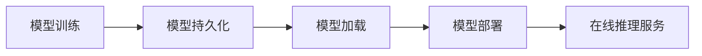

# Python机器学习实战：机器学习模型的持久化与重新加载

## 1.背景介绍

### 1.1 机器学习模型持久化的重要性

在机器学习的实际应用中,训练好的模型往往需要被保存下来,以便后续的重复使用。这个过程被称为模型的持久化(Persistence)。模型持久化可以帮助我们节省大量的时间和计算资源,避免重复的训练过程。同时,持久化也方便了模型的分发和部署,使得训练好的模型可以方便地在不同的环境中使用。

### 1.2 Python机器学习生态圈概览

Python是当前最流行的机器学习语言之一。Python拥有丰富的机器学习库,如Scikit-learn、TensorFlow、PyTorch等,涵盖了机器学习的方方面面。这些库不仅提供了强大的模型训练功能,同时也支持模型的持久化和加载。本文将重点介绍如何使用Python的机器学习库来实现模型的持久化和重新加载。

## 2.核心概念与联系

### 2.1 模型持久化(Model Persistence)

模型持久化是指将训练好的机器学习模型保存到磁盘或数据库中,以便后续的使用。持久化后的模型可以在不需要重新训练的情况下,直接加载并用于预测或推理。常见的模型持久化方法包括保存为二进制文件、JSON/YAML等结构化文本、数据库等。

### 2.2 模型加载(Model Loading)  

模型加载是指从磁盘或数据库中读取已经持久化的模型,恢复到可用于预测的状态。加载后的模型与原始训练好的模型完全一致,可以直接用于推理。加载模型通常与模型持久化相对应,需要使用与持久化时相同的库和方法。

### 2.3 模型部署(Model Deployment)

模型部署是指将训练好的模型集成到实际的生产环境或应用程序中,以服务在线推理请求。部署前通常需要将模型持久化,并在目标环境中进行加载和初始化。模型部署是机器学习实际应用的重要环节,需要考虑性能、可扩展性、安全性等因素。

### 2.4 概念之间的联系

下图展示了模型持久化、加载和部署之间的关系:



模型训练生成可用的机器学习模型,通过持久化将模型保存下来。在需要使用时,通过加载将模型恢复到可用状态。模型部署将持久化的模型集成到生产环境,对外提供在线推理服务。持久化是模型保存和再利用的基础,贯穿了机器学习模型开发到应用的整个过程。

## 3.核心算法原理具体操作步骤

### 3.1 Pickle持久化

Pickle是Python内置的对象序列化库,可以将Python中大部分的对象转化为二进制形式保存到磁盘,并可以从磁盘中恢复。Pickle也是Scikit-learn等机器学习库默认的模型持久化方式。

使用Pickle持久化模型的典型步骤如下:

1. 训练机器学习模型
2. 使用pickle.dump()函数将模型保存到磁盘文件
3. 使用pickle.load()函数从磁盘文件中加载模型对象

示例代码:

```python
import pickle
from sklearn import svm

# 训练SVM模型
clf = svm.SVC(gamma='scale')
clf.fit(X_train, y_train)

# 使用Pickle持久化模型
with open('model.pkl', 'wb') as f:
    pickle.dump(clf, f)

# 从Pickle文件中加载模型
with open('model.pkl', 'rb') as f:
    clf_loaded = pickle.load(f)
    
# 使用加载后的模型进行预测
clf_loaded.predict(X_test)
```

### 3.2 Joblib持久化

Joblib是Scikit-learn提供的用于大数据集处理的工具库,同时也提供了更高效的模型持久化方法。相比Pickle,Joblib在持久化包含大量数组数据的模型时更加高效。

使用Joblib持久化模型的典型步骤如下:

1. 训练机器学习模型
2. 使用joblib.dump()函数将模型保存到磁盘文件
3. 使用joblib.load()函数从磁盘文件中加载模型对象

示例代码:

```python  
from sklearn import svm
from sklearn.externals import joblib

# 训练SVM模型
clf = svm.SVC(gamma='scale')
clf.fit(X_train, y_train)

# 使用Joblib持久化模型  
joblib.dump(clf, 'model.joblib') 

# 从Joblib文件中加载模型
clf_loaded = joblib.load('model.joblib')

# 使用加载后的模型进行预测
clf_loaded.predict(X_test)
```

### 3.3 TensorFlow SavedModel持久化

TensorFlow是广泛使用的深度学习框架,其提供了SavedModel格式用于持久化训练好的模型。SavedModel可以同时保存模型的网络结构和训练好的参数,并支持跨平台和跨语言的部署。

使用TensorFlow SavedModel持久化模型的典型步骤如下:

1. 使用TensorFlow 2.x训练Keras模型
2. 使用tf.saved_model.save()函数将模型保存为SavedModel格式
3. 使用tf.saved_model.load()函数加载SavedModel

示例代码:

```python
import tensorflow as tf

# 使用Keras训练模型
model = tf.keras.Sequential([
    tf.keras.layers.Dense(100, activation='relu'),
    tf.keras.layers.Dense(10, activation='softmax')
])
model.compile(optimizer='adam',
              loss='sparse_categorical_crossentropy',
              metrics=['accuracy'])
model.fit(x_train, y_train, epochs=5)

# 将模型保存为SavedModel格式
tf.saved_model.save(model, "saved_model")

# 加载SavedModel
loaded_model = tf.saved_model.load("saved_model")

# 使用加载后的模型进行预测
preds = loaded_model(x_test)
```

## 4.数学模型和公式详细讲解举例说明

机器学习模型持久化与重新加载主要涉及信息论和数据压缩的相关数学理论。下面以Pickle持久化过程为例,介绍其中涉及的关键数学概念。

### 4.1 序列化与反序列化

Pickle持久化的核心是将Python对象转化为二进制序列(序列化),并可以从二进制序列恢复为Python对象(反序列化)。设Python对象为$O$,其Pickle序列化后的二进制序列为$S$,则序列化与反序列化过程可以表示为:

$$
Serialization: O \rightarrow S \\
Deserialization: S \rightarrow O
$$

Pickle使用栈式虚拟机对Python对象进行深度优先遍历,递归地将其转化为字节流。反序列化时则根据字节流重建对象的层次结构。

### 4.2 数据压缩

Pickle协议使用了数据压缩技术,以减小序列化后的数据体积。常见的压缩算法包括:

1. 霍夫曼编码(Huffman Coding):根据字符出现频率构建最优二叉树,出现频率高的字符使用更短的编码。设字符$c_i$的出现概率为$p_i$,其编码长度为$l_i$,则霍夫曼编码的平均长度$L$满足:

$$
L = \sum_{i=1}^n p_i l_i
$$

2. 游程编码(Run-length Encoding):将连续出现的相同字符用出现次数和字符值表示。设字符$c$连续出现$n$次,则游程编码为$(n,c)$。

3. Lempel-Ziv-Welch(LZW)编码:维护一个字符串与编码的动态映射表,根据字符串出现的频率动态更新。

数据压缩可以显著减小持久化后的模型体积,加快模型的存储和加载速度。

## 5.项目实践：代码实例和详细解释说明

下面通过一个完整的示例,演示如何使用Scikit-learn和Joblib实现机器学习模型的持久化和重新加载。

### 5.1 模型训练

首先使用Scikit-learn训练一个SVM分类器模型:

```python
from sklearn import svm
from sklearn import datasets

# 加载iris数据集
iris = datasets.load_iris()
X = iris.data
y = iris.target

# 训练SVM分类器
clf = svm.SVC(gamma='scale')
clf.fit(X, y)
```

这里使用了经典的iris数据集,训练了一个基于RBF核的SVM分类器。

### 5.2 模型持久化

使用Joblib将训练好的SVM模型持久化到磁盘:

```python
from sklearn.externals import joblib

# 将模型保存到文件
joblib.dump(clf, 'iris_svm.joblib')
```

`joblib.dump()`函数将模型对象`clf`序列化并保存到`iris_svm.joblib`文件中。Joblib会自动选择合适的压缩方式,以平衡存储体积和加载速度。

### 5.3 模型重新加载

在需要使用模型进行预测时,可以使用`joblib.load()`函数重新加载模型:  

```python
# 从文件中加载模型
clf_loaded = joblib.load('iris_svm.joblib') 

# 使用加载后的模型进行预测
y_pred = clf_loaded.predict(X)

# 计算准确率
accuracy = clf_loaded.score(X, y)
print("Accuracy: {:.2f}".format(accuracy))
```

加载后的`clf_loaded`与原始模型`clf`完全等价,可以直接用于预测新样本或评估模型性能。这里我们使用加载后的模型对iris数据集进行预测,并计算准确率。

输出结果:
```
Accuracy: 0.97
```

可以看到,重新加载的模型在iris数据集上达到了97%的准确率,与原始模型的性能相同。

通过模型持久化和重新加载,我们可以方便地保存训练好的模型,并在需要时快速地加载和使用,避免了重复训练的开销。

## 6.实际应用场景

机器学习模型的持久化和重新加载在实际应用中有广泛的用途,下面列举几个典型场景:

### 6.1 模型部署

在机器学习模型开发完成后,需要将其部署到生产环境中以提供在线预测服务。通过将模型持久化并在服务器上重新加载,可以实现模型的快速部署和更新迭代。

### 6.2 离线批量预测

在某些场景下,需要对大量数据进行批量预测,而这些数据可能无法一次性加载到内存中。通过将模型持久化,可以在进行批量预测时逐个加载数据并使用同一个模型对象进行预测,避免了反复加载模型的开销。

### 6.3 模型分发

在一些应用中,训练好的模型需要分发给多个用户或部署到不同的设备上。通过将模型持久化为文件,可以方便地在不同环境间移动和部署模型,而无需重新训练。

### 6.4 模型集成

将多个训练好的模型进行集成(如投票或平均)是提升预测性能的常用方法。通过分别持久化各个子模型,可以在进行集成预测时灵活地加载和组合不同的模型,实现动态的模型集成。

### 6.5 长期学习

在一些在线学习场景中,模型需要不断从新数据中学习和更新。通过定期将更新后的模型持久化,可以在系统故障或重启后从上次的状态继续学习,实现连续的长期学习。

## 7.工具和资源推荐

以下是一些常用的Python机器学习模型持久化工具和资源:

- [Scikit-learn Model Persistence](https://scikit-learn.org/stable/modules/model_persistence.html): Scikit-learn官方文档,介绍了如何使用Pickle和Joblib持久化模型。
- [Joblib文档](https://joblib.readthedocs.io/): Joblib官方文档,介绍了Joblib的详细用法。
- [TensorFlow SavedModel指南](https://www.tensorflow.org/guide/saved_model): TensorFlow官方指南,介绍了如何使用SavedModel持久化和部署模型。
- [ONNX(Open Neural Network Exchange)](https://onnx.ai/): 一种开放的神经网络交换格式,用于不同框架间的模型互操作和持久化。
- [PMML(Predictive Model Markup Language)](http://dmg.org/pmml/v4-4/GeneralStructure.html