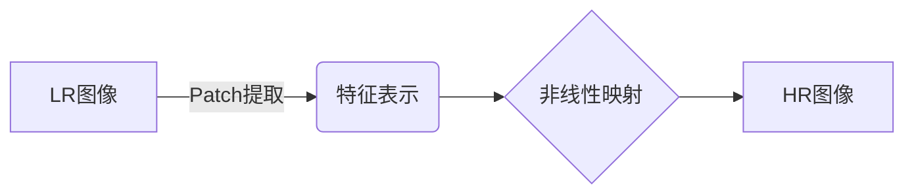
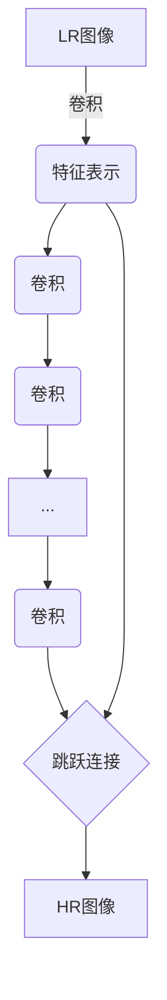
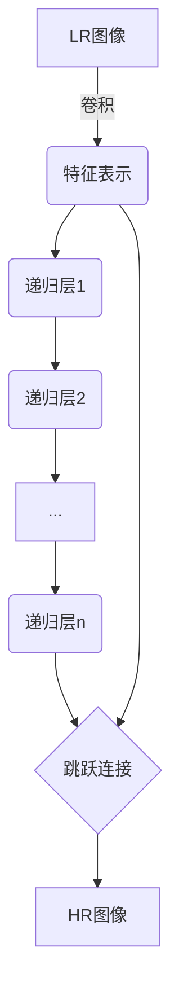

# Python深度学习实践：图像超分辨率重建

## 1.背景介绍

在现代社会中,图像处理技术在各个领域都有着广泛的应用,从医疗影像诊断到航空遥感探测,从安防监控到自动驾驶,图像分析无处不在。随着科技的不断进步,人们对图像质量的要求也在不断提高。高分辨率(High Resolution,HR)图像不仅可以提供更多的细节信息,也能为后续的图像处理任务提供更好的基础。

然而,由于成本、硬件限制等因素,获取高分辨率图像并非总是可行。这就催生了图像超分辨率(Super-Resolution,SR)重建技术的发展。图像超分辨率重建旨在从一个或多个低分辨率(Low Resolution,LR)图像中重构出高分辨率图像,弥补了硬件设备的不足,具有重要的理论意义和应用价值。

### 1.1 超分辨率重建的发展历程

图像超分辨率重建技术的发展大致可以分为三个阶段:

1. **传统方法阶段**:早期的超分辨率算法主要基于插值(Interpolation)、反向投影(Back-Projection)等经典方法,需要人工设计合适的先验约束和重建模型。这些方法计算效率较高,但重建效果有限。

2. **基于机器学习的方法阶段**:随着机器学习技术的兴起,研究人员开始尝试将其应用于超分辨率重建任务。这一阶段的代表性工作包括neighbour embedding方法、sparse coding方法等。这些方法相比传统方法有了一定的提升,但仍然存在一些缺陷,如难以充分利用大量训练数据、重建效果依赖于手工设计的特征等。

3. **基于深度学习的方法阶段**:近年来,深度学习技术在计算机视觉领域取得了巨大成功,也推动了超分辨率重建技术的飞速发展。深度卷积神经网络(DCNN)能够自动从大量数据中学习到有效的特征表示,极大地提高了图像重建质量。目前,基于深度学习的方法已经成为超分辨率重建的主流方向。

### 1.2 超分辨率重建的应用价值

高质量的图像不仅能为人类视觉体验提供更佳效果,也是众多计算机视觉任务的基础。通过超分辨率重建技术,我们可以从低分辨率图像中获取高分辨率图像,为下游任务提供更多有效信息,从而提高整体系统的性能。超分辨率重建技术在以下领域具有重要的应用价值:

- **医疗影像**:提高医疗影像的分辨率和质量,有助于医生更准确地诊断疾病。
- **安防监控**:对监控视频进行超分辨率重建,可以获取更清晰的图像细节,提高犯罪侦查的效率。
- **航空遥感**:对卫星遥感图像进行超分重建,可以获取更高分辨率的地理信息,为农业、环境监测等领域提供支持。
- **多媒体娱乐**:提升视频、图像的分辨率和质量,增强用户的观看体验。

综上所述,图像超分辨率重建技术不仅是计算机视觉领域的一个重要研究方向,也是推动相关应用领域发展的关键技术之一。

## 2.核心概念与联系

在深入探讨超分辨率重建的核心算法之前,我们有必要先了解一些基本概念和它们之间的联系。

### 2.1 低分辨率图像与高分辨率图像

在超分辨率重建任务中,我们将输入的图像称为**低分辨率(LR)图像**,期望重建的高质量图像称为**高分辨率(HR)图像**。一般来说,LR图像相对于HR图像而言,像素数量较少、细节信息较少、噪声较多。

我们用数学符号来表示LR图像和HR图像之间的关系:

$$
\mathbf{Y} = (\mathbf{X} \otimes \mathbf{k}) \downarrow_s + \mathbf{n}
$$

其中:

- $\mathbf{X}$ 表示待重建的高分辨率图像
- $\mathbf{Y}$ 表示观测到的低分辨率图像
- $\mathbf{k}$ 表示成像系统的点扩散函数(Point Spread Function,PSF)
- $\otimes$ 表示卷积操作
- $\downarrow_s$ 表示下采样(downsampling)操作,降低分辨率
- $\mathbf{n}$ 表示噪声项

上式描述了从高分辨率图像到低分辨率图像的成像过程。可以看出,成像系统的模糊(PSF卷积)、下采样以及噪声等因素,都会导致图像质量的下降。超分辨率重建的目标就是从degraded的LR图像$\mathbf{Y}$中恢复出高质量的HR图像$\mathbf{X}$。

### 2.2 上采样与卷积

在深度学习方法中,我们通常先将LR图像进行上采样(upsampling),获得一个初始的HR图像估计,然后再通过卷积神经网络进行非线性映射,重建出最终的HR图像。

**上采样**就是将图像的分辨率提高,增加像素数量的过程。常见的上采样方法有最近邻插值、双线性插值等。但是,简单的插值操作无法补充高频细节信息,因此需要后续的卷积操作来重建高频信息。

**卷积操作**是深度卷积神经网络的核心,它能够自动从大量数据中学习到有效的特征表示。在超分重建任务中,卷积层的作用是从上采样后的初始HR估计中恢复高频细节,重建出高质量的HR图像。

### 2.3 损失函数

为了评估重建结果,我们需要定义一个合适的损失函数(Loss Function)。常用的损失函数包括:

1. **均方误差(Mean Squared Error, MSE)**: $\mathcal{L}_{MSE}=\frac{1}{N}\sum_{i=1}^{N}\|\mathbf{X}_i-\hat{\mathbf{X}}_i\|_2^2$
2. **绝对误差(Mean Absolute Error, MAE)**: $\mathcal{L}_{MAE}=\frac{1}{N}\sum_{i=1}^{N}\|\mathbf{X}_i-\hat{\mathbf{X}}_i\|_1$

其中$\mathbf{X}_i$表示第$i$个样本的Ground Truth HR图像,$\hat{\mathbf{X}}_i$表示对应的重建结果,N是样本数量。

MSE损失函数对于像素值的差异较为敏感,而MAE损失函数则相对不那么敏感。在实践中,我们还可以结合感知质量评价指标(如PSNR、SSIM等)来定义复合损失函数,以期获得更好的视觉质量。

### 2.4 评价指标

评价超分重建算法的效果,通常使用以下几种指标:

1. **峰值信噪比(Peak Signal-to-Noise Ratio, PSNR)**: 衡量重建图像与Ground Truth之间的像素值差异。PSNR值越高,说明重建质量越好。
2. **结构相似性(Structural Similarity, SSIM)**: 从人眼视觉感受的角度,评估重建图像与Ground Truth之间的结构相似性。SSIM值越高,说明重建质量越好。
3. **视觉信息保真度(Visual Information Fidelity, VIF)**: 基于人眼视觉特性,评估重建图像与Ground Truth之间的视觉信息保真度。VIF值越高,说明重建质量越好。

除了上述全局评价指标外,我们还可以使用局部相似性指标(如LPIPS)来评估重建结果在局部区域的质量。

## 3.核心算法原理具体操作步骤

目前,基于深度学习的超分辨率重建算法取得了很好的效果,主要可以分为三类:

1. **先驱型网络结构**
2. **注意力机制增强型网络结构**  
3. **基于反馈机制的网络结构**

接下来,我们将分别介绍这三类算法的核心原理和具体操作步骤。

### 3.1 先驱型网络结构

先驱型网络结构主要包括SRCNN、VDSR、DRCN等模型。这些模型架构相对简单,但奠定了基于深度学习的超分重建算法的基础。

#### 3.1.1 SRCNN

SRCNN(Super-Resolution Convolutional Neural Network)是第一个将深度学习应用于超分辨率重建任务的模型。它的网络结构非常简洁,只包含三个卷积层:

1. **Patch提取和表示层(Patch Extraction and Representation)**:从输入的LR图像中提取大小为n×n的patch,并将其映射到一个高维的特征空间。
2. **非线性映射层(Non-linear Mapping)**:对提取到的特征进行一系列的卷积操作,以产生更加高层次的特征表示。
3. **重建层(Reconstruction)**:将高层次特征映射回目标HR图像的空间,得到最终的重建结果。

SRCNN的优点是结构简单、易于训练,为后续的工作奠定了基础。但由于网络深度有限,它的重建能力也受到一定限制。

#### 3.1.2 VDSR

VDSR(Very Deep Super-Resolution)模型在SRCNN的基础上,增加了网络的深度,使用20层卷积层和高层次的特征表示,从而提高了模型的重建能力。

VDSR的网络结构如下:

1. 一个卷积层,用于从输入的LR图像中提取特征
2. 18个卷积层,对特征进行非线性映射
3. 一个卷积层,将映射后的特征重构为HR图像
4. 跳跃连接,将LR特征与最后一层的输出相加,以恢复高频细节

VDSR的创新点在于通过加深网络,提高了模型的表达能力。同时,跳跃连接的引入也有助于恢复高频细节。

#### 3.1.3 DRCN

DRCN(Deeply Recursive Convolutional Network)模型则采用了递归的网络结构,将低层次的特征反复传递到高层,以增强特征的表达能力。

DRCN的网络结构包括:

1. 一个卷积层,用于从输入的LR图像中提取特征
2. 多个递归层,每个递归层包含多个卷积层,对特征进行非线性映射
3. 一个卷积层,将映射后的特征重构为HR图像
4. 跳跃连接,将LR特征与最后一层的输出相加

DRCN的核心思想是通过递归结构,使低层次特征能够在高层次特征的指导下不断优化和完善,从而提高模型的重建能力。

### 3.2 注意力机制增强型网络结构

尽管先驱型网络结构取得了不错的效果,但它们在捕捉长程依赖关系和利用全局上下文信息方面仍有不足。为了解决这一问题,研究人员引入了注意力机制,设计了一系列注意力增强型网络结构。

#### 3.2.1 RCAN

RCAN(Residual Channel Attention Network)模型在ResNet的基础上,引入了残差通道注意力模块(Residual Channel Attention Block, RCAB),以更好地利用通道间的信息。

RCAB的结构如下:

1. 一个残差块,包含两个卷积层
2. 一个通道注意力模块,对残差块的输出特征图进行通道加权,突出重要的通道特征

RCAN的网络结构由多个RCAB模块串联而成,最后通过一个上采样层和卷积