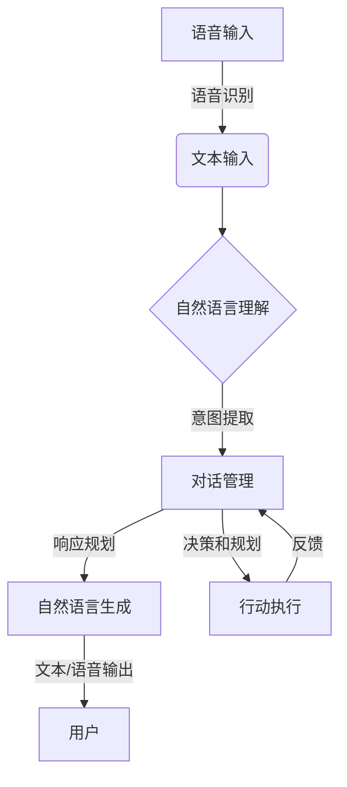

# Python深度学习实践：深度学习在虚拟助理中的应用

## 1.背景介绍

随着人工智能技术的不断发展,虚拟助理已经逐渐融入到我们的日常生活中。虚拟助理可以帮助用户完成各种任务,如查询信息、管理日程、控制智能家居设备等。深度学习作为一种强大的机器学习技术,在虚拟助理的构建中发挥着关键作用。

### 1.1 虚拟助理的发展历程

虚拟助理最早可以追溯到20世纪60年代,当时的虚拟助理系统主要基于规则和模式匹配。随着自然语言处理和机器学习技术的进步,虚拟助理逐渐向智能化和人性化方向发展。

近年来,随着深度学习技术的兴起,虚拟助理的能力得到了大幅提升。深度学习可以从海量数据中自动学习特征表示,并建立复杂的模型来模拟人类的认知过程,从而实现更加智能和人性化的虚拟助理。

### 1.2 深度学习在虚拟助理中的应用

深度学习在虚拟助理中的应用主要包括以下几个方面:

- **自然语言处理(NLP)**: 深度学习可以用于构建语音识别、自然语言理解、对话管理和自然语言生成等模块,实现与用户的自然语言交互。
- **计算机视觉**: 深度学习可以用于图像识别、目标检测和视频分析等任务,为虚拟助理提供视觉感知能力。
- **决策和规划**: 深度学习可以用于建模用户偏好,优化决策流程,并规划行动序列以完成复杂任务。
- **知识库构建**: 深度学习可以从大规模文本数据中提取知识,构建知识库,为虚拟助理提供背景知识。

本文将重点介绍深度学习在虚拟助理的自然语言处理方面的应用,包括语音识别、自然语言理解、对话管理和自然语言生成等核心模块。

## 2.核心概念与联系

在介绍深度学习在虚拟助理中的具体应用之前,我们先来了解一些核心概念及它们之间的联系。

### 2.1 自然语言处理(NLP)

自然语言处理(Natural Language Processing,NLP)是人工智能的一个分支,旨在使计算机能够理解和生成人类语言。NLP包括以下几个主要任务:

- **语音识别(Speech Recognition)**: 将人类语音转换为文本。
- **自然语言理解(Natural Language Understanding,NLU)**: 从文本中提取意义和语义信息。
- **对话管理(Dialogue Management)**: 根据上下文和目标,规划和生成合适的响应。
- **自然语言生成(Natural Language Generation,NLG)**: 将语义表示转换为自然语言文本或语音输出。

这些任务是相互关联的,构成了一个完整的NLP系统。例如,语音识别的输出作为自然语言理解的输入,自然语言理解的结果被用于对话管理,对话管理的输出则作为自然语言生成的输入。

### 2.2 深度学习在NLP中的应用

传统的NLP系统主要基于规则和统计模型,需要大量的人工特征工程。而深度学习则可以自动从数据中学习特征表示,并建立端到端的模型,显著提高了NLP系统的性能。

深度学习在NLP中的应用主要包括以下几个方面:

- **词向量(Word Embeddings)**: 将词映射到低维连续向量空间,捕捉词与词之间的语义和语法关系。
- **递归神经网络(Recursive Neural Networks)**: 可以处理具有树状结构的数据,如句子的语法树。
- **循环神经网络(Recurrent Neural Networks,RNNs)**: 适合处理序列数据,如自然语言文本。
- **长短期记忆网络(Long Short-Term Memory,LSTMs)**: 一种特殊的RNN,可以更好地捕捉长期依赖关系。
- **门控循环单元(Gated Recurrent Units,GRUs)**: 另一种特殊的RNN,相比LSTMs更简单且效果相当。
- **注意力机制(Attention Mechanism)**: 允许模型关注输入序列的不同部分,提高了模型的性能和解释性。
- **transformer**: 基于注意力机制的新型神经网络架构,在机器翻译等任务中表现出色。
- **bert**: 一种预训练的transformer模型,可以用于多种NLP任务,取得了state-of-the-art的性能。

这些深度学习模型和技术为构建高性能的NLP系统提供了强大的工具。

### 2.3 深度学习在虚拟助理中的作用

在虚拟助理系统中,深度学习主要应用于以下几个模块:

1. **语音识别**: 将用户的语音输入转录为文本,作为后续NLP模块的输入。
2. **自然语言理解**: 从用户的文本输入中提取意图和语义信息,理解用户的需求。
3. **对话管理**: 根据用户的意图和上下文,规划对话策略,决定系统的响应行为。
4. **自然语言生成**: 将对话管理模块的输出转换为自然语言文本或语音输出,与用户进行交互。
5. **决策和规划**: 根据用户的需求,结合背景知识和约束条件,做出决策并规划行动序列。

这些模块相互协作,构成了一个完整的虚拟助理系统。深度学习在每个模块中都发挥着关键作用,提高了系统的性能和智能化水平。

上图展示了深度学习在虚拟助理系统中的作用。用户的语音输入首先经过语音识别模块转换为文本,然后由自然语言理解模块提取意图和语义信息。对话管理模块根据意图和上下文规划响应策略,并将响应输入到自然语言生成模块,生成自然语言文本或语音输出,与用户进行交互。同时,对话管理模块还可以根据用户需求做出决策并规划行动序列,执行相应的操作,并根据反馈调整策略。

## 3.核心算法原理具体操作步骤

在上一节中,我们介绍了深度学习在虚拟助理中的作用和核心概念。接下来,我们将详细探讨虚拟助理系统中几个关键模块的核心算法原理和具体操作步骤。

### 3.1 语音识别

语音识别是将人类语音转换为文本的过程。它是虚拟助理系统的入口,对后续模块的性能有重要影响。

传统的语音识别系统主要基于隐马尔可夫模型(Hidden Markov Models,HMMs)和高斯混合模型(Gaussian Mixture Models,GMMs)。这些模型需要大量的人工特征工程,且难以捕捉语音信号中的复杂模式。

近年来,深度学习在语音识别领域取得了巨大成功,主要采用以下模型和算法:

1. **深度神经网络(Deep Neural Networks,DNNs)**: 将语音特征映射到语音单元(如音素)的分类器。
2. **循环神经网络(Recurrent Neural Networks,RNNs)**: 可以直接对原始语音信号建模,捕捉序列依赖关系。
3. **长短期记忆网络(Long Short-Term Memory,LSTMs)**: 一种特殊的RNN,可以更好地捕捉长期依赖关系。
4. **时间卷积网络(Time Convolutional Networks,TCNs)**: 使用卷积神经网络对序列数据建模。
5. **注意力机制(Attention Mechanism)**: 允许模型关注语音信号的不同部分,提高了性能和解释性。
6. **端到端模型(End-to-End Models)**: 直接从原始语音信号到文本转录,无需手工设计特征。
7. **联合建模(Joint Modeling)**: 同时建模语音识别和相关任务(如语言模型),提高性能。

这些深度学习模型和算法显著提高了语音识别的准确性,为虚拟助理系统提供了可靠的文本输入。

### 3.2 自然语言理解

自然语言理解(Natural Language Understanding,NLU)是从文本中提取意图和语义信息的过程。它是虚拟助理系统理解用户需求的关键步骤。

传统的NLU系统主要基于规则和统计模型,需要大量的人工特征工程。而深度学习则可以自动从数据中学习特征表示,并建立端到端的模型,显著提高了NLU的性能。

深度学习在NLU中的应用主要包括以下模型和算法:

1. **词向量(Word Embeddings)**: 将词映射到低维连续向量空间,捕捉词与词之间的语义和语法关系。常用的词向量模型有Word2Vec、GloVe等。
2. **递归神经网络(Recursive Neural Networks)**: 可以处理具有树状结构的数据,如句子的语法树,用于句法分析和语义表示。
3. **循环神经网络(Recurrent Neural Networks,RNNs)**: 适合处理序列数据,如自然语言文本,可用于意图分类和槽填充等任务。
4. **长短期记忆网络(Long Short-Term Memory,LSTMs)**: 一种特殊的RNN,可以更好地捕捉长期依赖关系,在许多NLU任务中表现出色。
5. **门控循环单元(Gated Recurrent Units,GRUs)**: 另一种特殊的RNN,相比LSTMs更简单且效果相当,在某些任务中表现更好。
6. **注意力机制(Attention Mechanism)**: 允许模型关注输入序列的不同部分,提高了模型的性能和解释性,在机器阅读理解等任务中表现出色。
7. **transformer**: 基于注意力机制的新型神经网络架构,在机器翻译等任务中表现出色,也可应用于NLU任务。
8. **bert**: 一种预训练的transformer模型,可以用于多种NLU任务,取得了state-of-the-art的性能。
9. **多任务学习(Multi-Task Learning)**: 同时学习多个相关任务,提高了模型的泛化能力和鲁棒性。
10. **迁移学习(Transfer Learning)**: 将在大规模数据集上预训练的模型迁移到目标NLU任务,提高了性能和数据效率。

这些深度学习模型和算法显著提高了NLU的性能,为虚拟助理系统理解用户需求提供了强大的支持。

### 3.3 对话管理

对话管理(Dialogue Management)是根据用户的意图和上下文,规划对话策略,决定系统的响应行为。它是虚拟助理系统的核心模块,直接影响着与用户的交互质量。

传统的对话管理系统主要基于有限状态机(Finite State Machines,FSMs)和部分观测马尔可夫决策过程(Partially Observable Markov Decision Processes,POMDPs)。这些方法需要大量的人工设计和调优,且难以处理复杂的对话场景。

近年来,深度学习在对话管理领域取得了重大进展,主要采用以下模型和算法:

1. **端到端神经对话系统(End-to-End Neural Dialogue Systems)**: 直接从对话历史映射到系统响应,无需手工设计对话状态和规则。
2. **序列到序列模型(Sequence-to-Sequence Models)**: 将对话历史作为输入序列,系统响应作为输出序列,使用编码器-解码器架构进行建模。
3. **注意力机制(Attention Mechanism)**: 允许模型关注对话历史的不同部分,提高了响应的相关性和一致性。
4. **强化学习(Reinforcement Learning)**: 将对话过程建模为马尔可夫决策过程,通过与用户的交互来优化对话策略。
5. **层次对话系统(Hierarchical Dialogue Systems)**: 将对话任务分解为多个子任务,分层管理对话流程,提高了系统的可解释性和鲁棒性。
6. **多模态对话系统(Multimodal Dialogue Systems)**: 融合语音、视觉、情感等多种模态信息,实现更加自