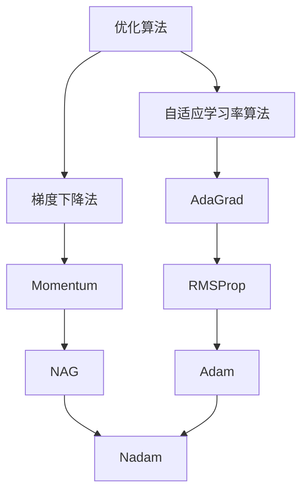

# RMSProp优化器原理与代码实例讲解

## 1.背景介绍

在机器学习和深度学习领域中,优化算法扮演着至关重要的角色。它们用于调整模型的参数,以最小化损失函数并提高模型的性能。随着深度神经网络的复杂度不断增加,传统的优化算法如梯度下降法在训练过程中往往会遇到一些挑战,例如陷入鞍点、梯度消失或梯度爆炸等问题。为了解决这些问题,研究人员提出了各种自适应优化算法,其中RMSProp(Root Mean Square Propagation)就是一种广为人知的自适应学习率优化算法。

### 1.1 优化算法的重要性

优化算法在机器学习和深度学习中扮演着核心角色,它们决定了模型训练的效率和收敛性能。选择合适的优化算法对于获得高质量的模型至关重要。传统的梯度下降法虽然简单直观,但在处理大规模数据和复杂模型时往往会遇到一些挑战,例如:

- **陷入鞍点(Saddle Point)**: 在高维空间中,损失函数可能存在许多平坦区域或鞍点,梯度下降法容易在这些区域停滞不前。
- **梯度消失/爆炸(Vanishing/Exploding Gradients)**: 在训练深度神经网络时,梯度可能会在反向传播过程中exponentially衰减或爆炸,导致模型无法有效地学习。

为了解决这些问题,研究人员提出了各种自适应优化算法,它们通过动态调整每个参数的学习率,以期获得更快、更稳定的收敛性能。

### 1.2 RMSProp优化器的背景

RMSProp是由Geoffrey Hinton在他的课程中提出的一种自适应学习率优化算法。它是对AdaGrad算法的改进版本,旨在解决AdaGrad算法在非凸优化问题上的缺陷。

AdaGrad算法通过累积所有过去梯度的平方和来调整每个参数的学习率。然而,在一些非凸优化问题上,由于梯度的累积效应,学习率会过度衰减,导致算法在后期阶段无法有效地继续学习。

RMSProp算法通过使用指数加权移动平均来缓解这一问题。它为每个参数维护一个移动平均的梯度平方,并使用该值来调整相应参数的学习率。这种方法能够平衡历史梯度的影响,避免学习率过度衰减,从而在非凸优化问题上表现出更好的收敛性能。

## 2.核心概念与联系

### 2.1 RMSProp算法的核心思想

RMSProp算法的核心思想是维护一个指数加权移动平均的梯度平方,并使用该值来调整每个参数的学习率。具体来说,对于每个参数$w_i$,RMSProp算法会跟踪一个移动平均的梯度平方$E[g_i^2]$,其中$g_i$是参数$w_i$的梯度。然后,它使用该值来缩放参数的更新步长,从而实现自适应学习率。

算法的更新规则如下:

$$
E[g_i^2]_t = \beta E[g_i^2]_{t-1} + (1-\beta)(\nabla_i L)^2 \\
w_i \leftarrow w_i - \frac{\eta}{\sqrt{E[g_i^2]_t + \epsilon}} \nabla_i L
$$

其中:

- $E[g_i^2]_t$是参数$w_i$在时间步$t$的移动平均梯度平方
- $\beta$是控制移动平均的衰减率,通常取值接近1(如0.9)
- $\nabla_i L$是损失函数$L$关于参数$w_i$的梯度
- $\eta$是基础学习率
- $\epsilon$是一个很小的正数,用于避免分母为0

可以看出,RMSProp算法通过调整每个参数的学习率来实现自适应性。当一个参数的梯度平方较大时,相应的学习率会变小;反之,当梯度平方较小时,学习率会变大。这种自适应机制有助于避免陷入陡峭或平坦区域,从而提高了算法的收敛性能。

### 2.2 RMSProp与其他优化算法的关系

RMSProp算法与其他一些著名的优化算法有着密切的联系,例如:

1. **Momentum**: Momentum算法通过引入动量项来加速梯度下降过程,从而更容易跳出局部最小值。RMSProp算法可以看作是对Momentum算法的一种扩展,它不仅考虑了梯度的方向,还考虑了梯度的幅度。

2. **AdaGrad**: AdaGrad算法是RMSProp的直接前身。它通过累积所有过去梯度的平方和来调整每个参数的学习率。然而,在非凸优化问题上,AdaGrad算法可能会导致学习率过度衰减,从而无法有效地继续学习。RMSProp算法通过使用指数加权移动平均来缓解这一问题。

3. **Adam**: Adam算法是RMSProp和Momentum算法的结合体。它不仅使用了指数加权移动平均的梯度平方来调整学习率,还引入了指数加权移动平均的梯度来估计一阶矩。Adam算法在许多情况下表现出了更好的收敛性能。

4. **Nadam**: Nadam算法是Adam算法的一种变体,它将Nesterov加速梯度应用于Adam算法,以期获得更快的收敛速度。

总的来说,RMSProp算法是一种重要的自适应学习率优化算法,它与其他优化算法有着密切的联系,并为后来的算法提供了理论基础和启发。

## 3.核心算法原理具体操作步骤

RMSProp算法的核心思想是维护一个指数加权移动平均的梯度平方,并使用该值来调整每个参数的学习率。具体的操作步骤如下:

1. **初始化参数**: 首先,我们需要初始化模型的参数$w$,通常使用一些随机初始化方法。

2. **计算梯度**: 对于每个小批量数据,我们需要计算损失函数$L$关于参数$w$的梯度$\nabla_w L$。

3. **初始化移动平均梯度平方**: 为每个参数$w_i$初始化一个移动平均梯度平方$E[g_i^2]_0$,通常设置为0或一个很小的正值。

4. **更新移动平均梯度平方**: 对于每个参数$w_i$,根据当前梯度$\nabla_i L$更新其对应的移动平均梯度平方$E[g_i^2]_t$:

$$
E[g_i^2]_t = \beta E[g_i^2]_{t-1} + (1-\beta)(\nabla_i L)^2
$$

其中$\beta$是控制移动平均的衰减率,通常取值接近1(如0.9)。

5. **更新参数**: 使用更新后的移动平均梯度平方$E[g_i^2]_t$来调整每个参数$w_i$的学习率,并更新参数:

$$
w_i \leftarrow w_i - \frac{\eta}{\sqrt{E[g_i^2]_t + \epsilon}} \nabla_i L
$$

其中$\eta$是基础学习率,而$\epsilon$是一个很小的正数,用于避免分母为0。

6. **重复步骤2-5**: 对于每个小批量数据,重复步骤2-5,直到模型收敛或达到最大迭代次数。

RMSProp算法的关键在于使用指数加权移动平均的梯度平方来调整每个参数的学习率。当一个参数的梯度平方较大时,相应的学习率会变小;反之,当梯度平方较小时,学习率会变大。这种自适应机制有助于避免陷入陡峭或平坦区域,从而提高了算法的收敛性能。

需要注意的是,RMSProp算法还有一些超参数需要调整,例如基础学习率$\eta$和移动平均衰减率$\beta$。合理设置这些超参数对于算法的性能也有重要影响。

## 4.数学模型和公式详细讲解举例说明

在上一节中,我们已经介绍了RMSProp算法的核心思想和操作步骤。现在,让我们更深入地探讨一下算法的数学模型和公式,并通过具体的例子来加深理解。

### 4.1 RMSProp算法的数学模型

RMSProp算法的核心思想是维护一个指数加权移动平均的梯度平方,并使用该值来调整每个参数的学习率。具体来说,对于每个参数$w_i$,RMSProp算法会跟踪一个移动平均的梯度平方$E[g_i^2]_t$,其中$g_i$是参数$w_i$的梯度。

算法的更新规则如下:

$$
\begin{aligned}
E[g_i^2]_t &= \beta E[g_i^2]_{t-1} + (1-\beta)(\nabla_i L)^2 \\
w_i &\leftarrow w_i - \frac{\eta}{\sqrt{E[g_i^2]_t + \epsilon}} \nabla_i L
\end{aligned}
$$

其中:

- $E[g_i^2]_t$是参数$w_i$在时间步$t$的移动平均梯度平方
- $\beta$是控制移动平均的衰减率,通常取值接近1(如0.9)
- $\nabla_i L$是损失函数$L$关于参数$w_i$的梯度
- $\eta$是基础学习率
- $\epsilon$是一个很小的正数,用于避免分母为0

我们可以看到,RMSProp算法通过调整每个参数的学习率来实现自适应性。当一个参数的梯度平方较大时,相应的学习率会变小;反之,当梯度平方较小时,学习率会变大。这种自适应机制有助于避免陷入陡峭或平坦区域,从而提高了算法的收敛性能。

### 4.2 RMSProp算法的例子

为了更好地理解RMSProp算法,让我们通过一个简单的例子来说明。假设我们有一个二元二次函数:

$$
f(x, y) = x^2 + 2y^2
$$

我们的目标是找到该函数的最小值点$(0, 0)$。初始参数设置为$(x_0, y_0) = (2, 2)$,基础学习率$\eta = 0.1$,移动平均衰减率$\beta = 0.9$,并且$\epsilon = 10^{-8}$。

我们将使用RMSProp算法来优化这个函数。首先,我们需要初始化移动平均梯度平方$E[g_x^2]_0$和$E[g_y^2]_0$为0。然后,我们按照算法的更新规则进行迭代:

1. 计算梯度:
   $$
   \nabla_x f = 2x, \quad \nabla_y f = 4y
   $$
   在$(2, 2)$处,梯度为$(4, 8)$。

2. 更新移动平均梯度平方:
   $$
   \begin{aligned}
   E[g_x^2]_1 &= 0.9 \times 0 + 0.1 \times 4^2 = 1.6 \\
   E[g_y^2]_1 &= 0.9 \times 0 + 0.1 \times 8^2 = 6.4
   \end{aligned}
   $$

3. 更新参数:
   $$
   \begin{aligned}
   x_1 &= 2 - \frac{0.1}{\sqrt{1.6 + 10^{-8}}} \times 4 \approx 1.58 \\
   y_1 &= 2 - \frac{0.1}{\sqrt{6.4 + 10^{-8}}} \times 8 \approx 1.25
   \end{aligned}
   $$

我们可以继续迭代这个过程,直到参数收敛到最小值点$(0, 0)$附近。在这个简单的例子中,我们可以清楚地看到RMSProp算法如何根据梯度的大小动态调整每个参数的