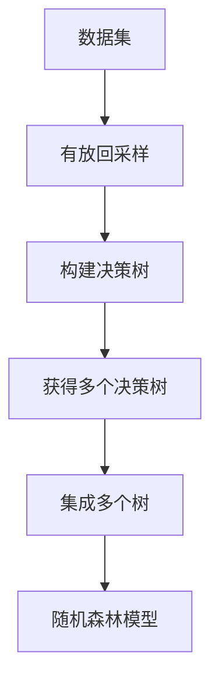

# Random Forest 原理与代码实战案例讲解

## 1.背景介绍

### 1.1 机器学习概述

机器学习是人工智能的一个重要分支,旨在让计算机从数据中自动分析获得规律,并利用规律对未知数据进行预测。机器学习算法按学习方式的不同可分为监督学习、非监督学习和强化学习等。

### 1.2 分类与回归问题

在机器学习中,分类和回归是两大核心问题。分类问题是根据已知输入数据对样本进行分类,比如判断一封电子邮件是否为垃圾邮件。回归问题是根据已知数据预测一个连续的数值输出,比如预测房价。

### 1.3 决策树算法

决策树是一种常用的监督学习算法,可以用于分类和回归任务。它通过不断划分特征空间,构建一个决策树模型,将输入数据映射到相应的输出。决策树具有可解释性强、可视化等优点,但也存在过拟合等缺陷。

## 2.核心概念与联系

### 2.1 集成学习

集成学习(Ensemble Learning)是将多个基础模型组合起来,从而获得比单一模型更强大的模型。常见的集成方法有Bagging、Boosting、Stacking等。

### 2.2 Bagging与随机森林

Bagging(Bootstrap Aggregating)是一种并行集成方法,通过对原始数据集进行有放回的随机采样,得到多个不同的训练数据集,分别训练出多个基础模型,然后将这些基础模型的结果进行平均或投票,得到最终模型。

随机森林(Random Forest)就是一种基于决策树和Bagging思想的集成算法。它不仅对样本进行有放回采样,还对特征也进行随机采样,从而为决策树引入了随机性,增加了决策树之间的差异性,有效减小了过拟合风险。

### 2.3 随机森林算法流程

随机森林算法的核心步骤如下:



## 3.核心算法原理具体操作步骤

### 3.1 决策树构建

1. 选择最优特征,根据特征对数据集进行划分
2. 对每个子集重复1,构建决策树分支节点
3. 直到所有实例属于同一类别或无法再划分为止

### 3.2 随机森林算法步骤

1. 对原始数据集进行有放回采样,获得N个新数据集
2. 对每个新数据集,根据特征袋对特征进行随机采样
3. 使用随机采样的特征,构建决策树
4. 对N个决策树取平均值(回归)或投票(分类)作为最终输出

## 4.数学模型和公式详细讲解举例说明

### 4.1 决策树构建

对于决策树的构建,我们需要选择最优特征对数据集进行划分。常用的指标是信息增益或信息增益率。

信息熵:
$$
Ent(D) = -\sum_{k=1}^{|y|} p_k \log_2 p_k
$$
其中$p_k$是数据集D中第k类样本所占的比例。

信息增益:
$$
\begin{aligned}
Gain(D,a) &= Ent(D) - \sum_{v=1}^{V}\frac{|D^v|}{|D|}Ent(D^v)\\
&= Ent(D) - \sum_{v=1}^{V} p(v)Ent(D^v)
\end{aligned}
$$
其中$D^v$是数据集D根据特征a取值v分割得到的子集,$p(v)=\frac{|D^v|}{|D|}$。我们选择信息增益最大的特征作为划分特征。

信息增益率:
$$
GainRatio(D,a) = \frac{Gain(D,a)}{IV(a)}
$$
其中$IV(a)$是特征a的固有值,用于减小对特征值较多的特征的偏好。

### 4.2 随机森林

在随机森林中,我们通过有放回采样和随机特征采样,增加了单个决策树之间的差异性。对于包含N个树的随机森林,对于单个样本的预测输出为:

回归问题:
$$
\hat{y} = \frac{1}{N}\sum_{n=1}^N T_n(x)
$$

分类问题:
$$
\hat{y} = \text{majority\_vote}\{T_n(x)\}_{n=1}^N
$$

其中$T_n(x)$表示第n棵决策树对样本x的预测输出。

## 5.项目实践:代码实例和详细解释说明

下面是使用Python中scikit-learn库构建随机森林模型的代码示例:

```python
from sklearn.ensemble import RandomForestClassifier
from sklearn.datasets import make_classification
from sklearn.model_selection import train_test_split
from sklearn.metrics import accuracy_score

# 生成示例数据集
X, y = make_classification(n_samples=1000, n_features=10, n_redundant=0, random_state=1)

# 划分训练集和测试集
X_train, X_test, y_train, y_test = train_test_split(X, y, test_size=0.2, random_state=1)

# 创建随机森林分类器
rf = RandomForestClassifier(n_estimators=100, max_depth=5, random_state=1)

# 训练模型
rf.fit(X_train, y_train)

# 预测
y_pred = rf.predict(X_test)

# 评估模型
accuracy = accuracy_score(y_test, y_pred)
print(f"Random Forest Accuracy: {accuracy}")
```

代码解释:

1. 导入相关模块和函数
2. 生成示例数据集`make_classification`
3. 划分训练集和测试集`train_test_split`
4. 创建随机森林分类器`RandomForestClassifier`,设置树的数量`n_estimators`和最大深度`max_depth`
5. 使用训练集训练模型`fit`
6. 对测试集进行预测`predict`
7. 计算预测精度`accuracy_score`

## 6.实际应用场景

随机森林算法由于其优秀的性能和可解释性,在许多领域都有广泛应用:

- 金融领域:信用风险评估、欺诈检测
- 医疗健康:疾病诊断、药物分析
- 计算机视觉:图像分类、目标检测
- 自然语言处理:文本分类、情感分析
- 推荐系统:个性化推荐
- ...

## 7.工具和资源推荐

- Python scikit-learn库: 提供了随机森林等多种机器学习算法的实现
- XGBoost库: 高效的梯度提升树算法库,性能优于scikit-learn
- LightGBM库: 另一个高效梯度提升树算法库
- Pandas: 数据处理和分析库
- Matplotlib/Seaborn: 数据可视化库
- MLCourse.ai: 机器学习在线课程

## 8.总结:未来发展趋势与挑战

随机森林作为一种成熟的集成学习算法,已被广泛应用,但仍有一些需要进一步改进的地方:

- 处理高维稀疏数据的能力有待提高
- 对异常值的鲁棒性还可以加强
- 可解释性方面还有提升空间
- ...

未来可能的发展趋势包括:

- 与深度学习模型相结合,发挥各自优势
- 设计更高效的并行化算法,利用GPU等加速
- 应用于更多新兴领域,如金融科技、智能制造等

## 9.附录:常见问题与解答

1. **随机森林和决策树有什么区别?**
   
   随机森林是基于决策树和Bagging思想的集成算法。相比单棵决策树,随机森林通过构建多棵决策树并进行集成,降低了过拟合风险,提高了泛化能力。

2. **随机森林如何处理缺失值?**
   
   随机森林在构建决策树时,会根据现有的特征值划分数据集。对于缺失值,可以将其视为一个新的特征值,或者使用一些填充方法(如均值插补)。

3. **如何选择随机森林的参数?**
   
   主要参数包括树的数量`n_estimators`、最大深度`max_depth`、最小样本数`min_samples_split`等。可以通过交叉验证和网格搜索等方法调优参数。一般来说,增加树的数量可以提高性能,但也会增加计算开销。

4. **随机森林适合哪些数据类型?**
   
   随机森林可以处理数值型和类别型特征,适用于分类和回归任务。对于高维稀疏数据,表现可能会略差。

5. **随机森林的优缺点是什么?**
   
   优点:泛化能力强、可解释性好、鲁棒性高、并行化方便。
   缺点:对于高维稀疏数据表现一般,训练时间开销大。

作者: 禅与计算机程序设计艺术 / Zen and the Art of Computer Programming