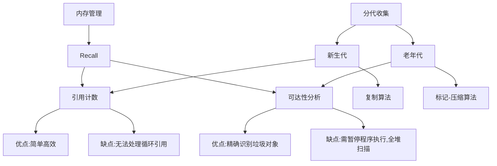
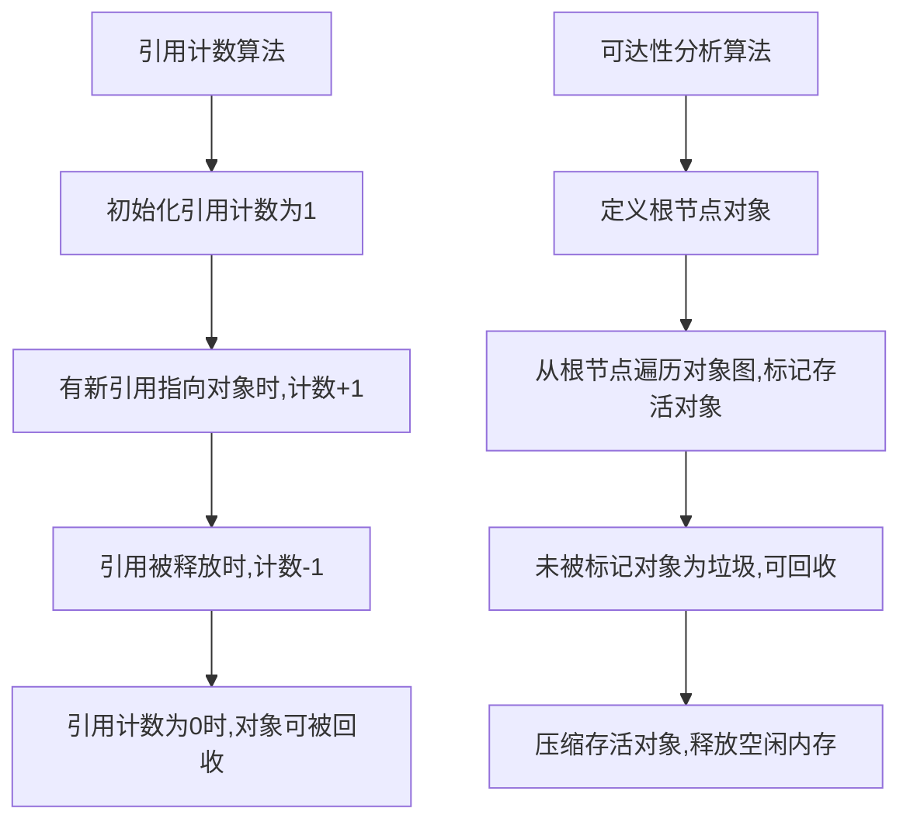

# Recall 原理与代码实战案例讲解

## 1.背景介绍

在现代计算机系统中,内存管理是一个非常重要的问题。内存是有限的资源,需要合理分配和回收。Recall 是一种内存回收机制,用于自动释放不再使用的内存空间,从而避免内存泄漏和提高系统性能。

内存泄漏是指程序在运行过程中,由于疏忽或错误,导致分配的内存空间无法被释放和重新利用。随着程序运行时间的增长,内存占用会越来越大,最终可能导致系统崩溃或性能严重下降。因此,有效的内存管理机制对于现代软件系统至关重要。

## 2.核心概念与联系

Recall 的核心概念是"引用计数"和"可达性分析"。引用计数跟踪每个内存对象被引用的次数,当引用计数为0时,表示该对象不再被使用,可以被回收。可达性分析从根节点出发,遍历整个对象图,标记所有可达的对象,未被标记的对象即为不可达对象,将被回收。

引用计数和可达性分析都有各自的优缺点。引用计数简单高效,但无法处理循环引用的情况。可达性分析能够精确识别所有垃圾对象,但代价是需要暂停程序执行,进行全堆扫描,影响系统响应时间。

现代垃圾回收器通常采用"分代收集"的策略,将内存分为新生代和老年代。新生代对象的生命周期较短,使用引用计数和复制算法进行回收。老年代对象生命周期较长,使用可达性分析和标记-压缩算法进行回收。



## 3.核心算法原理具体操作步骤

### 3.1 引用计数算法

引用计数算法的核心思想是为每个对象维护一个引用计数器,记录指向该对象的引用数量。当对象被创建时,引用计数器初始化为1。每当有新的引用指向该对象时,计数器加1;每当一个引用被释放时,计数器减1。当计数器归零时,表示该对象不再被任何引用指向,可以被安全回收。

1. 对象创建时,引用计数初始化为1
2. 每当有新引用指向对象,引用计数加1
3. 每当一个引用被释放,引用计数减1
4. 引用计数为0时,对象可被回收

优点:
- 实现简单,运行高效
- 可以立即回收不再使用的对象

缺点:
- 无法处理循环引用的情况
- 需要维护引用计数器,带来额外开销

### 3.2 可达性分析算法

可达性分析算法的核心思想是通过遍历对象图,标记所有可达的对象,未被标记的对象即为垃圾,可被回收。

1. 定义一组根节点对象(如全局变量、线程栈等)
2. 从根节点出发,遍历所有可达对象,标记为存活
3. 未被标记的对象即为垃圾,可被回收
4. 回收后,对存活对象进行压缩,释放空闲内存

优点:
- 可以精确识别所有垃圾对象,包括循环引用
- 压缩存活对象,避免内存碎片

缺点:  
- 需要暂停程序执行,进行全堆扫描,影响响应时间
- 在标记和压缩阶段,需要移动存活对象,代价较高



## 4.数学模型和公式详细讲解举例说明

### 4.1 复制算法

复制算法常用于新生代对象的回收。它将内存空间分为两个相等的空间,每次只使用其中一个空间。在垃圾回收时,将存活对象复制到另一个空间,然后将原空间全部回收。

设对象总大小为 $M$,复制空间大小为 $N$,则:

$$
\begin{aligned}
复制成本 &= M \\
内存利用率 &= \frac{M}{2N}
\end{aligned}
$$

当 $M \leq \frac{N}{2}$ 时,复制成本为 $O(M)$,内存利用率为 $\frac{1}{2}$。

当 $M > \frac{N}{2}$ 时,需要多次复制和压缩,复制成本为 $O(M \log_{\frac{N}{M}}N)$,内存利用率趋近于 $100\%$。

### 4.2 标记-压缩算法

标记-压缩算法常用于老年代对象的回收。它首先标记所有存活对象,然后将存活对象压缩到内存空间的一端,释放另一端的空闲空间。

设对象总大小为 $M$,存活对象大小为 $S$,压缩成本为 $C(S)$,则:

$$
\begin{aligned}
内存利用率 &= \frac{S}{M} \\
总体成本 &= C(S)
\end{aligned}
$$

压缩成本 $C(S)$ 与存活对象的大小和分布情况有关,通常为 $O(S)$ 到 $O(M)$ 之间。

## 5.项目实践:代码实例和详细解释说明

以下是一个简单的 Python 示例,演示了引用计数和可达性分析的实现:

```python
# 引用计数示例
class Object:
    def __init__(self):
        self.ref_count = 1
    
    def __del__(self):
        print(f"Object {id(self)} deleted")

def ref_count_demo():
    obj1 = Object()
    obj2 = obj1  # 引用计数加1
    obj3 = obj1  # 引用计数加1
    del obj2     # 引用计数减1
    del obj3     # 引用计数减1
    # 引用计数为0,obj1被回收

# 可达性分析示例  
import gc

class Node:
    def __init__(self, value):
        self.value = value
        self.next = None

def reachability_demo():
    # 构建循环引用
    node1 = Node(1)
    node2 = Node(2)
    node3 = Node(3)
    node1.next = node2
    node2.next = node3
    node3.next = node1

    # 手动触发垃圾回收
    gc.collect()
    # 循环引用未被回收

    # 手动断开引用
    del node1, node2, node3
    gc.collect()
    # 循环引用被回收

if __name__ == "__main__":
    ref_count_demo()
    reachability_demo()
```

在引用计数示例中,我们定义了一个 `Object` 类,它在创建时将引用计数初始化为1。当有新的引用指向对象时,引用计数加1;当引用被释放时,引用计数减1。当引用计数为0时,对象的 `__del__` 方法被调用,对象被回收。

在可达性分析示例中,我们构建了一个循环引用的情况。首次调用 `gc.collect()` 时,循环引用未被回收,因为它们仍然可达。当我们手动断开所有指向循环引用的引用后,再次调用 `gc.collect()`时,循环引用被成功回收。

## 6.实际应用场景

Recall 机制在各种编程语言和运行时环境中都有广泛应用,例如:

- Java 虚拟机 (JVM) 中的垃圾回收器
- Python 解释器中的内存管理
- 游戏引擎和浏览器中的内存管理
- 大数据系统中的内存管理(如 Spark、Flink 等)

以 Java 虚拟机为例,它采用分代收集策略,将内存分为新生代和老年代。新生代使用复制算法进行回收,老年代使用标记-压缩算法。此外,JVM 还提供了多种垃圾收集器,如 Serial、Parallel、CMS、G1 等,用户可以根据应用场景选择合适的收集器。

在游戏引擎和浏览器中,内存管理也是一个关键问题。游戏对象和 DOM 节点的生命周期复杂,需要高效的内存管理机制来避免内存泄漏和提高性能。

## 7.工具和资源推荐

- Java 虚拟机垃圾收集器调优工具:
  - JConsole: 基于 JMX 的可视化监控工具
  - JVisualVM: 全能的故障处理和性能分析工具
  - Eclipse Memory Analyzer Tool (MAT): 分析堆转储文件,查找内存泄漏
- Python 内存分析工具:
  - memory_profiler: 用于监控 Python 代码的内存使用情况
  - Pympler: 可视化内存使用情况,检测内存泄漏和循环引用
- C/C++ 内存分析工具:
  - Valgrind: 检测内存泄漏、越界访问等错误
  - AddressSanitizer: 基于编译器的内存错误检测工具
- 在线学习资源:
  - 《Java 虚拟机规范》(Java Virtual Machine Specification)
  - 《Python 内存管理》(Python Memory Management)
  - 《游戏编程精粹》(Game Programming Gems)

## 8.总结:未来发展趋势与挑战

虽然 Recall 机制已经得到了广泛应用,但它仍然面临一些挑战和发展方向:

1. **并发和并行化**: 随着多核处理器的普及,如何在不牺牲吞吐量的情况下,实现高效的并发和并行垃圾回收,是一个重要的研究方向。

2. **低延迟要求**: 在一些低延迟场景下(如游戏、实时系统等),传统的垃圾回收器可能无法满足要求。需要探索新的内存管理技术,如regionalized垃圾回收、增量式垃圾回收等。

3. **内存压缩**: 随着大数据和人工智能应用的兴起,系统需要管理越来越大的内存空间。高效的内存压缩技术有助于提高内存利用率,降低内存占用。

4. **安全性和可靠性**: 在一些关键任务系统中,内存错误可能导致严重的安全隐患。需要研究更加健壮和可靠的内存管理机制,提高系统的安全性。

5. **硬件加速**: 利用硬件加速技术(如GPU、FPGA等)加速垃圾回收过程,是一个值得探索的方向。

6. **机器学习优化**: 应用机器学习技术优化垃圾回收策略和参数,根据实际工作负载动态调整,是一个新兴的研究热点。

总的来说,Recall 机制将继续在软件系统中发挥重要作用。通过不断创新和优化,它将为构建高效、可靠的计算机系统提供坚实的基础。

## 9.附录:常见问题与解答

1. **什么是内存泄漏?**

内存泄漏是指程序在运行过程中,由于疏忽或错误,导致分配的内存空间无法被释放和重新利用。随着程序运行时间的增长,内存占用会越来越大,最终可能导致系统崩溃或性能严重下降。

2. **什么是循环引用?为什么引用计数无法处理循环引用?**

循环引用是指两个或多个对象相互引用,形成一个闭环。在这种情况下,即使程序不再需要这些对象,它们的引用计数也不会变为0,因此无法被回收。这就是引用计数算法的一个重大缺陷。

3. **什么是分代收集?它有什么优势?**

分代收集是将内存分