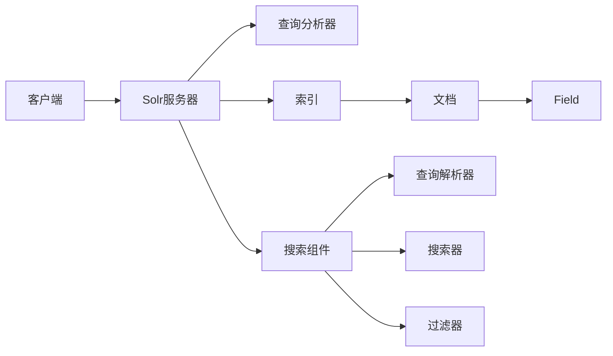

# Solr原理与代码实例讲解

## 1.背景介绍

### 1.1 什么是Solr

Solr是一个开源的、高度可扩展的搜索引擎服务器,基于Apache Lucene构建。它提供了全文搜索、命中高亮显示、分面搜索、动态聚类、数据库集成,以及丰富的文档处理(如Word、PDF等)能力。Solr具有高可靠性、可伸缩性和容错性,能够为大型网站提供快速、强大的搜索功能。

### 1.2 Solr的主要特性

- 高级全文搜索功能
- 优化的可伸缩架构,支持高容量和高并发
- 基于开放接口(XML、JSON、HTTP)的标准
- 综合的HTML管理界面
- 可伸缩性 - 高效复制到其他Solr搜索服务器
- 灵活而适应性强的配置
- 可扩展的插件架构
- 近实时搜索
- 配置文件驱动的可定制结构化搜索

### 1.3 Solr的应用场景

Solr广泛应用于各种需要搜索的场景,例如:

- 大型网站的站内搜索,如电商网站商品搜索
- 文档、图片、视频等多媒体资源的搜索
- 日志分析和搜索
- 地理位置搜索
- 垂直搜索引擎

## 2.核心概念与联系

### 2.1 Lucene与Solr的关系

Solr是构建在Lucene之上的搜索服务器。Lucene是一个Java编写的全文搜索引擎工具包,它本身并不是一个完整的搜索引擎,而是为搜索引擎应用提供基础服务。Solr使用Lucene作为其核心来实现索引和搜索,同时提供了一些Lucene所没有的特性,如基于Web的管理界面、监控界面等。

### 2.2 索引(Index)

索引是搜索引擎的核心,是将非结构化数据组织成可快速搜索的结构化数据的过程。在Solr中,索引由一个或多个Document组成。Solr使用Lucene建立反向索引,通过分词、语法分析等一系列文本分析过程,将文档内容切分成一系列词项(Term),然后记录每个词项在文档中的位置等信息。

### 2.3 文档(Document)

文档是Solr中信息的基本单元。文档由一个或多个Field组成,每个Field有一个名称和一个或多个值,还可以有一些属性如是否分词、是否索引等。Solr中的Document以XML或JSON格式表示。

### 2.4 域(Field)

Field是Solr文档的一个属性,由Field名和Field值组成。一个文档可以包含一个或多个Field。不同的Field可以有不同的数据类型,如文本、数值、日期等。Field有一些属性,如是否分词、是否索引、是否存储等,可以根据需求进行配置。

### 2.5 查询(Query)

查询是用户从Solr中搜索内容的请求。Solr提供了丰富的查询语法,包括关键词查询、短语查询、通配符查询、布尔查询、范围查询等。查询可以针对特定的Field进行,也可以是跨Field的。

### 2.6 Solr架构图



## 3.核心算法原理具体操作步骤

### 3.1 文本分析

文本分析是Solr将文本内容转换为可搜索的索引项的过程。主要步骤包括:

1. 分词:将文本内容切分成一个个单独的词。
2. 词干提取:将词的不同变形规整化为词干形式。
3. 大小写转换:通常将所有字母转为小写。
4. 去除停用词:去掉对搜索意义不大的常见词,如"的"、"是"等。
5. 同义词处理:将同义词归并到同一个词项下。

### 3.2 索引创建

Solr索引创建的主要步骤:

1. 定义文档结构:在schema.xml中定义文档包含哪些Field,每个Field的数据类型、是否分词等属性。
2. 提交文档:将待索引的文档内容以XML、JSON等格式提交给Solr。
3. 文本分析:对需要分词的Field进行上述文本分析步骤。
4. 创建索引:将分析结果写入索引文件。
5. 提交:将索引变更提交使其生效。

### 3.3 查询处理

Solr查询处理的主要步骤:

1. 查询解析:将用户输入的查询关键词,解析为Solr的内部查询表示。
2. 查找:在倒排索引中查找包含查询词的文档。
3. 过滤:根据查询条件对结果进行过滤,如按时间范围、按字段值等。
4. 排序:按相关性或其他指定的排序规则对结果进行排序。
5. 高亮、分页等:对结果进行额外的处理如关键词高亮、分页等。
6. 返回结果:将处理后的结果以指定的格式返回给客户端。

## 4.数学模型和公式详细讲解举例说明

### 4.1 向量空间模型(VSM)

Solr使用向量空间模型来计算查询与文档的相关度。在该模型中,将查询和文档都表示成一个N维空间中的向量,其中N为语料库中的词项总数。查询向量和文档向量的夹角余弦值越大,表示它们的相关度越高。

设查询向量为 $\vec{Q}$,文档向量为 $\vec{D}$,则它们的相关度为:

$$
sim(Q,D) = \frac{\vec{Q} \cdot \vec{D}}{|\vec{Q}| |\vec{D}|} = \frac{\sum_{i=1}^{n} w_{i,q} \cdot w_{i,d}}{\sqrt{\sum_{i=1}^{n} w_{i,q}^2} \sqrt{\sum_{i=1}^{n} w_{i,d}^2}}
$$

其中,$w_{i,q}$ 和 $w_{i,d}$ 分别表示词项 $t_i$ 在查询和文档中的权重。权重的计算通常使用TF-IDF方法:

$$
w_{i,d} = tf_{i,d} \cdot \log \frac{N}{df_i}
$$

其中,$tf_{i,d}$ 表示词项 $t_i$ 在文档 $d$ 中的频率,$df_i$ 表示包含词项 $t_i$ 的文档数,$N$ 为文档总数。

### 4.2 BM25模型

BM25是另一种常用的相关度计算模型,对TF-IDF进行了一些改进。其基本思想是,对于查询中的每个词,文档的相关度取决于该词在文档中的出现频率、文档长度等因素。

BM25的相关度计算公式为:

$$
score(D,Q) = \sum_{i=1}^{n} IDF(q_i) \cdot \frac{f(q_i, D) \cdot (k_1 + 1)}{f(q_i, D) + k_1 \cdot (1 - b + b \cdot \frac{|D|}{avgdl})}
$$

其中:
- $IDF(q_i)$ 是词项 $q_i$ 的逆文档频率。
- $f(q_i, D)$ 是 $q_i$ 在文档 $D$ 中的出现频率。
- $|D|$ 是文档 $D$ 的长度, $avgdl$ 是所有文档的平均长度。
- $k_1$ 和 $b$ 是调节因子,控制词频和文档长度的影响程度。

## 5.项目实践：代码实例和详细解释说明

下面通过一个简单的例子,演示如何使用Solr的Java客户端SolrJ进行索引和搜索。

### 5.1 添加索引

```java
// 创建一个和Solr服务器的连接
String urlString = "http://localhost:8983/solr/core0";
SolrClient solr = new HttpSolrClient.Builder(urlString).build();

// 创建一个文档对象
SolrInputDocument document = new SolrInputDocument();
document.addField("id", "doc1");
document.addField("title", "Apache Solr Tutorial");
document.addField("content", "This is an introductory tutorial about Apache Solr.");

// 将文档写入索引
UpdateResponse response = solr.add(document);

// 提交
solr.commit();

// 关闭连接
solr.close();
```

上面的代码首先创建了一个到Solr服务的连接。然后创建了一个`SolrInputDocument`对象,并添加了三个Field。接着将文档写入索引,提交变更,最后关闭连接。

### 5.2 查询

```java
// 创建连接
String urlString = "http://localhost:8983/solr/core0";
SolrClient solr = new HttpSolrClient.Builder(urlString).build();

// 创建一个查询
SolrQuery query = new SolrQuery();
query.setQuery("title:Solr");
query.setFields("id","title","content");
query.setStart(0);
query.setRows(10);

// 执行查询
QueryResponse response = solr.query(query);

// 获取结果
SolrDocumentList docs = response.getResults();
for (SolrDocument doc : docs) {
    System.out.println("id: " + doc.getFieldValue("id"));
    System.out.println("title: " + doc.getFieldValue("title"));
    System.out.println("content: " + doc.getFieldValue("content"));
}

// 关闭连接  
solr.close();
```

上面的代码首先创建了一个查询对象,指定了查询关键词、返回的Field、分页参数等。然后执行查询,从响应中获取结果文档列表,遍历输出每个文档的Field值。

## 6.实际应用场景

Solr可应用于多种需要搜索功能的场景,下面列举几个典型的应用案例:

### 6.1 电商网站商品搜索

在电商网站中,用户通过输入关键词搜索商品是非常常见的操作。使用Solr可以实现强大的商品搜索功能,如按关键词匹配商品标题、描述等,按品牌、分类、价格等条件过滤,按销量、评价等排序,以及商品推荐等。

### 6.2 论坛帖子搜索

在论坛网站中,用户经常需要搜索感兴趣的帖子。使用Solr可以实现帖子的全文检索,并支持按发帖时间、回复数、点击数等条件排序,高亮显示搜索关键词等。

### 6.3 日志分析

在网站运维中,经常需要对各种日志(如访问日志、错误日志等)进行分析。将日志数据导入Solr,可以方便地进行一些统计分析操作,如统计某个时间段内的访问次数、错误次数等,并可以将分析结果可视化展示。

### 6.4 新闻、博客等文章搜索

对于新闻、博客等内容型网站,为用户提供文章搜索是非常必要的功能。使用Solr可以对文章进行全文检索,并支持按类别、标签、发布时间等条件过滤,以及相关文章推荐等。

## 7.工具和资源推荐

### 7.1 官方网站

- Solr官网: https://solr.apache.org/
- Lucene官网: https://lucene.apache.org/

官网上有详尽的用户手册、API文档、教程等资源。

### 7.2 相关书籍

- 《Solr in Action》: 国外Solr专家撰写,深入讲解了Solr的原理和使用。
- 《Lucene in Action》: Lucene的权威指南,对理解Solr的底层原理很有帮助。
- 《Solr权威指南》: 国内Solr专家撰写,全面介绍了Solr的使用和开发。

### 7.3 开发工具

- SolrJ: Solr的Java客户端,用于在Java应用中集成Solr。
- SolrNet: Solr的.Net客户端。
- Postman: 用于测试Solr的HTTP API接口。

## 8.总结：未来发展趋势与挑战

### 8.1 云端化与SaaS化

随着云计算的普及,越来越多的应用开始迁移到云端。对Solr来说,提供基于云的Solr服务(Solr as a Service)将是一个重要的发展方向。用户无需关心Solr的安装、配置、扩容等,只需按使用