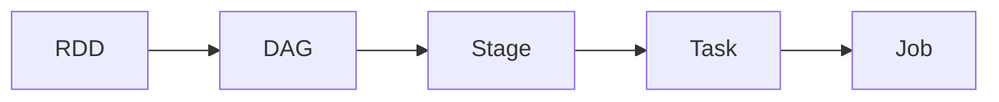

# Spark原理与代码实例讲解

## 1. 背景介绍
Apache Spark是一个开源的分布式计算系统，由加州大学伯克利分校AMPLab所开发。Spark提供了一个高效、快速、通用的大数据处理平台，它支持多种数据处理任务，包括批处理、交互式查询、实时分析、机器学习和图形处理等。Spark的核心是一个弹性分布式数据集（RDD），它是一个容错的、并行的数据结构，可以让用户显式地将数据存储在内存中，从而为整个数据集的分布式处理提供了极高的速度。

## 2. 核心概念与联系
Spark的设计哲学是基于内存计算，以提高大规模数据处理的速度。其核心概念包括：

- **RDD（弹性分布式数据集）**：是Spark中最基本的数据处理单元，代表一个不可变、分区、可并行操作的元素集合。
- **DAG（有向无环图）**：Spark中的任务调度是基于DAG的，它将RDD的转换操作表示为DAG图。
- **Stage**：DAG中的一个计算阶段，包含一系列的并行操作。
- **Task**：在Stage中的单个工作单元，对应于数据的一个分区。
- **Job**：由多个Stage组成，是用户提交给Spark的一个完整的计算请求。



## 3. 核心算法原理具体操作步骤
Spark的核心算法原理是基于RDD的转换（transformation）和行动（action）操作。转换操作会创建一个新的RDD，行动操作会触发计算并返回结果。

### 转换操作（Transformation）：
- `map`：对RDD的每个元素应用一个函数。
- `filter`：过滤出满足条件的元素。
- `flatMap`：与map类似，但每个输入项可以映射到0或多个输出项。

### 行动操作（Action）：
- `reduce`：对元素进行聚合操作。
- `collect`：将所有元素收集到驱动程序。
- `count`：返回RDD中元素的数量。

操作步骤通常包括：
1. 创建初始RDD。
2. 应用一系列转换操作。
3. 使用行动操作触发计算并获取结果。

## 4. 数学模型和公式详细讲解举例说明
以`map`和`reduce`为例，我们可以用数学公式来表示这两个操作：

- `map`操作可以表示为：$$ y_i = f(x_i) $$
  其中，$ x_i $ 是原始RDD中的元素，$ y_i $ 是经过函数 $ f $ 处理后的新RDD中的元素。

- `reduce`操作可以表示为：$$ y = \bigoplus_{i=1}^{n} x_i $$
  其中，$ \bigoplus $ 是一个二元操作符，比如加法或乘法，$ x_i $ 是RDD中的元素，$ y $ 是最终的聚合结果。

## 5. 项目实践：代码实例和详细解释说明
以下是一个简单的Spark代码实例，演示了如何使用`map`和`reduce`操作来计算一个数字列表的平方和。

```scala
val numbers = sc.parallelize(1 to 10) // 创建一个包含1到10的RDD
val squares = numbers.map(x => x * x) // 使用map操作计算平方
val squareSum = squares.reduce(_ + _) // 使用reduce操作计算平方和
println(squareSum) // 输出结果
```

在这个例子中，`sc`是SparkContext的实例，它是与Spark集群交互的入口点。`parallelize`方法创建了一个新的RDD，`map`操作将每个数字转换为其平方，`reduce`操作通过加法聚合所有平方值。

## 6. 实际应用场景
Spark在多个领域都有广泛的应用，包括：

- **金融分析**：用于风险管理、欺诈检测和实时交易分析。
- **电子商务**：用于推荐系统、客户细分和个性化营销。
- **医疗保健**：用于基因组学数据分析、患者数据管理和预测建模。

## 7. 工具和资源推荐
- **Apache Spark官方文档**：提供了详细的Spark使用指南和API文档。
- **Databricks Community Edition**：免费的Spark云平台，适合学习和小规模数据分析。
- **Spark Summit**：年度Spark用户大会，可以了解最新的Spark技术和行业应用。

## 8. 总结：未来发展趋势与挑战
Spark作为一个成熟的大数据处理平台，其未来的发展趋势包括更深入的机器学习集成、实时流处理能力的增强以及更好的云服务支持。同时，面临的挑战包括处理更大规模的数据集、保持高效的资源管理和优化跨语言接口。

## 9. 附录：常见问题与解答
- **Q: Spark和Hadoop的区别是什么？**
  A: Spark是基于内存计算的，而Hadoop MapReduce是基于磁盘的。Spark在处理速度上通常比Hadoop快。

- **Q: Spark如何保证数据的容错性？**
  A: Spark通过RDD的不可变性和 lineage（血统）信息来重新计算丢失的数据分区。

- **Q: Spark是否只能运行在Hadoop上？**
  A: 不是，Spark可以独立运行，也可以运行在Hadoop、Mesos或Kubernetes等集群管理器上。

作者：禅与计算机程序设计艺术 / Zen and the Art of Computer Programming