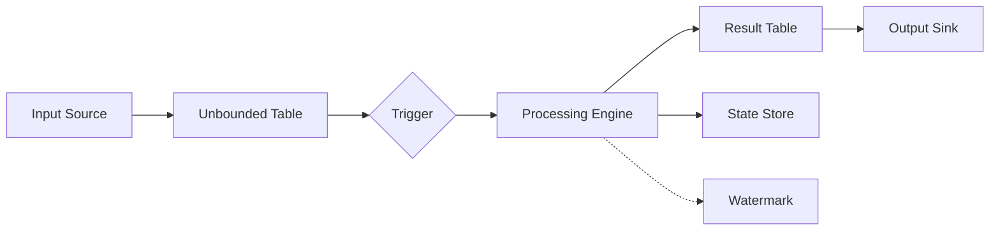

# Structured Streaming原理与代码实例讲解

## 1.背景介绍
### 1.1 大数据流处理的挑战
在当今大数据时代,海量数据以流的形式不断产生,如何实时、高效地处理这些数据流成为了一大挑战。传统的批处理模型难以满足实时性要求,而流处理框架如Storm、Flink等虽然可以实时处理数据,但编程模型复杂,容错性和一致性保证不足。

### 1.2 Structured Streaming的诞生
为了应对上述挑战,Databricks公司在Spark 2.0中引入了Structured Streaming。它建立在Spark SQL引擎之上,以Dataframe和Dataset API为基础,提供了一套类似批处理的高层次抽象编程模型,极大简化了流处理程序的编写。同时,它还继承了Spark SQL引擎的诸多优点,如catalyst优化器、tungsten计算引擎等,具有高性能和强大的容错性。

### 1.3 本文概述
本文将深入剖析Structured Streaming的原理和实现,包括其核心概念、编程模型、容错机制等。同时,我们还将通过代码实例来讲解如何使用Structured Streaming API进行流处理编程。最后,本文也会探讨Structured Streaming的实际应用场景和未来的发展方向。

## 2.核心概念与联系
### 2.1 无界表(Unbounded Table) 
Structured Streaming引入了无界表的概念。传统的表是有界的,数据集是固定的;而无界表代表一个不断增长的动态数据集,新的数据记录会不断追加到表中。

### 2.2 输入数据源
输入数据源表示流数据的来源。Structured Streaming支持多种输入源,包括:
- Kafka: 从Kafka读取数据 
- Socket: 从Socket连接读取数据
- File: 从文件系统目录读取文件数据
- Rate: 以固定速率生成数据

### 2.3 Trigger
Trigger定义了Structured Streaming程序多久会处理一次新到达的数据。常见的Trigger有:
- ProcessingTime: 根据固定的时间间隔如1秒触发
- Once: 只处理一次新数据就停止
- Continuous: 尽可能快地处理新数据,尽量减少延迟

### 2.4 输出模式
输出模式定义了处理结果的输出方式,包括:
- Append: 只输出新数据的处理结果
- Update: 只输出有更新的数据的最终结果 
- Complete: 输出所有数据的完整结果

### 2.5 Watermark
Watermark是一种处理乱序数据的机制。它用于跟踪数据的进度,筛选出迟到的数据。Structured Streaming根据指定的延迟阈值自动计算watermark。

### 2.6 状态存储
Structured Streaming的一些算子如聚合操作需要维护状态,状态默认存储在内存中,但也支持checkpoint到外部存储以实现容错。

### 2.7 概念联系
下图展示了Structured Streaming的核心概念以及它们之间的关系:



## 3.核心算法原理与具体步骤
### 3.1 Structured Streaming程序执行流程
1. 创建输入数据源,定义Schema
2. 定义数据处理逻辑,构建DataFrame/Dataset算子DAG图
3. 定义Trigger和输出模式
4. 启动StreamingQuery
5. Trigger触发后,从数据源读取一个Batch数据并处理
6. 将Batch处理结果写入结果表
7. 数据源有新数据到达后,重复5~7步骤

### 3.2 Incremental Query原理
Structured Streaming在每个Batch内部使用增量查询的方式处理数据。具体如下:

1. 从上一个Batch状态中读取所需的状态数据
2. 读取本Batch的新数据
3. 将状态数据和新数据一起处理,更新状态
4. 将计算结果写回结果表
5. 将更新后的状态写入状态存储

增量查询避免了每次都对全量数据进行重复计算,只关注新变化的数据,从而大幅提升计算效率。

### 3.3 容错恢复机制
Structured Streaming提供了端到端的Exactly-once语义保证,依赖Write-Ahead Log和Checkpoint机制实现:

1. 开启Checkpoint,定期将状态数据持久化到可靠存储
2. 每个Batch处理前,先写Offset范围到预写日志
3. Batch内所有数据处理成功后,更新状态并提交预写日志
4. 失败时,根据最近的Checkpoint状态恢复,重放WAL中的数据继续处理

Checkpoint和WAL能够保证每条数据只被处理一次,不多不少,从而实现端到端的Exactly-once。

## 4.数学模型和公式详解
### 4.1 无界表的数学定义
设数据流 $S$ 由一系列数据项 $e$ 组成,每个数据项 $e$ 带有时间戳 $t$,即 

$$S = \{e_1(t_1),e_2(t_2),...,e_n(t_n)\}$$

其中, $t_1 \leq t_2 \leq ... \leq t_n$

无界表 $UTable$ 可定义为:

$$UTable(t) = \{e | e \in S \wedge e.t \leq t\}$$  

即 $UTable(t)$ 包含了截止到时间 $t$ 的所有数据项。

### 4.2 Watermark的计算
Watermark用于处理乱序数据,其定义为:

$$Watermark(t) = t - \theta$$

其中,$t$为当前处理时间,$\theta$为指定的最大乱序延迟时间。

对于时间戳小于$Watermark(t)$的数据,可以认为已经迟到,可以选择丢弃或者更新之前的计算结果。

### 4.3 窗口聚合的数学定义
设窗口长度为 $L$,滑动步长为 $\delta$,则第$k$个窗口 $W_k$ 可表示为:

$$W_k = [k\delta, k\delta+L)$$

对于窗口 $W_k$,其聚合结果 $Agg_k$ 可以表示为:

$$Agg_k = \sum_{e \in UTable(k\delta+L) \wedge e.t \in W_k} f(e)$$

其中,$f$为聚合函数,如sum、count等。

Structured Streaming会在每个Trigger到达时计算当前窗口的聚合结果,并根据输出模式决定是否输出。

## 5.项目实践:代码实例与详解
下面我们通过一个实际的代码例子来演示如何使用Structured Streaming进行流处理。该例子从Socket接收数据,对每个单词进行计数,并将结果写入控制台。

```scala
import org.apache.spark.sql.functions._
import org.apache.spark.sql.SparkSession

object StructuredNetworkWordCount {
  def main(args: Array[String]): Unit = {
    val spark = SparkSession
      .builder
      .appName("StructuredNetworkWordCount")
      .getOrCreate()
    
    import spark.implicits._
    
    // 创建输入数据源
    val lines = spark
      .readStream
      .format("socket")
      .option("host", "localhost")
      .option("port", 9999)
      .load()
      
    // 定义数据处理逻辑  
    val words = lines.as[String].flatMap(_.split(" "))
    val wordCounts = words.groupBy("value").count()
    
    // 启动流式查询并输出结果
    val query = wordCounts
      .writeStream
      .outputMode("complete")
      .format("console")
      .start()
      
    query.awaitTermination()
  }
}
```

代码解析:

1. 首先创建一个SparkSession对象,它是Spark SQL的编程入口。

2. 使用`readStream`API创建一个Streaming DataFrame,数据源指定为Socket,监听本地9999端口。

3. 对输入的行数据进行处理,先把每行按空格split成单词,然后按单词分组count。这里体现了DataFrame API的强大之处,仅用一行代码就完成了单词计数。

4. 调用`writeStream` API将处理后的DataFrame写入输出接收器。这里指定输出模式为complete,即每次都输出完整结果到控制台。

5. 启动StreamingQuery并等待终止。在程序运行期间,可以往9999端口发送数据,就能看到实时的单词计数结果输出。

可以看到,得益于Structured Streaming的高层次抽象,我们只需要几十行代码就可以实现一个实时的流处理程序。相比之下,如果使用Storm或Flink等其他流处理框架,代码量和复杂度要高出很多。

## 6.实际应用场景
Structured Streaming目前已经在工业界得到了广泛应用,一些典型的应用场景包括:

### 6.1 实时ETL
使用Structured Streaming从Kafka等数据源读取原始数据,经过清洗、转换等ETL处理后写入数据库或数据仓库,可以实现实时的数据同步和集成。

### 6.2 实时数据分析
对流式数据进行实时统计分析,如计算各种指标的移动平均值、Top N等,可以实现实时的数据洞察和决策支持。

### 6.3 异常检测
通过对实时数据进行规则或模式匹配,可以实现实时的异常行为检测和告警,如欺诈检测、设备故障检测等。

### 6.4 物联网数据处理
对物联网设备产生的海量传感器数据进行实时处理,如聚合、关联分析等,可以实现智能设备的实时监控和优化。

## 7.工具和资源推荐
### 7.1 官方文档
- [Structured Streaming Programming Guide](http://spark.apache.org/docs/latest/structured-streaming-programming-guide.html)
- [Structured Streaming Kafka Integration Guide](http://spark.apache.org/docs/latest/structured-streaming-kafka-integration.html)

### 7.2 第三方工具
- [spark-daria](https://github.com/MrPowers/spark-daria): 一个方便进行Structured Streaming单元测试的工具库。
- [spark-fast-tests](https://github.com/MrPowers/spark-fast-tests): 同样用于加速Structured Streaming程序的单元测试。

### 7.3 应用案例
- [Databricks Structured Streaming ETL](https://databricks.com/blog/2017/04/04/real-time-end-to-end-integration-with-apache-kafka-in-apache-sparks-structured-streaming.html): 使用Structured Streaming实现端到端的实时ETL案例
- [Databricks Structured Streaming Aggregation](https://databricks.com/blog/2017/05/08/event-time-aggregation-watermarking-apache-sparks-structured-streaming.html): 使用Structured Streaming进行基于事件时间的流式聚合

## 8.总结:未来发展与挑战
### 8.1 未来发展方向
- 深度学习支持:计划引入Deep Learning Pipelines,支持在流数据上进行深度学习训练和推理。
- 机器学习支持:加强对在线学习算法的支持,提供开箱即用的流式机器学习Pipeline。
- SQL支持:进一步完善对Streaming SQL的支持,提供更加完整的语法和语义。
- 性能优化:持续优化内存管理、序列化、任务调度等,进一步提升性能。

### 8.2 面临的挑战
- 高效处理乱序数据:如何权衡准确性和延迟,更高效地处理乱序数据。
- 动态调整并行度:如何根据数据特征和到达率动态调整并行度,提升资源利用率。
- 增量机器学习:如何高效支持流数据上的增量机器学习训练。

## 9.附录:常见问题解答
### 9.1 Structured Streaming和Spark Streaming的区别?
Spark Streaming基于DStream API,属于较低层次的抽象;Structured Streaming基于DataFrame/Dataset API,提供了更高层次的声明式API,使用更加简单。同时,Structured Streaming能够充分利用Spark SQL引擎的优化,性能更好。

### 9.2 Structured Streaming支持Exactly-once语义吗?
支持。Structured Streaming提供了端到端的Exactly-once语义保证,通过Checkpoint和预写日志机制实现。

### 9.3 Structured Streaming支持流数据Join批数据吗?
支持。Structured Streaming允许将输入的流数据与静态数据集或另一个流进行Join,完全类似于静态DataFrame/Dataset的Join操作。

### 9.4 Structured Streaming有何局限性?
- 不支持链接Streaming DataFrame/Dataset与另一个Streaming DataFrame/Dataset
- 输出模式的局限:Append模式不支持聚合操作