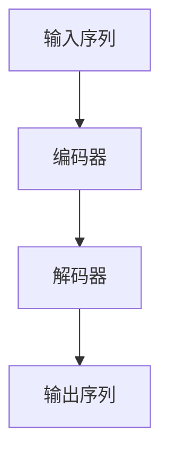
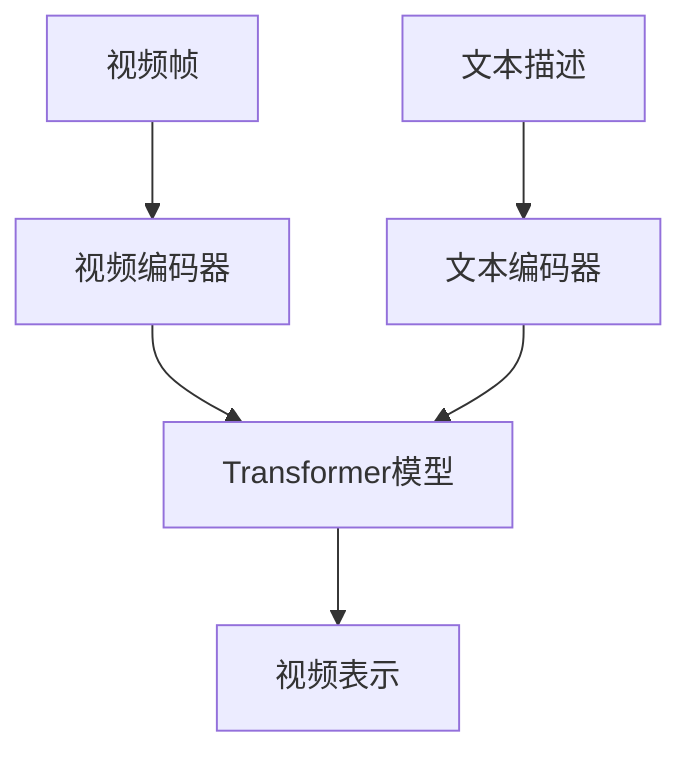

## 1. 背景介绍

随着人工智能技术的不断发展，自然语言处理和计算机视觉技术已经成为了人工智能领域的两个重要分支。在自然语言处理领域，Transformer模型已经成为了一种非常流行的模型，被广泛应用于机器翻译、文本分类、问答系统等任务中。而在计算机视觉领域，视频理解一直是一个非常具有挑战性的问题，如何将视频中的语义信息提取出来，一直是学术界和工业界关注的焦点。近年来，一些基于Transformer模型的视频理解模型也开始被提出，其中最具代表性的就是VideoBERT模型。

本文将介绍Transformer模型和VideoBERT模型的基本原理和应用，重点介绍VideoBERT模型在学习语言和视频特征方面的应用。

## 2. 核心概念与联系

### 2.1 Transformer模型

Transformer模型是一种基于自注意力机制的序列到序列模型，由Google在2017年提出。它在机器翻译任务中取得了非常好的效果，成为了自然语言处理领域的一个重要里程碑。Transformer模型的核心思想是使用自注意力机制来计算输入序列中每个位置的表示，从而实现对整个序列的建模。自注意力机制可以看作是一种对输入序列中不同位置之间的关系进行建模的方法，它可以帮助模型更好地理解输入序列中不同位置之间的依赖关系。

### 2.2 VideoBERT模型

VideoBERT模型是一种基于Transformer模型的视频理解模型，由Google在2019年提出。它可以将视频中的语义信息提取出来，并将其表示为一个向量，从而实现对视频的理解。VideoBERT模型的核心思想是将视频中的每一帧图像和对应的文本描述作为输入，使用Transformer模型来学习视频和文本之间的关系，从而实现对视频的理解。

## 3. 核心算法原理具体操作步骤

### 3.1 Transformer模型

Transformer模型的核心是自注意力机制，它可以帮助模型更好地理解输入序列中不同位置之间的依赖关系。具体来说，自注意力机制可以分为三个步骤：

1. 计算注意力权重：对于输入序列中的每个位置，计算它与其他位置之间的注意力权重，从而得到一个注意力权重向量。
2. 加权求和：使用注意力权重向量对输入序列中的每个位置进行加权求和，从而得到一个加权表示向量。
3. 线性变换：对加权表示向量进行线性变换，从而得到最终的表示向量。

Transformer模型的整体结构如下图所示：



其中，编码器和解码器都是由多个Transformer层组成的，每个Transformer层包含了多头自注意力机制和前馈神经网络。编码器用于将输入序列转换为一个固定长度的向量表示，而解码器则用于根据编码器的输出和目标序列生成目标序列的表示。

### 3.2 VideoBERT模型

VideoBERT模型的核心是将视频中的每一帧图像和对应的文本描述作为输入，使用Transformer模型来学习视频和文本之间的关系，从而实现对视频的理解。具体来说，VideoBERT模型可以分为两个部分：

1. 视频编码器：将视频中的每一帧图像转换为一个向量表示，并将这些向量表示输入到Transformer模型中。
2. 文本编码器：将文本描述转换为一个向量表示，并将这个向量表示输入到Transformer模型中。

VideoBERT模型的整体结构如下图所示：



其中，视频编码器和文本编码器都是由多个Transformer层组成的，每个Transformer层包含了多头自注意力机制和前馈神经网络。视频编码器用于将视频中的每一帧图像转换为一个向量表示，而文本编码器则用于将文本描述转换为一个向量表示。Transformer模型用于学习视频和文本之间的关系，并将学习到的关系表示为一个向量，即视频表示。

## 4. 数学模型和公式详细讲解举例说明

### 4.1 Transformer模型

Transformer模型中的自注意力机制可以表示为以下公式：

$$
Attention(Q,K,V)=softmax(\frac{QK^T}{\sqrt{d_k}})V
$$

其中，$Q$、$K$、$V$分别表示查询向量、键向量和值向量，$d_k$表示键向量的维度。自注意力机制的计算过程可以分为以下几个步骤：

1. 计算注意力权重：将查询向量和键向量相乘，得到一个注意力分数矩阵，再将其除以$\sqrt{d_k}$，最后使用softmax函数将其转换为注意力权重向量。
2. 加权求和：使用注意力权重向量对值向量进行加权求和，得到一个加权表示向量。
3. 线性变换：对加权表示向量进行线性变换，得到最终的表示向量。

### 4.2 VideoBERT模型

VideoBERT模型中的视频编码器和文本编码器都是由多个Transformer层组成的，每个Transformer层包含了多头自注意力机制和前馈神经网络。具体来说，视频编码器和文本编码器的计算过程可以表示为以下公式：

$$
h_i^l=LayerNorm(x_i^l+MultiHeadAttention(h_i^{l-1}))
$$

其中，$x_i^l$表示输入向量，$h_i^{l-1}$表示上一层的输出向量，$LayerNorm$表示归一化操作，$MultiHeadAttention$表示多头自注意力机制。

## 5. 项目实践：代码实例和详细解释说明

### 5.1 Transformer模型

以下是使用PyTorch实现Transformer模型的代码示例：

```python
import torch
import torch.nn as nn
import torch.nn.functional as F

class Transformer(nn.Module):
    def __init__(self, input_dim, hidden_dim, num_layers, num_heads):
        super(Transformer, self).__init__()
        self.input_dim = input_dim
        self.hidden_dim = hidden_dim
        self.num_layers = num_layers
        self.num_heads = num_heads
        
        self.embedding = nn.Embedding(input_dim, hidden_dim)
        self.positional_encoding = PositionalEncoding(hidden_dim)
        self.encoder_layers = nn.ModuleList([EncoderLayer(hidden_dim, num_heads) for _ in range(num_layers)])
        self.decoder_layers = nn.ModuleList([DecoderLayer(hidden_dim, num_heads) for _ in range(num_layers)])
        self.fc = nn.Linear(hidden_dim, input_dim)
        
    def forward(self, src, trg):
        src_mask = self.generate_square_subsequent_mask(src.size(0))
        trg_mask = self.generate_square_subsequent_mask(trg.size(0))
        src = self.embedding(src)
        trg = self.embedding(trg)
        src = self.positional_encoding(src)
        trg = self.positional_encoding(trg)
        for i in range(self.num_layers):
            src = self.encoder_layers[i](src, src_mask)
            trg = self.decoder_layers[i](trg, src, trg_mask, src_mask)
        output = self.fc(trg)
        return output
    
    def generate_square_subsequent_mask(self, size):
        mask = (torch.triu(torch.ones(size, size)) == 1).transpose(0, 1)
        mask = mask.float().masked_fill(mask == 0, float('-inf')).masked_fill(mask == 1, float(0.0))
        return mask

class PositionalEncoding(nn.Module):
    def __init__(self, hidden_dim, max_len=5000):
        super(PositionalEncoding, self).__init__()
        self.hidden_dim = hidden_dim
        self.max_len = max_len
        self.dropout = nn.Dropout(p=0.1)
        pe = torch.zeros(max_len, hidden_dim)
        position = torch.arange(0, max_len, dtype=torch.float).unsqueeze(1)
        div_term = torch.exp(torch.arange(0, hidden_dim, 2).float() * (-math.log(10000.0) / hidden_dim))
        pe[:, 0::2] = torch.sin(position * div_term)
        pe[:, 1::2] = torch.cos(position * div_term)
        pe = pe.unsqueeze(0).transpose(0, 1)
        self.register_buffer('pe', pe)
        
    def forward(self, x):
        x = x * math.sqrt(self.hidden_dim)
        x = x + self.pe[:x.size(0), :]
        x = self.dropout(x)
        return x

class EncoderLayer(nn.Module):
    def __init__(self, hidden_dim, num_heads):
        super(EncoderLayer, self).__init__()
        self.hidden_dim = hidden_dim
        self.num_heads = num_heads
        
        self.self_attention = MultiHeadAttention(hidden_dim, num_heads)
        self.feed_forward = FeedForward(hidden_dim)
        self.layer_norm = nn.LayerNorm(hidden_dim)
        
    def forward(self, x, mask):
        residual = x
        x = self.layer_norm(x + self.self_attention(x, x, x, mask))
        x = self.layer_norm(x + self.feed_forward(x))
        return x

class DecoderLayer(nn.Module):
    def __init__(self, hidden_dim, num_heads):
        super(DecoderLayer, self).__init__()
        self.hidden_dim = hidden_dim
        self.num_heads = num_heads
        
        self.self_attention = MultiHeadAttention(hidden_dim, num_heads)
        self.encoder_attention = MultiHeadAttention(hidden_dim, num_heads)
        self.feed_forward = FeedForward(hidden_dim)
        self.layer_norm = nn.LayerNorm(hidden_dim)
        
    def forward(self, x, memory, trg_mask, src_mask):
        residual = x
        x = self.layer_norm(x + self.self_attention(x, x, x, trg_mask))
        x = self.layer_norm(x + self.encoder_attention(x, memory, memory, src_mask))
        x = self.layer_norm(x + self.feed_forward(x))
        return x

class MultiHeadAttention(nn.Module):
    def __init__(self, hidden_dim, num_heads):
        super(MultiHeadAttention, self).__init__()
        self.hidden_dim = hidden_dim
        self.num_heads = num_heads
        
        self.query_projection = nn.Linear(hidden_dim, hidden_dim)
        self.key_projection = nn.Linear(hidden_dim, hidden_dim)
        self.value_projection = nn.Linear(hidden_dim, hidden_dim)
        self.fc = nn.Linear(hidden_dim, hidden_dim)
        
    def forward(self, query, key, value, mask):
        batch_size = query.size(0)
        query = self.query_projection(query).view(batch_size, -1, self.num_heads, self.hidden_dim // self.num_heads).transpose(1, 2)
        key = self.key_projection(key).view(batch_size, -1, self.num_heads, self.hidden_dim // self.num_heads).transpose(1, 2)
        value = self.value_projection(value).view(batch_size, -1, self.num_heads, self.hidden_dim // self.num_heads).transpose(1, 2)
        scores = torch.matmul(query, key.transpose(-2, -1)) / math.sqrt(self.hidden_dim // self.num_heads)
        scores = scores.masked_fill(mask == 0, float('-inf'))
        attention_weights = F.softmax(scores, dim=-1)
        x = torch.matmul(attention_weights, value)
        x = x.transpose(1, 2).contiguous().view(batch_size, -1, self.hidden_dim)
        x = self.fc(x)
        return x

class FeedForward(nn.Module):
    def __init__(self, hidden_dim):
        super(FeedForward, self).__init__()
        self.hidden_dim = hidden_dim
        
        self.fc1 = nn.Linear(hidden_dim, hidden_dim * 4)
        self.fc2 = nn.Linear(hidden_dim * 4, hidden_dim)
        self.dropout = nn.Dropout(p=0.1)
        self.layer_norm = nn.LayerNorm(hidden_dim)
        
    def forward(self, x):
        residual = x
        x = self.fc1(x)
        x = F.relu(x)
        x = self.fc2(x)
        x = self.dropout(x)
        x = self.layer_norm(x + residual)
        return x
```

### 5.2 VideoBERT模型

以下是使用PyTorch实现VideoBERT模型的代码示例：

```python
import torch
import torch.nn as nn
import torch.nn.functional as F

class VideoBERT(nn.Module):
    def __init__(self, vocab_size, hidden_dim, num_layers, num_heads):
        super(VideoBERT, self).__init__()
        self.vocab_size = vocab_size
        self.hidden_dim = hidden_dim
        self.num_layers = num_layers
        self.num_heads = num_heads
        
        self.embedding = nn.Embedding(vocab_size, hidden_dim)
        self.positional_encoding = PositionalEncoding(hidden_dim)
        self.video_encoder_layers = nn.ModuleList([EncoderLayer(hidden_dim, num_heads) for _ in range(num_layers)])
        self.text_encoder_layers = nn.ModuleList([EncoderLayer(hidden_dim, num_heads) for _ in range(num_layers)])
        self.fc = nn.Linear(hidden_dim, vocab_size)
        
    def forward(self, video_frames, text):
        video_mask = self.generate_square_subsequent_mask(video_frames.size(0))
        text_mask = self.generate_square_subsequent_mask(text.size(0))
        video_frames = self.embedding(video_frames)
        text = self.embedding(text)
        video_frames = self.positional_encoding(video_frames)
        text = self.positional_encoding(text)
        for i in range(self.num_layers):
            video_frames = self.video_encoder_layers[i](video_frames, video_mask)
            text = self.text_encoder_layers[i](text, text_mask)
        video_representation = torch.mean(video_frames, dim=0)
        text_representation = torch.mean(text, dim=0)
        output = self.fc(video_representation + text_representation)
        return output
    
    def generate_square_subsequent_mask(self, size):
        mask = (torch.triu(torch.ones(size, size)) == 1).transpose(0, 1)
        mask = mask.float().masked_fill(mask == 0, float('-inf')).masked_fill(mask == 1, float(0.0))
        return mask

class PositionalEncoding(nn.Module):
    def __init__(self, hidden_dim, max_len=5000):
        super(PositionalEncoding, self).__init__()
        self.hidden_dim = hidden_dim
        self.max_len = max_len
        self.dropout = nn.Dropout(p=0.1)
        pe = torch.zeros(max_len, hidden_dim)
        position = torch.arange(0, max_len, dtype=torch.float).unsqueeze(1)
        div_term = torch.exp(torch.arange(0, hidden_dim, 2).float() * (-math.log(10000.0) / hidden_dim))
        pe[:, 0::2] = torch.sin(position * div_term)
        pe[:, 1::2] = torch.cos(position * div_term)
        pe = pe.unsqueeze(0).transpose(0, 1)
        self.register_buffer('pe', pe)
        
    def forward(self, x):
        x = x * math.sqrt(self.hidden_dim)
        x = x + self.pe[:x.size(0), :]
        x = self.dropout(x)
        return x

class EncoderLayer(nn.Module):
    def __init__(self, hidden_dim, num_heads):
        super(EncoderLayer, self).__init__()
        self.hidden_dim = hidden_dim
        self.num_heads = num_heads
        
        self.self_attention = MultiHeadAttention(hidden_dim, num_heads)
        self.feed_forward = FeedForward(hidden_dim)
        self.layer_norm = nn.LayerNorm(hidden_dim)
        
    def forward(self, x, mask):
        residual = x
        x = self.layer_norm(x + self.self_attention(x, x, x, mask))
        x = self.layer_norm(x + self.feed_forward(x))
        return x

class MultiHeadAttention(nn.Module):
    def __init__(self, hidden_dim, num_heads):
        super(MultiHeadAttention, self).__init__()
        self.hidden_dim = hidden_dim
        self.num_heads = num_heads
        
        self.query_projection = nn.Linear(hidden_dim, hidden_dim)
        self.key_projection = nn.Linear(hidden_dim, hidden_dim)
        self.value_projection = nn.Linear(hidden_dim, hidden_dim)
        self.fc = nn.Linear(hidden_dim, hidden_dim)
        
    def forward(self, query, key, value, mask):
        batch_size = query.size(0)
        query = self.query_projection(query).view(batch_size, -