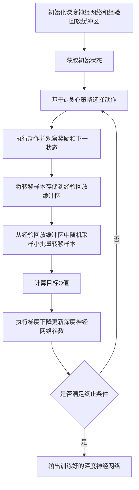

# deep Q-Learning原理与代码实例讲解

## 1. 背景介绍
### 1.1 强化学习概述
#### 1.1.1 强化学习的定义
#### 1.1.2 强化学习的特点
#### 1.1.3 强化学习的应用领域

### 1.2 Q-Learning算法
#### 1.2.1 Q-Learning的起源与发展
#### 1.2.2 Q-Learning的基本思想
#### 1.2.3 Q-Learning的优缺点

### 1.3 deep Q-Learning算法
#### 1.3.1 deep Q-Learning的提出背景
#### 1.3.2 deep Q-Learning的核心思想
#### 1.3.3 deep Q-Learning的优势

## 2. 核心概念与联系
### 2.1 状态(State)
#### 2.1.1 状态的定义
#### 2.1.2 状态的表示方法
#### 2.1.3 状态空间(State Space)

### 2.2 动作(Action) 
#### 2.2.1 动作的定义
#### 2.2.2 动作的表示方法  
#### 2.2.3 动作空间(Action Space)

### 2.3 奖励(Reward)
#### 2.3.1 奖励的定义
#### 2.3.2 奖励函数的设计原则
#### 2.3.3 即时奖励与累积奖励

### 2.4 策略(Policy)
#### 2.4.1 策略的定义
#### 2.4.2 确定性策略与随机性策略
#### 2.4.3 最优策略(Optimal Policy)

### 2.5 Q值(Q-value)
#### 2.5.1 Q值的定义
#### 2.5.2 Q值的更新方法
#### 2.5.3 Q值的收敛性

### 2.6 深度神经网络(Deep Neural Network)
#### 2.6.1 深度学习的基本概念
#### 2.6.2 深度神经网络的结构
#### 2.6.3 深度神经网络在强化学习中的应用

### 2.7 经验回放(Experience Replay)
#### 2.7.1 经验回放的作用
#### 2.7.2 经验回放的实现方法
#### 2.7.3 经验回放的优点

### 2.8 探索与利用(Exploration and Exploitation)
#### 2.8.1 探索与利用的概念
#### 2.8.2 ε-贪心策略
#### 2.8.3 探索与利用的平衡

## 3. 核心算法原理具体操作步骤
### 3.1 Q-Learning算法步骤
#### 3.1.1 初始化Q表
#### 3.1.2 选择动作
#### 3.1.3 执行动作并观察奖励和下一状态
#### 3.1.4 更新Q表
#### 3.1.5 重复步骤3.1.2到3.1.4直到收敛

### 3.2 deep Q-Learning算法步骤 
#### 3.2.1 初始化深度神经网络
#### 3.2.2 初始化经验回放缓冲区
#### 3.2.3 获取初始状态
#### 3.2.4 基于ε-贪心策略选择动作
#### 3.2.5 执行动作并观察奖励和下一状态
#### 3.2.6 将转移样本存储到经验回放缓冲区
#### 3.2.7 从经验回放缓冲区中随机采样小批量转移样本
#### 3.2.8 计算目标Q值
#### 3.2.9 执行梯度下降,更新深度神经网络参数
#### 3.2.10 重复步骤3.2.4到3.2.9,直到满足终止条件

### 3.3 deep Q-Learning算法流程图



## 4. 数学模型和公式详细讲解举例说明
### 4.1 马尔可夫决策过程(Markov Decision Process, MDP)
#### 4.1.1 MDP的定义
MDP 是一个五元组 $<S,A,P,R,\gamma>$,其中:
- $S$ 是有限的状态集合
- $A$ 是有限的动作集合
- $P$ 是状态转移概率矩阵,其中 $P_{ss'}^a$ 表示在状态 $s$ 下执行动作 $a$ 后转移到状态 $s'$ 的概率
- $R$ 是奖励函数,其中 $R_s^a$ 表示在状态 $s$ 下执行动作 $a$ 后获得的即时奖励
- $\gamma \in [0,1]$ 是折扣因子,用于平衡即时奖励和未来奖励

#### 4.1.2 MDP的最优策略
在MDP中,最优策略 $\pi^*$ 满足贝尔曼最优方程:

$$V^*(s)=\max_{a \in A} \left\{ R_s^a+\gamma \sum_{s' \in S}P_{ss'}^a V^*(s') \right\}, \forall s \in S$$

其中 $V^*(s)$ 表示在状态 $s$ 下采取最优策略时的状态值函数。

### 4.2 Q-Learning的数学模型
#### 4.2.1 Q函数的定义
Q函数 $Q(s,a)$ 表示在状态 $s$ 下执行动作 $a$ 的动作值函数,即在状态 $s$ 下执行动作 $a$ 后的期望累积奖励:

$$Q(s,a)=\mathbb{E}\left[\sum_{t=0}^{\infty} \gamma^t r_t | s_0=s,a_0=a,\pi \right]$$

其中 $r_t$ 表示在时刻 $t$ 获得的即时奖励。

#### 4.2.2 Q函数的更新规则
Q-Learning使用时间差分(Temporal Difference, TD)误差来更新Q函数:

$$Q(s_t,a_t) \leftarrow Q(s_t,a_t)+\alpha \left[r_t+\gamma \max_{a}Q(s_{t+1},a)-Q(s_t,a_t)\right]$$

其中 $\alpha \in (0,1]$ 是学习率。

### 4.3 deep Q-Learning的数学模型
#### 4.3.1 深度神经网络作为Q函数近似
在deep Q-Learning中,使用深度神经网络 $Q(s,a;\theta)$ 来近似Q函数,其中 $\theta$ 表示神经网络的参数。

#### 4.3.2 损失函数的定义
deep Q-Learning的目标是最小化时间差分误差的平方,即最小化如下损失函数:

$$L(\theta)=\mathbb{E}_{(s,a,r,s')\sim D}\left[\left(r+\gamma \max_{a'}Q(s',a';\theta^-)-Q(s,a;\theta)\right)^2\right]$$

其中 $D$ 表示经验回放缓冲区, $\theta^-$ 表示目标网络的参数。

#### 4.3.3 参数更新规则
使用梯度下降法来最小化损失函数,更新神经网络参数:

$$\theta \leftarrow \theta-\alpha \nabla_{\theta}L(\theta)$$

其中 $\alpha$ 是学习率。

## 5. 项目实践:代码实例和详细解释说明
下面给出一个使用PyTorch实现deep Q-Learning玩CartPole游戏的代码示例:

```python
import gym
import math
import random
import numpy as np
import matplotlib.pyplot as plt
from collections import namedtuple, deque
from itertools import count

import torch
import torch.nn as nn
import torch.optim as optim
import torch.nn.functional as F

env = gym.make('CartPole-v0').unwrapped

# 超参数设置
BATCH_SIZE = 128
GAMMA = 0.999
EPS_START = 0.9
EPS_END = 0.05
EPS_DECAY = 200
TARGET_UPDATE = 10

# 设备选择
device = torch.device("cuda" if torch.cuda.is_available() else "cpu")

# 定义经验回放缓冲区
Transition = namedtuple('Transition',
                        ('state', 'action', 'next_state', 'reward'))

class ReplayMemory(object):

    def __init__(self, capacity):
        self.memory = deque([],maxlen=capacity)

    def push(self, *args):
        """保存转移样本"""
        self.memory.append(Transition(*args))

    def sample(self, batch_size):
        return random.sample(self.memory, batch_size)

    def __len__(self):
        return len(self.memory)

# 定义深度Q网络
class DQN(nn.Module):

    def __init__(self, h, w, outputs):
        super(DQN, self).__init__()
        self.conv1 = nn.Conv2d(3, 16, kernel_size=5, stride=2)
        self.bn1 = nn.BatchNorm2d(16)
        self.conv2 = nn.Conv2d(16, 32, kernel_size=5, stride=2)
        self.bn2 = nn.BatchNorm2d(32)
        self.conv3 = nn.Conv2d(32, 32, kernel_size=5, stride=2)
        self.bn3 = nn.BatchNorm2d(32)

        def conv2d_size_out(size, kernel_size = 5, stride = 2):
            return (size - (kernel_size - 1) - 1) // stride  + 1
        convw = conv2d_size_out(conv2d_size_out(conv2d_size_out(w)))
        convh = conv2d_size_out(conv2d_size_out(conv2d_size_out(h)))
        linear_input_size = convw * convh * 32
        self.head = nn.Linear(linear_input_size, outputs)

    def forward(self, x):
        x = x.to(device)
        x = F.relu(self.bn1(self.conv1(x)))
        x = F.relu(self.bn2(self.conv2(x)))
        x = F.relu(self.bn3(self.conv3(x)))
        return self.head(x.view(x.size(0), -1))

# 定义智能体
class Agent():
    
    def __init__(self, h, w, n_actions):
        self.n_actions = n_actions
        self.policy_net = DQN(h, w, n_actions).to(device)
        self.target_net = DQN(h, w, n_actions).to(device)
        self.target_net.load_state_dict(self.policy_net.state_dict())
        self.target_net.eval()
        
        self.optimizer = optim.RMSprop(self.policy_net.parameters())
        self.memory = ReplayMemory(10000)
        
        self.steps_done = 0
    
    def select_action(self, state):
        sample = random.random()
        eps_threshold = EPS_END + (EPS_START - EPS_END) * \
            math.exp(-1. * self.steps_done / EPS_DECAY)
        self.steps_done += 1
        if sample > eps_threshold:
            with torch.no_grad():
                return self.policy_net(state).max(1)[1].view(1, 1)
        else:
            return torch.tensor([[random.randrange(self.n_actions)]], device=device, dtype=torch.long)
    
    def optimize_model(self):
        if len(self.memory) < BATCH_SIZE:
            return
        transitions = self.memory.sample(BATCH_SIZE)
        batch = Transition(*zip(*transitions))
        
        non_final_mask = torch.tensor(tuple(map(lambda s: s is not None,
                                              batch.next_state)), device=device, dtype=torch.bool)
        non_final_next_states = torch.cat([s for s in batch.next_state
                                                    if s is not None])
        state_batch = torch.cat(batch.state)
        action_batch = torch.cat(batch.action)
        reward_batch = torch.cat(batch.reward)
        
        state_action_values = self.policy_net(state_batch).gather(1, action_batch)
        
        next_state_values = torch.zeros(BATCH_SIZE, device=device)
        next_state_values[non_final_mask] = self.target_net(non_final_next_states).max(1)[0].detach()
        
        expected_state_action_values = (next_state_values * GAMMA) + reward_batch
        
        criterion = nn.SmoothL1Loss()
        loss = criterion(state_action_values, expected_state_action_values.unsqueeze(1))
        
        self.optimizer.zero_grad()
        loss.backward()
        for param in self.policy_net.parameters():
            param.grad.data.clamp_(-1, 1)
        self.optimizer.step()

# 训练智能体
agent = Agent(env.observation_space.shape[0], env.action_space.n)

num_episodes = 500
for i_episode in range(num_episodes):
    
    state = env.reset()
    state = torch.from_numpy(state).float().unsqueeze(0).to(device)
    
    for t in count():
        action = agent.select_action(state)
        next_state, reward, done, _ = env.step(action.item())
        reward = torch.tensor([reward], device=device)
        
        