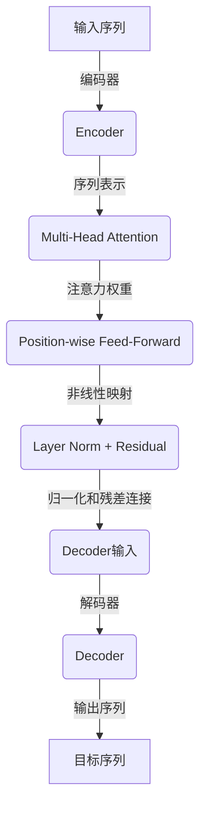

# transformer

## 1. 背景介绍

在自然语言处理(NLP)和序列数据建模领域,Transformer模型是一种革命性的架构,它完全依赖于注意力机制来捕捉输入序列和输出序列之间的长期依赖关系。Transformer模型最初由Google Brain团队在2017年提出,用于解决机器翻译任务,取得了比以往基于循环神经网络(RNN)和卷积神经网络(CNN)的模型更好的性能。

传统的序列模型如RNN和LSTM等,存在一些固有的缺陷,例如:

1. **梯度消失/爆炸问题**: 在训练过程中,梯度可能会随着时间步的增加而急剧减小或增大,导致模型难以学习长期依赖关系。

2. **序列计算的并行化困难**: RNN和LSTM的计算是按时间步骤严格递推进行的,无法实现高效的并行计算。

3. **路径长度限制**: 对于较长的序列,信息传递路径会变得很长,模型难以有效地捕捉远程依赖关系。

Transformer通过完全基于注意力机制的设计,成功克服了上述问题,实现了更好的并行计算能力和长期依赖建模能力。它的出现为NLP领域带来了新的发展机遇。

## 2. 核心概念与联系

Transformer模型的核心思想是利用**自注意力(Self-Attention)机制**来捕捉输入序列中任意两个位置之间的依赖关系,而不再依赖于序列顺序或者卷积核的大小。自注意力机制能够直接对输入序列中的任意两个位置进行关联,从而更好地建模长期依赖关系。

Transformer包含两个主要子模块:

1. **Encoder(编码器)**: 对输入序列进行编码,生成对应的序列表示。

2. **Decoder(解码器)**: 接收Encoder的输出,并生成目标序列。

编码器和解码器都由多个相同的层组成,每一层都包含以下几个核心组件:

1. **Multi-Head Attention(多头注意力机制)**: 捕捉序列中任意两个位置之间的依赖关系。

2. **Position-wise Feed-Forward Network(逐位置前馈网络)**: 对序列的每个位置进行相同的前馈网络变换,实现非线性映射。

3. **Residual Connection(残差连接)和Layer Normalization(层归一化)**: 用于促进梯度传播和加速训练收敛。

Transformer架构中没有卷积或循环操作,完全依赖于注意力机制来捕捉序列中元素之间的依赖关系,从而实现了高效的并行计算和长期依赖建模能力。

## 3. 核心算法原理具体操作步骤

### 3.1 注意力机制(Attention Mechanism)

注意力机制是Transformer的核心,它能够捕捉输入序列中任意两个位置之间的依赖关系。给定一个查询(Query)向量和一组键值(Key-Value)对向量,注意力机制会计算查询向量与每个键向量之间的相似性得分,并根据这些得分对值向量进行加权求和,生成注意力向量作为查询的表示。

具体计算步骤如下:

1. 计算查询向量与所有键向量之间的相似性得分:

   $$\text{Score}(Q, K) = \frac{QK^T}{\sqrt{d_k}}$$

   其中,$Q$是查询向量,$K$是键向量,$d_k$是键向量的维度,除以$\sqrt{d_k}$是为了防止内积值过大导致softmax饱和。

2. 对相似性得分进行softmax归一化,得到注意力权重:

   $$\text{Attention}(Q, K, V) = \text{softmax}(\frac{QK^T}{\sqrt{d_k}})V$$

   其中,$V$是值向量。

3. 将注意力权重与值向量相乘,得到注意力向量,作为查询向量的表示。

### 3.2 多头注意力机制(Multi-Head Attention)

为了捕捉不同的子空间表示,Transformer使用了多头注意力机制。具体做法是将查询、键、值向量先进行线性变换,分别投影到不同的子空间,然后在每个子空间内计算注意力,最后将所有子空间的注意力向量拼接起来作为最终的注意力表示。

具体计算步骤如下:

1. 线性投影:将查询、键、值向量分别投影到$h$个子空间,得到$Q_i,K_i,V_i(i=1,2,...,h)$。

   $$\begin{aligned}
   Q_i &= QW_i^Q \\
   K_i &= KW_i^K \\
   V_i &= VW_i^V
   \end{aligned}$$

   其中,$W_i^Q,W_i^K,W_i^V$是可学习的线性变换参数。

2. 在每个子空间内计算注意力:

   $$\text{head}_i = \text{Attention}(Q_i, K_i, V_i)$$

3. 将所有子空间的注意力向量拼接:

   $$\text{MultiHead}(Q, K, V) = \text{Concat}(\text{head}_1, \text{head}_2, ..., \text{head}_h)W^O$$

   其中,$W^O$是另一个可学习的线性变换参数,用于将拼接后的向量映射回原始的向量空间。

通过多头注意力机制,Transformer能够从不同的子空间获取不同的表示,提高了模型的表达能力。

### 3.3 位置编码(Positional Encoding)

由于Transformer没有使用卷积或循环操作,因此需要一种方式来注入序列的位置信息。Transformer使用了位置编码(Positional Encoding)的方法,为每个位置添加一个位置向量,使模型能够区分不同位置的元素。

位置编码向量是通过正弦和余弦函数计算得到的,公式如下:

$$\begin{aligned}
\text{PE}_{(pos, 2i)} &= \sin\left(\frac{pos}{10000^{2i/d_\text{model}}}\right) \\
\text{PE}_{(pos, 2i+1)} &= \cos\left(\frac{pos}{10000^{2i/d_\text{model}}}\right)
\end{aligned}$$

其中,$pos$是位置索引,$i$是维度索引,$d_\text{model}$是向量的维度。

位置编码向量会与输入向量相加,从而将位置信息注入到Transformer的计算过程中。

### 3.4 前馈网络(Feed-Forward Network)

在每个编码器和解码器层中,除了多头注意力子层之外,还包含一个前馈网络子层,用于对每个位置的向量进行非线性变换。前馈网络由两个线性变换和一个ReLU激活函数组成:

$$\text{FFN}(x) = \max(0, xW_1 + b_1)W_2 + b_2$$

其中,$W_1,W_2$是可学习的线性变换参数,$b_1,b_2$是可学习的偏置项。前馈网络可以应用于整个序列,实现高效的并行计算。

### 3.5 残差连接和层归一化(Residual Connection and Layer Normalization)

为了促进梯度传播和加速训练收敛,Transformer在每个子层之后使用了残差连接和层归一化操作。

残差连接是将子层的输出与输入相加,公式如下:

$$x' = \text{LayerNorm}(x + \text{Sublayer}(x))$$

其中,$\text{Sublayer}(x)$表示子层的输出,$x$是子层的输入。

层归一化是对输入进行归一化处理,以加速训练收敛。具体做法是对每个样本的每个特征进行归一化,公式如下:

$$y = \frac{x - \mathbb{E}[x]}{\sqrt{\text{Var}[x] + \epsilon}} \odot \gamma + \beta$$

其中,$\mathbb{E}[x]$和$\text{Var}[x]$分别表示输入$x$的均值和方差,$\epsilon$是一个很小的常数用于数值稳定性,$\gamma$和$\beta$是可学习的缩放和偏移参数。

通过残差连接和层归一化,Transformer能够更好地传播梯度,加速训练收敛。

## 4. 数学模型和公式详细讲解举例说明

在上一节中,我们介绍了Transformer的核心算法原理和具体操作步骤。现在,我们将更深入地探讨Transformer中涉及的数学模型和公式,并通过具体示例来加深理解。

### 4.1 注意力分数计算

注意力机制的核心是计算查询向量与键向量之间的相似性得分。在Transformer中,这个得分是通过点积运算计算的,公式如下:

$$\text{Score}(Q, K) = \frac{QK^T}{\sqrt{d_k}}$$

其中,$Q$是查询向量,$K$是键向量,$d_k$是键向量的维度。除以$\sqrt{d_k}$是为了防止内积值过大导致softmax饱和。

让我们通过一个具体示例来理解这个公式。假设我们有一个查询向量$Q = [0.1, 0.2, 0.3]$,以及两个键向量$K_1 = [0.4, 0.5, 0.6]$和$K_2 = [0.7, 0.8, 0.9]$,其中向量维度$d_k = 3$。我们需要计算查询向量与每个键向量之间的相似性得分。

对于$K_1$,计算过程如下:

$$\begin{aligned}
\text{Score}(Q, K_1) &= \frac{QK_1^T}{\sqrt{d_k}} \\
&= \frac{[0.1, 0.2, 0.3] \cdot [0.4, 0.5, 0.6]^T}{\sqrt{3}} \\
&= \frac{0.1 \times 0.4 + 0.2 \times 0.5 + 0.3 \times 0.6}{\sqrt{3}} \\
&= \frac{0.34}{\sqrt{3}} \approx 0.196
\end{aligned}$$

对于$K_2$,计算过程类似:

$$\begin{aligned}
\text{Score}(Q, K_2) &= \frac{QK_2^T}{\sqrt{d_k}} \\
&= \frac{[0.1, 0.2, 0.3] \cdot [0.7, 0.8, 0.9]^T}{\sqrt{3}} \\
&= \frac{0.1 \times 0.7 + 0.2 \times 0.8 + 0.3 \times 0.9}{\sqrt{3}} \\
&= \frac{0.61}{\sqrt{3}} \approx 0.352
\end{aligned}$$

我们可以看到,查询向量$Q$与$K_2$的相似性得分(0.352)高于与$K_1$的相似性得分(0.196)。这意味着在计算注意力权重时,$K_2$会获得更大的权重。

### 4.2 注意力权重计算

在计算了查询向量与每个键向量之间的相似性得分之后,我们需要对这些得分进行softmax归一化,以获得注意力权重。softmax函数的公式如下:

$$\text{softmax}(x_i) = \frac{e^{x_i}}{\sum_{j=1}^{n} e^{x_j}}$$

其中,$x_i$是输入的第$i$个元素,$n$是输入元素的总数。

继续上面的示例,我们有两个相似性得分:$\text{Score}(Q, K_1) = 0.196$和$\text{Score}(Q, K_2) = 0.352$。将它们输入到softmax函数中,我们可以得到对应的注意力权重:

$$\begin{aligned}
\text{weight}_1 &= \text{softmax}(0.196) = \frac{e^{0.196}}{e^{0.196} + e^{0.352}} \approx 0.292 \\
\text{weight}_2 &= \text{softmax}(0.352) = \frac{e^{0.352}}{e^{0.196} + e^{0.352}} \approx 0.708
\end{aligned}$$

我们可以看到,$K_2$获得了更大的注意力权重(0.708),而$K_1$的注意力权重较小(0.292)。这与我们之前计算的相似性得分是一致的。

### 4.3 注意力向量计算