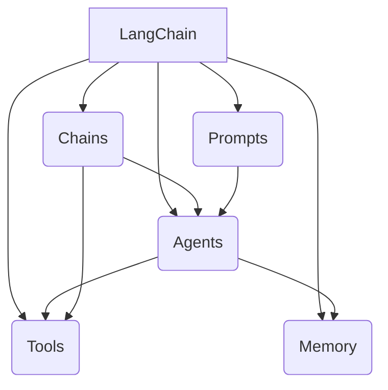

# 【LangChain编程：从入门到实践】LangChain社区介绍

## 1.背景介绍

### 1.1 人工智能时代的到来

人工智能(AI)已经成为当今科技发展的核心驱动力之一。随着计算能力的不断提升和算法的持续优化,AI技术在各个领域都展现出了巨大的潜力和价值。无论是自然语言处理、计算机视觉、决策优化还是机器学习等,AI都在不断推动着技术的进步和创新。

### 1.2 LangChain:连接人类与AI的桥梁

在这个人工智能时代,LangChain应运而生。作为一个强大的Python库,LangChain旨在构建可扩展的应用程序,将人类输入与各种AI模型和工具相结合,实现更智能、更高效的任务处理。LangChain提供了一种统一的接口,使开发人员能够轻松地集成和组合不同的语言模型、知识库和其他AI服务,从而创建出更加复杂和智能化的应用程序。

### 1.3 LangChain社区:推动AI创新的动力

随着LangChain的不断发展和普及,一个活跃的社区也逐渐形成。LangChain社区汇聚了来自世界各地的开发者、研究人员、爱好者和行业专家,他们共同分享想法、交流经验、解决问题,并推动着LangChain的持续进化。这个社区不仅是一个学习和成长的平台,也是一个促进合作和创新的催化剂。

## 2.核心概念与联系

### 2.1 LangChain的核心概念

LangChain的核心概念包括以下几个方面:

1. **Agents(智能体)**: Agents是LangChain中的核心组件,它们负责执行各种任务,如问答、文本生成、数据分析等。Agents可以与不同的语言模型、工具和数据源进行交互,并根据需要组合使用它们。

2. **Tools(工具)**: Tools是LangChain中的另一个关键概念。它们代表了各种外部资源和服务,如搜索引擎、数据库、API等。Agents可以利用这些工具来获取所需的信息和功能,从而完成更复杂的任务。

3. **Memory(记忆)**: Memory用于存储Agents在执行任务过程中产生的中间状态和结果。这有助于Agents保持上下文信息,并在需要时进行回溯和推理。

4. **Chains(链)**: Chains是一种将多个Agents和Tools组合在一起的方式,以实现更复杂的工作流程。它们定义了任务的执行顺序和数据流动,从而简化了应用程序的开发和管理。

5. **Prompts(提示)**: Prompts是用于指导语言模型执行特定任务的文本输入。在LangChain中,Prompts被广泛用于控制Agents的行为和输出。

这些核心概念相互关联,共同构建了LangChain的基础架构。开发人员可以灵活地组合和配置这些组件,以满足不同的应用需求。



### 2.2 LangChain与其他AI技术的联系

LangChain并不是一个孤立的AI技术,它与其他AI领域有着密切的联系。例如:

- **自然语言处理(NLP)**: LangChain广泛利用了NLP技术,如语言模型、文本生成、情感分析等,以实现更智能的人机交互和文本处理能力。

- **知识图谱**: LangChain可以与知识图谱技术相结合,从而更好地表示和利用结构化知识。

- **机器学习**: LangChain支持将各种机器学习模型集成为Tools,以实现更强大的数据处理和分析能力。

- **规划和推理**: LangChain利用了规划和推理技术,使Agents能够根据目标和约束条件自动生成执行计划。

- **人工智能安全**: LangChain还关注AI系统的安全性和可靠性,提供了一些机制来确保Agents的行为符合预期。

通过与这些AI技术的融合,LangChain为构建更智能、更复杂的应用程序提供了坚实的基础。

## 3.核心算法原理具体操作步骤

LangChain的核心算法原理主要包括以下几个方面:

### 3.1 Agent-Tool交互

Agent-Tool交互是LangChain中一个关键的算法原理。它定义了Agents如何与不同的Tools进行交互,以获取所需的信息和功能。该过程通常遵循以下步骤:

1. **任务分解**: Agent首先将原始任务分解为一系列子任务。

2. **工具选择**: 对于每个子任务,Agent需要选择合适的Tool来执行。这可能涉及到一些启发式规则或机器学习模型。

3. **工具调用**: 一旦选择了合适的Tool,Agent就会调用它并提供必要的输入数据。

4. **结果处理**: Agent接收Tool的输出结果,并对其进行解析和处理。

5. **迭代或终止**: 如果所有子任务都已完成,Agent就可以将结果组合起来并返回最终输出。否则,它会继续执行下一个子任务。

这个过程可以通过一个简单的示例来说明:

```python
from langchain import Agent, tool

# 定义一个搜索工具
search = tool("search-quality-reflection", search_quality_reflection, tool_description="搜索互联网并对结果质量进行反思")

# 创建一个Agent
agent = Agent(tools=[search])

# 执行任务
result = agent.run("什么是LangChain?")
```

在这个例子中,Agent首先被赋予了一个搜索工具。当执行"什么是LangChain?"这个任务时,Agent会调用搜索工具来查找相关信息,然后根据搜索结果的质量进行反思,最终返回一个综合的答复。

### 3.2 Chains和执行计划生成

Chains是LangChain中另一个重要的算法原理。它们定义了一系列Agents和Tools的执行顺序,以实现更复杂的工作流程。生成执行计划是Chains的核心任务之一。

执行计划生成算法通常包括以下步骤:

1. **目标分解**: 将原始目标分解为一系列子目标。

2. **子目标匹配**: 为每个子目标匹配合适的Agent或Tool。这可能涉及到一些启发式规则或机器学习模型。

3. **约束检查**: 检查所选择的Agent和Tool是否满足任何约束条件,如输入/输出类型、成本等。

4. **顺序确定**: 确定Agent和Tool的执行顺序,以满足数据依赖关系和其他约束。

5. **优化**: 可选地,对生成的执行计划进行优化,以提高效率或满足其他标准。

6. **执行**: 执行生成的执行计划,并返回最终结果。

以下是一个简单的Chains示例:

```python
from langchain import Chain, OpenAI, Wikipedia

# 定义一个搜索Wikipedia的链
wiki_chain = Chain(memory=None, inputs={"query": "What is LangChain?"}, output_keys=["result"], chains=[
    Wikipedia(input_keys=["query"]),
    OpenAI(input_keys=["query", "result"], output_keys=["result"])
])

# 执行链
result = wiki_chain.run()
```

在这个例子中,Chain首先使用Wikipedia工具搜索"什么是LangChain?"的相关信息。然后,它将这些信息和原始查询一起传递给OpenAI语言模型,以生成一个更详细的答复。

### 3.3 Prompts工程

Prompts工程是LangChain中另一个重要的算法原理。它涉及如何设计和优化用于指导语言模型的Prompts,以获得更好的性能和输出质量。

Prompts工程通常包括以下步骤:

1. **任务分析**: 分析要执行的任务的性质和要求,以确定所需的Prompts类型。

2. **Prompts设计**: 根据任务要求,设计初始的Prompts。这可能涉及到一些启发式规则或基于示例的方法。

3. **Prompts优化**: 通过迭代和反馈,不断优化Prompts,以提高语言模型的输出质量。这可能涉及到一些机器学习技术,如强化学习或元学习。

4. **Prompts组合**: 在某些情况下,可能需要组合多个Prompts来处理复杂的任务。

5. **Prompts个性化**: 根据特定的用户或应用场景,对Prompts进行个性化调整。

以下是一个简单的Prompts工程示例:

```python
from langchain import PromptTemplate, OpenAI

# 定义一个Prompt模板
template = """给定以下上下文:
{context}

根据上下文,回答这个问题: {question}"""
prompt = PromptTemplate(template=template, input_variables=["context", "question"])

# 创建一个OpenAI语言模型
llm = OpenAI(temperature=0)

# 使用Prompt生成答案
context = "LangChain是一个Python库,旨在构建可扩展的应用程序,将人类输入与各种AI模型和工具相结合..."
question = "什么是LangChain?"
answer = llm(prompt.format(context=context, question=question))
```

在这个例子中,我们首先定义了一个Prompt模板,它包含了上下文和问题两个变量。然后,我们使用这个模板和具体的上下文和问题,生成一个完整的Prompt,并将其输入到OpenAI语言模型中,以获得答案。通过优化Prompt模板,我们可以改善语言模型的输出质量。

## 4.数学模型和公式详细讲解举例说明

虽然LangChain主要是一个应用程序框架,但它也涉及到一些数学模型和公式,特别是在与机器学习模型集成时。以下是一些常见的数学模型和公式:

### 4.1 语言模型

语言模型是LangChain中最常用的机器学习模型之一。它们用于生成自然语言文本,并在许多任务中发挥着重要作用,如问答、文本生成、摘要等。

常见的语言模型包括:

- **N-gram模型**: 基于统计方法,根据前N-1个词来预测第N个词的概率。

$$P(w_n|w_1, w_2, ..., w_{n-1}) = \frac{count(w_1, w_2, ..., w_n)}{count(w_1, w_2, ..., w_{n-1})}$$

- **神经网络语言模型**: 使用神经网络来建模语言,通常基于循环神经网络(RNN)或transformer架构。

$$y = \text{softmax}(W_o h_t + b_o)$$

其中$h_t$是隐藏状态向量,$W_o$和$b_o$是输出层的权重和偏置。

- **GPT(生成式预训练转换器)**: 一种基于transformer的大型语言模型,被广泛用于各种自然语言处理任务。

$$\text{Attention}(Q, K, V) = \text{softmax}(\frac{QK^T}{\sqrt{d_k}})V$$

其中$Q$、$K$、$V$分别表示查询、键和值向量,$d_k$是缩放因子。

这些语言模型可以通过LangChain与其他组件集成,以实现更智能的文本处理能力。

### 4.2 知识图谱嵌入

知识图谱嵌入是将实体和关系映射到低维连续向量空间的技术,常用于知识表示和推理任务。LangChain可以与知识图谱技术相结合,以利用结构化知识。

常见的知识图谱嵌入模型包括:

- **TransE**: 将实体和关系映射到同一个向量空间,使得$h + r \approx t$对于三元组$(h, r, t)$成立。

$$L = \sum_{(h,r,t) \in S} \sum_{(h',r',t') \in S'} [\gamma + d(h + r, t) - d(h' + r', t')]_+$$

其中$S$和$S'$分别表示正例和负例三元组集合,$d$是距离函数,$\gamma$是边距超参数。

- **RotatE**: 在复数域中对实体和关系进行建模,使得$r \circ h \approx t$对于三元组$(h, r, t)$成立。

$$L = -\log \sigma(\gamma - d_r(r \circ h, t)) - \sum_{i=1}^n \log \sigma(d_r(r_i \circ h_i, t_i) + \gamma)$$

其中$\circ$表示复数乘法,$d_r$是关系投影