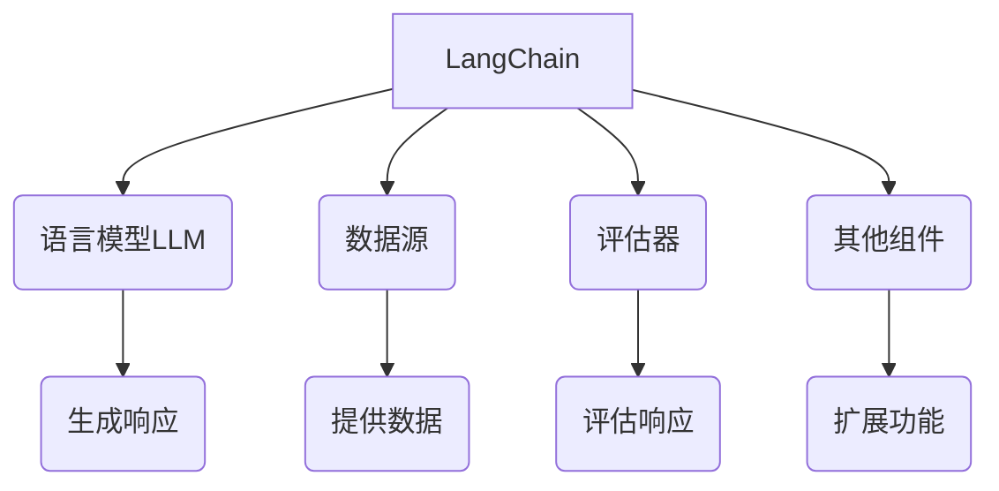

# 【LangChain编程：从入门到实践】变化与重构

## 1.背景介绍

### 1.1 人工智能时代的到来

在过去的几十年里,人工智能(AI)技术取得了长足的进步,从理论研究到实际应用,AI已经深深地渗透到我们生活的方方面面。随着计算能力的不断提高和算法的不断优化,AI系统能够处理越来越复杂的任务,展现出超乎想象的能力。

### 1.2 语言模型的兴起

语言模型是AI发展的重要组成部分,它通过对大量文本数据的训练,掌握语言的模式和规律,从而能够生成自然语言或理解自然语言输入。近年来,基于Transformer架构的大型语言模型取得了突破性进展,如GPT、BERT等,展现出了惊人的语言生成和理解能力。

### 1.3 LangChain的诞生

随着AI应用的不断扩展,开发人员面临着将各种AI模型集成到应用程序中的挑战。LangChain应运而生,作为一个统一的框架,旨在简化与各种语言模型的交互,并提供了丰富的功能来构建复杂的AI应用程序。

## 2.核心概念与联系

### 2.1 LangChain概述

LangChain是一个用于构建应用程序与大型语言模型(LLM)交互的Python库。它提供了一种模块化和可扩展的方式来组合LLM、数据源、评估器和其他组件,以创建智能应用程序。LangChain的核心思想是将复杂的任务分解为一系列较小的步骤,然后使用LLM和其他组件来执行这些步骤。



### 2.2 关键组件

LangChain由以下几个关键组件组成:

1. **语言模型(LLM)**:LangChain支持多种语言模型,如GPT、BERT、Claude等,用于生成自然语言响应。

2. **代理(Agents)**:代理是LangChain的核心概念之一,它封装了任务的执行逻辑,并协调LLM和其他组件的工作。

3. **工具(Tools)**:工具是代理可以利用的各种功能,如Web搜索、数据库查询、文件操作等。

4. **内存(Memory)**:内存用于存储代理执行过程中的上下文信息,以保持对话的连贯性。

5. **提示模板(Prompt Templates)**:提示模板定义了如何将输入数据传递给LLM,以及如何解析LLM的输出。

6. **数据源(Data Sources)**:数据源提供了代理可以访问和操作的各种数据,如文本文件、PDF、Web页面等。

7. **评估器(Evaluators)**:评估器用于评估LLM生成的响应的质量,并提供反馈以优化模型。

### 2.3 LangChain的优势

LangChain的主要优势包括:

1. **模块化和可扩展性**:LangChain采用模块化设计,允许开发人员灵活地组合不同的组件来构建复杂的应用程序。

2. **多语言模型支持**:LangChain支持多种流行的语言模型,如GPT、BERT、Claude等,并提供了统一的接口进行交互。

3. **丰富的功能**:LangChain提供了大量的内置功能,如代理、工具、内存、提示模板等,大大简化了应用程序的开发。

4. **数据源集成**:LangChain支持多种数据源,如文本文件、PDF、Web页面等,使得应用程序可以访问和处理各种形式的数据。

5. **可解释性和可控性**:LangChain允许开发人员定义和控制代理的执行逻辑,提高了应用程序的可解释性和可控性。

6. **活跃的社区和生态系统**:LangChain拥有一个活跃的开源社区,不断有新的功能和改进被添加,同时也有丰富的教程和示例供开发人员参考。

## 3.核心算法原理具体操作步骤 

### 3.1 代理(Agents)

代理是LangChain的核心概念之一,它封装了任务的执行逻辑,并协调LLM和其他组件的工作。代理的工作原理如下:

1. **初始化**:创建一个代理实例,并为其分配一个LLM、一组工具和一个内存实例。

2. **计划**:代理根据任务目标和可用工具,制定一个执行计划,即确定需要执行哪些步骤以及使用哪些工具。

3. **执行**:代理按照计划逐步执行每个步骤,利用LLM生成指令,并使用相应的工具执行这些指令。

4. **观察**:代理观察每个步骤的执行结果,并将相关信息存储在内存中。

5. **反馈**:代理可以根据执行结果和内存中的信息,调整后续的执行计划。

6. **输出**:最终,代理将生成最终的输出,作为任务的结果。

下面是一个使用LangChain创建代理的示例代码:

```python
from langchain import OpenAI, Wikipedia, DuckDuckGoSearchTool
from langchain.agents import initialize_agent, AgentType

# 初始化LLM
llm = OpenAI(temperature=0)

# 初始化工具
tools = [
    Wikipedia(),
    DuckDuckGoSearchTool()
]

# 创建代理
agent = initialize_agent(tools, llm, agent=AgentType.CONVERSATIONAL_REACT_DESCRIPTION, verbose=True)

# 执行任务
agent.run("What is the capital of France?")
```

在这个示例中,我们创建了一个基于OpenAI语言模型的代理,并为其分配了两个工具:Wikipedia和DuckDuckGo搜索。当执行`agent.run()`时,代理会根据任务目标和可用工具制定执行计划,并利用LLM和工具完成任务。

### 3.2 工具(Tools)

工具是代理可以利用的各种功能,如Web搜索、数据库查询、文件操作等。LangChain提供了许多内置工具,同时也支持自定义工具。

每个工具都需要实现一个`_run()`方法,用于执行工具的实际操作。代理会根据需要调用不同工具的`_run()`方法。

下面是一个自定义工具的示例:

```python
from langchain.tools import BaseTool

class Calculator(BaseTool):
    name = "Calculator"
    description = "A simple calculator that can perform basic arithmetic operations."

    def _run(self, query: str) -> str:
        try:
            result = eval(query)
            return str(result)
        except Exception as e:
            return f"Error: {e}"

    def _arun(self, query: str) -> str:
        return self._run(query)
```

在这个示例中,我们定义了一个简单的计算器工具。`_run()`方法接受一个算术表达式作为输入,使用`eval()`函数计算结果,并返回结果的字符串表示。

### 3.3 内存(Memory)

内存用于存储代理执行过程中的上下文信息,以保持对话的连贯性。LangChain支持多种内存实现,如ConversationBufferMemory、ConversationEntityMemory等。

下面是一个使用ConversationBufferMemory的示例:

```python
from langchain import OpenAI, ConversationBufferMemory
from langchain.agents import initialize_agent, AgentType

# 初始化LLM
llm = OpenAI(temperature=0)

# 创建内存实例
memory = ConversationBufferMemory()

# 创建代理
agent = initialize_agent(tools, llm, agent=AgentType.CONVERSATIONAL_REACT_DESCRIPTION, verbose=True, memory=memory)

# 执行任务
agent.run("What is the capital of France?")
agent.run("What is the population of Paris?")
```

在这个示例中,我们创建了一个`ConversationBufferMemory`实例,并将其传递给代理。在执行任务时,代理会将相关信息存储在内存中,以便后续的对话可以利用这些信息。

### 3.4 提示模板(Prompt Templates)

提示模板定义了如何将输入数据传递给LLM,以及如何解析LLM的输出。LangChain提供了多种预定义的提示模板,同时也支持自定义提示模板。

下面是一个自定义提示模板的示例:

```python
from langchain import PromptTemplate

template = """
You are an AI assistant helping a user with a task. The user's input is: {input}

Your response should be in the format:

Result: <your_response_here>