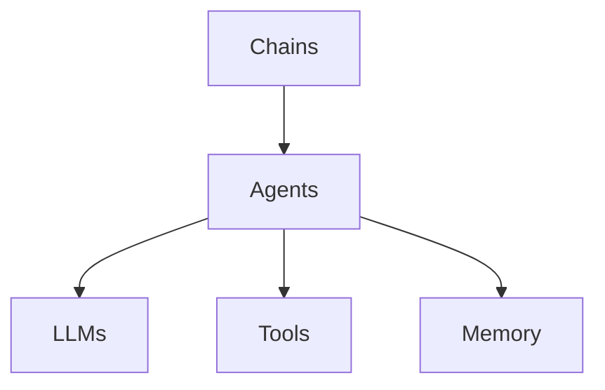
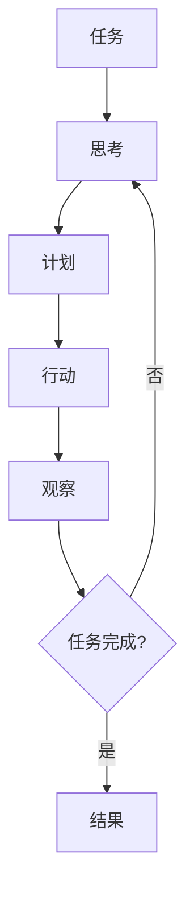
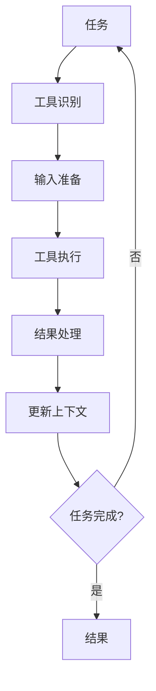
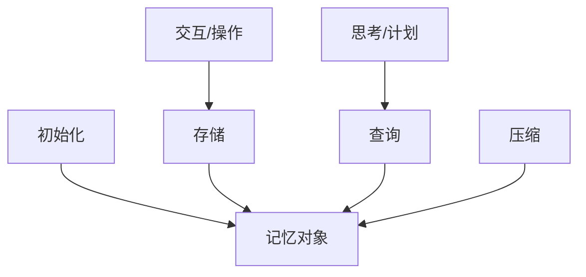

# 【LangChain编程：从入门到实践】大模型原理解释

## 1. 背景介绍

在当今的人工智能领域,大型语言模型(Large Language Models, LLMs)正在引领着一场革命性的变革。这些模型通过消化海量文本数据,学习到了惊人的语言理解和生成能力,为各种自然语言处理任务提供了强大的支持。然而,要充分发挥大型语言模型的潜能,仍然面临着诸多挑战,例如模型的可控性、安全性和可解释性等。

LangChain是一个由Anthropic公司开发的Python库,旨在简化大型语言模型的应用开发过程。它提供了一个统一的接口,使开发者能够轻松地将各种模型、数据源和工具链接在一起,构建强大且可扩展的应用程序。无论是问答系统、文本摘要、代码生成还是其他自然语言处理任务,LangChain都为开发者提供了一种高效、模块化的解决方案。

本文将深入探讨LangChain的核心概念、架构和算法原理,并通过实际案例展示其在实践中的应用。我们将揭开大型语言模型的神秘面纱,了解它们是如何工作的,以及LangChain是如何帮助我们更好地利用这些强大的模型。无论您是AI开发者、研究人员还是对这一领域感兴趣的爱好者,相信本文都能为您提供有价值的见解和实用的技能。

## 2. 核心概念与联系

### 2.1 大型语言模型(LLMs)

大型语言模型是一种基于深度学习的自然语言处理模型,通过在海量文本数据上进行预训练,学习到了丰富的语言知识和上下文理解能力。常见的LLMs包括GPT-3、PaLM、LaMDA等。这些模型能够生成看似人类写作的自然语言,并在各种NLP任务中表现出色,如问答、文本生成、摘要和翻译等。

### 2.2 LangChain架构

LangChain的核心架构由几个关键组件构成:

1. **Agents**: 代理是LangChain中的核心概念,它们封装了特定的任务逻辑,如问答、分析或操作执行。代理可以组合使用多个LLM和工具,实现复杂的工作流程。

2. **LLMs**: LangChain支持多种大型语言模型,如OpenAI的GPT-3、Anthropic的Claude等,并提供了统一的接口来与它们进行交互。

3. **Tools**: 工具是一组可执行的函数或API,用于执行特定的任务,如数据检索、计算或外部系统交互。代理可以调用这些工具来完成复杂的任务。

4. **Memory**: 内存组件用于存储代理与LLM之间的交互历史,以保持对话的连贯性和上下文理解。

5. **Chains**: 链是一种预定义的序列,将多个代理、LLM和工具组合在一起,实现特定的工作流程。

这些组件通过灵活的组合,使LangChain能够构建出各种复杂的应用程序,充分发挥大型语言模型的潜能。



## 3. 核心算法原理具体操作步骤

### 3.1 代理架构

LangChain中的代理架构是基于一种称为"思考-计划-行动"(Think-Plan-Act)的范式。代理首先会"思考"当前的任务和上下文,然后"计划"需要执行的一系列操作,最后"行动"执行这些操作并获取结果。这个过程可以反复进行,直到任务完成。

1. **思考(Think)**: 代理利用LLM生成一个初步的响应,对任务进行理解和分析。

2. **计划(Plan)**: 代理根据任务需求,决定需要执行哪些操作(如调用工具、查询知识库等),并生成一个操作序列作为计划。

3. **行动(Act)**: 代理执行计划中的每个操作,获取相应的结果。

4. **观察(Observe)**: 代理观察执行结果,并将其与原始任务和上下文进行比较,决定是否需要重新思考和计划。

5. **重复(Repeat)**: 如果任务尚未完成,代理会重复上述过程,直到达成最终目标。

这种迭代式的"思考-计划-行动"循环,使代理能够灵活地利用各种资源(如LLM、工具和知识库),完成复杂的任务。



### 3.2 工具调用

LangChain中的工具是一组可执行的函数或API,用于执行特定的任务,如数据检索、计算或外部系统交互。代理可以在"行动"阶段调用这些工具,以获取所需的信息或执行特定的操作。

工具调用的过程如下:

1. **工具识别**: 代理根据当前的任务和上下文,识别出需要调用哪些工具。

2. **输入准备**: 代理准备工具所需的输入参数,通常由LLM生成。

3. **工具执行**: 代理调用工具的执行函数,传入准备好的输入参数。

4. **结果处理**: 工具执行完毕后,代理获取执行结果,并将其整合到任务的上下文中。

通过灵活地调用各种工具,代理可以获取所需的信息和功能,从而更好地完成复杂的任务。



### 3.3 记忆管理

为了保持对话的连贯性和上下文理解,LangChain引入了记忆组件。记忆组件用于存储代理与LLM之间的交互历史,包括提出的问题、生成的响应以及执行的操作等。

记忆管理的过程如下:

1. **初始化**: 在代理初始化时,创建一个空的记忆对象。

2. **存储**: 每当代理与LLM交互或执行操作时,相关的信息都会存储在记忆对象中。

3. **查询**: 在"思考"和"计划"阶段,代理可以查询记忆对象,获取相关的历史信息,以维持上下文理解。

4. **压缩**: 为了控制记忆的大小,LangChain提供了多种压缩策略,如基于时间窗口或关键词的压缩。

通过记忆管理,代理能够更好地理解当前的任务上下文,提高对话的质量和一致性。



## 4. 数学模型和公式详细讲解举例说明

大型语言模型通常基于transformer架构,利用自注意力机制来捕捉输入序列中的长程依赖关系。自注意力机制的核心思想是允许每个输出元素关注整个输入序列的不同位置,从而捕捉到更丰富的上下文信息。

### 4.1 自注意力机制

给定一个输入序列 $X = (x_1, x_2, \dots, x_n)$,自注意力机制计算每个输出元素 $y_i$ 的加权和,其中权重由输入序列中的元素决定。具体来说,对于每个输出元素 $y_i$,我们首先计算一个注意力分数向量 $\alpha_i = (\alpha_{i1}, \alpha_{i2}, \dots, \alpha_{in})$,其中 $\alpha_{ij}$ 表示输出元素 $y_i$ 对输入元素 $x_j$ 的注意力分数。然后,我们将输入序列的元素与相应的注意力分数相乘,并求和得到输出元素 $y_i$:

$$y_i = \sum_{j=1}^{n} \alpha_{ij} (W_v x_j)$$

其中 $W_v$ 是一个可学习的权重矩阵,用于将输入元素 $x_j$ 映射到一个合适的向量空间。

注意力分数 $\alpha_{ij}$ 通过以下公式计算:

$$\alpha_{ij} = \frac{\exp(e_{ij})}{\sum_{k=1}^{n} \exp(e_{ik})}$$

其中 $e_{ij}$ 是一个注意力能量项,用于衡量输出元素 $y_i$ 对输入元素 $x_j$ 的关注程度。注意力能量项通常由以下公式计算:

$$e_{ij} = \frac{(W_q x_i)^T (W_k x_j)}{\sqrt{d_k}}$$

其中 $W_q$ 和 $W_k$ 是可学习的权重矩阵,用于将输入元素映射到查询(query)和键(key)向量空间。$d_k$ 是缩放因子,用于防止注意力能量项过大或过小。

通过自注意力机制,transformer模型能够捕捉输入序列中的长程依赖关系,从而更好地理解和生成自然语言。

### 4.2 多头注意力机制

为了进一步提高模型的表现能力,transformer架构引入了多头注意力机制。多头注意力机制将输入序列分别送入多个独立的注意力头(attention head),每个注意力头都学习捕捉不同的依赖关系模式。最后,所有注意力头的输出将被concatenated并经过一个线性变换,得到最终的输出向量。

具体来说,给定一个输入序列 $X = (x_1, x_2, \dots, x_n)$,对于第 $i$ 个注意力头,我们计算其输出 $\text{head}_i$ 如下:

$$\text{head}_i = \text{Attention}(X W_i^Q, X W_i^K, X W_i^V)$$

其中 $W_i^Q$、$W_i^K$ 和 $W_i^V$ 分别是第 $i$ 个注意力头的查询、键和值的线性变换矩阵。$\text{Attention}(\cdot)$ 函数计算自注意力机制的输出,如上一节所述。

然后,所有注意力头的输出被concatenated并经过一个线性变换 $W^O$,得到最终的多头注意力输出 $\text{MultiHead}(X)$:

$$\text{MultiHead}(X) = \text{Concat}(\text{head}_1, \text{head}_2, \dots, \text{head}_h) W^O$$

其中 $h$ 是注意力头的数量。

多头注意力机制允许模型从不同的表示子空间捕捉不同的依赖关系模式,从而提高了模型的表现能力和泛化能力。

## 5. 项目实践: 代码实例和详细解释说明

在本节中,我们将通过一个实际的代码示例,展示如何使用LangChain构建一个基于大型语言模型的问答系统。

### 5.1 问答系统概述

我们的问答系统将基于OpenAI的GPT-3模型,并利用Wikipedia作为知识库。系统的工作流程如下:

1. 用户提出一个问题。
2. 系统从Wikipedia中检索与问题相关的文本片段。
3. 系统将问题和相关文本片段输入到GPT-3模型中,生成答案。
4. 系统将生成的答案返回给用户。

### 5.2 代码实现

首先,我们需要导入所需的库和模块:

```python
from langchain.llms import OpenAI
from langchain.chains import RetrievalQA
from langchain.document_loaders import UnstructuredURLLoader
from langchain.indexes import VectorstoreIndexCreator
```

接下来,我们初始化GPT-3模型和Wikipedia知识库:

```python
# 初始化GPT-3模型
llm = OpenAI(temperature=0)

# 加载Wikipedia页面作为知识库
loader = UnstructuredURLLoader("https://en.wikipedia.org/wiki/Artificial_intelligence")
data = loader.load()

# 创建向量存储索引
index = VectorstoreIndexCreator().from_loaders([loader])
```

现在,我们可以创建一个RetrievalQA链,将问题、知识库和GPT-3模型结合在