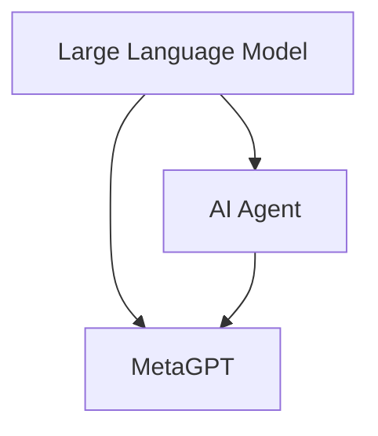

# 【大模型应用开发 动手做AI Agent】MetaGPT实战

## 1.背景介绍
### 1.1 大语言模型(LLM)的发展历程
#### 1.1.1 Transformer的诞生
#### 1.1.2 GPT系列模型的演进
#### 1.1.3 InstructGPT的提出
### 1.2 AI Agent的兴起 
#### 1.2.1 AI Agent的定义与特点
#### 1.2.2 AI Agent的应用场景
#### 1.2.3 AI Agent面临的挑战
### 1.3 MetaGPT的出现
#### 1.3.1 MetaGPT的起源
#### 1.3.2 MetaGPT的特点
#### 1.3.3 MetaGPT的发展前景

## 2.核心概念与联系
### 2.1 大语言模型(LLM)
#### 2.1.1 LLM的定义
#### 2.1.2 LLM的原理
#### 2.1.3 LLM的应用
### 2.2 AI Agent
#### 2.2.1 AI Agent的定义
#### 2.2.2 AI Agent的分类
#### 2.2.3 AI Agent的关键技术
### 2.3 MetaGPT
#### 2.3.1 MetaGPT的定义
#### 2.3.2 MetaGPT的架构
#### 2.3.3 MetaGPT与LLM、AI Agent的关系



## 3.核心算法原理具体操作步骤
### 3.1 MetaGPT的训练流程
#### 3.1.1 数据准备
#### 3.1.2 预训练
#### 3.1.3 微调
### 3.2 MetaGPT的推理过程  
#### 3.2.1 Prompt构建
#### 3.2.2 上下文融合
#### 3.2.3 解码生成
### 3.3 MetaGPT的优化技巧
#### 3.3.1 参数高效微调
#### 3.3.2 对比学习
#### 3.3.3 强化学习

## 4.数学模型和公式详细讲解举例说明
### 4.1 Transformer模型
#### 4.1.1 自注意力机制
$Attention(Q,K,V) = softmax(\frac{QK^T}{\sqrt{d_k}})V$
#### 4.1.2 多头注意力
$$MultiHead(Q,K,V) = Concat(head_1,...,head_h)W^O$$
$$head_i = Attention(QW_i^Q, KW_i^K, VW_i^V)$$
#### 4.1.3 前馈神经网络
$FFN(x) = max(0, xW_1 + b_1)W_2 + b_2$
### 4.2 GPT模型  
#### 4.2.1 因果语言建模
$$p(w_1, ..., w_n) = \prod_{i=1}^n p(w_i|w_{<i})$$
#### 4.2.2 位置编码
$PE_{(pos,2i)} = sin(pos/10000^{2i/d_{model}})$
$PE_{(pos,2i+1)} = cos(pos/10000^{2i/d_{model}})$
#### 4.2.3 损失函数
$L(θ) = - \sum_{i} log P(w_i|w_{<i};θ)$
### 4.3 MetaGPT模型
#### 4.3.1 元学习目标
$$θ^* = \mathop{\arg\min}\limits_{θ} \mathbb{E}_{T_i \sim p(T)} [\mathcal{L}_{T_i} (f_θ)]$$
#### 4.3.2 对比学习损失
$$\mathcal{L}_{CL} = -\mathbb{E}_{x,x^+,\{x^-\}} \left[ \log \frac{e^{f(x)^T f(x^+)}}{e^{f(x)^T f(x^+)} + \sum_{x^-} e^{f(x)^T f(x^-)}} \right]$$
#### 4.3.3 强化学习目标
$$J(θ) = \mathbb{E}_{\tau \sim \pi_θ} \left[ \sum_{t=0}^T \gamma^t r_t \right]$$

## 5.项目实践：代码实例和详细解释说明
### 5.1 环境准备
#### 5.1.1 硬件要求
#### 5.1.2 软件依赖
#### 5.1.3 数据集下载
### 5.2 模型训练
#### 5.2.1 配置文件设置
#### 5.2.2 预训练脚本
#### 5.2.3 微调脚本 
### 5.3 模型推理
#### 5.3.1 交互式对话
#### 5.3.2 任务型调用
#### 5.3.3 API部署

```python
import torch
from transformers import AutoTokenizer, AutoModelForCausalLM

tokenizer = AutoTokenizer.from_pretrained("EleutherAI/gpt-neo-2.7B")
model = AutoModelForCausalLM.from_pretrained("EleutherAI/gpt-neo-2.7B")

def generate_response(prompt):
    input_ids = tokenizer.encode(prompt, return_tensors="pt")
    output = model.generate(input_ids, max_length=100, num_return_sequences=1)
    response = tokenizer.decode(output[0], skip_special_tokens=True)
    return response

prompt = "What is MetaGPT?"
response = generate_response(prompt)
print(response)
```

以上代码展示了如何使用Hugging Face的Transformers库来加载预训练的GPT模型，并使用其进行文本生成。我们首先加载了EleutherAI的GPT-Neo-2.7B模型和对应的tokenizer，然后定义了一个`generate_response`函数，接收一个prompt作为输入，使用模型进行生成，并返回生成的文本。最后，我们给出一个关于MetaGPT的问题作为prompt，调用`generate_response`函数生成回答并打印出来。

## 6.实际应用场景
### 6.1 智能客服
#### 6.1.1 客户意图理解
#### 6.1.2 问题自动应答
#### 6.1.3 多轮对话管理
### 6.2 个性化推荐
#### 6.2.1 用户画像构建  
#### 6.2.2 推荐候选生成
#### 6.2.3 排序优化
### 6.3 智能写作
#### 6.3.1 文本生成
#### 6.3.2 文本摘要
#### 6.3.3 机器翻译

## 7.工具和资源推荐
### 7.1 开源代码库
#### 7.1.1 Hugging Face Transformers
#### 7.1.2 OpenAI GPT-3
#### 7.1.3 DeepMind RETRO
### 7.2 数据集
#### 7.2.1 Wikipedia
#### 7.2.2 BookCorpus
#### 7.2.3 CC-News  
### 7.3 学习资料
#### 7.3.1 《Attention Is All You Need》
#### 7.3.2 《Language Models are Few-Shot Learners》
#### 7.3.3 《Improving Language Understanding by Generative Pre-Training》

## 8.总结：未来发展趋势与挑战
### 8.1 大模型的发展趋势
#### 8.1.1 模型规模不断增大
#### 8.1.2 训练范式日益丰富
#### 8.1.3 应用领域持续拓展
### 8.2 AI Agent的未来方向
#### 8.2.1 多模态感知与交互
#### 8.2.2 主动学习与自我进化
#### 8.2.3 安全与伦理问题
### 8.3 MetaGPT面临的机遇与挑战
#### 8.3.1 技术创新空间广阔
#### 8.3.2 计算资源瓶颈凸显
#### 8.3.3 应用落地有待探索

## 9.附录：常见问题与解答
### 9.1 MetaGPT与GPT-3的区别是什么？
MetaGPT是一种元学习框架，旨在通过学习如何学习来提高大语言模型在下游任务上的表现。而GPT-3是一个预训练的语言模型，主要用于文本生成和补全任务。MetaGPT可以在GPT-3的基础上进行优化，使其更好地适应不同的任务。

### 9.2 MetaGPT能否用于商业应用？
MetaGPT作为一种通用的元学习框架，可以应用于各种商业场景，如智能客服、个性化推荐、智能写作等。但在实际应用中，还需要考虑模型的推理效率、数据安全、伦理合规等因素。

### 9.3 如何评估MetaGPT生成文本的质量？ 
评估MetaGPT生成文本的质量可以从多个维度进行，如流畅性、连贯性、相关性、多样性等。常用的评估指标包括perplexity、BLEU、ROUGE、METEOR等。此外，还可以通过人工评估的方式，由专家或用户对生成的文本进行主观打分。

作者：禅与计算机程序设计艺术 / Zen and the Art of Computer Programming