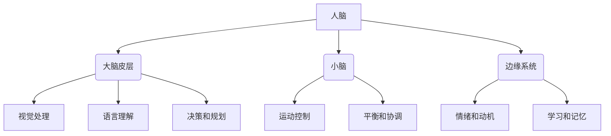
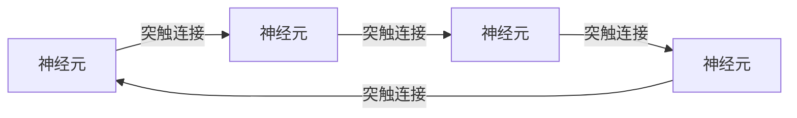
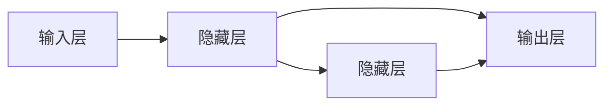

# 【大模型应用开发 动手做AI Agent】人类的大脑了不起

## 1. 背景介绍

### 1.1 人工智能的崛起

人工智能(AI)已经成为当今科技领域最热门的话题之一。近年来,大型语言模型和深度学习算法的突破性进展,推动了人工智能在各个领域的广泛应用,从自动驾驶到医疗诊断,从语音识别到自然语言处理,AI 无处不在。

### 1.2 大模型的兴起

在这场人工智能革命中,大型神经网络模型(如 GPT-3、PaLM 等)凭借其惊人的性能和通用能力,成为了焦点所在。这些大模型能够从海量数据中学习,并在广泛的任务上表现出色,展现出接近人类的理解和推理能力。

### 1.3 人脑与人工智能

然而,尽管人工智能取得了长足的进步,但与人类大脑相比,它仍然存在着诸多不足之处。人类大脑是一个神奇的生物计算机,其复杂性、灵活性和创造力超越了当前的人工智能系统。探索人脑的奥秘,不仅能帮助我们更好地理解自身,也有望为人工智能的发展提供新的启示和方向。

## 2. 核心概念与联系 

### 2.1 人脑的结构和功能

人脑是一个高度复杂的神经网络系统,由数十亿个神经元和数万亿个神经连接组成。它可以分为不同的区域,如大脑皮层、小脑、边缘系统等,每个区域负责特定的认知功能,如视觉处理、语言理解、运动控制等。



### 2.2 神经元和突触连接

神经元是人脑的基本计算单元,通过电化学信号进行信息传递和处理。神经元之间通过突触连接相互作用,形成了一个庞大的网络。这种网络具有可塑性,可以通过学习和经验来调整连接强度,从而获取新知识和技能。



### 2.3 大脑与人工神经网络的联系

人工神经网络(ANN)是一种模拟生物神经系统的计算模型。它由大量的人工神经元和连接组成,通过训练调整连接权重来学习特定任务。虽然人工神经网络远没有人脑那么复杂,但二者在基本原理上存在着相似之处,都是通过网络中节点之间的交互来实现信息处理和学习。



## 3. 核心算法原理具体操作步骤

### 3.1 监督学习

监督学习是机器学习中最常见的一种范式。它的基本思想是利用带有标签的训练数据,通过优化算法调整模型参数,使模型在训练数据上的预测结果与真实标签尽可能接近。这种方法广泛应用于分类、回归等任务。

1. **数据准备**:收集并清洗带标签的训练数据集。
2. **特征工程**:从原始数据中提取有意义的特征,以便模型学习。
3. **模型选择**:根据任务类型选择合适的模型,如逻辑回归、支持向量机等。
4. **模型训练**:使用优化算法(如梯度下降)在训练数据上迭代调整模型参数,最小化损失函数。
5. **模型评估**:在测试数据集上评估模型的性能指标,如准确率、F1分数等。
6. **模型调优**:根据评估结果,通过调整超参数、特征选择等方式优化模型。
7. **模型部署**:将训练好的模型应用于实际场景,进行预测或决策。

### 3.2 无监督学习

无监督学习旨在从未标记的原始数据中发现内在模式和结构。它不需要人工标注的训练数据,而是根据数据本身的统计特性进行自主学习。常见的无监督学习任务包括聚类、降维和生成模型等。

1. **数据准备**:收集并清洗原始数据集。
2. **特征提取**:从原始数据中提取有意义的特征,以便模型学习。
3. **模型选择**:根据任务类型选择合适的无监督学习模型,如K-means聚类、主成分分析(PCA)等。
4. **模型训练**:在数据集上训练模型,使其能够发现数据的内在结构和模式。
5. **模型评估**:使用合适的评估指标(如聚类质量、重构误差等)评估模型的性能。
6. **模型调优**:根据评估结果,通过调整超参数、特征选择等方式优化模型。
7. **模型应用**:将训练好的模型应用于实际场景,进行数据可视化、异常检测、生成新数据等任务。

### 3.3 强化学习

强化学习是一种基于奖惩机制的学习范式,它通过与环境交互,获取反馈信号(奖励或惩罚),并根据这些信号调整行为策略,最终达到最大化长期累积奖励的目标。强化学习广泛应用于机器人控制、游戏AI等领域。

1. **定义环境**:构建模拟环境,包括状态空间、动作空间和奖励函数。
2. **选择算法**:根据任务复杂度选择合适的强化学习算法,如Q-Learning、策略梯度等。
3. **初始化代理**:创建一个初始的智能体(Agent),包括状态表示、行为策略等。
4. **交互与学习**:让智能体与环境交互,获取状态、执行动作、收集奖励,并根据算法更新策略。
5. **评估与调优**:在测试环境中评估智能体的性能,根据结果调整超参数或算法。
6. **部署应用**:将训练好的智能体应用于实际场景,如机器人控制、游戏AI等。

## 4. 数学模型和公式详细讲解举例说明

### 4.1 神经网络模型

神经网络是一种广泛使用的机器学习模型,它模拟了生物神经系统的工作原理。一个典型的神经网络由输入层、隐藏层和输出层组成,每一层由多个神经元构成。神经元通过加权求和和激活函数进行信息传递和非线性变换。

$$
y = f\left(\sum_{i=1}^{n}w_ix_i + b\right)
$$

其中,$y$是神经元的输出,$x_i$是第$i$个输入,$w_i$是对应的权重,$b$是偏置项,$f$是非线性激活函数(如Sigmoid、ReLU等)。

在训练过程中,我们通过优化算法(如梯度下降)来调整权重和偏置,使得模型在训练数据上的预测结果与真实标签尽可能接近。这个过程可以通过最小化损失函数(如均方误差、交叉熵等)来实现。

$$
L = \frac{1}{N}\sum_{i=1}^{N}l(y_i, \hat{y}_i)
$$

其中,$L$是总体损失,$N$是样本数量,$l$是针对单个样本的损失函数,$y_i$是真实标签,$\hat{y}_i$是模型预测值。

通过反向传播算法,我们可以计算出每个权重和偏置对损失函数的梯度,并沿着梯度的反方向更新参数,从而使损失函数最小化。

$$
w_{t+1} = w_t - \eta\frac{\partial L}{\partial w_t}
$$

其中,$\eta$是学习率,控制着每次更新的步长。

### 4.2 聚类算法

聚类是一种常见的无监督学习任务,旨在将相似的数据点划分到同一个簇中。K-means算法是最经典的聚类算法之一,它的目标是最小化所有数据点到其所属簇中心的距离平方和。

算法步骤如下:

1. 随机初始化K个簇中心。
2. 对于每个数据点,计算它与每个簇中心的距离,将其分配到最近的簇中。
3. 重新计算每个簇的中心,作为该簇所有数据点的均值。
4. 重复步骤2和3,直到簇分配不再发生变化。

我们可以使用欧几里得距离或其他距离度量来衡量数据点与簇中心的距离。对于数据点$x$和簇中心$\mu_k$,欧几里得距离定义为:

$$
d(x, \mu_k) = \sqrt{\sum_{i=1}^{n}(x_i - \mu_{k,i})^2}
$$

其中,$n$是数据维度。

算法的目标是最小化所有数据点到其所属簇中心的距离平方和:

$$
J = \sum_{k=1}^{K}\sum_{x\in C_k}d(x, \mu_k)^2
$$

其中,$K$是簇的数量,$C_k$是第$k$个簇中的所有数据点。

### 4.3 强化学习算法

强化学习算法旨在通过与环境交互,学习一个最优策略,以最大化长期累积奖励。Q-Learning是一种常见的强化学习算法,它基于状态-动作值函数(Q函数)来估计在某个状态下执行某个动作所能获得的长期回报。

Q函数定义为:

$$
Q(s, a) = \mathbb{E}\left[r_t + \gamma r_{t+1} + \gamma^2 r_{t+2} + \cdots | s_t = s, a_t = a\right]
$$

其中,$s$是状态,$a$是动作,$r_t$是在时间$t$获得的即时奖励,$\gamma$是折现因子,用于权衡即时奖励和长期回报。

在每个时间步,智能体会根据当前状态$s$和Q函数值选择一个动作$a$,执行该动作后获得即时奖励$r$并转移到新状态$s'$。然后,我们可以使用下式更新Q函数:

$$
Q(s, a) \leftarrow Q(s, a) + \alpha\left[r + \gamma\max_{a'}Q(s', a') - Q(s, a)\right]
$$

其中,$\alpha$是学习率,控制着更新的幅度。

通过不断与环境交互并更新Q函数,智能体最终会收敛到一个近似最优策略,即在每个状态下选择Q值最大的动作。

## 5. 项目实践:代码实例和详细解释说明

### 5.1 监督学习:图像分类

以下是一个使用PyTorch实现的图像分类示例,基于CIFAR-10数据集。

```python
import torch
import torchvision
import torchvision.transforms as transforms

# 数据准备
transform = transforms.Compose([transforms.ToTensor(), transforms.Normalize((0.5, 0.5, 0.5), (0.5, 0.5, 0.5))])
trainset = torchvision.datasets.CIFAR10(root='./data', train=True, download=True, transform=transform)
trainloader = torch.utils.data.DataLoader(trainset, batch_size=4, shuffle=True)

# 定义模型
import torch.nn as nn
import torch.nn.functional as F

class Net(nn.Module):
    def __init__(self):
        super().__init__()
        self.conv1 = nn.Conv2d(3, 6, 5)
        self.pool = nn.MaxPool2d(2, 2)
        self.conv2 = nn.Conv2d(6, 16, 5)
        self.fc1 = nn.Linear(16 * 5 * 5, 120)
        self.fc2 = nn.Linear(120, 84)
        self.fc3 = nn.Linear(84, 10)

    def forward(self, x):
        x = self.pool(F.relu(self.conv1(x)))
        x = self.pool(F.relu(self.conv2(x)))
        x = torch.flatten(x, 1) # flatten all dimensions except batch
        x = F.relu(self.fc1(x))
        x = F.relu(self.fc2(x))