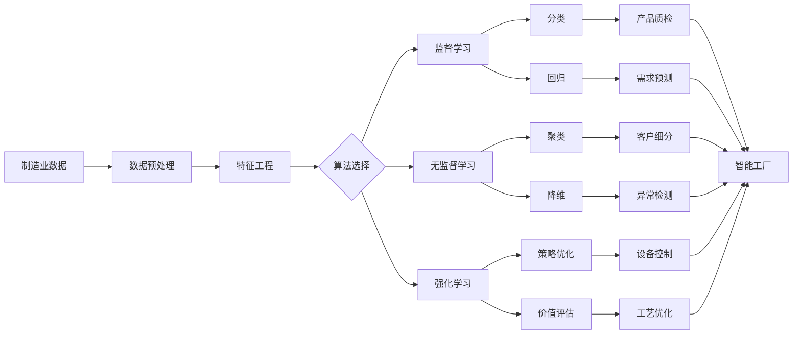

# 一切皆是映射：AI助力下的先进制造业革新

## 1. 背景介绍
### 1.1 制造业的发展现状
#### 1.1.1 传统制造业面临的挑战
#### 1.1.2 智能制造的兴起
#### 1.1.3 AI技术在制造业中的应用前景
### 1.2 映射理论概述
#### 1.2.1 映射的数学定义
#### 1.2.2 映射在计算机科学中的应用
#### 1.2.3 映射思想在AI领域的延伸

## 2. 核心概念与联系
### 2.1 人工智能的核心概念
#### 2.1.1 机器学习
#### 2.1.2 深度学习
#### 2.1.3 知识表示与推理
### 2.2 映射理论与AI的联系
#### 2.2.1 神经网络中的映射
#### 2.2.2 特征空间映射
#### 2.2.3 知识图谱中的映射关系
### 2.3 AI在制造业中的应用
#### 2.3.1 智能设计与仿真
#### 2.3.2 智能生产与优化
#### 2.3.3 预测性维护与故障诊断

## 3. 核心算法原理具体操作步骤
### 3.1 卷积神经网络（CNN）
#### 3.1.1 卷积层
#### 3.1.2 池化层
#### 3.1.3 全连接层
### 3.2 循环神经网络（RNN）
#### 3.2.1 简单RNN
#### 3.2.2 LSTM
#### 3.2.3 GRU
### 3.3 生成对抗网络（GAN）
#### 3.3.1 生成器
#### 3.3.2 判别器
#### 3.3.3 对抗训练过程

## 4. 数学模型和公式详细讲解举例说明
### 4.1 支持向量机（SVM）
#### 4.1.1 线性SVM
$$\min_{w,b} \frac{1}{2}||w||^2 \quad s.t. \quad y_i(w^Tx_i+b) \geq 1, i=1,2,...,n$$
#### 4.1.2 非线性SVM
$$K(x_i,x_j)=\phi(x_i)^T\phi(x_j)$$
#### 4.1.3 核函数的选择
### 4.2 主成分分析（PCA）
#### 4.2.1 协方差矩阵
$$C=\frac{1}{m}\sum_{i=1}^m(x_i-\bar{x})(x_i-\bar{x})^T$$
#### 4.2.2 特征值分解
$$C=U\Lambda U^T$$
#### 4.2.3 降维映射
$y=U_k^Tx$
### 4.3 t-SNE
#### 4.3.1 相似度计算
$$p_{j|i}=\frac{exp(-||x_i-x_j||^2/2\sigma_i^2)}{\sum_{k\neq i}exp(-||x_i-x_k||^2/2\sigma_i^2)}$$
#### 4.3.2 低维空间中的相似度
$$q_{ij}=\frac{(1+||y_i-y_j||^2)^{-1}}{\sum_{k\neq l}(1+||y_k-y_l||^2)^{-1}}$$
#### 4.3.3 KL散度最小化
$$\min_{y} KL(P||Q)=\sum_i\sum_jp_{ij}log\frac{p_{ij}}{q_{ij}}$$

## 5. 项目实践：代码实例和详细解释说明
### 5.1 基于CNN的工业产品缺陷检测
#### 5.1.1 数据集准备
#### 5.1.2 模型构建
```python
model = Sequential()
model.add(Conv2D(32, (3, 3), activation='relu', input_shape=(64, 64, 3)))
model.add(MaxPooling2D((2, 2)))
model.add(Conv2D(64, (3, 3), activation='relu')) 
model.add(MaxPooling2D((2, 2)))
model.add(Conv2D(64, (3, 3), activation='relu'))
model.add(Flatten())
model.add(Dense(64, activation='relu'))
model.add(Dense(1, activation='sigmoid'))
```
#### 5.1.3 模型训练与评估
### 5.2 基于RNN的设备剩余寿命预测
#### 5.2.1 时序数据预处理
#### 5.2.2 模型构建
```python
model = Sequential()
model.add(LSTM(128, input_shape=(timesteps, input_dim)))
model.add(Dropout(0.5))
model.add(Dense(1, activation='linear'))

model.compile(loss='mse', optimizer='adam')
```
#### 5.2.3 模型训练与评估
### 5.3 基于GAN的工业设计生成
#### 5.3.1 数据集准备
#### 5.3.2 生成器与判别器设计
```python
# 生成器
def build_generator():
    model = Sequential()
    model.add(Dense(256, input_dim=latent_dim))
    model.add(LeakyReLU(alpha=0.2))
    model.add(BatchNormalization(momentum=0.8))
    model.add(Dense(512))
    model.add(LeakyReLU(alpha=0.2))
    model.add(BatchNormalization(momentum=0.8))
    model.add(Dense(1024))
    model.add(LeakyReLU(alpha=0.2))
    model.add(BatchNormalization(momentum=0.8))
    model.add(Dense(np.prod(img_shape), activation='tanh'))
    model.add(Reshape(img_shape))
    return model

# 判别器  
def build_discriminator():
    model = Sequential()
    model.add(Flatten(input_shape=img_shape))
    model.add(Dense(512))
    model.add(LeakyReLU(alpha=0.2))
    model.add(Dense(256))
    model.add(LeakyReLU(alpha=0.2))
    model.add(Dense(1, activation='sigmoid'))
    return model
```
#### 5.3.3 对抗训练与生成效果展示

## 6. 实际应用场景
### 6.1 智能工厂
#### 6.1.1 设备联网与数据采集
#### 6.1.2 生产过程优化
#### 6.1.3 质量管控与追溯
### 6.2 智慧物流
#### 6.2.1 需求预测与库存管理
#### 6.2.2 路径规划与调度优化
#### 6.2.3 无人仓储与配送
### 6.3 个性化定制
#### 6.3.1 用户需求分析
#### 6.3.2 柔性生产与快速响应
#### 6.3.3 虚拟试装与体验

## 7. 工具和资源推荐
### 7.1 机器学习平台
#### 7.1.1 TensorFlow
#### 7.1.2 PyTorch
#### 7.1.3 Keras
### 7.2 数据标注工具
#### 7.2.1 LabelMe
#### 7.2.2 CVAT
#### 7.2.3 LabelImg
### 7.3 开源数据集
#### 7.3.1 ImageNet
#### 7.3.2 COCO
#### 7.3.3 UCI机器学习仓库

## 8. 总结：未来发展趋势与挑战
### 8.1 AI与制造业深度融合
#### 8.1.1 端到端的智能化解决方案
#### 8.1.2 人机协作与增强
#### 8.1.3 数字孪生与虚实融合
### 8.2 AI技术的进一步突破
#### 8.2.1 可解释性与可信赖性
#### 8.2.2 小样本学习与迁移学习
#### 8.2.3 联邦学习与隐私保护
### 8.3 制造业转型升级面临的挑战
#### 8.3.1 人才缺口与教育培养
#### 8.3.2 标准规范与安全问题
#### 8.3.3 产业生态与配套设施建设

## 9. 附录：常见问题与解答
### 9.1 如何选择适合的AI算法和模型？
### 9.2 如何进行数据采集、清洗和标注？
### 9.3 如何评估AI系统的性能和效果？
### 9.4 如何进行AI模型的部署和维护？
### 9.5 如何处理AI系统的伦理和法律问题？



以上是本文的主要内容结构和关键要点。AI技术与制造业的深度融合，为先进制造业的发展带来了新的机遇和挑战。通过对映射理论与AI核心概念的阐述，结合具体算法原理、数学模型、代码实例等，展现了AI在智能设计、生产优化、预测性维护等方面的应用。未来，AI与制造业将进一步深度融合，实现端到端的智能化解决方案，推动制造业的转型升级。同时，也需要在人才培养、标准规范、安全问题等方面进行积极探索和应对。

希望本文能够为读者提供一个全面的视角，理解AI在先进制造业中的重要作用和发展趋势，启发更多的思考和实践。让我们携手共进，共同推动AI赋能下的先进制造业革新，开创智能时代的新篇章。

作者：禅与计算机程序设计艺术 / Zen and the Art of Computer Programming