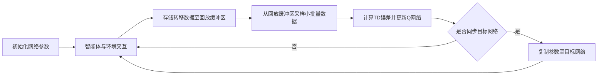

# 一切皆是映射：DQN在自动游戏中的应用：挑战与解决方案

## 1. 背景介绍

近年来，随着人工智能技术的飞速发展，强化学习(Reinforcement Learning)在游戏领域取得了令人瞩目的成就。其中，Deep Q-Network(DQN)算法更是掀起了一股研究热潮。DQN通过将深度学习与强化学习相结合，实现了令人惊叹的自动游戏玩家，在多个经典游戏中达到甚至超越了人类玩家的水平。

本文将深入探讨DQN算法在自动游戏领域的应用，剖析其核心概念与原理，阐述其面临的挑战以及相应的解决方案。我们将从算法、数学模型、代码实践等多个角度全面解析DQN，为读者提供一个系统全面的认知。

### 1.1 强化学习与DQN简介

强化学习是一种机器学习范式，旨在让智能体(Agent)通过与环境的交互，学习最优策略以获得最大累积奖励。与监督学习和非监督学习不同，强化学习并没有预先准备好的训练数据，而是通过不断地试错和探索来学习。

DQN是将深度学习引入强化学习的里程碑式算法。传统的强化学习使用表格(Table)来存储每个状态-动作对的价值，但在高维状态空间下这种方法难以扩展。DQN创新性地使用深度神经网络来逼近状态-动作价值函数Q(s,a)，突破了这一限制，使得强化学习能够处理图像等高维输入。

### 1.2 DQN在游戏领域的应用现状

DQN在游戏领域取得了一系列令人瞩目的成就：

- 2013年，DeepMind提出DQN[^1]，在Atari 2600游戏平台上实现了超越人类的表现。 
- 2015年，DeepMind进一步改进DQN，提出Double DQN[^2]等变体，在更多游戏上达到甚至超越人类玩家。
- 2016年，DeepMind提出AlphaGo[^3]，历史性地战胜人类顶尖围棋选手。AlphaGo虽然并非直接基于DQN，但其核心思想与DQN一脉相承。
- 近年来，DQN及其变体在星际争霸、Dota 2等复杂游戏中也取得了优异的表现[^4][^5]。

可以预见，DQN必将在自动游戏领域持续发挥重要作用，推动游戏AI的进一步发展。

## 2. 核心概念与联系

要深入理解DQN算法，首先需要掌握其背后的一些核心概念。本节将重点介绍马尔可夫决策过程(MDP)、Q-Learning、函数逼近等关键概念，并阐明它们之间的内在联系。

### 2.1 马尔可夫决策过程(MDP) 

MDP提供了对序贯决策问题建模的数学框架，是强化学习的理论基础。一个MDP由状态集合S、动作集合A、转移概率P、奖励函数R、折扣因子γ组成，形式化定义为一个五元组<S, A, P, R, γ>。

在每个离散的时间步t，智能体处于某个状态s_t∈S，执行一个动作a_t∈A，环境根据转移概率P(s_t+1|s_t,a_t)转移到下一个状态s_t+1，同时给予智能体一个即时奖励r_t=R(s_t,a_t)。智能体的目标是找到一个最优策略π:S→A，使得期望累积折扣奖励最大化：

$$
\max_\pi E\left[\sum_{t=0}^{\infty} \gamma^t r_t | s_0, \pi \right]
$$

其中，γ∈[0,1]是折扣因子，用于平衡即时奖励和长期奖励。

### 2.2 Q-Learning

Q-Learning是一种经典的无模型(model-free)强化学习算法，用于解决MDP问题。其核心思想是学习状态-动作价值函数Q(s,a)，表示在状态s下采取动作a的长期价值。最优Q函数满足贝尔曼最优方程：

$$
Q^*(s,a) = R(s,a) + \gamma \sum_{s'} P(s'|s,a) \max_{a'} Q^*(s',a')
$$

Q-Learning使用如下的迭代更新规则来逼近最优Q函数：

$$
Q(s_t,a_t) \leftarrow Q(s_t,a_t) + \alpha \left[r_t + \gamma \max_a Q(s_{t+1},a) - Q(s_t,a_t)\right]
$$

其中，α是学习率。Q-Learning是一种异策略(off-policy)算法，其学习的Q函数对应于贪婪策略，而行为策略则可以是ε-贪婪等探索性策略。

### 2.3 函数逼近与深度Q网络

传统Q-Learning使用表格(tabular)的方式存储Q值，每个状态-动作对对应一个表项。然而在状态和动作空间很大的问题中，这种做法面临维度灾难(curse of dimensionality)的挑战。

函数逼近(function approximation)提供了一种解决方案。其基本思路是用一个参数化函数（如神经网络）来近似表示Q函数，将Q-Learning转化为参数学习问题。DQN正是利用深度神经网络来逼近Q函数：

$$
Q(s,a;\theta) \approx Q^*(s,a)
$$

其中，θ为网络参数。DQN的目标是最小化近似Q网络与贝尔曼最优方程的均方误差：

$$
\mathcal{L}(\theta) = E_{(s,a,r,s')} \left[ \left( r + \gamma \max_{a'} Q(s',a';\theta^-) - Q(s,a;\theta) \right)^2 \right]
$$

其中，θ^-为目标网络参数，用于计算TD目标值，解耦当前网络和目标网络，提高训练稳定性。

### 2.4 经验回放(Experience Replay)

DQN引入了经验回放机制来打破数据的相关性，提高样本利用效率。智能体与环境交互产生的转移数据(s_t,a_t,r_t,s_t+1)被存储在一个回放缓冲区(replay buffer)D中。在训练时，DQN从D中随机采样小批量(mini-batch)转移数据，用于计算损失函数梯度并更新网络参数。经验回放的伪代码如下：

```python
Initialize replay buffer D
for episode = 1, M do
    Initialize state s_1
    for t = 1, T do
        With probability ε select a random action a_t
        otherwise select a_t = argmax_a Q(s_t,a; θ)
        Execute action a_t and observe reward r_t and next state s_t+1
        Store transition (s_t, a_t, r_t, s_t+1) in D
        Sample mini-batch of transitions (s_j, a_j, r_j, s_j+1) from D
        Set y_j = r_j if episode terminates at step j+1
                 = r_j + γ max_a' Q(s_j+1, a'; θ^-) otherwise
        Perform a gradient descent step on (y_j - Q(s_j,a_j; θ))^2 w.r.t. θ
    end for
end for
```

综上，MDP为序贯决策问题提供了建模框架，Q-Learning学习解决MDP的最优策略，DQN则利用深度神经网络逼近Q函数，并引入经验回放等机制，最终实现了端到端的强化学习系统。这些概念环环相扣，共同构成了DQN的理论与算法基础。

## 3. 核心算法原理与具体操作步骤

本节将详细阐述DQN算法的核心原理与具体操作步骤，重点关注算法流程、网络结构、损失函数、探索策略等关键要素，力求给读者一个全面深入的认知。

### 3.1 算法流程概览

DQN算法的主要流程可以概括为以下几个关键步骤：

1. 初始化Q网络参数θ，目标网络参数θ^-，经验回放缓冲区D。
2. 智能体与环境交互，产生转移数据(s_t,a_t,r_t,s_t+1)并存入D。 
3. 从D中采样小批量转移数据，计算TD误差，更新Q网络参数θ。
4. 每隔C步，将θ复制给θ^-，同步目标网络。
5. 重复步骤2-4，直至满足终止条件。

下图展示了DQN算法的整体流程：



### 3.2 Q网络结构设计

DQN使用卷积神经网络(CNN)来处理原始图像输入，提取特征表示。以Atari游戏为例，输入为连续4帧游戏画面灰度图，每帧图像大小为84×84。Q网络采用3个卷积层和2个全连接层，结构如下：

- 输入层：84×84×4
- 卷积层1：32个8×8滤波器，步长4，ReLU激活，输出20×20×32
- 卷积层2：64个4×4滤波器，步长2，ReLU激活，输出9×9×64  
- 卷积层3：64个3×3滤波器，步长1，ReLU激活，输出7×7×64
- 全连接层1：512个神经元，ReLU激活
- 全连接层2(输出层)：|A|个神经元，对应各个动作的Q值

其中，|A|为动作空间的大小。网络输出Q(s,a;θ)表示在状态s下采取动作a的估计Q值。

### 3.3 损失函数与优化方法

DQN的训练目标是最小化TD误差，即近似Q值与TD目标值之间的均方误差。对于转移样本(s,a,r,s')，其损失函数定义为：

$$
\mathcal{L}(\theta) = \left( r + \gamma \max_{a'} Q(s',a';\theta^-) - Q(s,a;\theta) \right)^2
$$

其中，θ^-为目标网络参数，用于计算TD目标值y=r+γ max_a' Q(s',a';θ^-)，提高训练稳定性。

在实践中，DQN使用小批量梯度下降法来优化损失函数。给定一个小批量B={(s_i,a_i,r_i,s'_i)}，其梯度估计为：

$$
\nabla_\theta \mathcal{L}(\theta) \approx \frac{1}{|B|} \sum_{i \in B} \left( r_i + \gamma \max_{a'} Q(s'_i,a';\theta^-) - Q(s_i,a_i;\theta) \right) \nabla_\theta Q(s_i,a_i;\theta)
$$

DQN使用RMSProp等自适应优化算法来更新网络参数：

$$
\theta \leftarrow \theta - \alpha \nabla_\theta \mathcal{L}(\theta)
$$

其中，α为学习率。

### 3.4 探索策略

为了在探索和利用之间取得平衡，DQN采用ε-贪婪策略来选择动作。在每个时间步，智能体以概率ε随机选择动作，否则选择Q值最大的动作：

$$
a_t = \begin{cases}
\text{随机动作} & \text{以概率} \quad \epsilon \\
\arg\max_a Q(s_t,a;\theta) & \text{以概率} \quad 1-\epsilon
\end{cases}
$$

一般来说，ε会在训练过程中逐渐衰减，从初始值ε_start线性衰减到最终值ε_end，以逐步减少探索：

$$
\epsilon_t = \epsilon_{end} + (\epsilon_{start} - \epsilon_{end}) \cdot \max \left(0, 1-\frac{t}{T}\right)
$$

其中，t为当前训练步数，T为探索步数上限。这种衰减式探索策略能够在早期鼓励探索，后期趋向稳定利用。

### 3.5 目标网络同步

为了提高训练稳定性，DQN引入了目标网络。目标网络参数θ^-仅每隔C步从在线网络复制一次，而不是每次都同步。这种周期性更新的方式降低了目标值的波动，缓解了