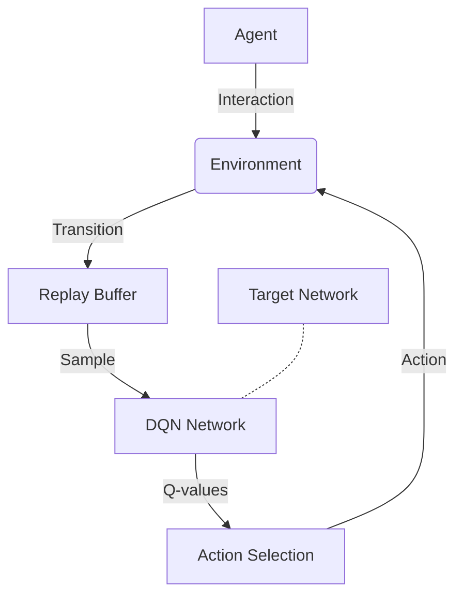
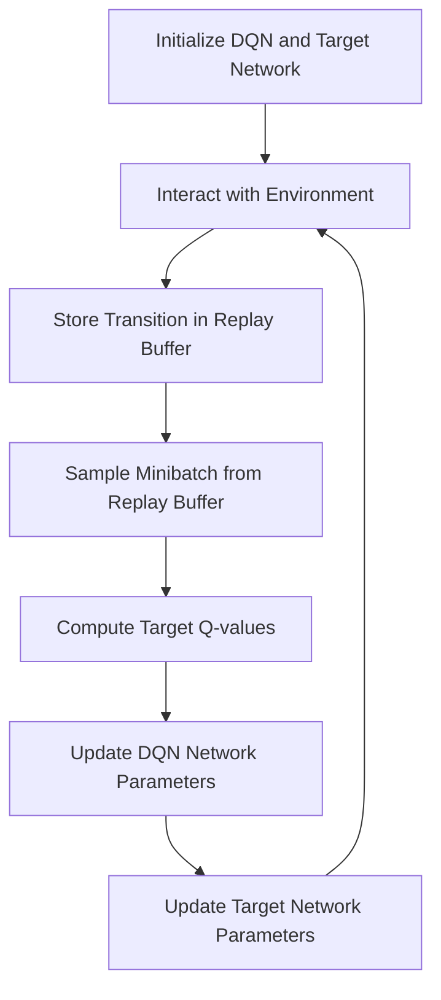

# 一切皆是映射：DQN网络参数调整与性能优化指南

## 1.背景介绍

### 1.1 深度强化学习简介

深度强化学习(Deep Reinforcement Learning, DRL)是机器学习领域中一个新兴且前景广阔的研究方向,它将深度学习(Deep Learning)与强化学习(Reinforcement Learning)相结合,旨在让智能体(Agent)通过与环境(Environment)的交互来学习获取最优策略,以最大化预期的累积奖励。

### 1.2 DQN算法概述 

深度Q网络(Deep Q-Network, DQN)是深度强化学习中最具代表性的算法之一,它使用深度神经网络来近似传统Q学习中的Q值函数。DQN算法的提出解决了在连续状态空间和动作空间下,传统Q学习算法存在的维数灾难问题,从而使得强化学习可以应用于更加复杂的环境。

### 1.3 DQN在实践中的挑战

尽管DQN算法取得了巨大的成功,但在实际应用中仍然面临诸多挑战,例如:

- 网络参数的选择和调整
- 样本效率低下
- 收敛性能差
- 泛化能力不足

本文将重点关注DQN网络参数的调整与性能优化,旨在为读者提供实用的技巧和见解,帮助提高DQN算法在实践中的效果。

## 2.核心概念与联系

### 2.1 Q学习与DQN

在传统的Q学习算法中,我们需要维护一个Q表,用于存储每个状态-动作对的Q值。然而,在连续状态空间和动作空间下,Q表将变得非常庞大,导致计算和存储资源的消耗成指数级增长。

DQN算法的核心思想是使用深度神经网络来近似Q值函数,从而避免维数灾难问题。具体来说,DQN网络将当前状态作为输入,输出该状态下所有可能动作对应的Q值,智能体只需选择Q值最大的动作即可。

$$
Q(s, a) \approx Q(s, a; \theta)
$$

其中,$\theta$表示DQN网络的参数。通过不断与环境交互并更新网络参数,DQN算法可以逐步学习到近似最优的Q值函数。

### 2.2 经验回放与目标网络

为了提高样本利用效率并增强算法的稳定性,DQN算法引入了两个关键技术:经验回放(Experience Replay)和目标网络(Target Network)。

经验回放通过维护一个经验池(Replay Buffer)来存储智能体与环境交互过程中的转换样本(状态、动作、奖励、下一状态),并在训练时从中随机采样小批量数据进行训练,有效解决了强化学习中的相关性问题。

目标网络是一个与DQN网络参数相同但保持固定的网络,它用于计算目标Q值,从而增强了算法的稳定性。每隔一定步数,DQN网络的参数会被复制到目标网络中。



### 2.3 DQN网络架构

DQN网络通常采用卷积神经网络(CNN)或全连接神经网络(DNN)的架构,具体取决于输入状态的表示形式。对于图像状态,CNN更加适合提取空间特征;对于向量状态,DNN则更加高效。

无论采用何种架构,DQN网络的输出层都需要与动作空间的大小相对应,以输出每个动作的Q值。网络的其他层则需要根据具体问题进行设计和调整,以获得更好的性能。

## 3.核心算法原理具体操作步骤

DQN算法的核心步骤如下:

1. **初始化**:初始化DQN网络和目标网络的参数,创建经验回放池。

2. **与环境交互**:在每一个时间步,智能体根据当前状态$s_t$和DQN网络输出的Q值,选择一个动作$a_t$执行。环境将返回执行该动作后的奖励$r_t$和下一状态$s_{t+1}$,并将转换样本$(s_t, a_t, r_t, s_{t+1})$存储到经验回放池中。

3. **采样训练数据**:从经验回放池中随机采样一个小批量的转换样本。

4. **计算目标Q值**:对于每个转换样本,计算目标Q值$y_j$:

   - 如果下一状态$s_{t+1}$是终止状态,则$y_j = r_t$
   - 否则,$y_j = r_t + \gamma \max_{a'} Q(s_{t+1}, a'; \theta^-)$,其中$\theta^-$表示目标网络的参数,$\gamma$是折扣因子。

5. **网络参数更新**:使用均方误差损失函数,并通过优化算法(如随机梯度下降)来更新DQN网络的参数$\theta$,使得$Q(s_t, a_t; \theta)$逼近目标Q值$y_j$。

6. **目标网络参数更新**:每隔一定步数,将DQN网络的参数复制到目标网络中。

7. **回到步骤2**,重复上述过程,直到算法收敛或达到最大训练步数。



## 4.数学模型和公式详细讲解举例说明

### 4.1 Q学习

在强化学习中,我们希望找到一个策略$\pi$,使得在环境$\mathcal{M}$中执行该策略时,能够最大化预期的累积奖励:

$$
J(\pi) = \mathbb{E}_\pi \left[ \sum_{t=0}^\infty \gamma^t r_t \right]
$$

其中,$r_t$是在时间步$t$获得的奖励,$\gamma \in [0, 1]$是折扣因子,用于权衡即时奖励和长期奖励的重要性。

Q学习算法通过估计状态-动作值函数$Q^\pi(s, a)$来近似求解最优策略$\pi^*$,其中$Q^\pi(s, a)$表示在状态$s$执行动作$a$,之后按策略$\pi$行动所能获得的预期累积奖励:

$$
Q^\pi(s, a) = \mathbb{E}_\pi \left[ \sum_{t=0}^\infty \gamma^t r_t | s_0 = s, a_0 = a \right]
$$

最优Q值函数$Q^*(s, a)$满足贝尔曼最优方程:

$$
Q^*(s, a) = \mathbb{E}_{s' \sim \mathcal{P}_{ss'}^a} \left[ r(s, a) + \gamma \max_{a'} Q^*(s', a') \right]
$$

其中,$\mathcal{P}_{ss'}^a$是在状态$s$执行动作$a$后,转移到状态$s'$的概率分布函数。

Q学习算法通过不断更新Q值函数,使其逼近最优Q值函数$Q^*$,从而近似求解最优策略$\pi^*$。

### 4.2 DQN算法

由于在连续状态空间和动作空间下,Q表将变得非常庞大,因此DQN算法使用深度神经网络来近似Q值函数:

$$
Q(s, a) \approx Q(s, a; \theta)
$$

其中,$\theta$表示DQN网络的参数。

在训练过程中,DQN算法使用均方误差损失函数来更新网络参数$\theta$:

$$
L(\theta) = \mathbb{E}_{(s, a, r, s') \sim \mathcal{D}} \left[ \left( y - Q(s, a; \theta) \right)^2 \right]
$$

其中,$\mathcal{D}$是经验回放池,$(s, a, r, s')$是从中采样的转换样本,目标Q值$y$的计算方式为:

$$
y = r + \gamma \max_{a'} Q(s', a'; \theta^-)
$$

$\theta^-$表示目标网络的参数,用于计算目标Q值,以增强算法的稳定性。

通过优化算法(如随机梯度下降)来最小化损失函数$L(\theta)$,从而使得DQN网络输出的Q值$Q(s, a; \theta)$逼近目标Q值$y$,进而近似求解最优Q值函数$Q^*$。

### 4.3 探索与利用的权衡

在强化学习中,智能体需要在探索(Exploration)和利用(Exploitation)之间进行权衡。过多的探索会导致收敛缓慢,而过多的利用则可能陷入次优局部最优解。

$\epsilon$-贪婪策略($\epsilon$-greedy policy)是一种常用的探索-利用权衡方法。具体来说,在选择动作时,智能体有$\epsilon$的概率随机选择一个动作(探索),有$1-\epsilon$的概率选择Q值最大的动作(利用)。$\epsilon$的值通常会随着训练的进行而逐渐降低,以增加利用的比例。

另一种常用的方法是软更新(Soft Update),它通过缓慢地将DQN网络的参数复制到目标网络中,从而实现探索与利用的平衡。具体来说,目标网络的参数$\theta^-$通过以下方式更新:

$$
\theta^- \leftarrow \tau \theta + (1 - \tau) \theta^-
$$

其中,$\tau \in (0, 1]$是软更新系数,控制了新旧参数的融合程度。较小的$\tau$值会使目标网络的参数更新缓慢,从而增加了探索的程度。

## 5.项目实践:代码实例和详细解释说明

以下是一个使用PyTorch实现的简单DQN算法示例,用于解决经典的CartPole-v1环境:

```python
import torch
import torch.nn as nn
import torch.optim as optim
import numpy as np
from collections import deque
import gym

# 定义DQN网络
class DQN(nn.Module):
    def __init__(self, state_dim, action_dim):
        super(DQN, self).__init__()
        self.fc1 = nn.Linear(state_dim, 64)
        self.fc2 = nn.Linear(64, action_dim)

    def forward(self, x):
        x = torch.relu(self.fc1(x))
        return self.fc2(x)

# 定义经验回放池
class ReplayBuffer:
    def __init__(self, capacity):
        self.buffer = deque(maxlen=capacity)

    def push(self, state, action, reward, next_state, done):
        self.buffer.append((state, action, reward, next_state, done))

    def sample(self, batch_size):
        batch = random.sample(self.buffer, batch_size)
        state, action, reward, next_state, done = map(np.stack, zip(*batch))
        return state, action, reward, next_state, done

    def __len__(self):
        return len(self.buffer)

# 定义DQN算法
class DQNAgent:
    def __init__(self, state_dim, action_dim, replay_buffer_size, batch_size, gamma, epsilon, epsilon_min, epsilon_decay, tau, device):
        self.device = device
        self.action_dim = action_dim
        self.replay_buffer = ReplayBuffer(replay_buffer_size)
        self.batch_size = batch_size
        self.gamma = gamma
        self.epsilon = epsilon
        self.epsilon_min = epsilon_min
        self.epsilon_decay = epsilon_decay
        self.tau = tau

        self.policy_net = DQN(state_dim, action_dim).to(device)
        self.target_net = DQN(state_dim, action_dim).to(device)
        self.target_net.load_state_dict(self.policy_net.state_dict())
        self.optimizer = optim.Adam(self.policy_net.parameters())

    def select_action(self, state):
        if np.random.rand() < self.epsilon:
            action = np.random.randint(self.action_dim)
        else:
            state = torch.from_numpy(state).float().unsqueeze(0).to(self.device)
            with torch.no_grad():
                q_values = self.policy_net(state)
            action = torch.argmax(q_values).item()
        return action

    def update(self):
        if len(self.replay_buffer) < self.batch_size:
            return

        state, action, reward, next_state, done = self.replay_buffer.sample(self.batch_size)

        state = torch.from_numpy(state).float().to(self.device)
        action = torch.from_numpy(action).long().to(self.device)
        reward = torch.from_numpy(reward).float().to(self.device)
        next_state = torch.from_numpy(next_state).float().to