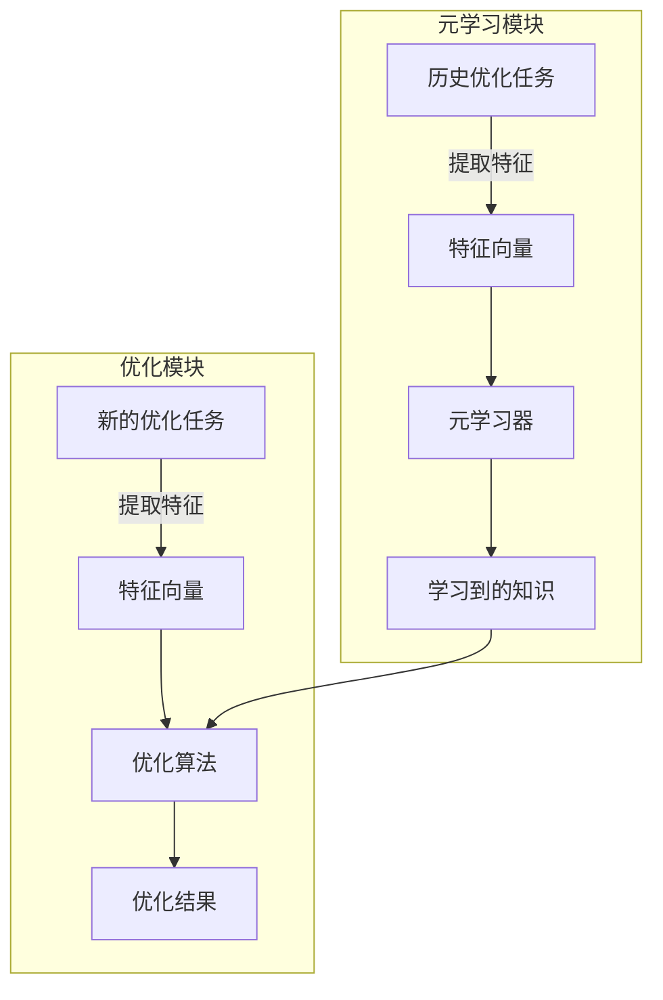
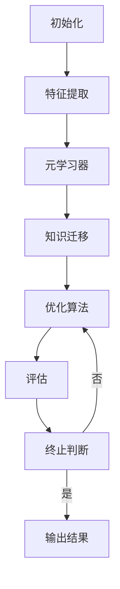

# 一切皆是映射：构建元学习启发式优化算法

## 1. 背景介绍

### 1.1 优化问题的挑战

在现实世界中,我们常常面临着各种复杂的优化问题,例如路径规划、资源分配、机器学习模型的超参数调优等。这些问题通常具有以下特点:

- 高维度搜索空间
- 非线性、非凸、多峰值
- 存在许多局部最优解
- 目标函数计算代价高昂

传统的确定性算法和随机搜索算法在处理这些复杂优化问题时往往效率低下,容易陷入局部最优解。因此,我们需要一种更加智能、高效的优化算法来应对这些挑战。

### 1.2 元启发式优化算法的兴起

近年来,元启发式优化算法(Meta-Heuristic Optimization Algorithms)作为一种新兴的优化范式备受关注。它们借鉴了自然界中的进化规律和集体智能行为,例如遗传算法模拟生物进化过程,蚁群算法模拟蚂蚁觅食行为,粒子群算法模拟鸟群觅食行为等。这些算法具有以下优点:

- 无需目标函数的梯度信息
- 全局搜索能力强
- 易于实现和并行化
- 适用于各种复杂优化问题

然而,现有的元启发式算法也存在一些缺陷,例如收敛速度慢、参数调优困难、易陷入局部最优等。因此,如何设计出更加高效、鲁棒的元启发式优化算法成为了一个重要的研究课题。

### 1.3 元学习在优化算法中的应用

元学习(Meta-Learning)是机器学习领域的一个新兴方向,旨在自动学习任务之间的相似性,从而加速新任务的学习过程。近年来,元学习技术在优化算法的设计中得到了广泛应用,形成了一种新的优化范式——元学习启发式优化算法(Meta-Learning-based Heuristic Optimization Algorithms)。

元学习启发式优化算法的核心思想是:利用元学习技术从历史优化任务中学习经验知识,并将这些知识迁移到新的优化任务中,从而加速优化过程,提高算法的性能。这种方法具有以下优点:

- 自适应性强,可自动调整算法参数和策略
- 利用历史经验,避免重复探索
- 具有良好的泛化能力,适用于各种优化问题

本文将详细介绍元学习启发式优化算法的核心概念、算法原理、实现方法,并探讨其在实际应用中的挑战和发展趋势。

## 2. 核心概念与联系

### 2.1 优化问题的形式化描述

在介绍元学习启发式优化算法之前,我们先来形式化描述一下优化问题。一般来说,优化问题可以表示为:

$$\min\limits_{x \in \Omega} f(x)$$

其中:

- $x$是决策变量向量,属于可行解空间$\Omega$
- $f(x)$是目标函数,需要最小化

根据决策变量$x$的取值范围,优化问题可以分为连续优化问题和组合优化问题两大类。本文主要关注连续优化问题,即$x$属于连续空间$\Omega \subseteq \mathbb{R}^n$。

### 2.2 元启发式优化算法的工作流程

传统的元启发式优化算法通常包含以下几个核心组件:

1. **初始化**:根据优化问题的特点,生成一个初始候选解集群
2. **评估**:计算每个候选解的目标函数值(适应度)
3. **选择**:根据适应度,从当前群体中选择一些个体
4. **变异**:对选择的个体进行变异操作,生成新的候选解
5. **更新**:用新的候选解替换原有的部分个体,更新群体
6. **终止判断**:根据终止条件(最大迭代次数、目标函数阈值等),决定是否终止优化过程

这种工作流程对应了"生成-评估-选择-变异"的基本循环,是大多数元启发式算法的通用框架。不同的算法主要在"变异"策略上有所区别,例如遗传算法使用交叉变异,蚁群算法使用信息素更新等。

### 2.3 元学习启发式优化算法的工作流程

元学习启发式优化算法在传统元启发式算法的基础上,引入了一个关键的"元学习"模块,用于从历史优化任务中学习经验知识,并指导新任务的优化过程。其工作流程如下:

具体来说:

1. **元学习模块**:从历史优化任务中提取特征向量,输入到元学习器中,学习获得优化经验知识
2. **优化模块**:对于新的优化任务,首先提取特征向量,然后将其输入到优化算法中。同时,优化算法也会利用元学习模块学习到的知识,指导优化过程。
3. **知识迁移**:元学习器学习到的知识可以是算法参数、启发式策略、采样分布等,这些知识将被迁移到新的优化任务中,从而加速优化过程。

通过这种"学习-优化"的双循环机制,元学习启发式优化算法可以不断从历史经验中积累知识,并将这些知识应用到新的优化任务中,从而显著提高算法的性能和泛化能力。

## 3. 核心算法原理具体操作步骤

### 3.1 特征提取

在元学习启发式优化算法中,特征提取是一个关键的环节。我们需要从优化任务中提取一些有意义的特征向量,作为元学习器的输入。常用的特征提取方法包括:

1. **基于问题的特征**:例如优化问题的维度、约束条件、目标函数的性质(连续性、光滑性、凸性等)等。
2. **基于实例的特征**:例如候选解的分布、适应度分布、最优解的特征等。
3. **基于过程的特征**:例如优化过程中的收敛速度、搜索轨迹、算子使用频率等。

不同的特征提取方法对应不同的特征向量,会影响元学习器的学习效果。一般来说,我们需要设计一些高质量的特征,使其能够很好地描述优化任务的特性,同时也要注意特征向量的维度,避免出现维数灾难问题。

### 3.2 元学习器

元学习器是元学习启发式优化算法的核心部分,负责从历史优化任务中学习经验知识。常用的元学习器包括:

1. **基于监督学习的方法**:将优化任务视为一个监督学习问题,使用机器学习模型(如神经网络、决策树等)从特征向量中学习映射关系,预测最优的算法参数或策略。
2. **基于强化学习的方法**:将优化过程视为一个马尔可夫决策过程,使用强化学习算法(如Q-Learning、策略梯度等)从优化轨迹中学习最优的策略。
3. **基于进化算法的方法**:使用进化算法(如遗传算法、进化策略等)在一定的搜索空间内进行全局优化,寻找最优的算法参数或策略。

不同的元学习器具有不同的优缺点,需要根据具体的应用场景进行选择。例如,监督学习方法通常收敛速度快,但需要大量的标注数据;强化学习方法可以自主探索,但收敛慢且不稳定;进化算法则具有良好的全局搜索能力,但计算代价较高。

### 3.3 知识迁移

元学习器学习到的知识需要被迁移到优化算法中,指导新的优化任务。常见的知识迁移方式包括:

1. **参数迁移**:直接将元学习器预测的参数值赋给优化算法,例如种群规模、变异概率等。
2. **策略迁移**:根据元学习器预测的策略,动态调整优化算法的行为,例如选择不同的变异操作。
3. **采样迁移**:使用元学习器预测的概率分布,对候选解空间进行重要性采样。
4. **初始化迁移**:将元学习器预测的初始解集输入到优化算法中,作为起始点。
5. **模型迁移**:将元学习器学习到的代理模型(如目标函数的近似模型)嵌入到优化算法中,加速评估过程。

不同的知识迁移方式对应不同的优化算法改进,需要根据具体情况进行选择和设计。同时,我们也可以将多种知识迁移方式结合使用,以获得更好的效果。

### 3.4 算法流程

综合上述核心组件,我们可以总结出元学习启发式优化算法的基本流程:

具体步骤如下:

1. **初始化**:根据优化问题的特点,生成一个初始候选解集群。
2. **特征提取**:从优化任务中提取特征向量。
3. **元学习器**:将特征向量输入元学习器,学习获得优化经验知识。
4. **知识迁移**:将学习到的知识迁移到优化算法中。
5. **优化算法**:执行改进后的优化算法,生成新的候选解。
6. **评估**:计算每个候选解的目标函数值(适应度)。
7. **终止判断**:根据终止条件,决定是否终止优化过程。
8. **输出结果**:输出最优解及其目标函数值。

需要注意的是,上述流程是一个通用框架,具体的实现细节需要根据不同的元学习器、知识迁移方式等进行调整和优化。

## 4. 数学模型和公式详细讲解举例说明

### 4.1 基于监督学习的元学习器

在基于监督学习的元学习器中,我们将优化任务视为一个监督学习问题,使用机器学习模型从特征向量中学习映射关系,预测最优的算法参数或策略。

假设我们有一个历史优化任务集合$\mathcal{D} = \{(x_i, y_i)\}_{i=1}^N$,其中$x_i$是第$i$个优化任务的特征向量,而$y_i$是对应的最优参数或策略。我们的目标是学习一个映射函数$f: \mathcal{X} \rightarrow \mathcal{Y}$,使得对于任意新的优化任务$x \in \mathcal{X}$,都可以预测出一个良好的参数或策略$\hat{y} = f(x)$。

常见的机器学习模型包括:

- **神经网络**:使用深度神经网络拟合映射函数$f(x)$,例如多层感知机、卷积神经网络等。
- **决策树与随机森林**:构建决策树或随机森林模型,根据特征向量$x$预测目标值$y$。
- **高斯过程回归**:将$f(x)$建模为高斯过程,通过核函数捕获特征向量之间的相似性。

使用监督学习方法的优点是可以直接从数据中学习映射关系,无需人工设计复杂的规则;缺点是需要大量的标注数据,且模型的泛化能力受限于训练数据的分布。

### 4.2 基于强化学习的元学习器

在基于强化学习的元学习器中,我们将优化过程视为一个马尔可夫决策过程,使用强化学习算法从优化轨迹中学习最优的策略。

具体来说,我们定义一个状态空间$\mathcal{S}$和动作空间$\mathcal{A}$,其中状态$s \in \mathcal{S}$描述了优化过程的当