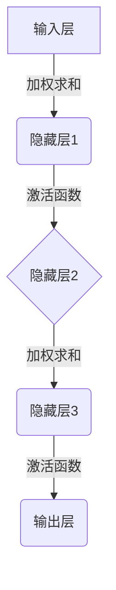

# 一切皆是映射：神经网络的可解释性问题

## 1.背景介绍

在过去的几年中,深度神经网络在各种任务中取得了令人瞩目的成就,包括计算机视觉、自然语言处理、语音识别等领域。然而,尽管神经网络展现出了强大的预测能力,但它们通常被视为"黑箱"模型,很难解释它们是如何得出预测结果的。这种缺乏透明度和可解释性不仅影响了人们对这些模型的信任,也限制了它们在一些关键领域(如医疗诊断和自动驾驶)的应用。

可解释性是指模型能够以人类可理解的方式解释其预测和决策的能力。对于神经网络而言,可解释性意味着能够揭示网络内部的决策过程,说明它是如何从输入数据中学习特征并产生输出的。提高神经网络的可解释性不仅有助于建立人们对这些模型的信任,也能促进模型的改进和调试。

然而,实现神经网络的可解释性是一个极具挑战的任务。这种挑战源于神经网络的复杂性和非线性特征,以及缺乏直观的解释机制。尽管如此,近年来研究人员提出了多种技术和方法来提高神经网络的可解释性,包括可视化技术、注意力机制和概念激活向量等。

本文将探讨神经网络可解释性的重要性、挑战和最新进展。我们将深入探讨不同的可解释性方法,并评估它们的优缺点。最后,我们将讨论未来的研究方向,以推动神经网络可解释性的发展,从而增强人工智能模型的透明度和可信度。

## 2.核心概念与联系

### 2.1 神经网络简介

神经网络是一种受生物神经系统启发的机器学习模型,由大量相互连接的节点(或称为神经元)组成。这些节点通过权重连接进行信息传递和处理。神经网络通过从训练数据中学习,自动发现输入和输出之间的复杂映射关系。

神经网络的基本工作原理可以概括为以下几个步骤:

1. **输入层**: 将输入数据(如图像、文本或其他特征)传递给神经网络。
2. **隐藏层**: 输入数据通过一系列加权求和和非线性激活函数的操作,在隐藏层中进行特征提取和转换。
3. **输出层**: 最后一个隐藏层的输出被传递到输出层,产生最终的预测或决策。

在训练过程中,神经网络通过反向传播算法调整权重,使预测输出与真实标签之间的误差最小化。训练完成后,神经网络可以对新的输入数据进行预测。

### 2.2 可解释性的重要性

尽管神经网络在许多任务中表现出色,但它们通常被视为"黑箱"模型,很难解释它们是如何得出预测结果的。这种缺乏透明度和可解释性会导致以下问题:

1. **信任问题**: 用户可能对神经网络的决策过程缺乏信任,特别是在一些关键领域(如医疗诊断和金融决策)。
2. **调试和改进困难**: 难以诊断神经网络的错误并进行改进,因为内部决策过程是不透明的。
3. **偏差和公平性问题**: 神经网络可能会学习到训练数据中存在的偏差,导致不公平的决策。
4. **法律和道德问题**: 在一些领域,决策过程需要遵守法律和道德规范,而神经网络的"黑箱"特性可能会违反这些规范。

提高神经网络的可解释性可以帮助解决上述问题,从而增强人们对这些模型的信任,促进模型的改进和调试,并确保它们的决策过程符合法律和道德规范。

### 2.3 可解释性的挑战

实现神经网络的可解释性面临着以下主要挑战:

1. **复杂性**: 神经网络通常包含大量参数和隐藏层,使得理解它们的内部工作机制变得极其困难。
2. **非线性**: 神经网络中的非线性激活函数使得它们的决策边界变得复杂,难以用简单的规则来解释。
3. **高维数据**: 神经网络通常处理高维数据(如图像和文本),使得可视化和解释变得更加困难。
4. **缺乏直观解释**: 神经网络学习到的特征通常缺乏人类可理解的语义解释。

克服这些挑战需要开发新的技术和方法,以提高神经网络的可解释性,同时保持其预测性能。

## 3.核心算法原理具体操作步骤

为了提高神经网络的可解释性,研究人员提出了多种技术和方法。以下是一些核心算法原理和具体操作步骤:

### 3.1 可视化技术

可视化技术旨在通过图形化的方式展示神经网络内部的工作机制,帮助人们理解它是如何从输入数据中学习特征并产生输出的。常用的可视化技术包括:

1. **激活图**: 显示每个神经元在给定输入下的激活强度,有助于理解神经网络对输入数据的响应。
2. **梯度加权类激活映射 (Grad-CAM)**: 使用梯度信息来突出显示输入图像中对于特定类别预测最相关的区域。
3. **saliency map**: 通过计算输入数据的微小扰动对输出的影响,来突出显示对预测结果最重要的输入特征。

**操作步骤**:

1. 选择要可视化的神经网络模型和输入数据。
2. 计算神经元的激活值或梯度信息。
3. 使用可视化技术(如热力图或叠加显示)将激活或梯度信息映射到输入数据上。
4. 分析可视化结果,了解神经网络关注的区域或特征。

### 3.2 注意力机制

注意力机制是一种允许神经网络动态地关注输入数据的不同部分的技术。通过学习分配注意力权重,注意力机制可以突出显示对预测结果最相关的输入特征,从而提高模型的可解释性。

**操作步骤**:

1. 在神经网络的特定层中引入注意力机制。
2. 计算注意力权重,表示每个输入特征对预测结果的相关性。
3. 根据注意力权重对输入特征进行加权求和,产生注意力加权的表示。
4. 使用注意力加权的表示进行后续的预测或决策。
5. 分析注意力权重,了解神经网络关注的输入特征。

### 3.3 概念激活向量 (CAV)

概念激活向量 (CAV) 是一种用于解释神经网络决策的技术。它通过测量神经网络对特定概念(如"狗"或"车")的响应,来量化这些概念在网络中的表示程度。

**操作步骤**:

1. 定义一组感兴趣的概念,并为每个概念准备一组示例图像。
2. 计算每个概念的CAV,即在给定概念图像下,神经网络中特定层的平均激活向量。
3. 使用CAV作为概念的表示,测量新输入与每个概念的相似性。
4. 分析相似性分数,了解神经网络对不同概念的编码方式。

### 3.4 局部可解释模型 (LIME)

局部可解释模型 (LIME) 是一种模型不可知的技术,它通过近似局部决策边界来解释任何机器学习模型的预测。LIME通过对输入数据进行微小扰动,并观察模型输出的变化,来构建一个可解释的线性模型,近似原始模型在该局部区域的行为。

**操作步骤**:

1. 选择要解释的输入实例和机器学习模型。
2. 通过对输入实例进行微小扰动,生成一组新的实例。
3. 获取原始模型对这些新实例的预测输出。
4. 使用加权最小二乘法拟合一个线性模型,近似原始模型在该局部区域的行为。
5. 分析线性模型的权重,了解每个特征对预测结果的贡献。

### 3.5 其他技术

除了上述技术,还有一些其他方法可以提高神经网络的可解释性,包括:

- **层次化注意力 (Hierarchical Attention)**: 在不同层次上应用注意力机制,捕捉不同粒度的特征。
- **原型网络 (Prototype Networks)**: 学习原型表示,使预测与原型实例的相似性相关联。
- **概念学习 (Concept Learning)**: 将人类可理解的概念嵌入到神经网络中,以提高可解释性。
- **可解释人工智能 (XAI)**: 一个研究领域,旨在开发新的技术和框架来提高人工智能系统的可解释性。

## 4.数学模型和公式详细讲解举例说明

在探讨神经网络可解释性的数学模型和公式之前,让我们先回顾一下神经网络的基本原理。

一个典型的前馈神经网络可以表示为一系列函数组合:

$$
f(x) = f^{(L)}(f^{(L-1)}(...f^{(2)}(f^{(1)}(x))))
$$

其中 $x$ 是输入数据, $f^{(l)}$ 是第 $l$ 层的函数,通常包括线性变换和非线性激活函数。每一层的输出作为下一层的输入,最终产生预测结果 $f(x)$。

在训练过程中,神经网络通过反向传播算法调整权重参数,以最小化损失函数 $\mathcal{L}(y, f(x))$,其中 $y$ 是真实标签。

### 4.1 梯度加权类激活映射 (Grad-CAM)

Grad-CAM 是一种可视化技术,用于解释卷积神经网络对图像分类的决策。它通过计算梯度信息来突出显示输入图像中对于特定类别预测最相关的区域。

对于给定的输入图像 $I$ 和类别 $c$,Grad-CAM 计算步骤如下:

1. 计算模型对于类别 $c$ 的分数 $y^c$:

$$
y^c = f^{(L)}(A^{(L-1)})
$$

其中 $A^{(L-1)}$ 是倒数第二层的特征映射。

2. 计算 $y^c$ 相对于 $A^{(L-1)}$ 的梯度:

$$
\frac{\partial y^c}{\partial A^{(L-1)}}
$$

3. 通过全局平均池化,获得每个特征映射的重要性权重 $\alpha_k^c$:

$$
\alpha_k^c = \frac{1}{Z} \sum_{i} \sum_{j} \frac{\partial y^c}{\partial A_{ijk}^{(L-1)}}
$$

其中 $Z$ 是归一化常数。

4. 将特征映射与对应的重要性权重相乘,并对所有特征映射求和,得到 Grad-CAM 热力图:

$$
L^c_{Grad-CAM}(x, y) = ReLU\left(\sum_k \alpha_k^c A_k^{(L-1)}\right)
$$

通过将 Grad-CAM 热力图叠加到原始输入图像上,我们可以直观地看到神经网络关注的区域。

### 4.2 注意力机制

注意力机制是一种允许神经网络动态地关注输入数据的不同部分的技术。它通过学习分配注意力权重,来突出显示对预测结果最相关的输入特征。

在序列数据(如文本或时间序列)上,注意力机制可以表示为:

$$
\begin{aligned}
e_t &= f_{att}(h_t, s) \\
\alpha_t &= \frac{\exp(e_t)}{\sum_{t'} \exp(e_{t'})} \\
c &= \sum_t \alpha_t h_t
\end{aligned}
$$

其中:

- $h_t$ 是时间步 $t$ 的隐藏状态向量
- $s$ 是当前的解码器状态向量
- $f_{att}$ 是计算注意力能量的函数,通常是一个前